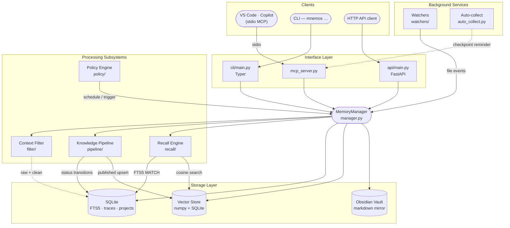
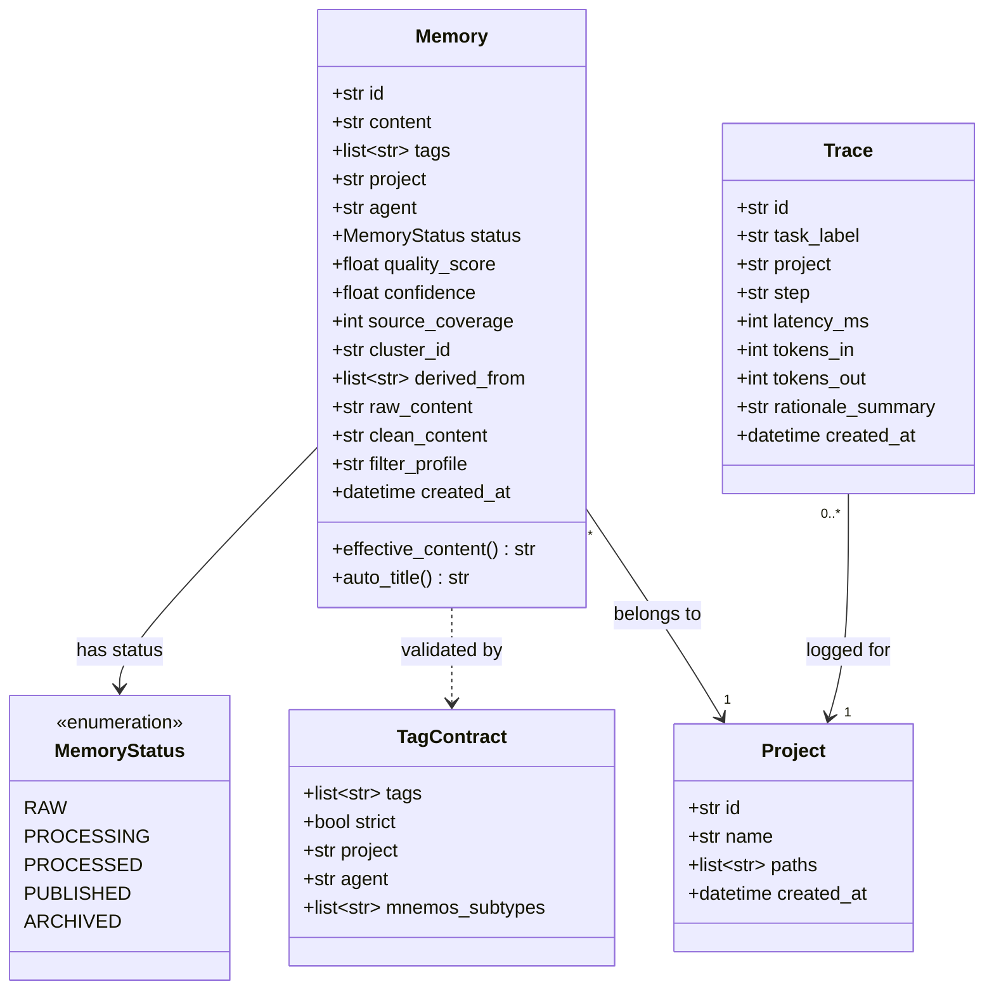
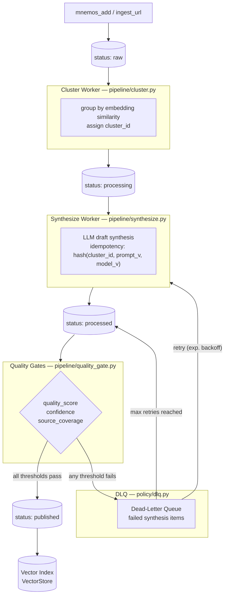
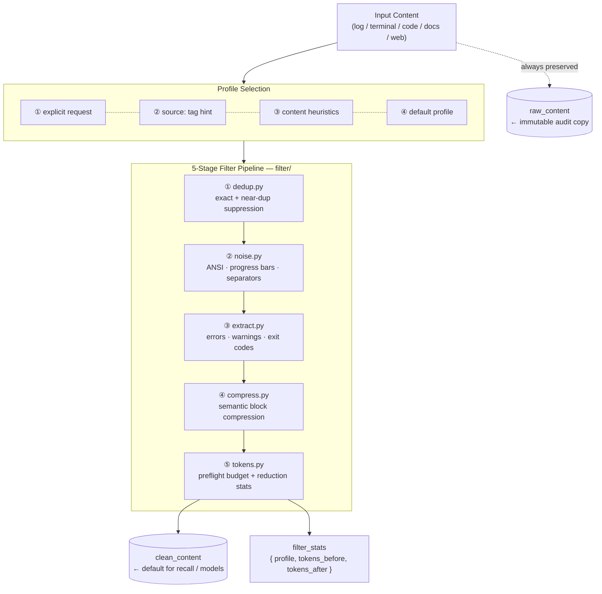
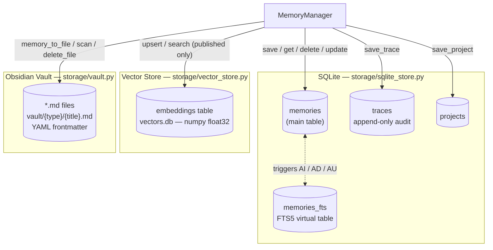
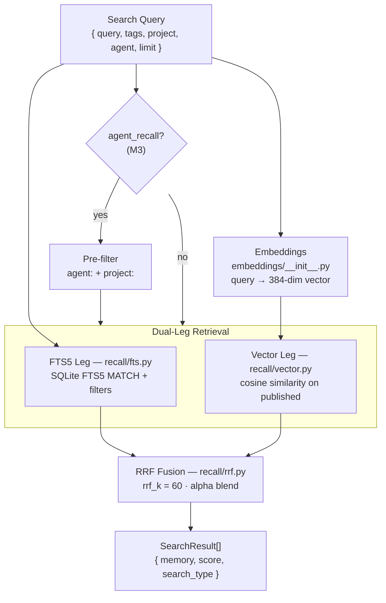
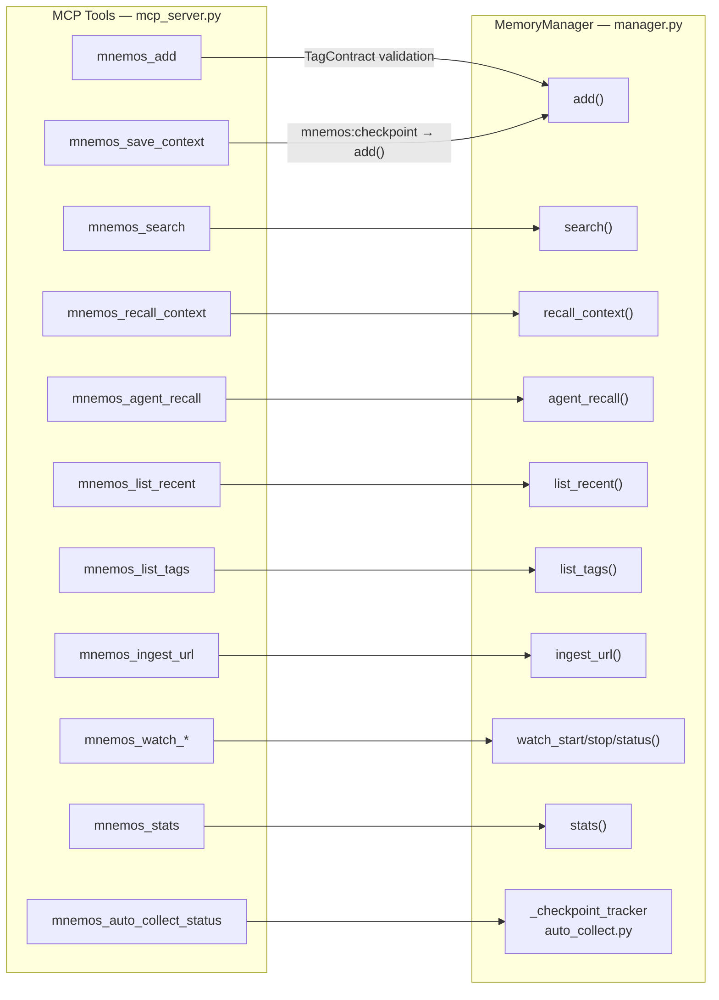
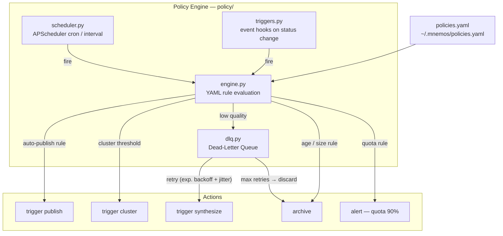
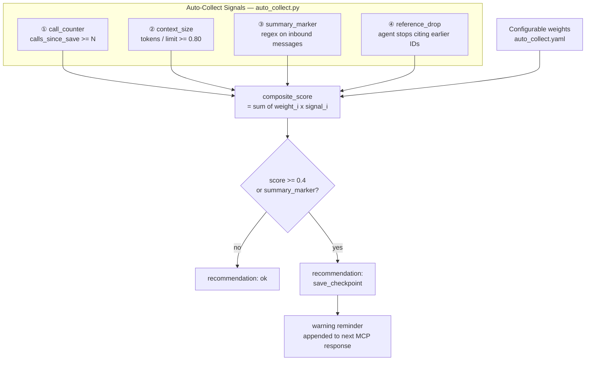

# Mnemos — architecture

> Companion to [PLAN.md](PLAN.md). PLAN is the *how* (phases, tasks, ordering). ARCHITECTURE is the *what* (components, interfaces, data, decisions).

## 1. System overview

Mnemos is a single-tenant memory/knowledge service for AI agents (primarily Copilot agents in VS Code, via MCP). It is forked from `ai-brain` and retains its core stack:

- **Runtime**: Python 3.11+, FastAPI HTTP API, Typer CLI, MCP server (stdio).
- **Storage**: SQLite (FTS5) for raw + processing + processed, SQLite + NumPy vector store (`vectors.db`) only for `published` knowledge units, Obsidian-compatible vault on disk for human-readable mirror.
- **Embeddings**: bundled `mnema-embed-v1` ONNX model (default `nano` provider, shipped at `src/mnemos/models/mnema-embed-v1/`) — privacy + offline, no external vector DB.
- **Packaging**: rootless `podman` container; systemd quadlet units; user-level install option.

### Conceptual layers



## 2. Core data model

### `Memory` (single unified table, status-driven)

| field | type | notes |
|---|---|---|
| `id` | uuid | primary key |
| `content` | text | markdown body |
| `tags` | array<string> | validated by `TagContract` |
| `project` | string | denormalised from `project:*` tag |
| `agent` | string | denormalised from `agent:*` tag |
| `status` | enum | `raw \| processing \| processed \| published \| archived` |
| `quality_score` | float? | populated by synthesis / quality-gate |
| `confidence` | float? | populated by synthesis |
| `source_coverage` | int? | distinct source URLs / paths in cluster |
| `cluster_id` | string? | set during clustering |
| `derived_from` | array<uuid> | provenance for `processed`/`published` |
| `embedding_id` | string? | Vector id in `vectors.db` when published |
| `raw_content` | text? | immutable source payload (logs/stdout/html/etc.) |
| `clean_content` | text? | filtered projection used for recall/model input |
| `filter_profile` | string? | `log|terminal|code|docs|web|default` |
| `filter_stats` | json? | token + dedup reduction stats |
| `filter_version` | string? | filter pipeline version used for this record |
| `created_at` | datetime | |
| `updated_at` | datetime | |

### `TagContract`

Required composition for any `mnemos_add`:
- exactly one `project:<slug>` tag
- exactly one `agent:<slug>` tag (or `agent:user` for human-authored)
- ≥1 tag from `mnemos:*` namespace (`mnemos:session`, `mnemos:bug-pattern`, `mnemos:learning`, `mnemos:decision`, `mnemos:rule`, `mnemos:open-question`, `mnemos:checkpoint`, `mnemos:legacy`)
- Optional whitelisted prefixes: `severity:`, `stack:`, `applyTo:`, `source:`

Enforcement: at MCP layer when `strict_tag_contract=true` (default for new installs). Lax mode tags legacy records `mnemos:legacy` + `agent:unknown` automatically.

### `Trace`

Per-pipeline-step audit row (M6):
`task_label, project, step, item_id, llm_called, llm_done, cache_hit, fallback_used, latency_ms, tokens_in/out, tokens_per_sec, rationale_summary (≤200 chars, NO chain-of-thought)`.

### Data model diagram



## 3. Interfaces

### MCP tools (stable names — integration plugins reference these)

The MCP surface is **26 tools** (`mcp_server.py` `list_tools()`). The v1-era table of 11 is superseded; the current contract, grouped:

| Group | Tools |
|---|---|
| Memory operations | `mnemos_add`, `mnemos_search`, `mnemos_agent_recall`, `mnemos_recall_context`, `mnemos_save_context`, `mnemos_list_recent`, `mnemos_list_tags`, `mnemos_ingest_url` |
| Context assembly & hooks | `mnemos_assemble_context`, `mnemos_context_rewrite`, `mnemos_hooks`, `mnemos_filter`, `mnemos_compress`, `mnemos_retrieve`, `mnemos_align_prefix` |
| Tags & workflow | `mnemos_tags`, `mnemos_tags_rename`, `mnemos_workflow` |
| Import / export | `mnemos_export`, `mnemos_import` |
| Watcher | `mnemos_watch_start`, `mnemos_watch_stop`, `mnemos_watch_status` |
| Stats & pipeline | `mnemos_stats`, `mnemos_auto_collect_status`, `mnemos_reprocess` |

Full per-tool reference — input schemas, output shapes, JSON-RPC examples: [docs/en/user/mcp-tools.md](docs/en/user/mcp-tools.md).

### HTTP API

Mirrors MCP tools (`POST /memories`, `GET /recall/agent/{name}`, `POST /search`, etc.) plus pipeline endpoints `POST /process`, `POST /synthesize`, `POST /publish/{memory_id}`, `GET /memories?status=`, `GET /traces`, `GET /metrics`.

### CLI

`mnemos add`, `mnemos search`, `mnemos recall --agent <x>`, `mnemos tags validate`, `mnemos migrate from-ai-brain`. Pipeline and DLQ operations (cluster, synthesize, publish, dlq retry/discard) are exposed over HTTP (`POST /process`, `POST /synthesize`, `POST /publish/{id}`, `/dlq/*`) and via `mnemos processor run`, not as dedicated CLI verbs.

## 4. Knowledge pipeline (M4) — the core architectural addition



**Key invariant**: only `status="published"` ever lives in the vector index. This is what makes hybrid recall high-signal: noise is filtered upstream by quality gates, not by ranking heuristics.

## 4a. Context Filter (M10) — pre-LLM token-noise reduction

Context Filter sits between interface input and downstream pipeline/recall so the model receives concise, semantically complete context instead of raw noise.

### Invariant

- Filtering never destroys data.
- `raw_content` is always retained for audit/drill-down.
- `clean_content` is the default payload for retrieval and model-facing flows.

### Pipeline

1. **Dedup** (`dedup.py`) — exact + near-duplicate suppression.
2. **Noise strip** (`noise.py`) — ANSI escape removal, progress bars, repeated separators, timestamp prefixes.
3. **Signal extract** (`extract.py`) — keep errors/warnings/exit-status + informative slices for large outputs.
4. **Compress** (`compress.py`) — semantic compression for repetitive blocks.
5. **Token estimate** (`tokens.py`) — preflight token budgeting and reduction accounting.

### Profiles

Configured in `~/.mnemos/filter_profiles.yaml`:

- `log`
- `terminal`
- `code`
- `docs`
- `web`
- `default`

Selection priority: explicit request → `source:` tag hint → content heuristics → `default`.

### API behavior

- `mnemos_add`: optional `filter_profile`, stores both raw and clean forms.
- recall/search tools return `clean_content` by default.
- `include_raw=true` enables drill-down to source payload.

## 5. Policy engine (M5)

Declarative YAML rules (`~/.mnemos/policies.yaml`):
- Auto-publish thresholds (quality + confidence + source-coverage).
- Defer / archive rules based on age, status, cluster size.
- Per-project overrides.

Reliability primitives:
- **Idempotency** — synthesis is keyed on `hash(cluster_id, prompt_version, model_version)`. Repeats return cached result.
- **DLQ** — failed synthesis lives here; inspected and retried over HTTP (`GET /dlq`, `POST /dlq/{id}/retry`, `DELETE /dlq/{id}`).
- **Retry** — exponential backoff with jitter; capped attempts.

## 6. Recall & ranking

- **FTS5**: SQLite full-text index over `content` + `tags`.
- **Vector**: SQLite + NumPy (`vectors.db`) on `published` only.
- **Fusion**: Reciprocal Rank Fusion (RRF) of the two result lists.
- **Per-agent recall** (M3): pre-filter by `agent:<slug>` (+ optional `project:<slug>`) before search; index covers `(tag_value, project_value)`.
- **File-context boost** (M8): when a `current_file_path` is provided, rules with matching `applyTo:` glob are pinned to the top.
- **Filtered output default** (M10): recall returns `clean_content` unless `include_raw=true` is explicitly requested.

## 7. Compaction detection (M7)

Auto-collect signals (weighted, configurable in `~/.mnemos/auto_collect.yaml`):
1. **Call counter** (inherited from ai-brain): N calls in T seconds → suggest checkpoint.
2. **Context-size heuristic**: client-reported token estimate > 80 % of model limit.
3. **Summary-marker detection**: regex on the most recent inbound messages for `<conversation-summary>` / `<compacted>`.
4. **Reference-drop heuristic**: agent stops citing earlier identifiers in the last N tool calls.

`mnemos_auto_collect_status` returns the per-signal vector + composite recommendation.

## 8. Path-scoped rules ingest (M8)

File watcher on `.github/instructions/*.instructions.md` in configured repos. On change:
- Parse frontmatter (`applyTo:` glob).
- Create / update a `Memory` with `status=published`, tags `mnemos:rule`, `project:<repo>`, `applyTo:<glob>`, `source:path-scoped-rule`.
- On delete → remove memory + vector entry.

This makes path-scoped rules first-class searchable knowledge instead of inert instruction files.

## 9. Security & operational posture

- **Rootless podman** by default. MCP server bound to localhost / unix-socket; HTTP API loopback only unless explicitly bound.
- **Secrets**: provider API keys via env vars (`MNEMOS_LLM__ANTHROPIC_API_KEY`, …) read once at startup; never written to logs.
- **URL ingest sanitisation**: strip credentials from URLs before storing.
- **Explainability**: only short `rationale_summary` (≤200 chars), never raw LLM chain-of-thought.
- **Filter safety**: Context Filter never removes source data; raw payload remains retrievable for audit/debug.
- **Quotas**: per-project soft cap on raw count; alert at 90 %.
- **Audit**: `traces` table is append-only.

## 10. Migration & deprecation

- `mnemos migrate from-ai-brain` (M13): SQLite + vault import; lax tag mode for legacy data; backup first; dry-run flag.
- ai-brain (M14): README header marks it `DEPRECATED`; tag `final-v0.2.x`; main branch frozen.

## 11. Module layout (Python)

> **Note**: Uses `src/` layout (inherited from ai-brain) to keep the Python package off `sys.path` by default and prevent accidental shadowing. Tree rebuilt from `src/mnemos/`; one-line purposes come from the module docstrings.

```
pyproject.toml
src/
  mnemos/
    __init__.py
    config.py            # env + YAML settings; legacy env-name aliases (#139)
    models.py            # Memory, TagContract, Trace data models
    manager.py           # MemoryManager — core CRUD + search orchestrator
    mcp_server.py        # MCP server over stdio — 26 mnemos_* tools
    sdk.py               # MnemosSDK — thin typed facade over MemoryManager
    workflow.py          # workflow lifecycle state machine for memories (#96)
    traces.py            # explainability / trace layer (M6)
    auto_collect.py      # compaction detection signals (M7)
    logging_setup.py     # logging configuration
    train_entry.py       # `mnemos-train` console entry point (ADR-0021 NM track)

    api/                 # FastAPI HTTP API
      main.py            #   app + routes
      auth.py            #   auth router (T-AUTH, ADR-0014)
      auth_store.py      #   tokens / sessions / challenges storage
      middleware.py      #   ASGI auth middleware
      rate_limit.py      #   slowapi rate-limiter singleton
      client_ip.py       #   trusted client-IP resolution
      federation.py      #   federation mediated-pull endpoint (Phase 2)
    cli/                 # Typer CLI
      main.py            #   entry point + core subcommands
      doctor.py          #   `mnemos doctor` health checks + auto-fix
      completion.py      #   `mnemos completion` shell completion installer
      integration.py     #   `mnemos integration` deployment layer
      agent_wiring.py    #   agent MCP wiring helpers
      export.py / export_cmd.py    # export logic + Typer wrapper
      import_.py / import_cmd.py   # import logic + Typer wrapper
      sync.py / sync_cmd.py        # federation batch sync + Typer wrapper
      scanner_cmd.py     #   `mnemos scanner` manual trigger + status
      logs.py            #   `mnemos logs` trace viewer
      migrate.py         #   ai-brain migration logic
      _manager.py        #   shared get_manager() helper
      util.py            #   shared CLI utilities

    storage/             # SQLite, vector store, Obsidian vault
      sqlite_store.py    #   SQLite FTS5 + traces + pipeline state
      vector_store.py    #   SQLite + NumPy vectors, published-only
      vault.py           #   Obsidian markdown mirror
    pipeline/            # knowledge pipeline (M4)
      cluster.py         #   embedding-similarity clustering
      synthesize.py      #   LLM draft synthesis (idempotent by hash)
      quality_gate.py    #   publish thresholds
      publish.py         #   publish to published + vector index
      refine.py          #   async refinement of pending rows (ADR-0019 B2a)
    policy/              # declarative rules (M5)
      scheduler.py       #   APScheduler cron / interval
      triggers.py        #   event hooks on status change
      engine.py          #   YAML rule evaluation
      dlq.py             #   Dead-Letter Queue
    recall/              # hybrid recall engine (FTS5 + vector + RRF)
    filter/              # Context Filter (M10)
      pipeline.py        #   5-stage filter: dedup → noise → extract → compress → tokens
    embeddings/          # embedding providers (bundled mnema-embed-v1 nano)
    models/
      mnema-embed-v1/    # bundled ONNX embedding model (model.onnx, tokenizer.json, manifest.json)
    llm/                 # LLM provider abstraction
      base.py            #   provider interface
    sessions/            # A2A Sessions API (M16)
      api.py             #   FastAPI router
      store.py           #   SQLite-backed session store
      models.py          #   Pydantic models
      summary.py         #   extractive summary helpers
    watchers/            # file watchers
      path_scoped.py     #   .github/instructions/*.instructions.md rules (M8)
    adapters/
      hermes.py          # Hermes Agent adapter (ADR-0017 D1 contract, #125)

    assemble.py          # assemble_context provider contract (ADR-0017 D1 / ADR-0018, #125)
    context_rewrite.py   # on_context_rewrite lifecycle event (ADR-0018, #125)
    hooks.py             # server-side lifecycle hooks (#125)
    ccr.py               # P1-4 CCR reversible compression (compress-cache-retrieve)
    cache_aligner.py     # P1-5 CacheAligner — prefix stabilization for KV caches
    danger_detectors.py  # danger detectors — positive-signal set (ADR-0019 Phase A)
    secrets_detector.py  # secret pattern detection (federation Layer 1)
    scanner.py           # background secrets scanner (federation Layer 2)
    scanner_runtime.py   # process-wide scanner singleton
    moderation.py        # moderation pipeline (federation Layer 3)
    compact.py           # compact federation exchange format (Phase 0, #85)
    audit.py             # federation sync audit log (append-only JSONL)
    trigger_codes.py     # federation mediated-pull trigger codes
    federation_client.py # federation client (A-side) — mediated pull transport
    federation_server.py # federation server (B-side) — mediated pull endpoint
    federation_a2a.py    # federation A2A handler — mediated pull over A2A
    federation_access_log.py  # federation access log (B-side audit)
    mesh_client.py       # mnemos-mesh gRPC client (Unix-socket transport, #105)
    mesh_server.py       # MnemosCore gRPC server on Unix socket (#105)
    _mesh_gen.py         # import shim for gRPC-generated stubs
```

`tests/` mirrors the modules; user-facing documentation lives under `docs/en/` and `docs/ru/`.

### M1 Git bootstrap commands (run once in mnemos/ dir)

```bash
# Step 1: clone ai-brain history into a temp directory
git clone /var/home/abyss/LABs/AI/ai-brain /tmp/mnemos-bootstrap

# Step 2: copy planning docs into temp clone
cp README.md PLAN.md ARCHITECTURE.md /tmp/mnemos-bootstrap/

# Step 3: copy .git from temp clone into mnemos/
cp -r /tmp/mnemos-bootstrap/.git .

# Step 4: rename origin → upstream-ai-brain (read-only reference)
git remote rename origin upstream-ai-brain
git remote set-url --push upstream-ai-brain DISABLED  # prevent accidental push

# Step 5: stage all changes and commit the fork baseline
git add -A
git commit -m "chore(m1): fork from ai-brain; add Mnemos planning documents"

# Step 6: (optional) set a new origin when you have a Mnemos repo
# git remote add origin <your-mnemos-remote-url>
```

## 12. Out of scope for v1 (explicit)

- **Cache Center** (M11) — *shipped under different names.* The original v1 deferral is resolved: reversible compression landed as **CCR** (`src/mnemos/ccr.py` — compress → cache original in `ccr_cache` by SHA-256 → retrieve via marker; tools `mnemos_compress` / `mnemos_retrieve`; `ccr` config section) and prefix stabilization as the **CacheAligner** (`src/mnemos/cache_aligner.py` — relocate dynamic spans for byte-stable prefixes; tool `mnemos_align_prefix`; `cache_aligner` config section). Both are wired into `mnemos_assemble_context` (optional CCR expansion + alignment stage). Nothing of the original Cache Center vision remains open.
- **New Web UI from scratch** — if ai-brain has one, we extend; if not, Swagger + mkdocs only.
- **Multi-tenant / multi-user auth** — Mnemos is single-tenant by design.
- **Cloud-managed embeddings** — local ONNX only.
- **Cross-machine sync** — out of scope; v2 if demanded.

## 13. Open questions for the implementation session

1. Confirm local ONNX embeddings (recommendation: keep).
2. Final list of LLM providers for synthesis at launch (current set: Anthropic + OpenAI + Azure OpenAI + Ollama + Gemini).
3. mcp.json server-name aliasing policy.
4. Git strategy verification: `git clone` + remote-rename approach OK?

## 14. Component diagrams

### Context Filter pipeline



### Storage layer



### Hybrid recall engine



### MCP tools → MemoryManager

> Diagram shows the v1 core subset; the current 26-tool surface is grouped in §3 and detailed in [docs/en/user/mcp-tools.md](docs/en/user/mcp-tools.md).



### Policy engine



### Compaction detection signals (M7)



## 15. References

- ai-brain repo: `/var/home/abyss/LABs/AI/ai-brain/`
- ai-brain knowledge-pipeline concept: `ai-brain/docs/knowledge-pipeline-concept.md` (v0.4 roadmap)
- Hermes Agent plugin: `integrations/hermes/` in this repo
- Mnemos tag contract skill: `integrations/skills/mnemos-tag-contract.md` in this repo
