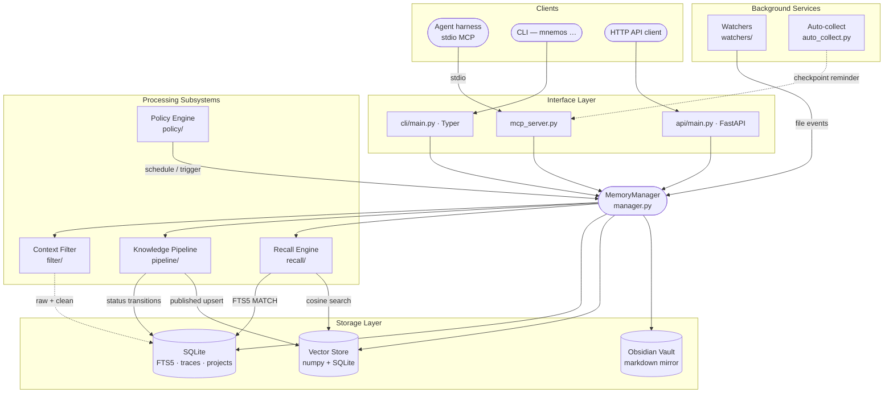

<!-- markdownlint-disable MD041 MD033 -->
<p align="center">
  
</p>

<h1 align="center">Mnemos</h1>

<p align="center">
  <strong>A memory &amp; knowledge server for AI agents</strong><br>
  <em>named after the Titaness of memory, built for AI agents that need to remember</em>
</p>

<p align="center">
  <a href="https://pypi.org/project/mnemos-memory-server/"></a>
  <a href="https://www.npmjs.com/package/pi-mnemos"></a>
  <a href="pyproject.toml"></a>
  <a href="pyproject.toml"></a>
  <a href="https://github.com/Korrnals/mnemos/releases"></a>
</p>

<p align="center">
  <strong>🇬🇧 English</strong> · <a href="README.ru.md">🇷🇺 Русский</a>
</p>

<p align="center">
  <a href="#-quick-start">Quick start</a> ·
  <a href="#-features">Features</a> ·
  <a href="#-what-mnemos-is">What it is</a> ·
  <a href="#-connect-any-harness">Connect a harness</a> ·
  <a href="#%EF%B8%8F-architecture">Architecture</a> ·
  <a href="#-documentation">Docs</a>
</p>

---

AI agents forget everything when a session ends. Mnemos gives them a place to lay it down —
structured, searchable, governed by contract — so what they learn does not vanish with the
closing of a window.

- **Local-first.** One process on your machine. SQLite + a bundled embedding model; nothing leaves the host, no API keys, works offline.
- **One server, any harness.** VS Code Copilot, Claude Code, Cursor, OpenCode, Codex, Windsurf, ZCode, pi, Hermes — the same MCP wire, one line each.
- **The agent learns to *use* it.** Not just tools: always-on instructions, a skill pack, and a memory-first prompt mode, deployed into your harness in one command.

---

## 🚀 Quick start

Four steps from an empty machine to an agent that remembers across sessions — and knows when to look.

### 1 · Install

Mnemos ships on PyPI as **`mnemos-memory-server`**. Pick the line that matches how you will use it:

| You want… | Install with | You get |
|-----------|--------------|---------|
| **Memory for an agent harness** — the usual case | `pip install "mnemos-memory-server[mcp]"` | server + `mnemos` CLI + REST API + **the MCP server your harness talks to** |
| The `mnemos` command on `PATH`, project environments untouched | `uv tool install "mnemos-memory-server[mcp]"` — or `pipx install "mnemos-memory-server[mcp]"` | same as above, isolated |
| CLI and REST only, no agent harness | `pip install mnemos-memory-server` | server + CLI + REST API (no MCP) |
| External LLM enrichment as well | `pip install "mnemos-memory-server[mcp,ollama]"` — also `openai`, `anthropic`, `gemini` | + the chosen provider SDK |

> **What `[mcp]` means.** Square brackets select a pip *extra* — an optional dependency group. The base
> package already holds everything needed to store and search memory: the `mnema-embed-v1` embedding
> model (~30 MB) is bundled, so search works offline with no downloads and no API keys. `[mcp]` adds the
> MCP SDK that `mnemos mcp-server` runs on — and MCP is how every agent harness connects, which is why
> it is the default recommendation. The quotes keep your shell from treating the brackets as a glob.

> ⚠️ **Mind the name.** `pip install mnemos` (without `-memory-server`) installs an unrelated project
> that owns the bare name on PyPI.

<details>
<summary><strong>Other ways to install</strong> — installer script, from source, released wheel, container</summary>

<br>

**Installer script** — creates an isolated venv at `~/.mnemos/venv`, drops a `mnemos` launcher into `~/.local/bin` (no venv activation ever), and offers to wire VS Code MCP in the same run:

```bash
curl -fsSL https://raw.githubusercontent.com/Korrnals/mnemos/main/scripts/install.sh | bash
```

Non-interactive: add `--mcp` / `--no-mcp`, e.g. `… | bash -s -- --mcp`.

**From source** (contributors — see [CONTRIBUTING.md](CONTRIBUTING.md)):

```bash
git clone https://github.com/Korrnals/mnemos.git && cd mnemos
uv venv && source .venv/bin/activate
uv pip install -e ".[dev,mcp]"
```

**Released wheel** (pin a specific version):

<!-- version:pip -->
```bash
pip install https://github.com/Korrnals/mnemos/releases/download/v4.0.0/mnemos_memory_server-4.0.0-py3-none-any.whl
```
<!-- /version:pip -->

**Container** — pulls the image, creates volumes, starts on port 8787:

```bash
export MNEMOS_API__TOTP_MASTER_KEY=$(python3 -c "import secrets; print(secrets.token_urlsafe(32))")
curl -fsSL https://raw.githubusercontent.com/Korrnals/mnemos/main/scripts/install.sh | bash -s -- --container
```

Or run the pre-built image directly (published to `ghcr.io/korrnals/mnemos` on every release; works with `docker` too):

```bash
podman run -d --name mnemos \
  -p 8787:8787 \
  -v mnemos-data:/data \
  -v mnemos-vault:/vault \
  -e MNEMOS_API__TOTP_MASTER_KEY="${MNEMOS_API__TOTP_MASTER_KEY}" \
<!-- version:image -->
  ghcr.io/korrnals/mnemos:4.0.0
<!-- /version:image -->

curl -s http://localhost:8787/health | jq
```

<!-- version:tags -->
Tags: `:4.0.0` (pinned) · `:latest` (rolling).
<!-- /version:tags -->

Full guide: [container deployment](docs/en/admin/runbooks/container-deployment.md).

</details>

### 2 · Write and find your first memory

```bash
mnemos add "First memory — Mnemos remembers across sessions" \
  --tags project:mnemos,agent:me,mnemos:learning

mnemos search "remembers across sessions"
```

Every entry carries the [tag contract](docs/en/user/tag-contract.md) — one `project:`, one `agent:`,
at least one `mnemos:` — so memory stays organised no matter how many agents write to it. The store
lives at `~/.mnemos/data/mnemos.db`, with a human-readable markdown mirror in `~/.mnemos/vault/`.

### 3 · Connect your harness

Every harness speaks to Mnemos over the same stdio wire — `mnemos mcp-server` — so it is one line each:

| Harness | Do this |
|---------|---------|
| **VS Code Copilot** | `curl -fsSL https://raw.githubusercontent.com/Korrnals/mnemos/main/scripts/mcp-setup.sh \| bash`, then reload the window |
| **Claude Code** | `claude mcp add --scope user mnemos -- mnemos mcp-server` |
| **Cursor** / **Windsurf** | paste `"mnemos": { "type": "stdio", "command": "mnemos", "args": ["mcp-server"] }` into `mcpServers` of `~/.cursor/mcp.json` / `~/.codeium/windsurf/mcp_config.json` |
| **OpenCode** | paste `"mnemos": { "type": "local", "command": ["mnemos", "mcp-server"] }` into `mcp` of `~/.config/opencode/opencode.json` |
| **Codex, ZCode, pi, Hermes, anything else** | one block each on [Connect Mnemos to any harness](integrations/mcp-presets.md) |

Restart the harness — the 26 `mnemos_*` tools appear in its tool list. Probe the wire without a harness:

```bash
mnemos doctor          # MCP transport, store, config, harness registration — PASS / WARN / FAIL per check
```

### 4 · Teach the agent to use its memory

Tools alone are passive — an agent that *can* call `mnemos_search` will still forget to. The behavioral
pack closes that gap: always-on instructions (recall at session start, checkpoint before the context
gets compacted, tag every write), 14+ memory skills, and a memory-first prompt mode:

```bash
mnemos integration setup       # detects your harnesses and deploys the pack; --target <name> to pick one
mnemos integration verify      # every file landed, stamped, well-formed
```

Coverage today — full pack (instructions + skills, plus the prompt mode for VS Code) for `copilot`,
`generic-copilot`, `cursor`, `hermes`; skills + MCP registration for `zcode`, `agents` (the `~/.agents`
standard read by Claude Code, Codex and friends) and `pi`. Always-on instructions for that second group
are tracked in [#231](https://github.com/Korrnals/mnemos/issues/231). Flags, the deploy map, and agent
wiring: [integration guide](docs/en/user/integration-guide.md).

That is the whole loop: **write, find, never lose it — and the agent knows when to look.**

> 📘 Guided first run with troubleshooting: [getting-started.md](docs/en/user/getting-started.md).

---

## ✨ Features

One local server — and a connected agent harness gets the full memory stack.

| Area | What you get |
|------|--------------|
| **Universal connectivity** | MCP server (26 tools, stdio) + REST API — any MCP-capable harness connects in one line ([tools](docs/en/user/mcp-tools.md) · [HTTP](docs/en/user/http-api.md)) |
| **Ready integrations** | VS Code Copilot, Claude Code, Cursor, Codex, Windsurf, OpenCode, ZCode, pi, Hermes Agent — one-line MCP presets for all of them, [native deploy targets](docs/en/user/integration-guide.md) for most, multi-harness doctor (`mnemos doctor`) |
| **Skill pack** | 14+ memory skills deployed into your harnesses |
| **Flexible memory** | Hybrid search (full-text + vector, rank fusion) over the bundled offline model `mnema-embed-v1`, [tag contract](docs/en/user/tag-contract.md), per-agent / per-project memory, [context-filter](docs/en/user/context-filter.md) profiles, CCR compression — 70–90% token savings, originals kept |
| **Context assembly** | `assemble_context`: search → compress → filter → secret scan → cache align → token budget, per-block provenance |
| **Context bridge** | `on_context_rewrite` — when the harness compacts history, the lossless original stays available on demand |
| **Lifecycle hooks** | `pre_llm_call` context injection, `on_session_start`, `post_tool_call` auto-compression of tool outputs |
| **Publication v3.0.0** | Entries visible immediately after save, background refinement with seamless swap, quarantine with neutral retraction |
| **Self-protection** | Injection / secret detectors on input and publication, every output scanned, full per-entry audit |
| **Auto-pipeline** | Background processor: clustering, deduplication, quality gate, publication |

Autonomy for an arbitrary harness and LLM-driven enrichment are partial — the
full, honest map lives in [docs/en/features.md](docs/en/features.md).

---

## 🧩 What Mnemos is

A **single-tenant, local-first memory server** for AI agents. One in-process core, three equivalent
control surfaces, and a storage layer you can read with your own eyes.

|  | Capability | What it gives you |
|---|------------|-------------------|
| 🔎 | **Hybrid search** | Vector similarity + SQLite FTS5 full-text over every memory |
| 🧪 | **Knowledge pipeline** | `raw → processing → processed → published` lifecycle with a state machine |
| 🧠 | **Per-agent recall** | A focused recall surface scoped to each agent's project context |
| ⚙️ | **Policy engine** | Schedule and trigger automation over the memory store |
| 🧹 | **Context filter** | Five-stage noise stripper for logs / stdout before anything hits a model |
| 🗜️ | **Reversible compression (CCR)** | Compress large content with zero data loss — originals cached in SQLite, retrievable via hash marker |
| 🧷 | **CacheAligner** | Relocate dynamic content (timestamps, UUIDs, session ids, tokens) to the tail so provider KV caches (Anthropic `cache_control`, OpenAI prefix caching) hit across requests |
| 🪶 | **Output token reduction** | Optional `verbosity` / `effort` params on `mnemos_add` / `mnemos_search` / `mnemos_recall_context` steer the caller's output style — backward compatible, defaults are a no-op |
| 📂 | **Path-scoped rules** | Ingest project rules and apply them by file path |
| 🗂️ | **Obsidian vault** | A markdown mirror humans can browse, edit, and grep |

SQLite for metadata, a local numpy + SQLite vector index for recall, and an Obsidian-compatible vault
for the humans in the loop.

---

## 🤝 Connect any harness

Mnemos works with every MCP-capable agent harness. Three integration levels —
pick the strongest one your harness supports:

| Harness | Native deploy target | One-line MCP preset | Adapter template |
|---------|----------------------|---------------------|------------------|
| VS Code Copilot | `copilot` (+ prompts via `generic-copilot`) | [mcp-setup.sh](scripts/mcp-setup.sh) | ✓ |
| Claude Code | via `agents` | [preset](integrations/mcp-presets.md#claude-code) | ✓ |
| Cursor | `cursor` | [preset](integrations/mcp-presets.md#cursor) | ✓ |
| Codex | via `agents` | [preset](integrations/mcp-presets.md#codex) | ✓ |
| Windsurf | — | [preset](integrations/mcp-presets.md#windsurf) | ✓ |
| OpenCode | — | [preset](integrations/mcp-presets.md#opencode) | ✓ |
| ZCode | `zcode` | — | ✓ |
| Any AGENTS.md-standard harness | `agents` | — | ✓ |
| pi | `pi` (bridge extension, also on npm as [`pi-mnemos`](https://www.npmjs.com/package/pi-mnemos)) | [preset](integrations/mcp-presets.md#pi) | ✓ |
| [Hermes Agent](https://hermes-agent.nousresearch.com/) | `hermes` (native in-process `MemoryProvider` plugin) | — | — |

- **Native targets** — `mnemos integration setup --target <name>` deploys the behavioral pack and
  registers the MCP server in one pass ([integration guide](docs/en/user/integration-guide.md)).
- **One-line presets** — [`integrations/mcp-presets.md`](integrations/mcp-presets.md): every harness
  above, copy-paste ready.
- **Adapter template** — [`integrations/adapter-template.md`](integrations/adapter-template.md):
  Connect / Expose / Configure + acceptance checklist for any harness that speaks MCP stdio.
- **Hermes Agent** runs Mnemos in-process: `pip install mnemos-memory-server` in the Hermes environment,
  then `mnemos integration setup --target hermes` ([details](docs/en/user/integration-guide.md#hermes-agent)).

The shared contract is the [tag schema](docs/en/user/tag-contract.md) — `project:<slug>`, `agent:<slug>`,
and at least one `mnemos:<subtype>` — that every memory entry must carry.

---

## 🏗️ Architecture

<details open>
<summary><strong>System diagram</strong> — clients → interfaces → core → storage</summary>

<br>



</details>

A deeper walkthrough — data model, state machines, security boundaries, operational concerns — lives in
[architecture/overview.md](docs/en/architecture/overview.md).

---

## 🎛️ Three surfaces, one core

The same `MemoryManager` powers all three interfaces. Pick the one that fits your client.

| Surface | Use it when… | Reference |
|---------|--------------|-----------|
| **MCP** — `mnemos mcp-server` | You are an agent harness — the path every connected agent takes | [mcp-tools.md](docs/en/user/mcp-tools.md) |
| **CLI** — `mnemos …` | You live in a shell, want fast ad-hoc add / search, or are scripting cron jobs | [cli-reference.md](docs/en/user/cli-reference.md) |
| **HTTP** — `mnemos serve` | You have a non-MCP client — a web dashboard, a mobile app, a CI runner | [http-api.md](docs/en/user/http-api.md) |

The HTTP surface also exposes the **A2A Sessions API** — a persistent backend for multi-step agent
conversations that survive restarts. See [a2a-sessions.md](docs/en/architecture/a2a-sessions.md).

---

## 📚 Documentation

| Page | What it covers |
|------|----------------|
| [docs/README.md](docs/README.md) | Documentation landing — language picker (EN / RU) |
| [getting-started.md](docs/en/user/getting-started.md) | First run: install → first memory → first search → connect your harness |
| [mcp-presets.md](integrations/mcp-presets.md) | Connect Mnemos to any harness — one-line MCP presets (VS Code, Claude Code, Cursor, OpenCode, Codex, Windsurf, pi, Hermes) |
| [integration-guide.md](docs/en/user/integration-guide.md) | The behavioral pack: instructions, skills, prompt mode, deploy targets, agent wiring, Hermes plugin |
| [features.md](docs/en/features.md) | What works out of the box, what is partial, what is planned |
| [architecture/overview.md](docs/en/architecture/overview.md) | System shape, data model, state machines, security boundaries |
| [cli-reference.md](docs/en/user/cli-reference.md) | Every `mnemos` subcommand with flags, defaults, examples |
| [mcp-tools.md](docs/en/user/mcp-tools.md) | Every `mnemos_*` tool exposed to agent harnesses |
| [http-api.md](docs/en/user/http-api.md) | Every HTTP endpoint (memory CRUD, workflow, hooks, A2A Sessions) |
| [tag-contract.md](docs/en/user/tag-contract.md) | The `project:` / `agent:` / `mnemos:` schema enforced on every memory |
| [security.md](docs/en/admin/security.md) | Threat model, SSRF guard, FTS5 escape, auth model |
| [runbooks/](docs/en/admin/runbooks/) | Install, migrate, backup / restore, dependency updates, container deployment |
| [adr/](docs/project/adr/) | Architectural decision records — the *why* behind the design |
| [CHANGELOG.md](CHANGELOG.md) | Release notes — Keep a Changelog format |
| [CONTRIBUTING.md](CONTRIBUTING.md) | Development setup, git workflow, quality gate |

---

## 📖 The lore

> In Hesiod's *Theogony*, **Mnemosyne** (Μνημοσύνη) is the Titaness of memory — she who, by Zeus, gave
> birth to the nine Muses and through them made the world's remembering possible. Her name is the root of
> *mnemonic*, and she is what every singer, poet, and philosopher prays to before they begin.

This software carries her name because it is built for the same task: **to make remembering possible for
the things that think.** AI agents, unmoored from any single conversation, lose everything that came
before. Mnemos gives them a place to lay it down — structured, searchable, governed by contract — so that
what they learn does not vanish with the closing of a session. The Muses, after all, were not for the
gods' benefit. They were for the songs.

---

## ⚖️ License &amp; contributing

Apache-2.0 — see [LICENSE](LICENSE) and [NOTICE](NOTICE). Source: [github.com/Korrnals/mnemos](https://github.com/Korrnals/mnemos).

Contributions are welcome — [CONTRIBUTING.md](CONTRIBUTING.md) has the development setup, the branch
and commit conventions, and the quality gate a change must pass.
