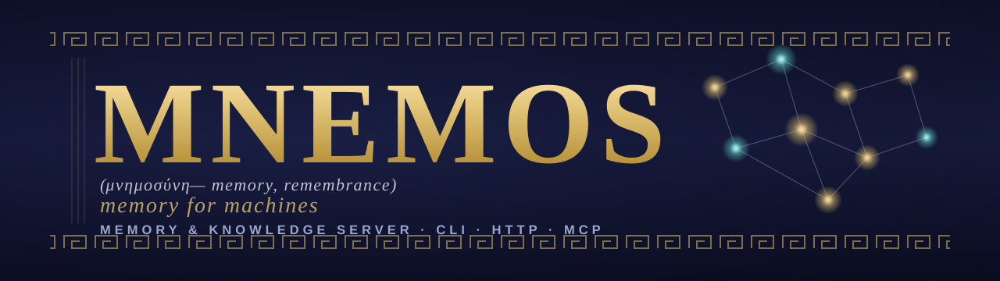
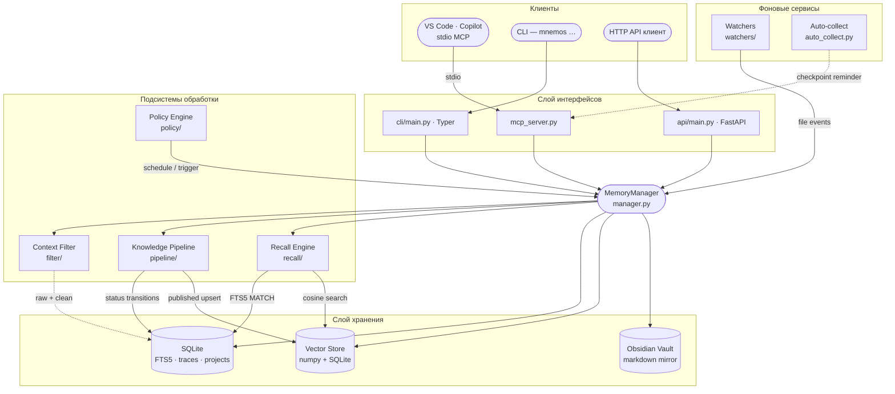

<!-- markdownlint-disable MD041 MD033 -->
<p align="center">
  
</p>

<h1 align="center">Mnemos</h1>

<p align="center">
  <strong>Сервер памяти и знаний для AI-агентов</strong><br>
  <em>назван в честь титаниды памяти, создан для AI-агентов, которым нужна память</em>
</p>

<p align="center">
  <a href="https://pypi.org/project/mnemos-memory-server/"></a>
  <a href="https://www.npmjs.com/package/pi-mnemos"></a>
  <a href="pyproject.toml"></a>
  <a href="pyproject.toml"></a>
  <a href="https://github.com/Korrnals/mnemos/releases"></a>
</p>

<p align="center">
  <a href="README.md">🇬🇧 English</a> · <strong>🇷🇺 Русский</strong>
</p>

<p align="center">
  <a href="#-возможности">Возможности</a> ·
  <a href="#-быстрый-старт">Быстрый старт</a> ·
  <a href="#-что-такое-mnemos">Что это</a> ·
  <a href="#%EF%B8%8F-архитектура">Архитектура</a> ·
  <a href="#%EF%B8%8F-три-поверхности-одно-ядро">Поверхности</a> ·
  <a href="#-документация">Документация</a>
</p>

---

## ✨ Возможности

Один локальный сервер — и подключённый агентский харнес получает полный стек памяти.

| Область | Что даёт |
|---------|----------|
| **Универсальное подключение** | MCP-сервер (26 инструментов, stdio) + REST API — любой харнесс с поддержкой MCP подключается одной строкой ([инструменты](docs/ru/user/mcp-tools.md) · [HTTP](docs/ru/user/http-api.md)) |
| **Готовые интеграции** | VS Code Copilot, Claude Code, Cursor, Codex, Windsurf, OpenCode, ZCode, pi, Hermes Agent — однострочные MCP-пресеты для всех, [нативные таргеты развёртывания](docs/ru/user/integration-guide.md) для большинства, доктор мульти-харнесов (`mnemos doctor`) |
| **Пакет скиллов** | 14+ скиллов памяти деплоятся в харнесы |
| **Гибкая память** | Гибридный поиск (полнотекстовый + векторный, слияние ранжирования) поверх встроенной офлайн-модели `mnema-embed-v1`, [теги-контракт](docs/ru/user/tag-contract.md), память по агентам и проектам, профили [контекстного фильтра](docs/ru/user/context-filter.md), сжатие CCR — экономия 70–90% токенов, оригиналы сохраняются |
| **Сборка контекста** | `assemble_context`: поиск → сжатие → фильтр → скан секретов → выравнивание кэша → бюджет токенов, провенанс каждого блока |
| **Мост контекста** | `on_context_rewrite` — при сжатии истории харнессом оригинал без потерь доступен по требованию |
| **Хуки жизненного цикла** | `pre_llm_call` (впрыск контекста перед запросом модели), `on_session_start`, `post_tool_call` (авто-сжатие выводов инструментов) |
| **Публикация v3.0.0** | Запись видна сразу после сохранения, фоновая дообработка с бесшовной подменой, карантин с нейтральной ретракцией |
| **Автозащита** | Детекторы инъекций / секретов на входе и публикации, скан каждой выдачи, полный аудит с привязкой к записи |
| **Автоконвейер** | Фоновый обработчик: кластеризация, дедупликация, гейт качества, публикация |

Автономность для произвольного харнесса и LLM-дообогащение — частично; полная
честная карта: [docs/ru/features.md](docs/ru/features.md).

---

## 🚀 Быстрый старт

Четыре шага до рабочего хранилища памяти, подключённого к вашему агентскому харнесу.

### 1 · Установка

Mnemos опубликован на PyPI — одна команда, ничего больше скачивать не нужно
(модель эмбеддингов встроена в пакет, работает офлайн):

```bash
pip install "mnemos-memory-server[mcp]"
```

Изолированный вариант — кладёт CLI `mnemos` в `PATH`, не трогая проектные
окружения (харнесы запускают `mnemos` из `PATH`, так что это естественный выбор):

```bash
uv tool install "mnemos-memory-server[mcp]"    # или: pipx install "mnemos-memory-server[mcp]"
```

> ⚠️ Имя пакета на PyPI — **`mnemos-memory-server`**. `pip install mnemos` устанавливает
> *не связанный* проект, которому принадлежит имя `mnemos`.

<details>
<summary><strong>🛠️ Другие способы установки</strong> — скрипт-установщик, из исходников, готовый wheel или контейнер</summary>

<br>

**Скрипт-установщик** — создаёт изолированный venv в `~/.mnemos/venv`, кладёт лаунчер `mnemos`
в `~/.local/bin` (**активировать venv не нужно**) и в том же запуске предлагает настроить VS Code MCP:

```bash
curl -fsSL https://raw.githubusercontent.com/Korrnals/mnemos/main/scripts/install.sh | bash
```

> Нужен неинтерактивный запуск? Добавьте `--mcp` / `--no-mcp`, чтобы выбрать заранее, например
> `… | bash -s -- --mcp`.

**Из исходников** (для разработки):

```bash
git clone https://github.com/Korrnals/mnemos.git
cd mnemos
uv venv && source .venv/bin/activate
uv pip install -e ".[dev,mcp]"
```

**Готовый wheel** (зафиксировать конкретную версию):

<!-- version:pip -->
```bash
pip install https://github.com/Korrnals/mnemos/releases/download/v4.0.0/mnemos_memory_server-4.0.0-py3-none-any.whl
```
<!-- /version:pip -->

**Контейнер одной командой** — скачивает образ, создаёт тома, запускает на порту 8787:

```bash
export MNEMOS_API__TOTP_MASTER_KEY=$(python3 -c "import secrets; print(secrets.token_urlsafe(32))")
curl -fsSL https://raw.githubusercontent.com/Korrnals/mnemos/main/scripts/install.sh | bash -s -- --container
```

Полное руководство — [container-deployment.md](docs/ru/admin/runbooks/container-deployment.md).

</details>

### 2 · Запись и поиск

```bash
mnemos add "Первая запись — Mnemos помнит между сессиями" \
  --tags project:mnemos,agent:tech-writer,mnemos:learning

mnemos search "помнит между сессиями"
```

Это весь цикл: **записал, нашёл, не потерял.** Каждая запись несёт
[контракт тегов](docs/ru/user/tag-contract.md) (`project:` / `agent:` / `mnemos:`), чтобы память оставалась упорядоченной.

### 3 · Подключите ваш харнес (MCP)

Любой харнесс с поддержкой MCP подключается по одному и тому же однострочнику —
**полные инструкции для копирования для каждого харнесса собраны на одной странице:
[Подключите Mnemos к любому харнесу](integrations/mcp-presets.md)**.

Конкретно для VS Code Copilot скриптовый путь безопасно вливается в ваш `mcp.json`:

```bash
curl -fsSL https://raw.githubusercontent.com/Korrnals/mnemos/main/scripts/mcp-setup.sh | bash
```

Затем **перезагрузите окно VS Code** (`Ctrl+Shift+P → Reload Window`). Инструменты `mnemos_*` появятся
в палитре инструментов Copilot, и агенты смогут вызывать `mnemos_add` / `mnemos_search` напрямую.
Claude Code, Cursor, OpenCode, Codex, Windsurf, ZCode, pi и Hermes получают свои пресеты
на той же странице.

### 4 · Установка поведенческих инструкций

```bash
mnemos integration setup
```

Развёртывает инструкции использования памяти, скиллы и режим промпта в ваш
агентский харнес — нативные таргеты для Copilot `~/.copilot/`, обычного Copilot,
Cursor, Hermes Agent `~/.hermes/`, плюс два универсальных таргета: `zcode`
(нативные скиллы `~/.zcode/` + конфиг MCP), `agents` (стандарт AGENTS.md
`~/.agents/` — нативно читается Claude Code, Codex, Cursor и другими) и `pi`
(бридж-расширение). Агенты теперь *знают когда и как* использовать память
Mnemos — а не просто имеют инструменты. Используйте `--home <dir>` для установки
в home другого окружения (например, контейнера).

Добавьте `--wire-agents --all`, чтобы в том же проходе выдать инструменты
`mnemos/*` во фронтматтер Copilot-агентов. См. [руководство по интеграции](docs/ru/user/integration-guide.md#подключение-mcp-инструментов-к-агентам)
по флагам wiring и [руководство по контекстному фильтру](docs/ru/user/context-filter.md)
— пятиступенчатый очиститель шума, который запускается автоматически при каждом `mnemos_add`.

<details>
<summary><strong>🐳 Запуск готового образа напрямую (GHCR)</strong></summary>

<br>

Образ публикуется в `ghcr.io/korrnals/mnemos` при каждом release-теге.

```bash
# Сгенерируйте TOTP-ключ (обязательно — контейнер слушает 0.0.0.0)
export MNEMOS_API__TOTP_MASTER_KEY=$(python3 -c "import secrets; print(secrets.token_urlsafe(32))")

podman run -d --name mnemos \
  -p 8787:8787 \
  -v mnemos-data:/data \
  -v mnemos-vault:/vault \
  -e MNEMOS_API__TOTP_MASTER_KEY="${MNEMOS_API__TOTP_MASTER_KEY}" \
<!-- version:image -->
  ghcr.io/korrnals/mnemos:4.0.0
<!-- /version:image -->

curl -s http://localhost:8787/health | jq
```

<!-- version:tags -->
Теги: `:4.0.0` (фиксированная) · `:latest` (rolling). Работает и с `docker` — замените `podman` на `docker`.
<!-- /version:tags -->

</details>

> 📘 Пошаговое руководство первого запуска с MCP- и HTTP-серверами —
> [getting-started.md](docs/ru/user/getting-started.md).

---

## 🧩 Что такое Mnemos

**Однотенантный, локально-ориентированный сервер памяти** для AI-агентов. Одно ядро in-process, три
эквивалентных поверхности управления и слой хранения, который можно прочитать своими глазами.

|  | Возможность | Что это даёт |
|---|------------|-------------------|
| 🔎 | **Гибридный поиск** | Векторная близость + полнотекстовый FTS5 по каждой записи |
| 🧪 | **Конвейер знаний** | Жизненный цикл `raw → processing → processed → published` с конечным автоматом |
| 🧠 | **Recall на агента** | Сфокусированная поверхность recall в контексте проекта каждого агента |
| ⚙️ | **Движок политик** | Планирование и триггеры автоматизации над хранилищем памяти |
| 🧹 | **Контекстный фильтр** | Пятиступенчатая очистка логов / stdout перед отправкой модели |
| 🗜️ | **Обратимое сжатие (CCR)** | Сжатие большого контента без потери данных — оригиналы кэшируются в SQLite, извлекаются по хеш-маркеру |
| 🧷 | **CacheAligner (P1-5)** | Перенос динамического контента (таймстампы, UUID, session id, токены) в хвост, чтобы KV-кэши провайдеров (Anthropic `cache_control`, OpenAI prefix caching) попадали между запросами |
| 🪶 | **Сокращение токенов вывода (P1-7)** | Опциональные параметры `verbosity` / `effort` на `mnemos_add` / `mnemos_search` / `mnemos_recall_context` управляют стилем вывода вызывающей стороны — обратная совместимость, значения по умолчанию — no-op |
| 📂 | **Path-scoped rules** | Ингест правил проекта и применение их по пути файла |
| 🗂️ | **Obsidian vault** | Markdown-зеркало, которое люди могут смотреть, править и grep'ать |

SQLite для метаданных, локальный векторный индекс на numpy + SQLite для recall и Obsidian-совместимый
vault для людей в процессе.

---

## 🏗️ Архитектура

<details open>
<summary><strong>Схема системы</strong> — клиенты → интерфейсы → ядро → хранилище</summary>

<br>



</details>

Более глубокий разбор — модель данных, конечные автоматы, границы безопасности, эксплуатационные аспекты —
в [architecture/overview.md](docs/ru/architecture/overview.md).

---

## 🎛️ Три поверхности, одно ядро

Один и тот же `MemoryManager` управляет всеми тремя интерфейсами. Выберите подходящий клиенту.

| Поверхность | Когда использовать… | Документация |
|---------|--------------|-----------|
| **CLI** — `mnemos …` | Вы работаете в шелле, нужен быстрый ad-hoc add / search или скрипты cron | [cli-reference.md](docs/ru/user/cli-reference.md) |
| **HTTP** — `mnemos serve` | У вас не-MCP клиент — веб-дашборд, мобильное приложение, CI runner | [http-api.md](docs/ru/user/http-api.md) |
| **MCP** — `mnemos mcp-server` | Вы VS Code Copilot или любой MCP-aware агент — путь Copilot-агентов | [mcp-tools.md](docs/ru/user/mcp-tools.md) |

MCP-поверхность также предоставляет **A2A Sessions API** (M16) — постоянный бэкенд для многошаговых
разговоров агентов. Пять endpoints (`POST /v1/sessions`, append-turn, range-load, …) позволяют агентам
переживать рестарты без потери контекста. См. [a2a-sessions.md](docs/ru/architecture/a2a-sessions.md).

---

## 📖 Лор

> В «Теогонии» Гесиода **Мнемосина** (Μνημοσύνη) — титанида памяти. Она, от Зевса, родила девять муз и
> через них сделала возможным воспоминание мира. Её имя — корень слова *мнемонический*, и к ней обращается
> каждый певец, поэт и философ, прежде чем начать.

Это программное обеспечение носит её имя, потому что создано для той же задачи: **сделать воспоминание
возможным для тех, кто мыслит.** AI-агенты, оторванные от единственного разговора, теряют всё, что было
до. Mnemos даёт им место, где можно это сохранить — структурированно, с поиском, по контракту — чтобы то,
что они узнали, не исчезало с закрытием сессии. Музы, в конце концов, были не для богов. Они были для
песен.

---

## 📚 Документация

| Страница | Содержание |
|------|----------------|
| [docs/README.md](docs/README.md) | Главная страница документации — выбор языка (EN / RU) |
| [getting-started.md](docs/ru/user/getting-started.md) | Первый запуск: установка → первая запись → первый поиск → подключение харнеса |
| [mcp-presets.md](integrations/mcp-presets.md) | Подключение Mnemos к любому харнесу — однострочные MCP-пресеты (VS Code, Claude Code, Cursor, OpenCode, Codex, Windsurf, pi, Hermes) |
| [architecture/overview.md](docs/ru/architecture/overview.md) | Архитектура, модель данных, конечные автоматы, границы безопасности |
| [cli-reference.md](docs/ru/user/cli-reference.md) | Все подкоманды `mnemos` с флагами, значениями по умолчанию, примерами |
| [mcp-tools.md](docs/ru/user/mcp-tools.md) | Все инструменты `mnemos_*` для VS Code Copilot |
| [http-api.md](docs/ru/user/http-api.md) | Все HTTP endpoints (CRUD памяти + A2A Sessions, M16) |
| [a2a-sessions.md](docs/ru/architecture/a2a-sessions.md) | Контракт agent-to-agent разговоров (M16) |
| [tag-contract.md](docs/ru/user/tag-contract.md) | Схема `project:` / `agent:` / `mnemos:`, обязательная для каждой записи |
| [security.md](docs/ru/admin/security.md) | Модель угроз, SSRF-защита, FTS5 escape, пиннинг HF Hub |
| [runbooks/](docs/ru/admin/runbooks/) | Установка, миграция, резервное копирование, обновление зависимостей |
| [container-deployment.md](docs/ru/admin/runbooks/container-deployment.md) | Сборка, push, compose, podman, Kubernetes, quadlet |
| [adr/](docs/project/adr/) | Архитектурные решения (ADR) — *почему* за каждым дизайном |
| [milestones.md](docs/project/milestones.md) | Журнал milestones со статусами |
| [reports/](docs/project/reports/) | Отчёты о завершённых этапах — итоговый отчёт по каждой фазе дорожной карты |
| [CHANGELOG.md](CHANGELOG.md) | Release notes — формат Keep a Changelog |

---

## 🤝 Интеграции

Mnemos работает с любым харнессом, говорящим по MCP. Три уровня интеграции —
выберите самый сильный из доступных для вашего харнесса:

| Харнесс | Нативная цель | Однострочный MCP-пресет | Шаблон адаптера |
|---------|---------------|-------------------------|-----------------|
| VS Code Copilot | `copilot` (+ промпты через `generic-copilot`) | [mcp-setup.sh](scripts/mcp-setup.sh) | ✓ |
| Claude Code | через `agents` | [пресет](integrations/mcp-presets.md#claude-code) | ✓ |
| Cursor | `cursor` | [пресет](integrations/mcp-presets.md#cursor) | ✓ |
| Codex | через `agents` | [пресет](integrations/mcp-presets.md#codex) | ✓ |
| Windsurf | — | [пресет](integrations/mcp-presets.md#windsurf) | ✓ |
| OpenCode | — | [пресет](integrations/mcp-presets.md#opencode) | ✓ |
| ZCode | `zcode` | — | ✓ |
| Любой харнесс стандарта AGENTS.md | `agents` | — | ✓ |
| [Hermes Agent](https://hermes-agent.nousresearch.com/) | `hermes` (нативный `MemoryProvider` плагин) | — | — |

- **[Hermes Agent](https://hermes-agent.nousresearch.com/)** — нативный `MemoryProvider` плагин
  (`integrations/hermes/`): автоматический prefetch, sync-turn, зеркалирование встроенной памяти.
  С версии плагина **3.0.0** (ADR-0017 D1) плагин работает **in-process** — требуется `pip install mnemos-memory-server`
  в Python-окружении Hermes, а легаси-ключи конфигурации `base_url` / `api_key` / `totp_secret` удалены.
  См. [руководство по интеграции](docs/ru/user/integration-guide.md#hermes-agent).
- **Нативные цели** — `mnemos integration setup --target <имя>` развёртывает
  поведенческий пакет и регистрирует MCP-сервер за один проход. См.
  [руководство по интеграции](docs/ru/user/integration-guide.md).
- **Однострочные MCP-пресеты** — [`integrations/mcp-presets.md`](integrations/mcp-presets.md):
  Cursor, Claude Code, Codex и Windsurf подключаются вставкой одной строки.
- **Шаблон адаптера** — [`integrations/adapter-template.md`](integrations/adapter-template.md):
  Connect / Expose / Configure + чеклист приёмки для любого харнесса,
  говорящего по MCP stdio.

Общий контракт — [схема тегов](docs/ru/user/tag-contract.md) — `project:<slug>`, `agent:<slug>`
и хотя бы один `mnemos:<subtype>` — которую должна нести каждая запись.

---

## ⚖️ Исходный код и лицензия

- **Исходник** — этот репозиторий, [github.com/Korrnals/mnemos](https://github.com/Korrnals/mnemos).
- **Лицензия** — Apache-2.0 (см. [LICENSE](LICENSE)).

## 🌱 Участие

PR приветствуются. Прочитайте [PLAN.md](PLAN.md) для roadmap и следуйте конвенциям в [docs/](docs/).

Git-workflow: `feat/*` → `dev-<этап>` → `release/X.Y.Z` → `main`; `main` принимает только `release/*` и
`hotfix/*` PR. Обязательны Conventional Commits. Запустите `make verify` перед открытием PR.

---

<p align="center">
  <sub><strong>Воспроизведите зелёное состояние:</strong> <code>make verify</code> запускает полный
  quality gate — ruff + mypy --strict + bandit + pip-audit + 2300+ тестов. Если зелёно — готово к публикации.</sub>
</p>
