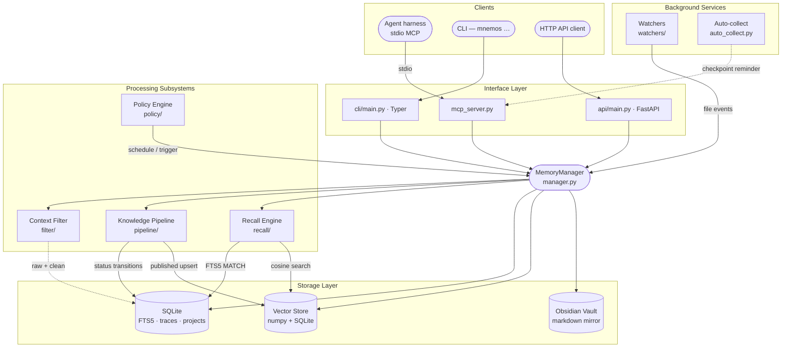

<!-- markdownlint-disable MD041 MD033 -->
<p align="center">
  
</p>

<h1 align="center">Mnemos</h1>

<p align="center">
  <strong>Сервер памяти и знаний для AI-агентов</strong><br>
  <em>назван в честь титаниды памяти, создан для агентов, которым нужно помнить</em>
</p>

<p align="center">
  <a href="https://pypi.org/project/mnemos-memory-server/"></a>
  <a href="https://www.npmjs.com/package/pi-mnemos"></a>
  <a href="pyproject.toml"></a>
  <a href="pyproject.toml"></a>
  <a href="https://github.com/Korrnals/mnemos/releases"></a>
</p>

<p align="center">
  <a href="README.md">🇬🇧 English</a> · <strong>🇷🇺 Русский</strong>
</p>

<p align="center">
  <a href="#-быстрый-старт">Быстрый старт</a> ·
  <a href="#-возможности">Возможности</a> ·
  <a href="#-что-такое-mnemos">Что это</a> ·
  <a href="#-подключение-любого-харнеса">Подключить харнес</a> ·
  <a href="#%EF%B8%8F-архитектура">Архитектура</a> ·
  <a href="#-документация">Документация</a>
</p>

---

AI-агенты забывают всё, когда сессия заканчивается. Mnemos даёт им место, куда это можно
положить — структурированно, с поиском, по контракту — чтобы то, что агент узнал, не исчезало
с закрытием окна.

- **Локальность прежде всего.** Один процесс на вашей машине. SQLite + встроенная модель эмбеддингов; ничего не покидает хост, без API-ключей, работает офлайн.
- **Один сервер, любой харнес.** VS Code Copilot, Claude Code, Cursor, OpenCode, Codex, Windsurf, ZCode, pi, Hermes — один и тот же MCP-провод, одна строка на каждого.
- **Агент учится этим *пользоваться*.** Не только инструменты: always-on инструкции, пакет скиллов и режим промпта «память прежде всего», разворачиваемые в ваш харнес одной командой.

---

## 🚀 Быстрый старт

Четыре шага от пустой машины до агента, который помнит между сессиями — и знает, когда заглянуть в память.

### 1 · Установка

Mnemos опубликован на PyPI как **`mnemos-memory-server`**. Выберите строку под ваш сценарий:

| Вы хотите… | Команда | Что получите |
|-----------|---------|--------------|
| **Память для агентского харнеса** — обычный случай | `pip install "mnemos-memory-server[mcp]"` | сервер + CLI `mnemos` + REST API + **MCP-сервер, с которым разговаривает ваш харнес** |
| Команда `mnemos` в `PATH`, проектные окружения не тронуты | `uv tool install "mnemos-memory-server[mcp]"` — или `pipx install "mnemos-memory-server[mcp]"` | то же самое, изолированно |
| Только CLI и REST, без агентского харнеса | `pip install mnemos-memory-server` | сервер + CLI + REST API (без MCP) |
| Плюс внешнее LLM-дообогащение | `pip install "mnemos-memory-server[mcp,ollama]"` — также `openai`, `anthropic`, `gemini` | + SDK выбранного провайдера |

> **Что значит `[mcp]`.** Квадратные скобки выбирают pip-*экстру* — опциональную группу зависимостей.
> В базовом пакете уже есть всё, что нужно для хранения и поиска памяти: модель эмбеддингов
> `mnema-embed-v1` (~30 МБ) встроена, поэтому поиск работает офлайн — без загрузок и без API-ключей.
> `[mcp]` добавляет MCP SDK, на котором работает `mnemos mcp-server`, — а MCP — это то, чем
> подключается любой агентский харнес, поэтому он и рекомендован по умолчанию. Кавычки защищают
> скобки от того, чтобы шелл принял их за glob.

> ⚠️ **Не перепутайте имя.** `pip install mnemos` (без `-memory-server`) устанавливает посторонний
> проект, которому принадлежит это имя на PyPI.

<details>
<summary><strong>Другие способы установки</strong> — скрипт-установщик, из исходников, готовый wheel, контейнер</summary>

<br>

**Скрипт-установщик** — создаёт изолированный venv в `~/.mnemos/venv`, кладёт лаунчер `mnemos`
в `~/.local/bin` (активировать venv не нужно никогда) и в том же запуске предлагает настроить VS Code MCP:

```bash
curl -fsSL https://raw.githubusercontent.com/Korrnals/mnemos/main/scripts/install.sh | bash
```

Неинтерактивный запуск: добавьте `--mcp` / `--no-mcp`, например `… | bash -s -- --mcp`.

**Из исходников** (контрибьюторам — см. [CONTRIBUTING.ru.md](CONTRIBUTING.ru.md)):

```bash
git clone https://github.com/Korrnals/mnemos.git && cd mnemos
uv venv && source .venv/bin/activate
uv pip install -e ".[dev,mcp]"
```

**Готовый wheel** (зафиксировать конкретную версию):

<!-- version:pip -->
```bash
pip install https://github.com/Korrnals/mnemos/releases/download/v4.0.0/mnemos_memory_server-4.0.0-py3-none-any.whl
```
<!-- /version:pip -->

**Контейнер** — скачивает образ, создаёт тома, запускает на порту 8787:

```bash
export MNEMOS_API__TOTP_MASTER_KEY=$(python3 -c "import secrets; print(secrets.token_urlsafe(32))")
curl -fsSL https://raw.githubusercontent.com/Korrnals/mnemos/main/scripts/install.sh | bash -s -- --container
```

Или запустите готовый образ напрямую — публикуется в `ghcr.io/korrnals/mnemos` при каждом релизе:

```bash
podman run -d --name mnemos \
  -p 8787:8787 \
  -v mnemos-data:/data \
  -v mnemos-vault:/vault \
  -e MNEMOS_API__TOTP_MASTER_KEY="${MNEMOS_API__TOTP_MASTER_KEY}" \
<!-- version:image -->
  ghcr.io/korrnals/mnemos:4.0.0
<!-- /version:image -->

curl -s http://localhost:8787/health | jq
```

<!-- version:tags -->
Теги: `:4.0.0` (фиксированная) · `:latest` (rolling). Работает и с `docker` — замените `podman` на `docker`.
<!-- /version:tags -->

Полное руководство — [развёртывание в контейнере](docs/ru/admin/runbooks/container-deployment.md).

</details>

### 2 · Первая запись и поиск

```bash
mnemos add "Первая запись — Mnemos помнит между сессиями" \
  --tags project:mnemos,agent:me,mnemos:learning

mnemos search "помнит между сессиями"
```

Каждая запись несёт [контракт тегов](docs/ru/user/tag-contract.md) — один `project:`, один `agent:`,
хотя бы один `mnemos:` — поэтому память остаётся упорядоченной, сколько бы агентов в неё ни писали.
Хранилище живёт в `~/.mnemos/data/mnemos.db`, а для людей рядом — человекочитаемое markdown-зеркало
в `~/.mnemos/vault/`.

### 3 · Подключите ваш харнес

Любой харнес разговаривает с Mnemos по одному и тому же stdio-проводу — `mnemos mcp-server` —
поэтому на каждого нужна одна строка:

| Харнесс | Что сделать |
|---------|-------------|
| **VS Code Copilot** | `curl -fsSL https://raw.githubusercontent.com/Korrnals/mnemos/main/scripts/mcp-setup.sh \| bash`, затем перезагрузите окно |
| **Claude Code** | `claude mcp add --scope user mnemos -- mnemos mcp-server` |
| **Cursor** / **Windsurf** | вставьте `"mnemos": { "type": "stdio", "command": "mnemos", "args": ["mcp-server"] }` в `mcpServers` файла `~/.cursor/mcp.json` / `~/.codeium/windsurf/mcp_config.json` |
| **OpenCode** | вставьте `"mnemos": { "type": "local", "command": ["mnemos", "mcp-server"] }` в `mcp` файла `~/.config/opencode/opencode.json` |
| **Codex, ZCode, pi, Hermes, всё остальное** | по одному блоку на странице [Подключите Mnemos к любому харнесу](integrations/mcp-presets.md) |

Перезапустите харнес — в списке инструментов появятся 26 инструментов `mnemos_*`. Проверьте провод без харнеса:

```bash
mnemos doctor          # MCP-транспорт, хранилище, конфиг, регистрация харнесов — PASS / WARN / FAIL по каждой проверке
```

### 4 · Научите агента пользоваться памятью

Одни инструменты пассивны — агент, который *может* вызвать `mnemos_search`, всё равно будет забывать
это делать. Пробел закрывает поведенческий пакет: always-on инструкции (recall в начале сессии,
чекпоинт до того, как контекст сожмут, тег на каждую запись), 14+ скиллов памяти и режим промпта
«память прежде всего»:

```bash
mnemos integration setup       # находит ваши харнесы и разворачивает пакет; --target <имя> — выбрать один
mnemos integration verify      # каждый файл на месте, с меткой и в правильной форме
```

Покрытие сегодня — полный пакет (инструкции + скиллы, плюс режим промпта для VS Code) для `copilot`,
`generic-copilot`, `cursor`, `hermes`; скиллы + регистрация MCP для `zcode`, `agents` (стандарт
`~/.agents`, который читают Claude Code, Codex и друзья) и `pi`. Always-on инструкции для второй
группы отслеживаются в [#231](https://github.com/Korrnals/mnemos/issues/231). Флаги, карта
развёртывания и wiring агентов: [руководство по интеграции](docs/ru/user/integration-guide.md).

Это весь цикл: **записал, нашёл, не потерял — и агент знает, когда заглянуть в память.**

> 📘 Пошаговый первый запуск с разбором неполадок: [getting-started.md](docs/ru/user/getting-started.md).

---

## ✨ Возможности

Один локальный сервер — и подключённый агентский харнес получает полный стек памяти.

| Область | Что даёт |
|---------|----------|
| **Универсальное подключение** | MCP-сервер (26 инструментов, stdio) + REST API — любой харнесс с поддержкой MCP подключается одной строкой ([инструменты](docs/ru/user/mcp-tools.md) · [HTTP](docs/ru/user/http-api.md)) |
| **Готовые интеграции** | VS Code Copilot, Claude Code, Cursor, Codex, Windsurf, OpenCode, ZCode, pi, Hermes Agent — однострочные MCP-пресеты для всех, [нативные таргеты развёртывания](docs/ru/user/integration-guide.md) для большинства, мульти-харнесный доктор (`mnemos doctor`) |
| **Пакет скиллов** | 14+ скиллов памяти разворачиваются в ваши харнесы |
| **Гибкая память** | Гибридный поиск (полнотекстовый + векторный, слияние рангов) поверх встроенной офлайн-модели `mnema-embed-v1`, [контракт тегов](docs/ru/user/tag-contract.md), память по агентам и проектам, профили [контекстного фильтра](docs/ru/user/context-filter.md), сжатие CCR — экономия 70–90% токенов, оригиналы сохраняются |
| **Сборка контекста** | `assemble_context`: поиск → сжатие → фильтр → скан секретов → выравнивание кэша → бюджет токенов, провенанс каждого блока |
| **Мост контекста** | `on_context_rewrite` — когда харнес сжимает историю, оригинал без потерь доступен по требованию |
| **Хуки жизненного цикла** | `pre_llm_call` — впрыск контекста, `on_session_start`, `post_tool_call` — авто-сжатие вывода инструментов |
| **Публикация v3.0.0** | Запись видна сразу после сохранения, фоновая дообработка с бесшовной подменой, карантин с нейтральной ретракцией |
| **Автозащита** | Детекторы инъекций / секретов на входе и на публикации, скан каждого вывода, полный аудит по каждой записи |
| **Автоконвейер** | Фоновый процессор: кластеризация, дедупликация, гейт качества, публикация |

Автономность для произвольного харнесса и LLM-дообогащение — частично; полная
честная карта: [docs/ru/features.md](docs/ru/features.md).

---

## 🧩 Что такое Mnemos

**Однотенантный, локально-ориентированный сервер памяти** для AI-агентов. Одно ядро in-process, три
эквивалентных поверхности управления и слой хранения, который можно прочитать своими глазами.

|  | Возможность | Что это даёт |
|---|------------|-------------------|
| 🔎 | **Гибридный поиск** | Векторная близость + SQLite FTS5 полнотекст по каждой записи |
| 🧪 | **Конвейер знаний** | Жизненный цикл `raw → processing → processed → published` с конечным автоматом |
| 🧠 | **Recall на агента** | Сфокусированная поверхность recall в контексте проекта каждого агента |
| ⚙️ | **Движок политик** | Планирование и триггеры автоматизации над хранилищем памяти |
| 🧹 | **Контекстный фильтр** | Пятиступенчатая очистка шума из логов / stdout до того, как что-то попадёт в модель |
| 🗜️ | **Обратимое сжатие (CCR)** | Сжатие большого контента без потери данных — оригиналы кэшируются в SQLite, извлекаются по хеш-маркеру |
| 🧷 | **CacheAligner** | Перенос динамического контента (таймстампы, UUID, session id, токены) в хвост, чтобы KV-кэши провайдеров (Anthropic `cache_control`, OpenAI prefix caching) попадали между запросами |
| 🪶 | **Сокращение токенов вывода** | Опциональные параметры `verbosity` / `effort` на `mnemos_add` / `mnemos_search` / `mnemos_recall_context` управляют стилем вывода вызывающей стороны — обратно совместимо, значения по умолчанию — no-op |
| 📂 | **Path-scoped rules** | Ингест правил проекта и применение их по пути файла |
| 🗂️ | **Obsidian vault** | Markdown-зеркало, которое люди могут листать, править и грепать |

SQLite для метаданных, локальный векторный индекс на numpy + SQLite для recall и Obsidian-совместимый
vault для людей в контуре.

---

## 🤝 Подключение любого харнеса

Mnemos работает с любым агентским харнесом с поддержкой MCP. Три уровня интеграции —
выбирайте самый сильный из доступных для вашего харнеса:

| Харнесс | Нативная цель | Однострочный MCP-пресет | Шаблон адаптера |
|---------|---------------|-------------------------|-----------------|
| VS Code Copilot | `copilot` (+ промпты через `generic-copilot`) | [mcp-setup.sh](scripts/mcp-setup.sh) | ✓ |
| Claude Code | через `agents` | [пресет](integrations/mcp-presets.md#claude-code) | ✓ |
| Cursor | `cursor` | [пресет](integrations/mcp-presets.md#cursor) | ✓ |
| Codex | через `agents` | [пресет](integrations/mcp-presets.md#codex) | ✓ |
| Windsurf | — | [пресет](integrations/mcp-presets.md#windsurf) | ✓ |
| OpenCode | — | [пресет](integrations/mcp-presets.md#opencode) | ✓ |
| ZCode | `zcode` | — | ✓ |
| Любой харнесс стандарта AGENTS.md | `agents` | — | ✓ |
| pi | `pi` (бридж-расширение, также на npm как [`pi-mnemos`](https://www.npmjs.com/package/pi-mnemos)) | [пресет](integrations/mcp-presets.md#pi) | ✓ |
| [Hermes Agent](https://hermes-agent.nousresearch.com/) | `hermes` (нативный in-process плагин `MemoryProvider`) | — | — |

- **Нативные таргеты** — `mnemos integration setup --target <имя>` разворачивает поведенческий пакет
  и регистрирует MCP-сервер за один проход ([руководство по интеграции](docs/ru/user/integration-guide.md)).
- **Однострочные пресеты** — [`integrations/mcp-presets.md`](integrations/mcp-presets.md): каждый
  харнес из таблицы выше, готово к копипасту.
- **Шаблон адаптера** — [`integrations/adapter-template.md`](integrations/adapter-template.md):
  Connect / Expose / Configure + чеклист приёмки для любого харнеса, говорящего по MCP stdio.
- **Hermes Agent** запускает Mnemos in-process: `pip install mnemos-memory-server` в Python-окружении
  Hermes, затем `mnemos integration setup --target hermes`
  ([подробнее](docs/ru/user/integration-guide.md#hermes-agent)).

Общий контракт — [схема тегов](docs/ru/user/tag-contract.md) — `project:<slug>`, `agent:<slug>`
и хотя бы один `mnemos:<subtype>` — обязательна для каждой записи памяти.

---

## 🏗️ Архитектура

<details open>
<summary><strong>Схема системы</strong> — клиенты → интерфейсы → ядро → хранилище</summary>

<br>



</details>

Более глубокий разбор — модель данных, конечные автоматы, границы безопасности, эксплуатационные
аспекты — в [architecture/overview.md](docs/ru/architecture/overview.md).

---

## 🎛️ Три поверхности, одно ядро

Один и тот же `MemoryManager` питает все три интерфейса. Выберите тот, что подходит вашему клиенту.

| Поверхность | Когда использовать… | Документация |
|---------|--------------|-----------|
| **MCP** — `mnemos mcp-server` | Вы — агентский харнес; путь, по которому идёт каждый подключённый агент | [mcp-tools.md](docs/ru/user/mcp-tools.md) |
| **CLI** — `mnemos …` | Вы живёте в шелле, нужен быстрый ad-hoc add / search или скрипты для cron | [cli-reference.md](docs/ru/user/cli-reference.md) |
| **HTTP** — `mnemos serve` | У вас не-MCP клиент — веб-дашборд, мобильное приложение, CI runner | [http-api.md](docs/ru/user/http-api.md) |

HTTP-поверхность также открывает **A2A Sessions API** — постоянный бэкенд для многошаговых
разговоров агентов, которые переживают рестарты. См. [a2a-sessions.md](docs/ru/architecture/a2a-sessions.md).

---

## 📚 Документация

| Страница | Содержание |
|------|----------------|
| [docs/README.md](docs/README.md) | Главная страница документации — выбор языка (EN / RU) |
| [getting-started.md](docs/ru/user/getting-started.md) | Первый запуск: установка → первая запись → первый поиск → подключение харнеса |
| [mcp-presets.md](integrations/mcp-presets.md) | Подключение Mnemos к любому харнесу — однострочные MCP-пресеты (VS Code, Claude Code, Cursor, OpenCode, Codex, Windsurf, pi, Hermes) |
| [integration-guide.md](docs/ru/user/integration-guide.md) | Поведенческий пакет: инструкции, скиллы, режим промпта, таргеты развёртывания, wiring агентов, плагин Hermes |
| [features.md](docs/ru/features.md) | Что работает из коробки, что частично, что в планах |
| [architecture/overview.md](docs/ru/architecture/overview.md) | Устройство системы, модель данных, конечные автоматы, границы безопасности |
| [cli-reference.md](docs/ru/user/cli-reference.md) | Все подкоманды `mnemos` с флагами, значениями по умолчанию, примерами |
| [mcp-tools.md](docs/ru/user/mcp-tools.md) | Все инструменты `mnemos_*`, доступные агентским харнесам |
| [http-api.md](docs/ru/user/http-api.md) | Все HTTP-эндпоинты (CRUD памяти, workflow, хуки, A2A Sessions) |
| [tag-contract.md](docs/ru/user/tag-contract.md) | Схема `project:` / `agent:` / `mnemos:`, обязательная для каждой записи памяти |
| [security.md](docs/ru/admin/security.md) | Модель угроз, SSRF-защита, FTS5 escape, модель аутентификации |
| [runbooks/](docs/ru/admin/runbooks/) | Установка, миграция, резервное копирование / восстановление, обновление зависимостей, развёртывание в контейнере |
| [adr/](docs/project/adr/) | Архитектурные решения (ADR) — *почему* за каждым решением в дизайне |
| [CHANGELOG.md](CHANGELOG.md) | Release notes — формат Keep a Changelog |
| [CONTRIBUTING.ru.md](CONTRIBUTING.ru.md) | Настройка разработки, git-workflow, quality gate |

---

## 📖 Легенда

> В «Теогонии» Гесиода **Мнемосина** (Μνημοσύνη) — титанида памяти. Она, от Зевса, родила девять муз и
> через них сделала возможным воспоминание мира. Её имя — корень слова *мнемонический*, и к ней
> обращается каждый певец, поэт и философ, прежде чем начать.

Это программное обеспечение носит её имя, потому что создано для той же задачи: **сделать воспоминание
возможным для тех, кто мыслит.** AI-агенты, не привязанные ни к одному разговору, теряют всё, что было
до. Mnemos даёт им место, куда это можно положить — структурированно, с поиском, по контракту — чтобы
то, что они узнали, не исчезало с закрытием сессии. Музы, в конце концов, были не для богов. Они были
для песен.

---

## ⚖️ Лицензия и вклад

Apache-2.0 — см. [LICENSE](LICENSE) и [NOTICE](NOTICE). Исходники: [github.com/Korrnals/mnemos](https://github.com/Korrnals/mnemos).

Вклад приветствуется — в [CONTRIBUTING.ru.md](CONTRIBUTING.ru.md): настройка окружения разработки,
конвенции веток и коммитов и quality gate, который должно пройти каждое изменение.
