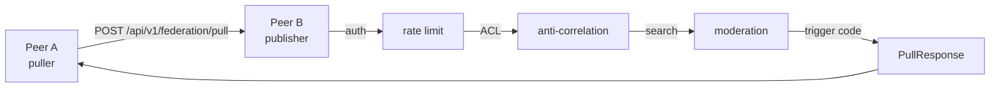
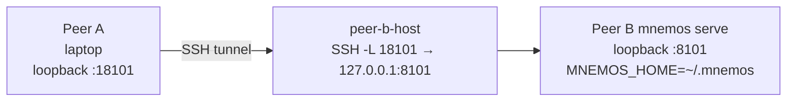

# Federation — cross-host testing guide

**Audience:** operators and QA engineers verifying mnemos federation
before a release or before opening a new peer.

**Scope:** end-to-end verification of the mediated-pull channel
(`POST /api/v1/federation/pull`) between two mnemos instances — one
acting as peer A (the puller), one as peer B (the publisher). Covers
the single-host smoke test and the cross-host (laptop ↔ remote host)
e2e test. Production deployment notes are at the end.

**Related:**

- [`federation.md`](federation.md) — Phase 1 prerequisites (per-peer
  ACL, trigger codes, access log) and the `PeerConfig` field reference.
- [`security.md`](security.md) §9 — T-AUTH, the non-loopback startup
  guard, TOTP 2FA.
- [`docs/project/adr/0016-federation-threat-model.md`](../../project/adr/0016-federation-threat-model.md)
  — mTLS pinning, per-peer bearer binding, threat model.
- ArchCom contract 2026-07-17 §3.2, §9, §10 — the mediated-pull flow,
  trigger codes, access log.

---

## 1. Overview

Cross-host federation testing verifies that peer A can pull memory
records from peer B through the mediated-pull endpoint, and that every
defence in the federation chain behaves correctly. The chain is:



The test matrix covers six behaviours:

| # | Behaviour | How it is verified |
| --- | --- | --- |
| 1 | Mediated pull — A pulls records from B via `POST /api/v1/federation/pull` | `curl` request, expect `trigger_code=EXHAUSTIVE` and a non-empty `records` array |
| 2 | Anti-correlation — a repeat query on the same `(peer, topic)` returns `ALREADY_EXHAUSTED` | Repeat the query, expect `trigger_code=ALREADY_EXHAUSTED` and empty `records` |
| 3 | ACL enforcement — a `project_scope` not in `PeerConfig.allowed_projects` is refused | Query with an out-of-scope project, expect `403` + `trigger_code=REFUSED` |
| 4 | Rate limiting — requests beyond `rate_limit_per_minute` return `429` | Fire 30+ rapid requests, expect `429` after the limit |
| 5 | Idempotent import — re-importing the same compact payload skips existing records | `mnemos sync import` twice, expect `records_imported=0, records_skipped=N` on the second run |
| 6 | Full roundtrip — pulled records are searchable on A after import | `mnemos search` finds the imported record on peer A |

The five trigger codes (`EXHAUSTIVE`, `ALREADY_EXHAUSTED`, `REFUSED`,
`RATE_LIMITED`, `TRUNCATED`) are defined in
`src/mnemos/trigger_codes.py` and documented in
[`federation.md`](federation.md) §2.

---

## 2. Prerequisites

| Requirement | Detail |
| --- | --- |
| mnemos version | v2.12.1+ on **both** hosts (the mediated-pull endpoint and the non-loopback startup guard both landed in the v2.12 line). |
| Peer B config | `federation.enabled: true` (or `federation.shared_projects` non-empty — the server treats an empty `shared_projects` as federation disabled). |
| Peer B peers | Peer A is configured in `federation.peers` on peer B with `bearer_token_env`, `allowed_projects`, `allowed_types`, `rate_limit_per_minute`. See [`federation.md`](federation.md) §1. |
| SSH access | For the cross-host test, the operator has SSH access to peer B's host (used to forward peer B's loopback port to the laptop). |
| Loopback bind | mnemos v2.12.0 startup guard `_check_non_loopback_auth` (in `src/mnemos/api/main.py`) exits non-zero if a non-loopback bind is attempted without `auth_enabled=true` + `totp_enabled=true` + `behind_tls_proxy=true`. The test binds to loopback and tunnels over SSH so the full auth stack is not required for the test. |

### Why loopback + SSH tunnel for testing

The startup guard exists so a misconfigured `auth_enabled: false`
server never becomes reachable from the network without credentials
(see [`security.md`](security.md) §9). For a test that runs on a
single remote host and is reached only through an SSH tunnel from the
operator's laptop, the loopback bind satisfies the guard and the SSH
tunnel provides the transport — no TLS proxy, no TOTP master key, no
ingress required. This is a **test-only** configuration; production
deployments must use the full auth stack (see §5).

### Test tokens

The bearer token used in this guide is a **dummy** — generate a real
one for your test run and delete it afterwards. Never commit a token
value to a config file or a repository.

```bash
# Generate a test bearer token (32 bytes, base64)
TEST_TOKEN=$(openssl rand -base64 32)
echo "MNEMOS_FED_PEER_MNEMOS_A_TOKEN=$TEST_TOKEN"
```

---

## 3. Single-host smoke test

The single-host smoke test runs two mnemos instances on the same
machine, in different `MNEMOS_HOME` directories, and walks the
export → import → search → re-import idempotency loop. It does **not**
exercise the live `POST /api/v1/federation/pull` endpoint — that is
the cross-host test in §4. The smoke test verifies the compact payload
format and the `mnemos sync` CLI.

A companion script `scripts/smoke-federation.sh` automates the steps
below. It is being added in parallel with this guide; if it is not yet
present in your checkout, run the steps manually.

### Steps

1. **Create two `MNEMOS_HOME` directories.**

   ```bash
   export MNEMOS_HOME_A=/tmp/mnemos-fed-a
   export MNEMOS_HOME_B=/tmp/mnemos-fed-b
   mkdir -p "$MNEMOS_HOME_A" "$MNEMOS_HOME_B"
   ```

2. **Seed peer B with a test memory.**

   ```bash
   MNEMOS_HOME=$MNEMOS_HOME_B mnemos add \
     --content "Test decision: federation pull uses POST /api/v1/federation/pull" \
     --tags "project:cross-memory-test,agent:hermes-test,mnemos:decision" \
     --project cross-memory-test \
     --agent hermes-test
   ```

3. **Export a compact payload from peer B.**

   ```bash
   MNEMOS_HOME=$MNEMOS_HOME_B mnemos sync export \
     --shared-projects cross-memory-test \
     --output /tmp/mnemos-fed-payload.json
   ```

4. **Import the payload into peer A.**

   ```bash
   MNEMOS_HOME=$MNEMOS_HOME_A mnemos sync import \
     --source /tmp/mnemos-fed-payload.json
   ```

   Expect `records_imported=1, records_skipped=0`.

5. **Verify the record is searchable on peer A.**

   ```bash
   MNEMOS_HOME=$MNEMOS_HOME_A mnemos search \
     --query "federation pull" \
     --project cross-memory-test
   ```

   The test decision from step 2 should appear in the results.

6. **Re-import the same payload — verify idempotency.**

   ```bash
   MNEMOS_HOME=$MNEMOS_HOME_A mnemos sync import \
     --source /tmp/mnemos-fed-payload.json
   ```

   Expect `records_imported=0, records_skipped=1`. The `sync import`
   command merges idempotently by record `id`
   (`fed:<source_agent>:<uuid>` prefix); existing records are skipped,
   never overwritten (see `src/mnemos/cli/sync.py`).

7. **Clean up.**

   ```bash
   rm -rf "$MNEMOS_HOME_A" "$MNEMOS_HOME_B" /tmp/mnemos-fed-payload.json
   ```

---

## 4. Cross-host e2e test (laptop ↔ remote host)

This is the test we ran on 2026-07-27 between a laptop (peer A) and a
remote host (peer B, the `ai-agent` machine). It exercises the live
`POST /api/v1/federation/pull` endpoint and every defence in the chain.

**Topology:**



### a. Start the test `mnemos serve` on peer B (remote host)

SSH into peer B and start mnemos on a loopback port. The
`auth_enabled=false` setting is **test-only** — the loopback bind
satisfies the startup guard, and the SSH tunnel is the only way in.

```bash
# On peer B (remote host)
MNEMOS_HOME=~/.mnemos mnemos serve --port 8101
```

If `config.yaml` on peer B has `api.auth_enabled: true`, override it
for the test by passing the env var or editing the test config. The
startup guard only fires on a non-loopback bind, so a loopback serve
with `auth_enabled=false` starts cleanly.

### b. Seed peer B with a test memory

Still on peer B, add a test record in a project that will be in peer
A's `allowed_projects`:

```bash
MNEMOS_HOME=~/.mnemos mnemos add \
  --content "Cross-host test decision: mediated pull verified 2026-07-27" \
  --tags "project:cross-memory-test,agent:hermes-test,mnemos:decision" \
  --project cross-memory-test \
  --agent hermes-test
```

### c. Configure peer A in `federation.peers` on peer B

Edit peer B's `config.yaml` (under `MNEMOS_HOME=~/.mnemos/config.yaml`)
to add peer A. The token value lives in the named env var, never in
the config file.

```yaml
federation:
  shared_projects:
    - cross-memory-test
  peers:
    mnemos-A:
      bearer_token_env: MNEMOS_FED_PEER_MNEMOS_A_TOKEN
      allowed_projects:
        - cross-memory-test
      allowed_types:
        - decision
        - learning
        - bug-pattern
      rate_limit_per_minute: 30
      # mtls_cert_fingerprint omitted for the test — mTLS pinning is
      # optional and not exercised in the SSH-tunnel test path.
```

Restart `mnemos serve` so it picks up the config change (the
federation peers map is loaded at startup).

### d. Set the bearer token in peer B's serve environment

Restart `mnemos serve` with the token in the environment:

```bash
# On peer B (remote host)
MNEMOS_FED_PEER_MNEMOS_A_TOKEN=<token-from-§2> \
MNEMOS_HOME=~/.mnemos mnemos serve --port 8101
```

The server reads the token from the env var named in
`bearer_token_env` at request time (see
`_resolve_peer_token` in `src/mnemos/federation_server.py`), so a
rotation does not require a restart — but the peers map itself does.

### e. Open the SSH tunnel from the laptop

On the laptop (peer A), forward a local port to peer B's loopback
port:

```bash
# On peer A (laptop)
ssh -f -N -L 18101:127.0.0.1:8101 peer-b-host
```

`-f` backgrounds the tunnel after authentication; `-N` means no remote
command is executed. The laptop now reaches peer B's mnemos at
`http://127.0.0.1:18101`.

### f. Pull from the laptop

```bash
# On peer A (laptop)
curl -sS -X POST http://127.0.0.1:18101/api/v1/federation/pull \
  -H "Authorization: Bearer <token-from-§2>" \
  -H "Content-Type: application/json" \
  -d '{
    "peer_id": "mnemos-A",
    "query": "mediated pull verified",
    "project_scope": "cross-memory-test",
    "include_content": true
  }' | jq
```

### g. Verify the response

Expect:

- HTTP `200`
- `trigger_code: "EXHAUSTIVE"`
- `records` array non-empty (one entry for the seed record from step b)
- `records[0].source_agent` matches peer B's self id (`mnemos-B` by
  default, or the value of `MNEMOS_FED_SELF_ID` if overridden)
- `ttl_class: "ephemeral"` — a policy hint; the server does not enforce
  TTL on the A side (contract §3.3)

### h. Anti-correlation check

Repeat the exact same query (same `peer_id`, same `query` string):

```bash
curl -sS -X POST http://127.0.0.1:18101/api/v1/federation/pull \
  -H "Authorization: Bearer <token-from-§2>" \
  -H "Content-Type: application/json" \
  -d '{
    "peer_id": "mnemos-A",
    "query": "mediated pull verified",
    "project_scope": "cross-memory-test",
    "include_content": true
  }' | jq '.trigger_code, .records | length'
```

Expect `trigger_code: "ALREADY_EXHAUSTED"` and `records` empty. The
access log
(`~/.mnemos/logs/federation-access.jsonl` on peer B) records the prior
`EXHAUSTIVE` entry for this `(peer_id, sha256(query))` pair, and the
server returns `ALREADY_EXHAUSTED` **without re-running search**
(contract §9). The plaintext query is never stored in the access log —
only its SHA-256 (КП-5).

### i. ACL check

Query with a `project_scope` that is **not** in peer A's
`allowed_projects`:

```bash
curl -sS -o /dev/null -w "%{http_code}\n" -X POST http://127.0.0.1:18101/api/v1/federation/pull \
  -H "Authorization: Bearer <token-from-§2>" \
  -H "Content-Type: application/json" \
  -d '{
    "peer_id": "mnemos-A",
    "query": "anything",
    "project_scope": "secret-project-not-allowed",
    "include_content": true
  }'
```

Expect HTTP `403` and a body with `trigger_code: "REFUSED"`. The
access log records the refusal with `trigger_code=REFUSED` and empty
`record_ids`.

### j. Rate-limit check

Fire requests faster than `rate_limit_per_minute` (30 in the example
config). A simple loop:

```bash
for i in $(seq 1 40); do
  code=$(curl -sS -o /dev/null -w "%{http_code}" -X POST http://127.0.0.1:18101/api/v1/federation/pull \
    -H "Authorization: Bearer <token-from-§2>" \
    -H "Content-Type: application/json" \
    -d '{
      "peer_id": "mnemos-A",
      "query": "rate-limit-probe-'$i'",
      "project_scope": "cross-memory-test",
      "include_content": false
    }')
  echo "req $i -> $code"
done
```

Expect the first ~30 requests to return `200` (each with a distinct
`query`, so anti-correlation does not short-circuit them) and the
remainder to return `429`. The rate limiter is a per-peer sliding
60-second window keyed on `peer_id` (see `RateLimiter` in
`src/mnemos/federation_server.py`). Wait 60 seconds for the window to
evict before continuing.

### k. Full roundtrip — pull, import, search on peer A

Save the pull response from step f to a file, wrap the `records` array
as a compact `mnemos.federation.v1` payload, and import it on the
laptop.

```bash
# On peer A (laptop) — save the pull response
curl -sS -X POST http://127.0.0.1:18101/api/v1/federation/pull \
  -H "Authorization: Bearer <token-from-§2>" \
  -H "Content-Type: application/json" \
  -d '{
    "peer_id": "mnemos-A",
    "query": "mediated pull verified roundtrip",
    "project_scope": "cross-memory-test",
    "include_content": true
  }' > /tmp/pull-response.json

# Wrap the records as a compact payload. The compact payload shape is
# documented in src/mnemos/compact.py. A minimal wrapper:
jq '{format_version: "mnemos.federation.v1", records: .records}' \
  /tmp/pull-response.json > /tmp/compact-payload.json

# Import into peer A's mnemos
MNEMOS_HOME=~/.mnemos mnemos sync import --source /tmp/compact-payload.json
```

Expect `records_imported=1, records_skipped=0`.

Then verify the record is searchable on peer A:

```bash
MNEMOS_HOME=~/.mnemos mnemos search \
  --query "mediated pull verified" \
  --project cross-memory-test
```

The imported record should appear, with provenance from peer B
(`fed:mnemos-B:<uuid>` prefix on the record id).

### l. Idempotency — re-import the same payload

```bash
MNEMOS_HOME=~/.mnemos mnemos sync import --source /tmp/compact-payload.json
```

Expect `records_imported=0, records_skipped=1`. The `sync import`
command merges idempotently by record `id`; existing records are
skipped, never overwritten.

### m. Cleanup

1. Kill `mnemos serve` on peer B (`Ctrl-C` in the serve terminal, or
   `pkill -f "mnemos serve --port 8101"`).
2. Tear down the SSH tunnel on the laptop:

   ```bash
   # Find and kill the tunnel process
   pkill -f "ssh -f -N -L 18101:127.0.0.1:8101 peer-b-host"
   ```

3. Delete the test token from peer B's environment (it was set inline
   in the serve command, so killing the process clears it; if it was
   exported, `unset MNEMOS_FED_PEER_MNEMOS_A_TOKEN`).
4. Remove the `mnemos-A` peer entry from peer B's `config.yaml`, or
   replace it with the production config.
5. Optionally delete the test memory on peer B:

   ```bash
   MNEMOS_HOME=~/.mnemos mnemos delete --project cross-memory-test --agent hermes-test
   ```

   (Use the `mnemos delete` flags appropriate to your version; the goal
   is to remove the `cross-memory-test` seed so it does not leak into
   a later production pull.)
6. Remove the local artifacts: `rm /tmp/pull-response.json
   /tmp/compact-payload.json`.

---

## 5. Production deployment notes

The SSH-tunnel + loopback-bind configuration above is **test-only**.
A production federation deployment must use the full auth stack.

| Concern | Test (this guide) | Production |
| --- | --- | --- |
| Transport | SSH tunnel `-L 18101 → 127.0.0.1:8101` | Ingress + TLS (Caddy / nginx / Traefik) terminating mTLS upstream |
| Peer B bind | Loopback, `auth_enabled=false` | Non-loopback, `auth_enabled=true` + `totp_enabled=true` + `behind_tls_proxy=true` (startup guard requires all three) |
| Bearer token | Inline env var in the serve command | Per-peer bearer in a Kubernetes `Secret` — the config names the env var (`bearer_token_env`), the `Secret` holds the value |
| mTLS | Omitted (`mtls_cert_fingerprint` unset) | Per-peer cert pinning per ADR-0016 — set `mtls_cert_fingerprint` to the SHA-256 of the peer's client cert, and have the reverse proxy inject `X-Client-Cert-Fingerprint` |
| Rate limit | 30/min (test) | Tuned per peer; the limiter is process-local, so multi-worker deployments need an external limiter (Redis) — see [`federation.md`](federation.md) |
| Access log | `~/.mnemos/logs/federation-access.jsonl` (default) | Persistent volume — set `federation.access_log_path` to a mounted path in containerised deployments |

### Helm chart reference

The AgentsNode helm chart task (mnemos memory id `4df5d1bd`) is
tracking the production helm chart that wires the per-peer bearer
`Secret`, the mTLS cert pinning, and the access-log volume. Until that
chart lands, production deployments configure the above manually in
`config.yaml` + the deployment's env vars.

See ADR-0016 (`docs/project/adr/0016-federation-threat-model.md`) for
the full threat model and the mTLS-vs-bearer rationale.

---

## 6. Troubleshooting

| Symptom | Likely cause | Fix |
| --- | --- | --- |
| `403` + `trigger_code=REFUSED` (peer not configured) | Peer A's `peer_id` is not in peer B's `federation.peers` map, or `federation.peers` is empty | Add the peer entry to peer B's `config.yaml` and restart `mnemos serve` |
| `403` + `trigger_code=REFUSED` (token mismatch) | The bearer token in the request does not match the value of the env var named in `bearer_token_env` | Verify the env var is set in peer B's serve environment and the request sends `Authorization: Bearer <token>` with the same value |
| `403` + `trigger_code=REFUSED` (ACL) | `project_scope` is not in the peer's `allowed_projects` (and is not `["*"]`) | Add the project to `allowed_projects`, or use a project that is already allowed |
| `429` | Per-peer rate limit exceeded — the sliding 60-second window is full | Wait 60 seconds for the window to evict, or raise `rate_limit_per_minute` (clamped 1–600) |
| `200` + `trigger_code=ALREADY_EXHAUSTED` + empty `records` | Expected on a repeat query for the same `(peer_id, topic)` — the access log recorded a prior `EXHAUSTIVE` | This is correct behaviour, not an error. To re-pull, use a different `query` string (the access log keys on `sha256(query)`) |
| `200` + `trigger_code=EXHAUSTIVE` + empty `records` | Peer B has no records matching the query in the allowed project/type scope | Seed peer B with a test record in an allowed project and type, then re-pull |
| Connection refused (laptop) | SSH tunnel is down, `mnemos serve` is not running on peer B, or the port is wrong | Check the tunnel: `ss -lntp \| grep 18101` on the laptop; check the serve: `ss -lntp \| grep 8101` on peer B; restart as needed |
| `FATAL: non-loopback bind (...) requires: api.auth_enabled=true, ...` at startup | `mnemos serve` was started with a non-loopback `--host` (or `api.host` in config) without the full auth stack | Either bind to loopback (`--host 127.0.0.1`) and use an SSH tunnel for testing, or set `api.auth_enabled=true` + `api.totp_enabled=true` + `api.behind_tls_proxy=true` and provide `MNEMOS_API__TOTP_MASTER_KEY` (see [`security.md`](security.md) §9) |
| `FATAL: api.totp_enabled=true but MNEMOS_API__TOTP_MASTER_KEY is not set` | TOTP enabled without the master key | Set `MNEMOS_API__TOTP_MASTER_KEY` in the environment (env-only, never on disk) |
| `mnemos sync import` returns `records_skipped=N` on first import | The records were already present in peer A's store from a prior run | Expected if the test was run before and not cleaned up. Use `mnemos search` to confirm the records are present, then proceed |

---

### References

- ArchCom contract 2026-07-17 — `.archcom/sessions/2026-07-17-federation-contract.md` §3.2 (flow), §9 (trigger codes), §10 (access log)
- ADR-0016 — `docs/project/adr/0016-federation-threat-model.md`
- `src/mnemos/federation_server.py` — `handle_pull` (the server flow)
- `src/mnemos/api/federation.py` — the FastAPI route adapter
- `src/mnemos/api/main.py` — `_check_non_loopback_auth` (startup guard)
- `src/mnemos/cli/sync.py` — `mnemos sync import` (idempotent merge)
- `src/mnemos/trigger_codes.py` — the five trigger codes
- `scripts/smoke-federation.sh` — single-host smoke test automation (added in parallel)
