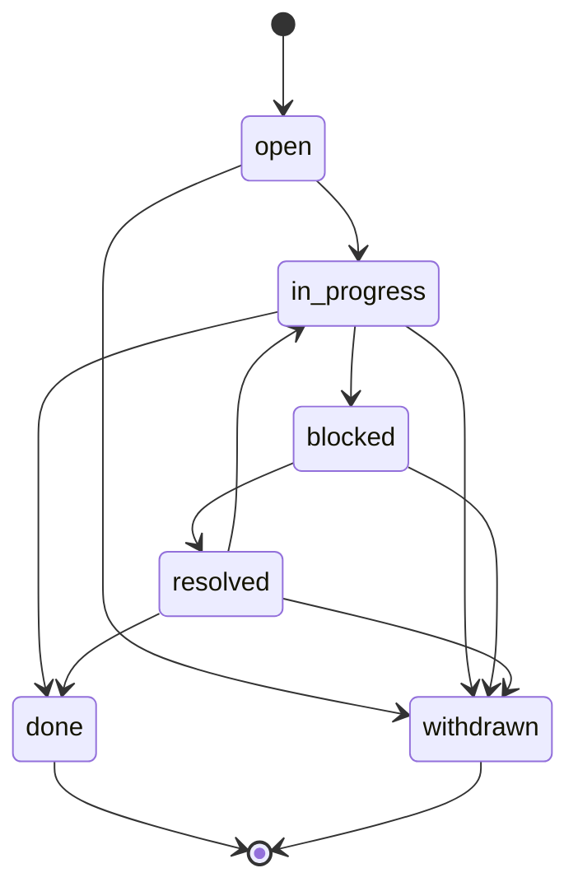

# MCP Tools Reference

**🌐 Language / Язык:** English · [Русский](../../ru/user/mcp-tools.md)

> Complete reference for the `mnemos_*` tools exposed by the Mnemos MCP server (`mnemos mcp-server`).

Mnemos speaks the [Model Context Protocol](https://modelcontextprotocol.io/) (MCP) over **stdio JSON-RPC 2.0**. VS Code Copilot and any MCP-aware client can call the tools listed here.

The server is defined in `src/mnemos/mcp_server.py`. Every tool below is registered with the `@server.list_tools()` decorator and dispatched by `call_tool()`.

For a quick start on wiring it into VS Code, see [getting-started.md#run-the-mcp-server](getting-started.md#connect-your-harness-mcp). For programmatic access, the same capabilities are also available over HTTP — see [http-api.md](http-api.md). For the tag schema enforced by most tools, see [tag-contract.md](tag-contract.md).

---

## Transport

| Property | Value |
|----------|-------|
| Protocol | MCP (JSON-RPC 2.0 over stdio) |
| Server name | `mnemos` |
| Default transport | stdio (no TCP) |
| Tool prefix | `mnemos_` |
| Encoding | UTF-8, JSON |

The server does not bind any port. Stop it with `Ctrl+C` or by sending EOF on stdin.

---

## Tool catalogue (summary)

| Tool | Purpose | Tags required |
|------|---------|---------------|
| [`mnemos_add`](#mnemos_add) | Create a new memory entry | yes |
| [`mnemos_search`](#mnemos_search) | Hybrid FTS + vector search | no |
| [`mnemos_agent_recall`](#mnemos_agent_recall) | Per-agent recall (M3) | no |
| [`mnemos_recall_context`](#mnemos_recall_context) | Restore session context for a project | no |
| [`mnemos_save_context`](#mnemos_save_context) | Persist a session checkpoint | no (auto) |
| [`mnemos_list_recent`](#mnemos_list_recent) | List recent entries | no |
| [`mnemos_list_tags`](#mnemos_list_tags) | List all tags with counts | no |
| [`mnemos_tags`](#mnemos_tags) *(pilot #97)* | Grouped bulk tag ops: rename / remove / add (`action: enum`) | no |
| [`mnemos_tags_rename`](#mnemos_tags_rename) | Bulk rename tag prefixes across memories (e.g. `gcw:` → `mnemos:`); dry-run by default | no |
| [`mnemos_workflow`](#mnemos_workflow) *(#96)* | Workflow lifecycle: set / get / history (`action: enum`) | no |
| [`mnemos_ingest_url`](#mnemos_ingest_url) | Fetch and save a web page | yes |
| [`mnemos_watch_start`](#mnemos_watch_start) | Start a background file watcher | no |
| [`mnemos_watch_stop`](#mnemos_watch_stop) | Stop the file watcher | no |
| [`mnemos_watch_status`](#mnemos_watch_status) | Report watcher status | no |
| [`mnemos_auto_collect_status`](#mnemos_auto_collect_status) | Compaction signal vector (M7) | no |
| [`mnemos_compress`](#mnemos_compress) | Reversible compression (CCR) — cache original, embed marker | no |
| [`mnemos_retrieve`](#mnemos_retrieve) | Retrieve a CCR-cached original or FTS5 snippets | no |
| [`mnemos_align_prefix`](#mnemos_align_prefix) | CacheAligner — relocate dynamic content for prefix cache stability | no |
| [`mnemos_filter`](#mnemos_filter) | Run / refresh the context filter on an existing memory (secret-scanned `clean_content`) | no |
| [`mnemos_assemble_context`](#mnemos_assemble_context) *(#125)* | ADR-0017 D1 — assemble the pre-LLM-call context block (recall → CCR → filter → scan → align → budget) | no |
| [`mnemos_context_rewrite`](#mnemos_context_rewrite) *(#125)* | ADR-0018 — `on_context_rewrite` lifecycle event: report a context rewrite, the original lands in LTM (idempotent, version-less) | no |
| [`mnemos_hooks`](#mnemos_hooks) *(#125)* | ADR-0017 D1 / ADR-0018 lifecycle hooks — grouped `action:enum` tool: `pre_llm_call` / `on_session_start` / `post_tool_call` (autocompression, opt-in) | no |
| [`mnemos_export`](#mnemos_export) | Export memories to a file (JSON or SQLite snapshot) | no |
| [`mnemos_import`](#mnemos_import) | Import memories from an export file (merge or restore) | no |
| [`mnemos_reprocess`](#mnemos_reprocess) | Manually run the knowledge pipeline over queued raw/processing entries | no |
| [`mnemos_stats`](#mnemos_stats) | Health counters and key paths | no |

---

## `mnemos_add`

Create a new memory entry. The MCP layer enforces the Mnemos tag contract ([M2](tag-contract.md)) before writing.

### Input

| Field | Type | Required | Default | Description |
|-------|------|----------|---------|-------------|
| `content` | string | **yes** | — | Text to remember. |
| `title` | string | no | auto | Short title. |
| `tags` | string[] | **yes** | — | Must include `project:<slug>`, `agent:<slug>`, and at least one `mnemos:<subtype>`. |
| `memory_type` | string | no | `note` | One of `note`, `fact`, `snippet`, `bookmark`, `conversation`. |
| `filter_profile` | string | no | auto | One of `log`, `terminal`, `code`, `docs`, `web`, `default`. Drives M10 context filter. |
| `verbosity` | string | no | config default | One of `default`, `terse`, `minimal`. Injects output-style guidance into the tool result framing. See [Output token reduction](#output-token-reduction-p1-7). |
| `effort` | string | no | config default | One of `low`, `medium`, `high`. Injects reasoning-effort hint into the tool result framing. See [Output token reduction](#output-token-reduction-p1-7). |

### Output

```json
{
  "id": "550e8400-e29b-41d4-a716-446655440000",
  "title": "Use uv, not pip",
  "status": "raw"
}
```

### Example call (JSON-RPC)

```json
{
  "jsonrpc": "2.0",
  "id": 1,
  "method": "tools/call",
  "params": {
    "name": "mnemos_add",
    "arguments": {
      "content": "Use uv, not pip",
      "tags": ["project:mnemos", "agent:tech-writer", "mnemos:learning"]
    }
  }
}
```

### Errors

| Error | Cause |
|-------|-------|
| `❌ Tag contract violation: ...` | Missing `project:`, `agent:`, or `mnemos:` tag. |
| `❌ Error: ...` | SQLite write failure, vault write failure, or embed failure (the latter is non-fatal — see [architecture overview](../architecture/overview.md#1-storage-layer)). |

### Related

- Tag schema: [tag-contract.md](tag-contract.md)
- HTTP equivalent: [`POST /memories`](http-api.md#post-memories--create-memory)
- CLI equivalent: [`mnemos add`](cli-reference.md#add)

---

## `mnemos_search`

Hybrid search: FTS5 (full-text) + vector + Reciprocal Rank Fusion. Only `published` memories are searched by default.

**Query semantics:** the FTS5 leg treats the WHOLE `query` string as one quoted phrase (adjacent tokens, in order — `_build_fts_query` quotes the entire input). A keyword-set query like `postgres migration` matches only that exact phrase; to find individual keywords, issue separate single-term queries.

### Input

| Field | Type | Required | Default | Description |
|-------|------|----------|---------|-------------|
| `query` | string | **yes** | — | Natural language search string. Matched as ONE whole phrase by the FTS5 leg (see Query semantics above). |
| `tags` | string[] | no | — | Filter: all of these tags must be present. |
| `project` | string | no | — | Restrict to a project slug. |
| `limit` | integer | no | `10` | Max results. |
| `include_raw` | boolean | no | `false` | If true, returns `raw_content` instead of cleaned `content`. |
| `verbosity` | string | no | config default | One of `default`, `terse`, `minimal`. Injects output-style guidance into the tool result framing. See [Output token reduction](#output-token-reduction-p1-7). |
| `effort` | string | no | config default | One of `low`, `medium`, `high`. Injects reasoning-effort hint into the tool result framing. See [Output token reduction](#output-token-reduction-p1-7). |

### Output

```json
[
  {
    "id": "550e8400-e29b-41d4-a716-446655440000",
    "title": "Use uv, not pip",
    "content": "Use uv, not pip — it's faster and resolves transitive CVE closure correctly.",
    "tags": ["project:mnemos", "agent:tech-writer", "mnemos:learning"],
    "score": 0.812,
    "search_type": "hybrid",
    "status": "published"
  }
]
```

### Example call

```json
{
  "jsonrpc": "2.0",
  "id": 2,
  "method": "tools/call",
  "params": {
    "name": "mnemos_search",
    "arguments": {
      "query": "how to manage Python dependencies",
      "limit": 5,
      "project": "mnemos"
    }
  }
}
```

### Errors

- `❌ Error: ...` — query parsing failure (rare; usually succeeds with an empty result).

### Related

- HTTP equivalent: [`POST /search`](http-api.md#search)
- CLI equivalent: [`mnemos search`](cli-reference.md#search)

---

## `mnemos_agent_recall`

Per-agent recall (M3). Returns the most recent entries for a single agent, optionally filtered by project and / or sub-query.

### Input

| Field | Type | Required | Default | Description |
|-------|------|----------|---------|-------------|
| `agent` | string | **yes** | — | Agent slug, e.g. `cr-security-reviewer`. |
| `project` | string | no | — | Restrict to a project slug. |
| `query` | string | no | — | Optional FTS / vector query within the agent scope. |
| `limit` | integer | no | `20` | Max entries to return. |

When `query` is omitted, the tool returns recent entries (recency-ordered). When `query` is present, it runs a hybrid search scoped to the agent's tags.

### Output

```json
[
  {
    "id": "550e8400-e29b-41d4-a716-446655440000",
    "title": "Bandit B608 hardcoded SQL — flag for triage",
    "content": "Found hardcoded SQL in src/legacy/loader.py:42 ...",
    "tags": ["project:mnemos", "agent:cr-security-reviewer", "mnemos:bug-pattern"],
    "created_at": "2026-06-15T10:42:00+00:00",
    "status": "published"
  }
]
```

### Example call

```json
{
  "jsonrpc": "2.0",
  "id": 3,
  "method": "tools/call",
  "params": {
    "name": "mnemos_agent_recall",
    "arguments": {
      "agent": "cr-security-reviewer",
      "project": "mnemos",
      "query": "bandit SQL injection",
      "limit": 10
    }
  }
}
```

### Errors

- None typical. Returns an empty array if no matches.

### Related

- HTTP equivalent: [`GET /recall/agent/{name}`](http-api.md#get-recallagentname--agent-recall)
- CLI equivalent: [`mnemos recall --agent <slug>`](cli-reference.md#recall)

---

## `mnemos_recall_context`

Restore the latest session checkpoint for a project. The **first** thing an agent should call at the start of a session, especially after context compaction.

### Input

| Field | Type | Required | Default | Description |
|-------|------|----------|---------|-------------|
| `project` | string | no | auto (cwd) | Project name. Auto-detected from the current working directory if omitted. |
| `query` | string | no | — | Optional focus aspect. |
| `verbosity` | string | no | config default | One of `default`, `terse`, `minimal`. Injects output-style guidance into the tool result framing. See [Output token reduction](#output-token-reduction-p1-7). |
| `effort` | string | no | config default | One of `low`, `medium`, `high`. Injects reasoning-effort hint into the tool result framing. See [Output token reduction](#output-token-reduction-p1-7). |

### Output

A plain-text block formatted as Markdown:

```text
# Context for project 'mnemos'

---
# Session checkpoint — 2026-06-15T10:42:00+00:00

## Goals
Ship M15 production hardening.
## Completed
bandit clean, mypy --strict green
## In Progress
pip-audit CVE-2026-45829 ignore
## Decisions
Pin chromadb 1.5.9 with audit
## Context
Active files: src/mnemos/manager.py, src/mnemos/api/main.py
```

If no checkpoint is found:

```text
No context found for project 'mnemos'. Start by saving context with mnemos_save_context.
```

In **auto-collect mode** (`MNEMOS_AUTO_COLLECT=1`), a `## 🔄 Auto-Collect Mode Active` block is appended with mandatory session rules.

### Example call

```json
{
  "jsonrpc": "2.0",
  "id": 4,
  "method": "tools/call",
  "params": {
    "name": "mnemos_recall_context",
    "arguments": { "project": "mnemos" }
  }
}
```

### Related

- `mnemos_save_context` — the matching writer
- [architecture.md](../architecture/overview.md)
- HTTP equivalent: [`POST /context/recall`](http-api.md#post-contextrecall--recall-session-context)

---

## `mnemos_save_context`

Persist a session checkpoint. Agents should call this **proactively**: after meaningful work, before switching tasks, or when context is large.

### Input

| Field | Type | Required | Default | Description |
|-------|------|----------|---------|-------------|
| `project` | string | no | auto (cwd) | Project name. |
| `goals` | string | no | — | Current session goals. |
| `completed` | string | no | — | What has been completed. |
| `in_progress` | string | no | — | What is in progress. |
| `decisions` | string | no | — | Key technical decisions + rationale. |
| `context` | string | no | — | Other context (file paths, architecture, gotchas). |

Mnemos synthesises the parts into a single Markdown memory tagged with `project:<slug>`, `agent:user`, and `mnemos:checkpoint`.

### Output

```text
✅ Context saved (id=550e8400-...).
```

### Example call

```json
{
  "jsonrpc": "2.0",
  "id": 5,
  "method": "tools/call",
  "params": {
    "name": "mnemos_save_context",
    "arguments": {
      "project": "mnemos",
      "goals": "Finish M15.1 mypy --strict",
      "completed": "Added None checks in 12 functions",
      "in_progress": "tests/test_api.py:241 type narrowing",
      "decisions": "Use cast() sparingly, prefer TypeGuard"
    }
  }
}
```

### Related

- `mnemos_recall_context` — the matching reader
- Auto-collect mode: [mcp-tools.md#auto-collect-mode](#auto-collect-mode)
- HTTP equivalent: [`POST /context/save`](http-api.md#post-contextsave--save-a-session-checkpoint)

---

## `mnemos_list_recent`

List the most recent memory entries, oldest-last.

### Input

| Field | Type | Required | Default | Description |
|-------|------|----------|---------|-------------|
| `limit` | integer | no | `10` | Max entries. |
| `tags` | string[] | no | — | Filter: any of these tags must be present. |
| `project` | string | no | — | Restrict to a project slug. |

### Output

```json
[
  {
    "id": "550e8400-e29b-41d4-a716-446655440000",
    "title": "Use uv, not pip",
    "tags": ["project:mnemos", "agent:tech-writer", "mnemos:learning"],
    "status": "raw",
    "created_at": "2026-06-15T10:42:00+00:00"
  }
]
```

### Example call

```json
{
  "jsonrpc": "2.0",
  "id": 6,
  "method": "tools/call",
  "params": {
    "name": "mnemos_list_recent",
    "arguments": { "limit": 20, "project": "mnemos" }
  }
}
```

### Related

- HTTP equivalent: [`GET /memories`](http-api.md#get-memories--list-recent)
- CLI equivalent: [`mnemos recall`](cli-reference.md#recall)

---

## `mnemos_list_tags`

List every tag in the memory with its occurrence count.

### Input

None.

### Output

```json
{
  "project:mnemos": 142,
  "agent:tech-writer": 23,
  "agent:sre": 41,
  "mnemos:learning": 67,
  "mnemos:bug-pattern": 12,
  "mnemos:decision": 8,
  "mnemos:checkpoint": 14
}
```

### Example call

```json
{
  "jsonrpc": "2.0",
  "id": 7,
  "method": "tools/call",
  "params": { "name": "mnemos_list_tags", "arguments": {} }
}
```

### Related

- HTTP equivalent: [`GET /tags`](http-api.md#tags)

---

## `mnemos_tags`

Grouped bulk tag operations across memories: rename a prefix, remove tags, or add tags. Action-based dispatch — the grouped pilot tool (#97); every action goes through the same safe write path (plain `UPDATE`, so the FTS5 index stays consistent), previews by default (`dry_run: true`) and is idempotent.

### Input

| Field | Type | Required | Default | Description |
|-------|------|----------|---------|-------------|
| `action` | string | **yes** | — | `rename`, `remove`, or `add`. |
| `from_prefix` | string | for `rename` | — | Source prefix, e.g. `gcw:`. Must end with `:`. |
| `to_prefix` | string | for `rename` | — | Target prefix, e.g. `mnemos:`. Must end with `:`. |
| `tags` | string[] | for `remove` / `add` | — | Tags to remove or add. Required for those two actions. |
| `subtypes` | string[] | no | — | Optional whitelist of subtypes to rename (`rename` only). |
| `wildcard` | boolean | no | `false` | `remove` only: treat each entry in `tags` as a prefix and strip every matching `prefix*` tag instead of exact matches. `rename` is prefix-based by design. |
| `dry_run` | boolean | no | `true` | Preview without writing. |
| `project` | string | no | — | Scope the scan to a project slug. |
| `agent` | string | no | — | Scope the scan to an agent slug. |
| `invalid_subtypes_to_legacy` | boolean | no | `false` | `rename` only: rename invalid subtypes to `<to_prefix>legacy` instead of skipping them. |

> **Contract safety.** The resulting tag set is re-validated in strict mode per memory: removing the last `project:` / `agent:` / `mnemos:` tag (or otherwise breaking the contract) is rejected per memory with an error entry instead of corrupting the store.

### Output

A report dict. `changed` counts memories whose tag set actually changed; `renamed` is kept for back-compat with `mnemos_tags_rename` callers and mirrors `changed`:

```json
{
  "action": "remove",
  "scanned": 142,
  "changed": 9,
  "removed_tags": ["severity:high"],
  "wildcard": false,
  "errors": [],
  "dry_run": true
}
```

`rename` returns `{"from_prefix", "to_prefix", "scanned", "renamed", "changed", "skipped_invalid", "errors", "dry_run"}`; `add` returns `{"action", "scanned", "changed", "added_tags", "errors", "dry_run"}`.

### Example call

```json
{
  "jsonrpc": "2.0",
  "id": 9,
  "method": "tools/call",
  "params": {
    "name": "mnemos_tags",
    "arguments": {
      "action": "rename",
      "from_prefix": "gcw:",
      "to_prefix": "mnemos:",
      "dry_run": false
    }
  }
}
```

### Errors

| Error | Cause |
|-------|-------|
| `unknown action '<x>'...` | `action` is not `rename` / `remove` / `add`. |
| `action='rename' requires 'from_prefix' and 'to_prefix' ...` | Missing prefixes for the rename action. |
| `tags must be a non-empty list` | `remove` / `add` called with an empty `tags` list. |

### Related

- Grouped sibling: [`mnemos_tags_rename`](#mnemos_tags_rename) — legacy alias for `action: "rename"`

---

## `mnemos_tags_rename`

Bulk rename tags matching `from_prefix:<subtype>` → `to_prefix:<subtype>` across existing memories. Kept as a **non-breaking alias**: calls are dispatched to the same rename path as [`mnemos_tags`](#mnemos_tags) with `action: "rename"` (a stray `action` key in the arguments is ignored). Safe — the rename goes through a plain `UPDATE` so the FTS5 external-content index stays consistent — and idempotent: a second run with the same arguments renames 0 memories.

### Input

| Field | Type | Required | Default | Description |
|-------|------|----------|---------|-------------|
| `from_prefix` | string | **yes** | — | Source prefix, e.g. `gcw:`. Must end with `:`. |
| `to_prefix` | string | **yes** | — | Target prefix, e.g. `mnemos:`. Must end with `:`. |
| `subtypes` | string[] | no | — | Optional whitelist of subtypes to rename. |
| `dry_run` | boolean | no | `true` | Preview without writing. |
| `project` | string | no | — | Scope to a project slug. |
| `agent` | string | no | — | Scope to an agent slug. |
| `invalid_subtypes_to_legacy` | boolean | no | `false` | Rename invalid subtypes to `<to_prefix>legacy` instead of skipping them. |

### Output

```json
{
  "from_prefix": "gcw:",
  "to_prefix": "mnemos:",
  "scanned": 142,
  "renamed": 0,
  "changed": 0,
  "skipped_invalid": 3,
  "errors": [],
  "dry_run": true
}
```

### Example call

```json
{
  "jsonrpc": "2.0",
  "id": 10,
  "method": "tools/call",
  "params": {
    "name": "mnemos_tags_rename",
    "arguments": {
      "from_prefix": "gcw:",
      "to_prefix": "mnemos:",
      "invalid_subtypes_to_legacy": true
    }
  }
}
```

### Related

- Grouped tool: [`mnemos_tags`](#mnemos_tags) — `action: "rename"` is the same code path
- HTTP equivalent: `POST /tags/rename` (implemented in the API; not yet covered in [http-api.md](http-api.md))

---

## `mnemos_ingest_url`

Fetch a web page, extract its main content (via `trafilatura`), and save it as a memory.

### Input

| Field | Type | Required | Description |
|-------|------|----------|-------------|
| `url` | string | **yes** | HTTP / HTTPS URL to fetch. |
| `tags` | string[] | **yes** | Same M2 contract as `mnemos_add`. |

> **SSRF guard.** The MCP layer strips `user:password@` from the URL authority before fetching (defence in depth alongside the in-process guard). Do not bypass this by building the URL from a string.

### Output

```json
{
  "id": "550e8400-e29b-41d4-a716-446655440000",
  "title": "How to manage Python dependencies",
  "url": "https://example.com/article"
}
```

### Example call

```json
{
  "jsonrpc": "2.0",
  "id": 8,
  "method": "tools/call",
  "params": {
    "name": "mnemos_ingest_url",
    "arguments": {
      "url": "https://example.com/article",
      "tags": ["project:research", "agent:user", "mnemos:learning"]
    }
  }
}
```

### Errors

| Error | Cause |
|-------|-------|
| `❌ Error: ...` | Network failure, blocked URL (SSRF guard), or `trafilatura` extraction failure. |

### Related

- CLI equivalent: [`mnemos add --url <URL>`](cli-reference.md#add)
- HTTP equivalent: [`POST /memories` with manual content](http-api.md#post-memories--create-memory)
- HTTP equivalent: [`POST /ingest-url`](http-api.md#post-ingest-url--fetch-and-save-a-web-page)
- Security: [security.md](../admin/security.md#2-ssrf-prevention-memorymanager_validate_url)

---

## `mnemos_watch_start`

Start a background file watcher. New and modified files under the watched paths are auto-indexed into Mnemos.

### Input

| Field | Type | Required | Default | Description |
|-------|------|----------|---------|-------------|
| `paths` | string[] | no | `[cwd]` | Directories to watch. |
| `scan` | boolean | no | `true` | Run an initial scan to catch up on existing files. |
| `include_rules` | boolean | no | `false` | Also watch `.github/instructions/*.instructions.md` (M8 path-scoped rules). |

### Output

```text
✅ Watcher started on ['/home/you/project']
# or, with include_rules:
✅ Watcher started on ['/home/you/project'] (including .instructions.md rules)
```

### Example call

```json
{
  "jsonrpc": "2.0",
  "id": 9,
  "method": "tools/call",
  "params": {
    "name": "mnemos_watch_start",
    "arguments": {
      "paths": ["/home/you/mnemos", "/home/you/notes"],
      "include_rules": true
    }
  }
}
```

### Notes

- File size cap is `watcher.max_file_size_kb` (default 512 KB) — files larger than this are skipped.
- Default ignored dirs: `.git`, `node_modules`, `__pycache__`, `.venv`, `dist`, `build`, `.mypy_cache`, `.pytest_cache`, `.ruff_cache`.
- Default watched extensions: `.md`, `.py`, `.js`, `.ts`, `.yaml`, `.yml`, `.toml`, `.json`, `.txt`, `.rst`, `.sh`, `.css`, `.html`, `.sql`.

### Related

- HTTP equivalent: [`POST /watch/start`](http-api.md#post-watchstart--start-the-file-watcher)

---

## `mnemos_watch_stop`

Stop the background file watcher.

### Input

None.

### Output

```text
✅ Watcher stopped.
```

### Related

- HTTP equivalent: [`POST /watch/stop`](http-api.md#post-watchstop--stop-the-file-watcher)

---

## `mnemos_watch_status`

Report the current state of the background watcher.

### Input

None.

### Output

```json
{
  "running": true,
  "paths": ["/home/you/mnemos"],
  "files_queued": 3,
  "files_indexed": 142,
  "include_rules": false
}
```

### Related

- HTTP equivalent: [`GET /watch/status`](http-api.md#get-watchstatus--watcher-status)

---

## `mnemos_auto_collect_status`

Return the current compaction-detection signal vector (M7). The agent reads this to decide whether to call `mnemos_save_context` proactively.

### Input

None.

### Output

```json
{
  "auto_collect_enabled": false,
  "signals": {
    "call_counter": {
      "calls_since_save": 7,
      "threshold": 12,
      "triggered": false
    },
    "elapsed_secs": {
      "value": 312,
      "threshold": 900,
      "triggered": false
    },
    "context_size_heuristic": {
      "value": null,
      "note": "populated by client (M7)"
    },
    "summary_marker_detected": {
      "value": null,
      "note": "populated by client (M7)"
    },
    "reference_drop_heuristic": {
      "value": null,
      "note": "populated by client (M7)"
    }
  },
  "recommendation": "ok",
  "next_reminder_in_calls": 5
}
```

The `recommendation` field is one of:

| Value | Meaning |
|-------|---------|
| `ok` | No checkpoint needed yet. |
| `save_checkpoint` | Save now — you are at or past a threshold. |

### Auto-collect mode

Set `MNEMOS_AUTO_COLLECT=1` in the server's environment. The reminder thresholds tighten:

| Setting | Normal | Auto-collect |
|---------|--------|--------------|
| Calls since save | 12 | 6 |
| Elapsed seconds | 900 (15 min) | 480 (8 min) |

Tool descriptions also change (with `🔄 [AUTO-COLLECT] MANDATORY:` prefixes) so agents take the hints more seriously. **Recommended for production agents**, not for one-off scripts.

### Related

- HTTP equivalent: [`GET /auto-collect`](http-api.md#get-auto-collect--compaction-signal-vector)

---

## `mnemos_stats`

Return Mnemos health counters.

### Input

None.

### Output

Same shape as the CLI `mnemos stats` command — see [cli-reference.md#stats](cli-reference.md#stats).

```json
{
  "status": "ok",
  "version": "4.0.0",
  "data_dir": "/home/you/.mnemos/data",
  "vault_path": "/home/you/.mnemos/vault",
  "total": 142,
  "by_status": {"raw": 5, "processing": 0, "processed": 12, "published": 120, "archived": 5},
  "vectors": 120
}
```

### Related

- HTTP equivalent: [`GET /metrics`](http-api.md#get-metrics)
- CLI equivalent: [`mnemos stats`](cli-reference.md#stats)

---

## `mnemos_reprocess`

Manually trigger the knowledge pipeline to process queued `raw` / `processing` entries into `published` knowledge: cluster → synthesize → quality gate → publish. Use when `mnemos_stats` shows a large `queue_depth`, or after bulk import.

### Input

| Field | Type | Required | Default | Description |
|-------|------|----------|---------|-------------|
| `project` | string | no | — | Restrict the pass to a project slug. |
| `agent` | string | no | — | Restrict the pass to an agent slug. |
| `limit` | integer | no | `100` | Maximum entries considered. |

### Output

The pipeline summary dict:

```json
{
  "clusters": 3,
  "synthesized": 3,
  "published": 5,
  "failed_quality_gate": 1,
  "single_promoted": 2,
  "stuck_rescued": 0,
  "published_ids": ["550e8400-e29b-41d4-a716-446655440000"],
  "refined": 4,
  "refined_noop": 1,
  "refine_failed": 0,
  "quarantined": 0
}
```

Memories that do not form a cluster are promoted individually (`single_promoted`) so the queue drains even when most entries are unique.

### Example call

```json
{
  "jsonrpc": "2.0",
  "id": 11,
  "method": "tools/call",
  "params": {
    "name": "mnemos_reprocess",
    "arguments": { "project": "mnemos", "limit": 200 }
  }
}
```

### Related

- HTTP equivalent: [`POST /process`](http-api.md#post-process--run-end-to-end-pipeline)
- CLI equivalent: [`mnemos processor run`](cli-reference.md#processor)

---

## `mnemos_compress`

Compress large content (tool output, logs, JSON) with **zero data loss**. The original is cached in the `ccr_cache` SQLite table keyed by its SHA-256 hash; the compressed output embeds a short parseable marker so the LLM can call `mnemos_retrieve` to fetch the full original back on demand. Achieves 70–90% token reduction on typical logs and JSON.

Content shorter than `min_size_chars` (default 500) is returned as-is — not cached, not compressed (tiny content has no token savings).

### Input

| Field | Type | Required | Default | Description |
|-------|------|----------|---------|-------------|
| `text` | string | **yes** | — | Content to compress. ≥500 chars to cache. |
| `profile` | string | no | auto | One of `log`, `terminal`, `code`, `docs`, `web`, `default`. Auto-detected if omitted. |
| `project` | string | no | `""` | Project slug to scope the cache entry. |
| `agent` | string | no | — | **A2 issuer ledger:** your agent slug, recorded on the cache row as the issuer so strict marker validation can later prove the marker was minted in your context. |
| `session` | string | no | — | **A2 issuer ledger:** your session id, stored alongside `agent` as the issuer pair. |

### Output

```json
{
  "compressed_text": "[compressed: a1b2... | 30000→900 chars | retrieve via mnemos_retrieve]\n...filtered content...",
  "hash": "a1b2c3d4e5f6789012345678901234567890abcdef1234567890abcdef12345678",
  "original_size": 30000,
  "compressed_size": 900,
  "reduction_pct": 97.0,
  "marker": "[compressed: a1b2... | 30000→900 chars | retrieve via mnemos_retrieve]",
  "cached": true,
  "profile": "log"
}
```

### Marker format

```text
[compressed: <sha-256-hash> | <N>→<M> chars | retrieve via mnemos_retrieve]
```

The marker is the only overhead added on top of the filtered content. It is short, parseable, and LLM-friendly. The hash is content-addressed, so re-compressing the same text is a no-op (the cache entry is reused). The issuer pair recorded with `agent`/`session` belongs to the FIRST writer of the `(project, hash)` row — a later session re-compressing identical content receives a marker that strict validation binds to that first issuer (fail-closed; harmless, since the re-compressor already holds the content).

### Example

Compress a 30K-line build log → ~900 chars in the context window. When the LLM needs the full traceback, it calls `mnemos_retrieve` with the hash from the marker.

### Related

- HTTP equivalent: [`POST /compress`](http-api.md#post-compress--compress-content)

---

## `mnemos_retrieve`

Retrieve the original uncompressed content for a CCR marker hash. If `query` is omitted, returns the full original. If `query` is provided, returns FTS5-ranked snippets from within the cached original — useful when the original is large and only a few lines are relevant.

### Input

| Field | Type | Required | Default | Description |
|-------|------|----------|---------|-------------|
| `hash` | string | **yes** | — | SHA-256 hash from a `[compressed: ...]` marker. |
| `query` | string | no | — | Search query for snippet retrieval. |
| `snippet_count` | integer | no | `5` | Number of snippets when `query` is provided. |
| `project` | string | no | — | Project slug: scope the lookup to this project's entries — a hash cached under another project is reported as not found. |
| `validate_marker` | boolean | no | `ccr.validate_markers` | **A2 strict mode:** validate the marker before any content is issued. |
| `original_chars` | integer | no | — | `N` from the `[compressed: <hash> | N→M chars]` marker — enables the integrity check. |
| `agent` | string | no | — | Your agent slug — the trusted issuer context for the provenance check. |
| `session` | string | no | — | Your session id, paired with `agent` as the trusted issuer context. |

### A2 strict marker validation

A request is **marker-shaped** when it carries any of `original_chars` / `agent` / `session` — the metadata a harness parses out of a marker plus its own identity. When strict mode is on (`validate_marker=true`, or the `ccr.validate_markers` config knob), a marker-shaped request must pass three checks BEFORE any content is issued (ArchCom 2026-08-27, decision `archcom-2026-08-27-deferrals-triage`):

1. **existence** — the entry must exist under `(project, hash)`; strict validation REQUIRES the `project` scope: `validate_marker=true` (or the knob) without `project` is refused with `reason="marker validation failed: existence: project scope required for marker validation"` and no content (an unscoped lookup would redeem against the first-stored copy of any project);
2. **integrity** — the marker's `original_chars` must equal the character length of the stored original;
3. **provenance** — the row's issuer ledger (recorded at compress time via `agent`/`session`) must match your `(agent, session)` pair: a `null` session matches only a `null` issuer session, never a wildcard.

Any failed check returns the refused shape with `reason="marker validation failed: <check>: <detail>"` and **no content** (fail-closed). Reasons are FIXED non-oracle strings — they never echo the stored original length or the stored issuer pair (a reason leaking those is a two-call oracle that defeats provenance). Rows stored without issuer identity (legacy migrations, identity-less compress) fail full-shape validation with the distinct `unverifiable legacy marker` reason. **Hash-only closure (review F2):** in strict mode a hash-only retrieve of an issuer-stamped row is refused with `reason="marker validation required"` — stripping the optional args cannot bypass the gate; legacy NULL-issuer rows stay redeemable hash-only with a WARNING (unverifiable by construction; refusing would brick pre-A2 caches). Plain hash-only retrieves on knob-off deployments are unaffected. A refused validation does not bump `retrieval_count`.

For `mnemos_assemble_context` with `expand_ccr=true`: pass `agent` alongside `session` so the expansion runs under your issuer context; without a full `(agent, session)` identity a strict deployment SKIPS the expansion of issuer-stamped markers (the marker stays — the model keeps the on-demand handle); legacy NULL-issuer rows still expand. The CCR stage stats carry `skipped_refused` for these.

Residual (accepted, ADR-0018 residual register): a trusted harness with compress access can still seed content inside its own project and redeem the marker from the same identity — single-operator threat model; revisit on the first multi-principal trigger.

### Output (full retrieval)

```json
{
  "hash": "a1b2...",
  "found": true,
  "original": "...full original text...",
  "size_bytes": 30000,
  "retrieval_count": 2
}
```

### Output (snippet retrieval)

```json
{
  "hash": "a1b2...",
  "found": true,
  "query": "Traceback",
  "snippets": [
    {"text": "Traceback (most recent call last):", "rank": 1.0},
    {"text": "  File \"app.py\", line 42, in handler", "rank": 0.8}
  ],
  "retrieval_count": 3
}
```

If the hash is absent from the cache (e.g. evicted by TTL or LRU), `found` is `false` with a `reason` field.

### Related

- HTTP equivalent: [`POST /retrieve`](http-api.md#post-retrieve--retrieve-a-ccr-cached-original)

---

## `mnemos_align_prefix`

**CacheAligner (P1-5)** — relocate dynamic content (ISO timestamps, UUIDs, session ids, short-lived tokens, calendar dates) from system-prompt-like text to a `--- Dynamic context ---` block at the end, so the prefix stays byte-identical across requests and provider KV caches (Anthropic `cache_control`, OpenAI prefix caching) hit. Inspired by headroom's CacheAligner (https://github.com/headroomlabs-ai/headroom, Apache 2.0). Original implementation — no headroom code imported.

When CacheAligner is disabled in config, the text is returned unchanged with an empty `extracted` list.

### Input

| Field | Type | Required | Default | Description |
|-------|------|----------|---------|-------------|
| `text` | string | **yes** | — | System-prompt-like text to stabilize. |
| `profile` | string | no | `default` | One of `code`, `docs`, `default`. Toggles which dynamic kinds are extracted. `code` and `docs` skip bare tokens (avoid mangling long identifiers or hyphenated words); `default` extracts all kinds. |

### Output

```json
{
  "aligned_text": "You are a senior engineer.\n\n--- Dynamic context ---\n- timestamp: 2026-07-17T10:30:00Z\n- session_id: sess-abc123def456\n",
  "extracted": [
    {"kind": "timestamp", "value": "2026-07-17T10:30:00Z", "start": 24, "end": 44},
    {"kind": "session_id", "value": "sess-abc123def456", "start": 60, "end": 78}
  ],
  "prefix_stabilized": true,
  "moved_chars": 38
}
```

- `aligned_text` — the input with dynamic spans removed and a `--- Dynamic context ---` block appended at the end, listing each extracted value with its kind.
- `extracted` — the list of extracted spans (`kind`, `value`, `start`, `end` in the *original* text).
- `prefix_stabilized` — `true` when at least one span was extracted from the prefix region (i.e. the aligned prefix is longer than the original prefix up to the first dynamic span).
- `moved_chars` — total characters relocated (sum of span lengths).

### Example

Input:
```text
You are a senior engineer. Today is 2026-07-17T10:30:00Z. Session: sess-abc123def456.
[stable rules follow...]
```

Aligned output (prefix up to the first dynamic span is now byte-stable across requests):
```text
You are a senior engineer. Today is . Session: .
[stable rules follow...]

--- Dynamic context ---
- timestamp: 2026-07-17T10:30:00Z
- session_id: sess-abc123def456
```

### Profile behaviour

| Profile | Skips | Why |
|---------|-------|-----|
| `default` (or omitted) | nothing | extract all kinds |
| `code` | `token` | bare 20+ char tokens would mangle long identifiers / hashes in code |
| `docs` | `token` | prose rarely contains real tokens; avoids mangling long hyphenated words |

The profile's skip set merges (union) with any per-kind toggles from `CacheAlignerConfig` — disabling a kind in config widens what a profile already skips.

### Config

```yaml
cache_aligner:
  enabled: true               # master switch
  extract_timestamps: true   # ISO 8601 timestamps
  extract_uuids: true        # canonical 8-4-4-4-12 UUIDs
  extract_session_ids: true  # sess-*, session:*, sid-*
  extract_dates: true        # calendar dates 2026-07-17 / 2026/07/17
  extract_tokens: true       # bare 20+ char opaque tokens
```

A kind whose toggle is `false` is added to the skip set and stays in-place (not relocated).

### Related

- Architecture: [overview.md#cachealigner-p1-5](../architecture/overview.md#cachealigner-p1-5)
- Config reference: [config.example.yaml](../../../config.example.yaml)

---

## `mnemos_filter`

Run or refresh the Context Filter (M10) on an existing memory and return its `clean_content`. Useful when auto-filter was off at ingest, or to re-filter with a different profile.

The tool is the **issuance-gated** twin of the maintenance primitive: only `published` / `processed` memories are filterable into context (`raw` / `processing` / `archived` refuse fail-closed), an optional caller `project` scope fails closed on mismatch, and the returned `clean_content` is secret-scanned — refuse mode drops the content entirely, redact mode returns the redacted copy plus counts.

### Input

| Field | Type | Required | Default | Description |
|-------|------|----------|---------|-------------|
| `memory_id` | string | **yes** | — | ID of the memory to filter. |
| `profile` | string | no | auto-detected | Context Filter profile. See [context-filter.md#profiles](context-filter.md#profiles). |
| `budget` | integer | no | — | Token budget for truncation. |
| `project` | string | no | — | Caller project slug — the memory must belong to it (mismatch fails closed). Omit for operator semantics. |

### Output

```json
{
  "memory_id": "550e8400-e29b-41d4-a716-446655440000",
  "profile": "terminal",
  "clean_content": "...filtered text...",
  "stats": { "...": "filter pipeline stats" },
  "redactions": 0
}
```

When `redactions` > 0 the response also carries `redacted_patterns` (pattern names only — matched values are never echoed).

### Example call

```json
{
  "jsonrpc": "2.0",
  "id": 12,
  "method": "tools/call",
  "params": {
    "name": "mnemos_filter",
    "arguments": {
      "memory_id": "550e8400-e29b-41d4-a716-446655440000",
      "profile": "terminal"
    }
  }
}
```

### Errors

Error payloads carry a `reason` field:

| `reason` | Cause |
|----------|-------|
| `not_found` | No memory with this id. |
| `status_gate` | Memory status is not `published` / `processed` (or is quarantined). |
| `project_scope` | Memory does not belong to the caller's `project`. |
| `no_content` | Memory has no content to filter. |
| `refused` | The secret scan refused the echoed content (no content is returned). |

### Related

- [context-filter.md](context-filter.md) — profiles, pipeline stages, auto-filter behaviour (the profile list lives there — not duplicated here)
- HTTP equivalent: [`POST /filter/{memory_id}`](http-api.md#post-filtermemory_id--apply-the-5-stage-context-filter)
- CLI equivalent: [`mnemos filter`](cli-reference.md#filter)

---

## Checkpoint reminder (auto-injected)

Every non-save tool call returns its normal payload **plus** an optional reminder string when one of the auto-collect thresholds is hit:

```text
... normal result ...

⚠️ [mnemos] 12 tool calls since last checkpoint (970s ago). Consider calling mnemos_save_context to preserve your current progress.
```

This is informational; nothing in Mnemos blocks the call. Disable by setting `MNEMOS_AUTO_COLLECT=0` (the default).

---

## Tag contract reminder

The `mnemos_add` and `mnemos_ingest_url` tools reject calls that violate the M2 contract. The three required tag families are:

| Tag | Format | Cardinality | Purpose |
|-----|--------|-------------|---------|
| `project:<slug>` | `[a-z0-9][a-z0-9\-_]{0,63}` | exactly 1 | Binds to a codebase / initiative |
| `agent:<slug>` | `[a-z0-9][a-z0-9\-_]{0,63}` | exactly 1 | Authoring agent |
| `mnemos:<subtype>` | `[a-z][a-z0-9\-]*` | at least 1 | Cognitive category |

Valid `mnemos:` subtypes: `session`, `bug-pattern`, `learning`, `decision`, `rule`, `open-question`, `checkpoint`, `legacy`.

Full reference: [tag-contract.md](tag-contract.md).

---

## Output token reduction (P1-7)

`mnemos_add`, `mnemos_search`, and `mnemos_recall_context` accept two optional parameters that steer the caller's output style without changing what Mnemos stores or returns:

| Parameter | Values | What it does |
|-----------|--------|--------------|
| `verbosity` | `default`, `terse`, `minimal` | Injects an output-style guidance suffix into the tool result framing. `terse` asks for brief, no-preamble output; `minimal` asks for facts only. |
| `effort` | `low`, `medium`, `high` | Injects a reasoning-effort hint. `low` flags a routine step (minimal reasoning); `high` asks for deliberate reasoning and verification. |

These are **hints passed through to the caller**, not model config changes. They are inspired by headroom's output token reduction work. Original implementation.

### Backward compatibility

- Both parameters are optional. Omitting them uses the config defaults (`default_verbosity=default`, `default_effort=medium`).
- The defaults (`default` / `medium`) produce an empty guidance suffix — the tool result is byte-identical to the pre-P1-7 output.
- Invalid values (e.g. `"verbose"`, `"turbo"`) are validated against the allowed frozensets, logged at `WARNING`, and fall back to the config default — graceful degradation, never raises.

### Config

```yaml
output_style:
  enabled: true              # master switch; when false, steering is a no-op
  default_verbosity: default # default when caller omits verbosity
  default_effort: medium     # default when caller omits effort
```

When `output_style.enabled` is `false`, both resolvers return the no-op defaults regardless of caller input.

### Example

```json
{
  "jsonrpc": "2.0",
  "id": 7,
  "method": "tools/call",
  "params": {
    "name": "mnemos_search",
    "arguments": {
      "query": "cache aligner prefix stability",
      "verbosity": "terse",
      "effort": "low"
    }
  }
}
```

The tool result carries the normal payload **plus** a short guidance suffix:

```text
... normal search results ...

---
*Output style: terse. Be brief. No preambles, no restated context, no ceremony. Lead with the result. Omit explanations the caller already has.*
*Effort: low — routine step, minimal reasoning.*
```

---

## `mnemos_assemble_context`

**ADR-0017 D1 provider contract (mnemos #125, Wave 1)** — one call assembles the model-facing context block for a pre-LLM-call injection. Any MCP-capable harness gains standardized context assembly instead of adapter-private recall.

Fixed pipeline, in order (recorded verbatim in `stats.stages`):

1. **recall** — hybrid RRF (FTS5 + vector) via the standard search path; the entry-invariant status gate means only `published` / `processed` memories surface (`raw` and DLQ content is unreachable). A `file` contributes the recall query and pins applyTo-scoped rule memories to the top.
2. **ccr** *(optional, `expand_ccr=true`)* — inline `[compressed: <hash> | …]` markers found in recalled content are expanded via project-scoped retrieval, budget-aware: an original that would not fit the budget stays compressed (the marker remains; the model can call `mnemos_retrieve` on demand).
3. **filter** — the 5-stage context filter per block (auto-detected profile).
4. **scan** *(mandatory)* — every block passes the issuance secret scan; redacted spans (`<REDACTED:<pattern>>`) are counted per block; refuse mode (`ccr.retrieve_refuse_on_secret`) drops the block (fail-closed). Nothing enters the assembled output unscanned.
5. **align** — CacheAligner relocates dynamic content to each block's tail (runs before provenance wrapping so the provenance line stays parseable).
6. **budget** — whole provenance-wrapped blocks are included greedily in rank order under the token budget; blocks that do not fit are skipped whole (never truncated mid-block).

Every injected block carries a provenance line, exact format:

```text
[mnemos:<memory-id> project=<slug> status=<status> retrieved=<iso8601>]
```

### Input

| Field | Type | Required | Default | Description |
|-------|------|----------|---------|-------------|
| `session` | string | **yes** | — | Caller's session identifier (echoed in the result; identifies the assembly, not the memories). |
| `project` | string | **yes** | — | Project slug scoping recall and CCR redemption. |
| `agent` | string | no | — | Caller agent slug — pairs with `session` as the issuer context: with it, the CCR expansion stage runs under strict marker validation; without it a strict deployment skips expansion of issuer-stamped markers (the marker stays; legacy NULL-issuer rows still expand). |
| `file` | string | no | — | File path: contributes the recall query and pins applyTo-matching rule memories to the top. |
| `budget` | integer | no | `2048` | Token budget for the assembled block. |
| `mode` | string | no | `sync` | `sync` (default) / `async` (store the result, return a handle) / `code` / `prose` (sync delivery + filter recall candidates by the content type captured at ingest). |
| `expand_ccr` | boolean | no | `false` | Enable the optional CCR marker-expansion stage. |
| `async_handle` | string | no | — | Fetch (and pop) a result stored by a previous `mode="async"` call. Session-bound: only the assembling session may redeem; mismatch → error, handle not consumed. |

### Output

```json
{
  "session": "sess-42",
  "project": "my-project",
  "file": null,
  "mode": "sync",
  "content_type": null,
  "text": "[mnemos:3f2a… project=my-project status=published retrieved=2026-08-27T10:00:00+00:00]\nDeployment guide…",
  "blocks": [
    {
      "memory_id": "3f2a…",
      "project": "my-project",
      "status": "published",
      "score": 0.0114,
      "search_type": "hybrid",
      "content_type": "prose",
      "provenance": "[mnemos:3f2a… project=my-project status=published retrieved=2026-08-27T10:00:00+00:00]",
      "content": "Deployment guide…",
      "tokens": 96,
      "redactions": 1,
      "redacted_patterns": {"aws-key": 1},
      "ccr_expanded": false,
      "ccr_hashes": []
    }
  ],
  "tokens": {"budget": 2048, "estimated": 96},
  "stats": {
    "stages": ["recall", "ccr", "filter", "scan", "align", "budget"],
    "recall": {"query": "my-project", "query_source": "derived",
                "candidates": 3, "admissible": 3,
                "content_type_filtered": 0,
                "content_type_fallbacks": 1, "applyto_pinned": 0},
    "ccr": {"enabled": false, "markers_found": 0, "expanded": 0,
             "skipped_missing": 0, "skipped_budget": 0, "skipped_refused": 0},
    "filter": {"profiles": {"default": 1, "code": 1}},
    "scan": {"blocks_scanned": 2, "blocks_refused": 0},
    "align": {"blocks_aligned": 1, "moved_chars": 24},
    "budget": {"budget": 2048, "estimated_tokens": 96,
                "blocks_included": 2, "blocks_skipped": 0}
  }
}
```

For `mode="async"` the call returns only a handle envelope (`{"mode": "async", "handle": "<hex>", "status": "ready", "note": …}`); pass `async_handle` on a later call to fetch the stored result (one-shot: a handle can be fetched once, and only by the session that assembled it — a cross-session fetch is denied without consuming the handle).

### Notes

- **Boundary validation** — invalid `session` / `project` / `mode` / `budget`, a non-string `file`, an unknown `async_handle`, or an `async_handle` owned by a different session returns an `{"error": …}` dict (REST twin answers 422).
- **contentType partition** — `mode=code` keeps candidates whose ingest-time `detect_profile` was `code`; `mode=prose` keeps the rest (binary partition). Legacy rows without stored metadata are classified on the fly and counted in `recall.content_type_fallbacks`.
- **Budget partitioning (addendum 2)** — the budget stays monolithic in this wave; an active-state line reserved before recall allocation waits for the D5 baseline corridor.
- **Async registry** — in-memory, per-manager, capped (oldest evicted); entries are session-bound (CWE-863: the handle is a bearer token, so only the assembling session may redeem); a server restart drops pending handles.
- **`ccr_hashes`** — per-block observability: the content-addressed origin hashes of the CCR markers expanded into that block (empty when none). The provenance wrapper format is unchanged — it names the outer memory.

### Related

- REST twin: `POST /context/assemble` (same manager path) — [http-api.md](http-api.md)
- Pipeline rationale: ADR-0017 (D1), ADR-0018 (entry invariant: scan + provenance + status gate on every LTM → context entry)
- CCR: [`mnemos_compress`](#mnemos_compress) / [`mnemos_retrieve`](#mnemos_retrieve)

---

## `mnemos_context_rewrite`

**ADR-0018 `on_context_rewrite` lifecycle event (mnemos #125, Wave 2)** — the harness reports that it *rewrote* a block of its working context. The original of the replaced block is the source of truth: it is stored to long-term memory losslessly through the **normal knowledge pipeline** and becomes rehydratable through the **existing** scanned/gated channels. Harness compaction becomes lossless when originals land in the provider.

Semantics (ADR-0018, verbatim):

- **Idempotent** — re-delivery of the same event performs no duplicate writes. The idempotency key is content-addressed: SHA-256 over the length-prefixed canonical tuple `project/agent/session/supersedes/content`, persisted as `metadata["rewrite_event_key"]` and looked up *before* any write. The advisory `diff` is deliberately excluded from the key — it is not load-bearing, so a re-delivery carrying a different diff is still the same event. Two identical blocks replaced in two different sessions are two events (`session` participates in the key).
- **Version-less** — no ordering promise, no version chains. Replacement lineage is a `supersedes` edge (Phase 1 minimal `memory_edges` surface); traversal/expansion is Phase 2 (ADR-0017 D2).
- **Pipeline entry** — the original enters at `raw` via `MemoryManager.add`; it is context-reachable only after the pipeline advances it to `processed`/`published` (the `CONTEXT_ADMISSIBLE_STATUSES` gate). The Layer-1 write-path secret scan runs on `content` (a hit auto-tags `mnemos:no-federate`; zero-loss — the original is stored unchanged). The advisory diff gets its own Layer-1 verdict (`rewrite_diff_scan_verdict`: clean/hit/unknown) and a hit also tags the record `mnemos:no-federate` — otherwise the advisory payload would federate unflagged through a channel that only scans `content`.
- **Rehydrate = existing channels** — rewrite-stored originals surface through `mnemos_retrieve` / `mnemos_assemble_context` (scan-at-issuance, provenance, status gate). There is deliberately no new retrieval path.
- **Marker** — the CCR marker stays in the harness window (caller-side). Set `include_marker=true` to also receive the compress marker for the original; rehydrate of that marker goes through `mnemos_retrieve` (project-scoped, issuance-scanned).

### Input

| Field | Type | Required | Default | Description |
|-------|------|----------|---------|-------------|
| `content` | string | **yes** | — | Original text of the replaced context block — the source of truth, stored unchanged. |
| `project` | string | **yes** | — | Project slug (tag `project:<slug>`). |
| `agent` | string | **yes** | — | Agent slug (tag `agent:<slug>`). |
| `session` | string | no | — | Session id — provenance metadata and part of the idempotency key. |
| `supersedes` | string | no | — | Memory id of the block being replaced — creates the `supersedes` edge new → old (must exist; also part of the event key). |
| `diff` | string | no | — | Advisory was→becomes diff — stored as metadata, never load-bearing, never echoed. |
| `include_marker` | boolean | no | `false` | Also return the CCR compress marker for the original. |

### Output

```json
{
  "status": "stored",
  "memory_id": "3f2a…",
  "memory_status": "raw",
  "event_key": "9c1d…",
  "project": "my-project",
  "agent": "my-agent",
  "session": "sess-42",
  "supersedes": {"to_memory_id": "a17b…", "edge_created": true}
}
```

`status` is `stored` (first delivery; `memory_status` is `raw` — the pipeline has not run yet) or `deduplicated` (re-delivery: same `memory_id`, no new writes; the idempotent edge insert reports `edge_created: false`). `ccr_marker` (the full `mnemos_compress` result) appears only when `include_marker=true`. The receipt carries **no version or ordering fields** — by design (version-less event).

### Notes

- **Boundary validation** — empty `content`/`project`/`agent`, blank optional strings, a tag-contract violation (strict mode), a size-cap violation (`content` > `mnemos.context_rewrite_max_content_chars`, default 1 MiB; `diff` > `mnemos.context_rewrite_max_diff_chars`, default 256 KiB), or a `supersedes` target **not found in the caller's project** returns an `{"error": …}` dict (REST twin answers 422). The supersedes message deliberately does not distinguish "no such memory" from "memory of another project" — no global existence oracle.
- **Write-surface rate limit** — `mnemos.context_rewrite_rate_limit_per_minute` (default 30, 0 disables) counts STORED events per `(project, session)` in a rolling minute; over-limit returns `{"error": …, "rate_limited": true}` (REST 429). Deduplicated re-deliveries perform no write and consume no quota — retry storms stay harmless.
- **Stored tags** — `project:<slug>`, `agent:<slug>`, `mnemos:session` (closest existing subtype for live session material; a dedicated `mnemos:context-rewrite` subtype is a tag-contract vocabulary change deferred to the committee), plus `mnemos:no-federate` on any secret hit.
- **Provenance metadata** — `metadata["source"] = "context-rewrite"`, `rewrite_session`, `rewrite_event_key`, and (when supplied) `rewrite_diff` + `rewrite_diff_scan_verdict`.
- **Single-tenant trust model** — the harness is trusted software; the provider guarantees storage, scanning, gating and provenance, not replacement policy (pinned zones, budgets and replace-event emission stay harness-side).

### Related

- REST twin: `POST /context/rewrite` (same manager path) — [http-api.md](http-api.md)
- Rationale: ADR-0018 (§"on_context_rewrite": lifecycle event, not a versioned primitive)
- Rehydrate channels: [`mnemos_retrieve`](#mnemos_retrieve) / [`mnemos_assemble_context`](#mnemos_assemble_context); marker via [`mnemos_compress`](#mnemos_compress)

---

## `mnemos_hooks`

**Lifecycle hooks (ADR-0017 D1 / ADR-0018, mnemos #125 Wave 3)** — the automation integration points, grouped behind `action:enum` (the mnemos #97 grouped-tool pattern). Three actions, one tool:

- **`pre_llm_call`** — assemble the context block to **inject before a model call** (thin wrapper over `mnemos_assemble_context`, delivery pinned to sync). `context_hint` (what the upcoming call is about) is used as the recall query instead of the derived project/file term. The ADR-0018 entry invariant — secret scan, provenance, status gate — runs inside the assemble pipeline; the hook adds nothing to it.
- **`on_session_start`** — recall recent checkpoints for session bootstrap (thin wrapper over the recall path; the echoed content is scanned at issuance on this channel, mirroring `mnemos_recall_context`).
- **`post_tool_call`** — the **autocompression entry point** (ADR-0018): when `auto_compress` resolves true (per-call argument, else the `hooks.auto_compress` config knob, default `false`), the tool output is compressed via CCR and the marker-headed `compressed_text` is returned — the caller **substitutes** it for the raw output in its window. Off by default: the envelope says so and nothing is written.

**Identity mandate (A2 register N2, loudly):** `session` + `project` + `agent` are required on EVERY call. For `post_tool_call` this is a security requirement, not ergonomics — the compress call always threads the caller's `(agent, session)` onto the cache row (the A2 issuer ledger), so strict marker validation (`ccr.validate_markers`) can later prove the marker was minted in the redeemer's own context. Identity-less compression would mint NULL-issuer rows that strict validation refuses to redeem — the hook has no identity-less mode.

### Input

| Field | Type | Required | Default | Description |
|-------|------|----------|---------|-------------|
| `action` | string | **yes** | — | `pre_llm_call` / `on_session_start` / `post_tool_call`. |
| `session` | string | **yes** | — | Caller session id. |
| `project` | string | **yes** | — | Project slug. |
| `agent` | string | **yes** | — | Caller agent slug (issuer identity). |
| `context_hint` | string | no | — | `pre_llm_call`: what the upcoming model call is about — the explicit recall query. FTS5 whole-phrase semantics: the hint is matched as ONE quoted phrase (adjacent tokens in order), not a keyword set. |
| `file` | string | no | — | `pre_llm_call`: optional file path (recall terms + applyTo rule pinning). |
| `budget` | integer | no | `2048` | `pre_llm_call`: token budget. |
| `limit` | integer | no | `5` | `on_session_start`: checkpoint count. |
| `tool_name` | string | `post_tool_call` | — | The tool that produced the output. |
| `output_text` | string | `post_tool_call` | — | The raw tool output to compress. |
| `auto_compress` | boolean | no | knob | `post_tool_call`: per-call override of `hooks.auto_compress`. |
| `profile` | string | no | auto | `post_tool_call`: filter profile hint for the compression. |

### Output

`pre_llm_call` returns the full `mnemos_assemble_context` result plus `hook`/`injection` keys (inject `text` before the model call). `on_session_start` returns `{hook, session, project, agent, checkpoints: [{id, content, created_at, redactions, redacted_patterns?}], redactions}` — checkpoint content is issuance-scanned; refuse mode drops the checkpoint. `post_tool_call` with autocompression on returns the CCR envelope (`ccr`, `compressed_text`, `marker`, `compressed`, `action: "substitute …"`); with it off, `{auto_compress: false, compressed: false, note}` and no write.

### Notes

- **Config** — two knobs: `hooks.auto_compress` (default `false`) and `hooks.max_output_chars` (default 1,048,576 chars — `post_tool_call` rejects an oversized `output_text` at the boundary BEFORE any write, mirroring the context-rewrite caps convention; `0` disables). The read-only hooks need no enablement; they expose no capability the server surfaces do not already have.
- **Sync only (this wave)** — ADR-0017 D1 names sync/async hook modes; async delivery waits for a consumer that needs it. Harnesses needing `async`/`code`/`prose` assembly modes call `mnemos_assemble_context` directly.
- **Memory capture is explicit** — `post_tool_call` does not silently store tool outputs as memories; use `MnemosSDK.remember` (or `mnemos_add`/REST) when a result is worth keeping.
- **Errors** — boundary violations return `{"error": …}` (REST twin answers 422; unknown action is 404 there). An over-cap `output_text` is a boundary violation: `{"error": "output_text exceeds hooks.max_output_chars (N > M)"}`, nothing written.

### Related

- REST twin: `POST /hooks/{action}` — [http-api.md](http-api.md)
- Programmatic surface: `MnemosSDK` ([integration-guide.md](integration-guide.md))
- Rationale: ADR-0017 D1 (lifecycle integration), ADR-0018 (post_tool_call autocompression, residual register N2)

---

## `mnemos_export`

Export memories to a file on disk. Thin wrapper over the CLI `mnemos export` logic. Returns metadata only — the export content is **never** returned inline (the stdio transport cannot carry a binary SQLite tarball or a large JSON blob over the JSON-RPC stdout channel).

Federation defence-in-depth (#86) is inherited automatically because the tool wraps the same `run_export` function as the CLI and HTTP surfaces: records tagged `mnemos:no-federate` are excluded from the export, and detected secrets in passing records are replaced with `<REDACTED:<pattern_name>>`.

### Input

| Field | Type | Required | Default | Description |
|-------|------|----------|---------|-------------|
| `output_path` | string | **yes** | — | Absolute path where the export file is written. |
| `format` | enum `json` \| `sqlite` | no | `json` | `json` = metadata-only export (filters apply); `sqlite` = full `tar.gz` snapshot (filters ignored). |
| `compress` | enum `none` \| `gzip` | no | `none` | Compression mode. (`zstd` is CLI-only.) |
| `project` | string | no | — | Filter by project slug (json only). |
| `agent` | string | no | — | Filter by agent slug (json only). |
| `status` | enum `raw` \| `processing` \| `processed` \| `published` \| `archived` | no | — | Filter by memory status (json only). |
| `tags` | array of string | no | — | Filter by tags (json only). |
| `since` | string (ISO-8601) | no | — | Only memories created on or after this date (json only). |
| `until` | string (ISO-8601) | no | — | Only memories created before this date (json only). |
| `encrypt` | boolean | no | `false` | When `true`, encrypt the output. The passphrase is read from the `MNEMOS_EXPORT_PASSPHRASE` environment variable. |

### Returns

```json
{
  "path": "/abs/path/to/backup.json",
  "memory_count": 42,
  "format": "json",
  "compress": "none",
  "encrypted": false,
  "bytes": 18234,
  "warnings": []
}
```

### Security note

- **Passphrase via environment, never in arguments.** When `encrypt=true`, the server reads the passphrase from the `MNEMOS_EXPORT_PASSPHRASE` environment variable. Passing the passphrase value in `output_path` or any other argument would leak it into MCP logs — never do this.
- **No inline content.** The tool writes to `output_path` and returns metadata only. Read the file from disk to inspect the export.
- **`#86` inheritance.** `mnemos:no-federate` records are excluded; secrets in passing records are redacted. No extra configuration needed.

### Example

```json
{
  "jsonrpc": "2.0",
  "id": 8,
  "method": "tools/call",
  "params": {
    "name": "mnemos_export",
    "arguments": {
      "output_path": "/tmp/mnemos-backup.json",
      "format": "json",
      "project": "mnemos",
      "compress": "gzip"
    }
  }
}
```

For an encrypted full snapshot:

```json
{
  "name": "mnemos_export",
  "arguments": {
    "output_path": "/tmp/mnemos-snapshot.tar.gz",
    "format": "sqlite",
    "encrypt": true
  }
}
```

(With `MNEMOS_EXPORT_PASSPHRASE` set in the server's environment.)

---

## `mnemos_import`

Import memories from an export file. Thin wrapper over the CLI `mnemos import` logic. Two modes: **merge** (insert new, skip or overwrite existing) and **restore** (wipe all then import — destructive, requires `confirm=true`).

Import validation (#86) is inherited automatically: schema drift, oversized content, invalid tags, and prompt-injection patterns are handled by the same `run_import` function the CLI and HTTP surfaces use.

### Input

| Field | Type | Required | Default | Description |
|-------|------|----------|---------|-------------|
| `source_path` | string | **yes** | — | Absolute path to the export file to import. |
| `mode` | enum `merge` \| `restore` | no | `merge` | `merge` = insert new / skip-or-overwrite existing; `restore` = wipe all then import (requires `confirm=true`). |
| `overwrite` | boolean | no | `false` | Overwrite existing memories (merge mode only). |
| `confirm` | boolean | no | `false` | **Required `true` for `restore` mode** (hard gate — restore wipes all existing data). |
| `dry_run` | boolean | no | `false` | Validate without writing; returns a validation report. |
| `passphrase_env` | string | no | — | Name of the environment variable holding the decryption passphrase (NOT the value). |

### Returns

```json
{
  "mode": "merge",
  "dry_run": false,
  "imported": 12,
  "skipped": 3,
  "updated": 0,
  "errors": [],
  "warnings": [],
  "format_version": "1.0",
  "mnemos_version": "4.0.0"
}
```

### Security note

- **Passphrase via environment variable name, never the value.** `passphrase_env` takes the *name* of the environment variable (e.g. `"MY_IMPORT_PASS"`), and the server reads `os.environ["MY_IMPORT_PASS"]`. Passing the passphrase value as the argument would leak it into MCP logs.
- **Restore requires `confirm=true`.** Without it the tool returns an error and does not touch the live data. Restore wipes all memories, vectors, and projects.
- **`#86` inheritance.** Schema drift is rejected; oversized content (>1 MiB) is rejected; invalid tags raise a tag-contract error; prompt-injection patterns are logged at WARNING (not blocked — content may legitimately discuss injection).

### Example

```json
{
  "jsonrpc": "2.0",
  "id": 9,
  "method": "tools/call",
  "params": {
    "name": "mnemos_import",
    "arguments": {
      "source_path": "/tmp/mnemos-backup.json",
      "mode": "merge",
      "overwrite": false
    }
  }
}
```

Restore (destructive) with confirmation:

```json
{
  "name": "mnemos_import",
  "arguments": {
    "source_path": "/tmp/mnemos-snapshot.tar.gz",
    "mode": "restore",
    "confirm": true
  }
}
```

Encrypted import (with `MNEMOS_IMPORT_PASS` set in the server's environment):

```json
{
  "name": "mnemos_import",
  "arguments": {
    "source_path": "/tmp/encrypted.bin",
    "mode": "merge",
    "passphrase_env": "MNEMOS_IMPORT_PASS"
  }
}
```

---

## `mnemos_workflow`

Workflow lifecycle management for a memory (mnemos #96). Separates mutable **workflow state** (open → in-progress → done, blocked/resolved, terminal states) from the append-only **tag classification** (`project:X`, `mnemos:decision`). The tag layer stays append-only; this layer is the mutable work lifecycle.

Action-based dispatch — the same `action: enum` pattern as `mnemos_tags`. The state machine and the five guardrails are enforced **server-side** in `MemoryManager.workflow_set`; this tool (and the REST `POST /memories/{id}/workflow`) are thin wrappers that cannot bypass it.

### States and transitions



- **`blocked → done` is forbidden** — a stuck dependency must go through `resolved` first (blocked → resolved → done). This is the headline forbidden edge; an agent cannot silently skip a blocker by jumping straight to a terminal state.
- **`done` and `withdrawn` are terminal** — no further transitions are permitted from either.
- A memory that has never had its workflow set (legacy row or freshly created) is treated as `open` for the first transition.

### Input

| Field | Type | Required | Default | Description |
|-------|------|----------|---------|-------------|
| `action` | enum `set` \| `get` \| `history` | **yes** | — | `set` transitions the status; `get` returns the current status + lock owner; `history` returns the audit trail. |
| `memory_id` | string | **yes** | — | Target memory id. |
| `to` | enum `open` \| `in-progress` \| `blocked` \| `resolved` \| `done` \| `withdrawn` | `set`: **yes** | — | Target status. `blocked → done` is forbidden. |
| `actor` | string | `set`: **yes** | — | Free-form actor id. **Phase 1 weak identity — NO authn/authz.** |
| `reason` | string | `set` + `force=true`: **yes** | `""` | Human-readable reason. Required when `force=true`. |
| `force` | boolean | no | `false` | Override a lock held by another actor (guardrail 4 — requires `reason`). |
| `limit` | integer | no | `50` | Max history rows (`history` only). |

### Guardrails (enforced server-side)

| # | Guardrail | Behaviour |
|---|-----------|-----------|
| G1 | **Audit log** | Every recorded transition writes a `memory_workflow_history` row (`from`, `to`, `actor`, `reason`, `force_used`, `created_at`). **Rejected transitions** (forbidden edge, lock conflict, rate-limit, force-without-reason) write **no** audit row — the log records state changes, not attempts. |
| G2 | **Stale-lock auto-release** | A lock older than `workflow_stale_lock_threshold_hours` (default `24`) is auto-releasable by a different actor — no `force` needed. Logged at WARNING. |
| G3 | **Idempotent transitions** | Setting `to=X` when the memory is already `X` is a **no-op** (no write, no audit row). Returns `idempotent: true`, `recorded: false`. |
| G4 | **Force-unlock** | `force=true` overrides a foreign lock; `force_used=1` is recorded in the audit log. **`reason` is required** — blank reason is rejected. |
| G5 | **Rate limit** | More than `workflow_rate_limit_per_minute` transitions (default `30`) on one memory in a minute is rejected. The limit is **per-memory, not per-actor** — churn on a single memory is throttled regardless of which actor drives the transitions. |

### Output

**`action: set`** (a transition result):

```json
{
  "memory_id": "01HXYZ...",
  "from_status": "open",
  "to_status": "in-progress",
  "actor": "agent-dba",
  "previous_locked_by": null,
  "locked_by": "agent-dba",
  "locked_at": "2026-07-31T12:00:00+00:00",
  "stale_lock_released": false,
  "force_used": false,
  "idempotent": false,
  "recorded": true,
  "reason": "",
  "terminal": false
}
```

**`action: get`** (current projection — `workflow_status` normalises unset → `open`):

```json
{
  "memory_id": "01HXYZ...",
  "workflow_status": "in-progress",
  "locked_by": "agent-dba",
  "locked_at": "2026-07-31T12:00:00+00:00"
}
```

**`action: history`** (audit trail, newest first):

```json
{
  "memory_id": "01HXYZ...",
  "history": [
    {
      "id": "uuid...",
      "memory_id": "01HXYZ...",
      "from_status": "open",
      "to_status": "in-progress",
      "actor": "agent-dba",
      "reason": "",
      "force_used": 0,
      "created_at": "2026-07-31T12:00:00+00:00"
    }
  ]
}
```

### Errors

- **Missing `memory_id`** → `{"error": "memory_id is required ..."}`.
- **`action: set` missing `to` or `actor`** → `{"error": "action='set' requires 'to' ..."}` / `"... requires 'actor' ..."`.
- **Unknown `action`** → `{"error": "unknown action 'X'. Valid actions: 'set', 'get', 'history'"}`.
- **Forbidden transition / guardrail violation** (e.g. `blocked → done`, lock held by another actor without `force`, force without `reason`, rate limit) → `{"error": "<verbatim manager message>"}`. Over REST these map to HTTP `409`; over the MCP tool they are returned as the `error` field.
- **Memory not found** (`get`) → `{"error": "memory 'X' not found"}`.

### Lock semantics

| Target status | Lock effect |
|---------------|-------------|
| `in-progress` | Acquires the lock (owner = `actor`, timestamp refreshed). |
| `blocked` / `resolved` | Keeps the lock; on a takeover (`force` / stale-release) the owner becomes `actor` and the stale-clock restarts. |
| `open` / `done` / `withdrawn` | Releases the lock (`locked_by` and `locked_at` cleared). |

### Example

Start work on a memory:

```json
{
  "name": "mnemos_workflow",
  "arguments": {
    "action": "set",
    "memory_id": "01HXYZ...",
    "to": "in-progress",
    "actor": "agent-dba"
  }
}
```

Hit a blocker, then resolve and finish:

```json
{"name": "mnemos_workflow", "arguments": {"action": "set", "memory_id": "01HXYZ...", "to": "blocked", "actor": "agent-dba", "reason": "waiting on upstream spec tag"}}
{"name": "mnemos_workflow", "arguments": {"action": "set", "memory_id": "01HXYZ...", "to": "resolved", "actor": "agent-dba"}}
{"name": "mnemos_workflow", "arguments": {"action": "set", "memory_id": "01HXYZ...", "to": "done", "actor": "agent-dba"}}
```

Force-override a stale lock held by another actor:

```json
{
  "name": "mnemos_workflow",
  "arguments": {
    "action": "set",
    "memory_id": "01HXYZ...",
    "to": "in-progress",
    "actor": "agent-dba",
    "force": true,
    "reason": "previous actor unreachable for >24h"
  }
}
```

### Phase 1 — weak identity

`actor` is a **free-form string with no authn/authz** in Phase 1. Any caller may claim any actor id; the guardrails (stale-lock, force, rate limit) are the only protection. A future phase will bind `actor` to an authenticated principal; until then, treat the workflow layer as advisory coordination, not a security boundary.

### REST equivalent

The same lifecycle is exposed over HTTP, nested under the memory (not a top-level `/status`):

| Method | Path | Maps to |
|--------|------|---------|
| `GET` | `/memories/{memory_id}/workflow` | `workflow_get` (404 if memory missing) |
| `POST` | `/memories/{memory_id}/workflow` | `workflow_set` (body: `to`, `actor`, `reason`, `force`; `409` on guardrail violation) |
| `DELETE` | `/memories/{memory_id}/workflow` | `workflow_set(... to="withdrawn")` — **cancel / withdraw** (terminal, irreversible). Ends the workflow in `withdrawn`; the lock is cleared as a side effect of reaching a terminal state. `actor` query param required; `force` overrides a foreign lock. |

`DELETE` is a **cancel / withdraw** — it ends the workflow in the terminal `withdrawn` state (no further transitions possible). It is **not** a lock-release-to-resumable: the state machine has no edge back to `open`, so the memory is not returned to a resumable state. To **finish** work normally, use `POST` with `to=done`.

### Related

- [http-api.md](http-api.md) — the nested `/memories/{id}/workflow` REST endpoints
- [tag-contract.md](tag-contract.md) — the append-only classification layer (distinct from this mutable lifecycle layer)
- ArchCom 2026-07-18 session 2 — the `action: enum` pattern + nested REST naming decision

---

## See also

- [getting-started.md](getting-started.md) — wiring `mcp.json` and the first call
- [http-api.md](http-api.md) — the same capabilities over HTTP
- [cli-reference.md](cli-reference.md) — the same capabilities over the CLI
- [tag-contract.md](tag-contract.md) — M2 schema enforced by `mnemos_add`
- [security.md](../admin/security.md) — SSRF guard, secrets hygiene
- [architecture overview](../architecture/overview.md#mcp-server) — server lifecycle

---

_Last updated: 2026-09-05_
