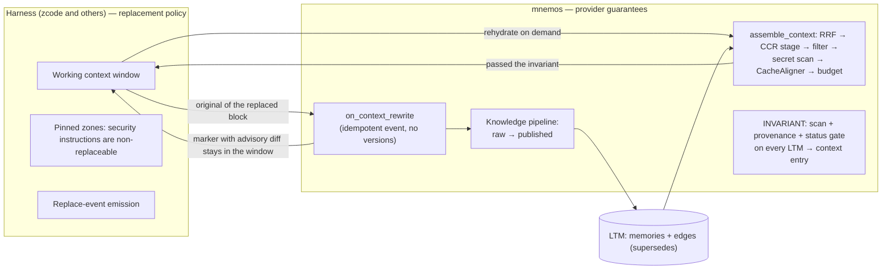

# ADR 0018: Context Rewrite and LTM Bridge

**Status:** Accepted (Architectural Committee, 2026-08-22) — conditional: the
P0 fix-track (see Phases) must land before any implementation of the rewrite
mechanics
**Deciders:** Tech Lead (chair), Product Architect, Senior System Engineer,
Senior Security Engineer
**Scope:** provider contract (ADR-0017 D1), CCR rehydrate channel, knowledge
pipeline, minimal memory graph, metric gates

## Context

The owner observed a context-slimming mechanics in the zcode harness: thin
replacement inside the working template (a was→becomes diff), while the full
original is preserved in long-term memory and details are fetched on demand
(vector and graph retrieval). The committee asked whether this is already
part of the mnemos architecture (ADR-0017), what is missing, and whether
formalizing it is correct.

Part of it exists. CCR (`src/mnemos/ccr.py`, `ccr_cache`, exposed as MCP
tools `mnemos_compress` / `mnemos_retrieve` and over REST) already provides
"thin marker in context + full original + retrieve by marker" with 86–96%
reduction, content addressing, and idempotency. But the proposal is wider on
three axes: semantic revision of live context has no lifecycle operation in
the D1 contract; `ccr_cache` is a TTL/LRU cache, not long-term memory
(originals are evicted); and graph retrieval is Phase 2 (ADR-0017 D2). The
D1 contract itself exists only on paper — `assemble_context` has zero
occurrences in the code. Only the harness can replace a block inside its own
context window; mnemos is the provider of primitives and of the contract.

A security inventory of the existing rehydrate channel found four defects:
`ccr_store` writes the original verbatim without `detect_secrets`
(`sqlite_store.py:1504`); `retrieve` returns the full original without
re-scan or provenance; `ccr_get` is not project-scoped (cross-session
leakage within a node); the plaintext marker is parsed on first match
(lookalike risk). Formalizing rewrite without fixing these turns rehydrate
from a rare manual gesture into a systematic mechanism and grows exposure
by orders of magnitude.

## Decision

Accept the mechanics as an **extension of the `assemble_context` provider
contract (ADR-0017 D1)** — not as a new primitive. Positioning: harness
compaction becomes lossless when originals land in the provider.

### Entry invariant (every LTM → context path)

Every path by which LTM content enters working context — `assemble_context`
injection, tool-call rehydrate (`mnemos_retrieve`), future graph expansion
(D2) — passes three controls: secret scan, provenance wrapper, and status
gate. The status gate admits `published` and `processed` entries (the
documented search-default set); `raw` and DLQ content is unreachable from
context, otherwise knowledge-pipeline gating becomes bypassable. Narrowing
to `published` only is a one-line constant change if Phase 1 decides so. Scan runs on issuance always (scanner patterns evolve, stored
records age); a verdict flag cached at store time is a later optimization,
not a substitute. When a secret is found at store time, the original is
still stored unchanged (zero-loss storage) with a verdict flag, and
issuance is redacted — "never echo secrets" ranks above "zero-loss at
issuance"; an optional refuse-to-cache mode is decided at P1 implementation.

### `on_context_rewrite`: lifecycle event, not a versioned primitive

Context rewrite is an idempotent, version-less lifecycle operation of the
D1 contract. The original of the replaced block is the source of truth: it
goes to the knowledge pipeline (`raw → published` gating). The marker stays
in the window carrying an advisory was→becomes diff; the diff is not
load-bearing. The event promises no version ordering — version pairs and
traversal are `supersedes` edges in D2 (Phase 2).

### Boundary: harness policy, provider guarantees

| Concern | Owner |
|---|---|
| When and what to replace; token budget | Harness |
| Pinned zones (security instructions are non-replaceable) | Harness — declaration plus acceptance |
| Replace-event emission (what and when was replaced — observability) | Harness |
| Acceptance: golden adapter test (a security instruction survives N rewrite cycles) | Harness |
| Zero-loss storage; retrieval (hash → FTS → vector → graph by phase) | Provider |
| Secret scan, provenance, status gate | Provider |
| Rehydrate | Provider tool only — the harness cannot bypass the controls |

Acceptance model: declaration plus acceptance is sufficient (single-tenant;
the harness is trusted software). The provider's half of pinned zones is
re-anchoring of invariants via CacheAligner tail-relocation.

### CCR stage in `assemble_context`

The fixed D1 pipeline gains a CCR stage (size S). `post_tool_call`
autocompression (size M) is a subset of Phase 1. Phase 1 delivers MCP
tools, a documented protocol, and a harness acceptance checklist —
explicitly not "guaranteed replacement": the provider cannot see the
harness window.

### Minimal `memory_edges` in Phase 1

A minimal edges table (`kind=supersedes` only, no expansion) lands in
Phase 1, so a slice of Phase 2 is not dragged in implicitly. D2 graph
expansion later runs under the entry invariant.

### D5 metric pair (amendment to ADR-0017 D5)

Rewrite quality is measured by `replace-hit-rate` and `replace-regret-rate`.
Target corridors are set after the baseline on the golden set is recorded
(open until then).

## Phases

| Phase | Scope | Size | Exit gate |
|---|---|---|---|
| P0 fix (immediately, before any mechanics) | Scan on `mnemos_retrieve` (redact or refuse at issuance) + status gate (`published` + `processed`, the documented search-default set — narrowing to `published`-only is a one-line constant change if Phase 1 decides so) — one PR | S | Tests for secret echo and raw issuance; Security review |
| P1 fix | Scan at `ccr_store` (verdict flag; secret → store with flag + redacted issuance); project scoping of `ccr_get` + audit of `ccr_search`; minimal `memory_edges` table (`kind=supersedes`, no expansion) | S–M | Security review; CCR regression suite green |
| P2 fix | Marker validation (faux-marker source) | S | Escalation rule enforced: no marker-driven automation merges before validation |
| Phase 1 (D1 contract, per ADR-0017 roadmap) | `assemble_context` + CCR stage; `on_context_rewrite` as an MCP event tool; harness acceptance checklist (pinned-zones golden test, replace-event); `post_tool_call` autocompression; D5 metrics incl. the new pair | M | ADR-0017 Phase 1 gate: golden set, precision/recall@k, injection-acceptance |
| Phase 2 (per ADR-0017 roadmap) | Graph expansion over edges — under the entry invariant | M | ADR-0017 Phase 2 gate |

Marker validation is P2 today and **escalates to P1 as a precondition of any
marker-driven automation** (`post_tool_call` autocompression, auto-rehydrate).

## Alternatives considered

- **New "diff-swap" primitive with versioned semantics (L)** — rejected:
  duplicates the CCR marker for ~90% of use cases; shipping without demand
  metrics violates D5; versioned diff semantics silently grows to L.
- **Implement entirely inside zcode as private harness mechanics** —
  rejected: reproduces ADR-0017 gap #1 ("context delivery is
  adapter-private") and forfeits mnemos' provider position.
- **Separate `context_diff` API outside D1** — rejected: duplicates the
  contract; extending the lifecycle is the correct shape.
- **"CCR is done, close the question"** — rejected as false: automation,
  LTM guarantee, and secret scan on the channel are missing.
- **Keep all CCR originals forever (disable TTL/LRU)** — rejected:
  unbounded database growth; "full history" is achieved only via the
  explicit persist operation (the rewrite event) into the knowledge
  pipeline.
- **Rely on the D1 secret scan in `assemble_context` only** — rejected:
  does not cover tool-call rehydrate, the path that exists today.
- **Forbid the mechanics** — rejected: the channel already exists and is
  useful; the correct action is to control it, not to close it.

## Consequences

- **Positive:** harness compaction becomes lossless when originals land in
  the provider (universal memory provider positioning); the existing
  rehydrate channel gains the security controls it lacks today; rewrite
  quality becomes measurable (the D5 metric pair).
- **Negative / costs:** the CCR issuance promise is narrowed — issuance may
  be redacted where a secret is present (the original is stored unchanged);
  the advisory diff can lose semantics (mitigated: the original in LTM is
  the source of truth, the diff is not load-bearing); frequent rewrites add
  pipeline load (mitigated: entries enter at `raw` and gate to `published`;
  `replace-regret-rate` corridor after baseline); the P0/P1 fix-track is
  immediate unplanned work ahead of the merge train.
- **Accepted residual risks:** cross-session marker leakage until the P1
  patch (single-tenant blast radius is the node; fix in the first batch
  after P0); a malicious harness is not mitigated by this contract
  (single-tenant threat model: the harness is trusted software).

## References

- Architectural Committee decision record: mnemos entry `b1f4c34f`
  (tags: `committee`, `mnemos:decision`).
- Full architectural contract: mnemos entry `318ae722`.
- ADR-0017 — D1 (provider contract this ADR extends), D2 (memory graph;
  `supersedes` edges and expansion), D5 (metric gates; amended with the
  `replace-hit-rate` / `replace-regret-rate` pair).
- Issues: #125 (Phase 1 provider contract), #130 (Phase 3).
- Session protocol and full architectural contract are archived with the
  committee records (team-local, not part of this repository).
