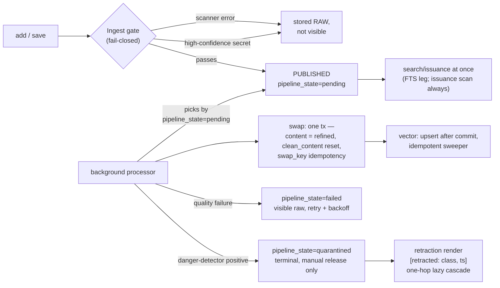

# ADR 0019: Optimistic Publication with Async Refinement

**Status:** Accepted (Architectural Committee, 2026-08-29) — supersedes the
ingest-time invisibility default; conditional: Phase A (danger detectors +
fail-closed ingest gate) must land before the immediate-visibility semantics
ships
**Amended by:** ADR-0020 (2026-08-30) — §5 retraction render is reason-neutral ([retracted: ts]); reason class lives in audit and operator-gated metadata.
**Deciders:** Tech Lead (chair), Product Architect, Senior Security Engineer,
Senior System Engineer, Analytics Lead, Senior QA Engineer
**Scope:** entry visibility semantics, `pipeline_state` lifecycle, provenance
marker contract (amends ADR-0018), quarantine semantics, swap mechanics, D5
metric additions

## Context

The owner issued a product directive (mnemos `6d2e036f`): every entry becomes
findable immediately after save, a fast ingest validation decides admissibility,
the full pipeline refines the entry asynchronously on a copy, and the served
projection is seamlessly replaced when refinement completes. The Tech Lead
convened the committee on this directive (open question mnemos `c6353ef2`).

The current state delivers this only as a loophole. The sole immediate-publish
mechanism is the Hermes bypass — `publish_on_write` with `skip_quality_check` —
which pushes entries straight to `published` and **permanently skips full
processing**: no quality gate, no dedup, no refinement, and no trace of the
bypass in status or audit. On the clean path, entries stay invisible to search
until processing completes (BASELINE.md hard invariant "raw / non-admissible
entries surfaced = 0"). Immediate visibility exists, but as an unauditable
side door; the owner's model requires it as honest server semantics.

The committee confirmed the model is compatible with ADR-0017 and implementable
server-side, provided visibility is decoupled from pipeline state and the
projection — not the identity — is what gets replaced. Three conflicts were
argued to consensus (failure handling for already-visible entries, the
raw-vs-refined distinction without touching `MemoryStatus`, vector upsert
ordering at swap time) and are folded into the Decision below.

## Decision

Adopt **optimistic publication with async refinement** as server semantics.
An entry is visible to search immediately after passing a fast fail-closed
ingest gate; the full pipeline refines it asynchronously; on readiness a
single transaction replaces the served projection on the same row, under the
same ID. Failures split into two lanes by class: quality failures leave the
entry visible raw with retry; a positive danger-detector signal quarantines
it terminally until manual release.

### Visibility and pipeline state are orthogonal

`MemoryStatus` and `CONTEXT_ADMISSIBLE_STATUSES` (ADR-0018) are **not
extended**: `{PUBLISHED, PROCESSED}` remain the only visibility gate. The
pipeline lifecycle moves to a new orthogonal column `pipeline_state` with
values `pending | processing | refined | failed | quarantined` (default
`pending` for new visible entries). The single exception: the admissibility
predicate additionally excludes `pipeline_state='quarantined'`. "Refined
only" is a query flag, not status ontology (see marker contract below).

New columns on `memories`: `pipeline_state` (TEXT), `processed_at` (TS),
`swap_key` (TEXT — `hash(cluster_id, prompt_version, processed_hash)`,
idempotency by analogy with `synthesis_cache_key`), `quarantine_reason` (TEXT,
detector class code). Migration is `ALTER TABLE ADD COLUMN` (instant,
metadata-only). Backfill heals the Hermes legacy: existing `PUBLISHED` rows
with unfinished processing become `pending` (idempotent by `swap_key`);
synthesized `PROCESSED` rows become `refined`; no FTS rebuild (rowids are
stable).

### Swap mechanics (seamless replacement)

The swap is one SQLite transaction via the targeted `update_fields` path
(`content` is already whitelisted, rowid stays stable, the FTS
`AFTER UPDATE` trigger reindexes correctly): `content` ← refined output,
`clean_content` reset (otherwise the swap is masked by `effective_content()`),
`pipeline_state=refined`, `processed_at`, `swap_key`, and a `marker_version`
increment. A second swap with the same `swap_key` is a no-op. The
search-vs-swap race is benign: one ID, so a reader sees the old or the new
snapshot — never a mix and never a duplicate.

The vector store is deliberately outside the transaction: the embed is
upserted by `memory_id` **after** commit; a failed upsert is healed by an
idempotent sweeper (`refined` rows with a stale embed). Healing SLO seeds —
soft 5 s (alert) and hard 60 s (exclude from the vector leg + alert) — are
**provisional-until-measured**, to be revised from timing-stand percentiles
per the owner's benchmarks-only directive (mnemos `06b68002`). Audit events
per `memory_id`: ingest verdict, publication, `swap_committed` (old/new
revision hashes), `embed_upserted` (content revision bound to embed revision),
quarantine (reason, detector, scope).

### Failure policy: two lanes

The pipeline itself classifies the failure — errors are already typed by
stage (quality gate / dedup vs danger detectors). Class (b) fires only on a
positive signal from the enumerated detector set.

| Lane | Signal | Consequence | Recovery |
|---|---|---|---|
| Quality / infra (a) | LLM timeout, score below threshold, no dedup pair | `pipeline_state=failed`; entry stays visible raw (the ingest-validated projection); flag carried in the marker | retry with backoff + attempt counter |
| Danger (b) | positive detector signal: secret in refined output, injection, poisoning | `pipeline_state=quarantined` + `quarantine_reason`; excluded from issuance; retraction render `[retracted: <class>, ts]` on the same ID | manual release only |
| Ambiguity | scanner / detector error | quarantine — fail-closed in both directions | manual review |

Retraction is a state of the same record, not a separate tombstone row. The
tombstone is injected into a session's issuance once, and only if the entry
had previously entered that session's context. The cascade to quoting entries
is one hop, lazy (marker-driven at assembly time, no background traversal);
recursive traversal is deferred to ADR-0017 D2.

### Provenance marker contract (amendment to ADR-0018)

Every issuance path must carry a structured field: `id`, `status`,
`pipeline_phase` (the `pipeline_state` value), and `version`
(`marker_version`, incremented on swap). The rendered bracket string
`[mnemos:<id> project=
 status=<s> pipeline=<phase> v=<n>]` is a projection
of the field, not the source of truth. The marker is built from the same row
snapshot as the served projection (single read — anti-TOCTOU), so a consumer
can detect projection desync on its own via the version. A new issuance path
without the marker is an invariant violation. "Refined only" is the
`refined_only` query flag of search; federation / multi-principal boundaries
export refined projections only — the structured field encodes this without
render parsing.

### Ingest gate (precondition of the semantics)

`detect_secrets` runs synchronously at add/update, fail-closed: a scanner
error means the entry is stored (zero-loss) but not admitted to issuance.
High-confidence secrets mean a hard publication refusal (RAW storage remains
allowed). A positive injection detector (the enumerated set) must exist
**before** the immediate-visibility semantics ships — today the injection
screen at ingest is log-only and cannot classify threats into lane (b). The
"visible-before-swap" window is itself a golden-scenario metric. A CI
regression gate holds `injection-acceptance = 1.000` including raw entries.

### D5 metric additions and BASELINE rewrite

New metrics: **LTV** = t(findable) − t(save_ack); **LTS** = t(first refined
issuance) − t(save_ack); **swap-coverage** = N_swapped / N_saved, where a
swap counts as completed only after the healed vector; **stuck-raw** ≤ 0.01;
**duplicate-rate@k** = 0 (invariant: one ID occupies exactly one issuance
slot); **mixed-window-hit-rate**; raw-vs-refined quality delta via paired
**McNemar** on paired hits, not two independent samples.

Corridor formula: `baseline − max(0.02; 95% CI)`, re-baselined on corpus ×2
growth, embedder change, or model change; thresholds pulled from thin air are
forbidden (owner directive mnemos `06b68002`). BASELINE.md is rewritten in
the same PR as the implementation: the "raw surfaced = 0" invariant is
consciously retired and replaced by — issuance scan always;
injection-acceptance = 1.000 including raw; duplicate-rate@5 = 0. Timing
moves to a separate perf stand (p50/p95/p99); deterministic golden checks
only causal ordering. Success criteria: LTV p99 ≤ the immediate-path
reference; swap-coverage ≥ 0.97; injection-acceptance = 1.000 (incl. raw);
S1–S3 golden scenarios green in CI. Growing the rated-query corpus ~4×
(48 → ~192) for precision corridors is a separate task that does not block
Phases A–B.

### Testing contract (QA)

Invariants: findable immediately after add (polling ≤ 100 ms, no sleeps); ID
unchanged by the swap; `raw_content` byte-identical; marker
status/pipeline_phase equal to the current row values; fail-closed scan in
both phases (a secret introduced by processing blocks exactly like an ingest
one); one ID in an issuance exactly once; retry idempotent (embed call
counter = 1). Races via barrier synchronization (search-vs-swap, double swap,
swap during index rebuild, reprocessing after failure). Golden: before/after
swap snapshot pairs with fixed IDs and deterministic embeds. Tests that
legitimize the Hermes bypass are deleted or kept `xfail` until Phase D.

## Phases

| Phase | Scope | Depends on |
|---|---|---|
| A | Injection detector (enumerated set, positive-signal) + fail-closed ingest gate + ingest audit events | — |
| B | Schema (`pipeline_state` / `processed_at` / `swap_key` / `quarantine_reason`) + daemon pending-pickup + swap mechanics + marker with `pipeline_phase` / `marker_version` + quarantine predicate | A |
| C | BASELINE.md rewrite + timing stand + S1–S3 golden scenarios + formula-based corridors + McNemar jig | B |
| D | Hermes bypass removal (`publish_on_write` → legal semantics), backfill healing, `xfail` cleanup | B |

Implementation owner: Tech Lead; execution in waves via delegates under the
agent-review protocol (reviewer ≠ implementer, verdict before merge).

## Consequences

- **Positive:** immediate findability becomes honest server semantics with a
  full audit trail instead of an unauditable bypass; Hermes legacy is healed
  by the backfill; consumers detect projection desync themselves via the
  marker version; raw-vs-refined quality becomes measurable (paired McNemar);
  refinement failures degrade gracefully (visible raw + retry) instead of
  blocking visibility.
- **Negative / costs:** ingest-validated raw content is briefly visible
  before refinement, making the issuance scan the only guard in that window
  (hence the Phase A precondition); duplicates are briefly visible until the
  dedup merge (merge keeps the canonical ID and redirect tombstones);
  BASELINE.md invariants change shape; SLO numbers stay provisional until the
  timing stand lands; CI gains a hard injection-acceptance gate over raw
  entries.
- **Deferred / accepted residuals:** recursive quarantine cascade over the
  citation graph — ADR-0017 D2; the `visibility: immediate | curated` policy
  knob exists but stays off until a consumer requires curation; per-principal
  ingest gates and the external refined-only boundary — with the second
  principal (ADR-0014 token); rated-query corpus growth to ~192 for precision
  corridors.

## Alternatives considered

| Alternative | Why rejected |
|---|---|
| Keep the Hermes `skip_quality_check` bypass as the "fast path" | The entry permanently skips full processing; a loophole with no trace in status or audit |
| New statuses (preview / VISIBLE_RAW / QUARANTINE) in `MemoryStatus` | Cascading edits to every gate, filter, statistic, and client for information one orthogonal field already carries; overloads the ADR-0018 invariant |
| Swap via a new row with lineage (derive-new-row) | Unstable identity: breaks `[mnemos:<id>]` markers, duplicates rows, orphans FTS |
| Per-adapter visibility flags | Splits semantics across channels; the owner's model is a server-level default |
| Vector upsert before commit / stale flag blocking issuance | Not rollback-safe without 2PC; a vector-store outage would become a read-path outage of SQLite |
| Push-retractions into every `assemble_context` | Clutters context; the tombstone is injected once and only if the entry had previously entered the session context |
| Recursive quarantine cascade | Expensive, requires a reference index; deferred to D2 (graph) |
| ARCHIVED as quarantine | Neither signals contamination nor corrects already-consumed context |
| LTV threshold "5 seconds" and mean latencies | Numbers out of thin air (violates the owner's benchmarks-only directive); percentiles from measurements only |
| Tests of immediate visibility on top of the current bypass | Would cement the bug as a contract |

## References

- ADR-0017 — roadmap: D1 (provider contract), D2 (memory graph; recursive
  cascade deferred there), D5 (metric gates this ADR extends).
- ADR-0018 — entry invariant, provenance, status gate; the marker contract is
  amended by this ADR.
- Architectural Committee session of 2026-08-29 (protocol and full
  architectural contract) — archived with the committee records, team-local
  and not part of this repository; see the mnemos entries below.
- Owner directives: mnemos `6d2e036f` (publication model),
  `06b68002` (benchmarks-only thresholds).
- Open question closed by this ADR: mnemos `c6353ef2`. Tech Lead decisions:
  mnemos `19b9c2a5`.
