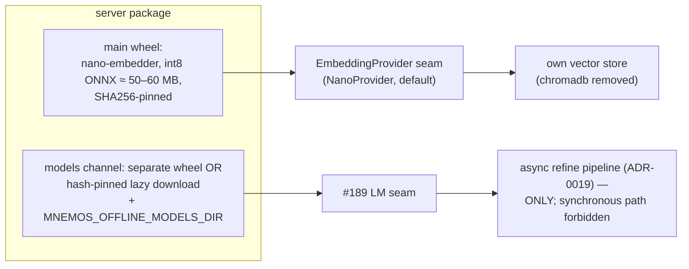

# ADR 0021: Nano-Model Track — Bundled Nano-Embedder and Nano-Refiner

**Status:** Accepted (Architectural Committee, 2026-08-31) — staged and
quality-gated; non-blocking for the P1 queue
**Deciders:** Tech Lead (chair), Product Architect, Senior System Engineer,
Senior Security Engineer, Senior QA Engineer
**Scope:** bundled nano-embedder as the default `EmbeddingProvider` (chromadb
removal), nano-refiner behind the #189 seam, model-quality contour S1m with
`model_fingerprint`, model-artifact security, stages NM-0 – NM-4

## Context

The owner directed (mnemos `515ba813`): an ultra-light model for memory work
only — CPU-resident, living inside the package — so the server achieves full
autonomy without API keys or network. The Tech Lead convened the committee
and split the idea into stages behind quality gates.

The competitive landscape leaves the niche open (Product Architect): mem0
requires an OpenAI key even self-hosted, zep is a cloud, langmem needs a
configured LLM — none of them bundles a model. The charter success metric:
install → first search with no network, keys, or configuration = 100% of
fresh installs.

Three findings from review shaped the decision:

- ADR-0006 already made local ONNX embeddings the default, but the model is
  downloaded at first run, so the install is not yet fully offline. The
  pinned MiniLM-L6 is English-only; the owner's memory is RU+EN, so the
  distillate must be multilingual.
- System Engineer's discovery: chromadb is only the embedding provider
  (`ChromaDefaultProvider` in the embedding seam); the store has long been
  our own. Replacing one class removes the entire dependency.
- QA's blocker: S1 gates the issuance path on the deterministic BLAKE2b
  reference and does **not** gate the production embedder — the environment
  flag is recorded but never checked, so a silent embedder substitution
  passes today. This hole closes before any model lands (NM-0).

## Decision

Adopt a staged nano-model track. The product frame is fixed first: **sell
autonomy, not a model** — "memory without keys and network out of the box",
never "our unique trained model". Marketing: an offline-first slogan, a
demo without network, an honest comparison table; the nano-refiner stays
out of marketing until it passes its gate.

### Stage 1 — nano-embedder (NM-1)

A multilingual 6-layer distillate, ~45–60M parameters, int8 ONNX ≈ 50–60 MB
— fits the main wheel under the PyPI file limit. Distillation runs on the
mira GPU machine; the artifact is committed to the repo, and CI verifies its
hash (no training in CI). Expected CPU cost: 1–5 ms per text, 200–400 ms
per 32×512 batch.

`NanoProvider` (onnxruntime + tokenizers, both already dependencies) plugs
into the clean `EmbeddingProvider` seam and becomes the production default.
With it, **chromadb leaves the dependency tree entirely**: the `"chromadb"`
provider setting gets a migration warning; the #180 CVE alert dissolves
(−3 CVEs), telemetry goes away, and the install shrinks by 150–250 MB.
The embedder rides in the main wheel; the sdist ships without weights.

Embedder replacement triggers the ADR-0020 re-baseline and a full re-embed
of the corpus via an idempotent sweeper.

### Stage 2 — nano-refiner (NM-3)

A 135–500M int4 model running through onnxruntime-genai — one runtime
shared with the embedder (135M ≈ 50–100 tok/s, 500M ≈ 20–40 tok/s on CPU;
RAM +0.3–1 GB). It substitutes strictly behind the #189 seam (the single
replacement point in `_produce_refined_projection`) and is **async-only**:
it rides the ADR-0019 background refine pipeline, where 5–30 s per digest on
CPU is acceptable; a synchronous path is forbidden. A
`REFINE_PROCESSING_VERSION` bump changes `swap_key`, so already-refined
entries re-swap correctly.

The refiner ships in a separate models wheel or as a lazy download with a
pinned revision hash; `MNEMOS_OFFLINE_MODELS_DIR` supports offline installs
from a file. It stays **opt-in until its corridors beat both the
deterministic stub and an external LLM**; only then does it become the
local default. Prerequisite: the S3 stand (ADR-0020 BF-3) exists — without
it the stage is not gateable.

### NM-0 — model-quality gate (prerequisite of both stages)

Closes the found blocker: the production embedder becomes gated. The S1m
extension measures recall@k, precision@k, MRR, nDCG@k of the production
embedder on the judged corpus, as self-comparison with the corridor
`baseline − max(0.02; 95% CI)`; external sets (MTEB) are informational
only. A `model_fingerprint` field (sha256 of weights + opset + provider)
lands in the baselines schema; a weight change without an explicit
re-baseline in the same PR fails loud (mutation regression test).

Determinism rules: per-arch corridors (x86_64 and arm64 as separate
baseline rows; cross-arch deltas informational); bit-identity between
architectures is **not** required. The S1 reference stays on BLAKE2b
forever — the reference measures the retrieval pipeline; the production
model is measured separately. Digest quality is fact-retention@N,k,
replace-regret, and repeat idempotency — no LLM-judge. The offline gonogo
test is a gate; latency and RSS are informational locally, corridored only
in the S2 nightly; no wall-clock gate in the local run.

### Security requirements (mandatory)

- Static weights only — no runtime fine-tuning on user data (poisoning and
  privacy); the weight-write race test must fail.
- ONNX/GGUF formats only; pickle serialization is a blocker (CWE-502).
- Weight SHA256 pinned in the server package; the loader fails on mismatch.
- The model artifact is signed by the release pipeline like code (SHA256 +
  cosign + GPG) and carried in the SBOM with base-model provenance and
  license — Apache-2.0/MIT-class only, with attribution.
- Network isolation of inference plus a gonogo test asserting no outbound
  connections; onnxruntime(-genai) dependency audit — minimal feature set,
  no HTTP backends.
- Inference budgets (max_tokens, timeout, input length, bounded queue, by
  analogy with `hooks.max_output_chars`); on excess the projection is
  refused and the record stays raw — never quarantined.
- Secret scan of the LM-produced projection **before** swap — the ADR-0019
  §7 contour, extended to LM output.

### Not doing

The reranker (NM-4) is Not-doing until a measured recall@k ceiling
demonstrates the need (benchmarks-only directive). Anti-scope: no general
LM — no chat, code generation, or question answering; no fine-tuning
infrastructure for third-party tasks; no training in CI (mira GPU only, CI
checks the hash); no synchronous LM path.

## Phases

| Phase | Scope | Readiness gate |
|---|---|---|
| NM-0 | model-quality contour: S1m extension, `model_fingerprint` in baselines, fail-loud weight change, closing the ungated-embedder hole | suite and stands green; the "silent weight swap" mutation goes red |
| NM-1 | distillation on mira → int8 ONNX artifact → `NanoProvider` in the seam as default; chromadb removal from `pyproject` with migration warning; re-embed sweeper; re-baseline | S1 invariants green on the nano-embedder; S1m corridor vs reference; offline gonogo; Apache-2.0/MIT license + SBOM provenance; model artifact signed in the release pipeline |
| NM-2 | S3 stand (ADR-0020 BF-3: long-lived session, fact-retention) — prerequisite of NM-3 | per the ADR-0020 contract |
| NM-3 | nano-refiner: int4 via onnxruntime-genai, async-only behind #189, `REFINE_PROCESSING_VERSION` bump, inference budgets, opt-in delivery channel | fact-retention@N,k not worse; replace-regret ≤ baseline; repeat idempotency; scan-before-swap extended to LM output — then local default |
| NM-4 | reranker — Not-doing | — |

Sequencing: NM-0 → NM-1 → NM-2 → NM-3. NM-0 and NM-1 enter the tracker
immediately; NM-0 has standalone value with or without any model. The track
runs parallel to and does not block the P1 queue.

## Consequences

- **Positive:** a fresh install reaches first search with zero network,
  keys, or configuration — the charter metric becomes real; chromadb
  removal dissolves the #180 alert (−3 CVEs), kills telemetry, and cuts
  150–250 MB; one runtime serves embedder and refiner; NM-0 gates the
  production embedder for the first time — standalone value independent of
  the model; ADR-0006's first-run model download disappears.
- **Negative / costs:** distillation and artifact management on mira; the
  models delivery channel adds release and signing surface; the corpus
  re-embeds on every embedder swap; corridors stay cold until first
  measurements; per-arch baselines double the maintenance rows.
- **Deferred / accepted residuals:** the reranker until a measured recall@k
  ceiling; the refiner's local default until corridors beat the stub and an
  external LLM; cross-arch bit-identity explicitly not pursued.

## Alternatives considered

| Alternative | Why rejected |
|---|---|
| Training a model from scratch | Expensive and risky; distillation with hash pinning reaches the same result more reliably |
| LM weights in the main wheel | PyPI 100 MB per-file limit; bloat; bypasses the artifact signing contour |
| Runtime fine-tuning on the user's corpus | Weight poisoning plus privacy |
| pickle weight serialization | CWE-502 |
| Stage-3 reranker now | No measured need (benchmarks-only directive) |
| Synchronous path for the LM refiner | 5–30 s per digest on CPU — background pipeline only |
| Bit-identical int8 across ARM/x86 as a requirement | Not guaranteed by the runtime; per-arch corridors instead |
| Replacing the BLAKE2b S1 reference with a neural embedder | Conflates the reference with the subject under test; the reference measures the pipeline, the production model is measured separately |
| Marketing framed as "a unique trained model" | The product frame is autonomy, not the model |
| LLM-as-judge / MTEB as gates | Instability and external dependency; gates run on the owned corpus only |

## References

- ADR-0006 — local ONNX embeddings default and the `EmbeddingProvider`
  seam; this track removes its first-run download.
- ADR-0017 — D6 zero-config promise this track completes.
- ADR-0019 — §6 corridors and re-baseline triggers, §7 testing contract
  (the scan-before-swap contour extended to LM output here); the async
  refine pipeline the refiner rides.
- ADR-0020 — stands S1/S3, corridor formula, re-baseline triggers
  (embedder / model change), BF-3.
- Epic: issue #197 (NM track). Feeds: #189 (LM provider seam), #180
  (chromadb CVEs dissolve), #177.
- Owner directive: mnemos `515ba813`.
- Architectural Committee session of 2026-08-31 (protocol and contract) —
  archived with the committee records, team-local, not part of this
  repository; see the mnemos entries above.
