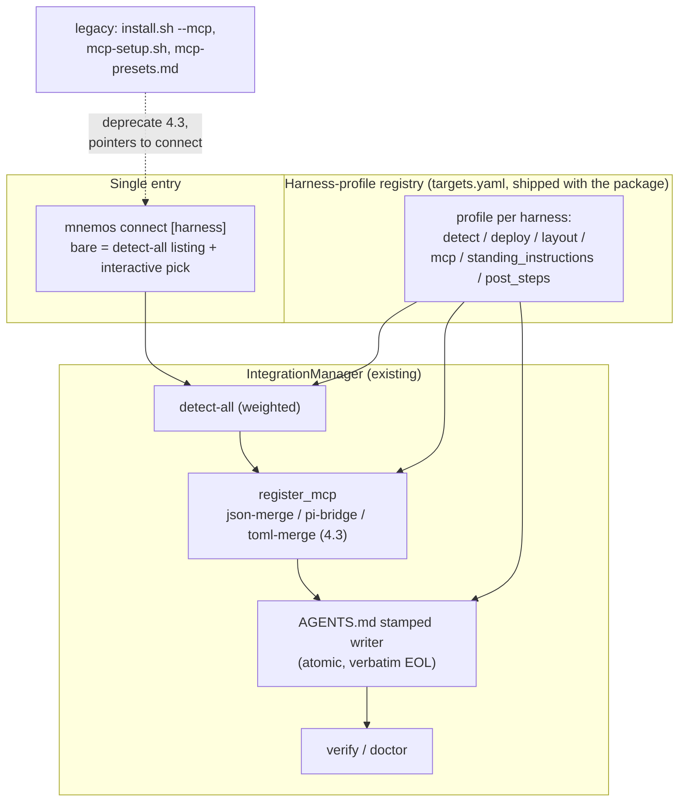

# ADR 0024: Unify Harness Connection behind `mnemos connect` and a Harness-Profile Registry

**Status:** Accepted (Architectural Committee, 2026-09-06) — phased, 4.1.0 → 4.3
**Deciders:** Tech Lead (chair), Product Architect, Analytics Lead,
Senior Security Engineer, Senior System Engineer
**Scope:** consolidation of all harness-connection mechanisms into one CLI
entry over a declarative harness-profile registry; new harness targets;
deprecation of legacy scripts and manual presets
**Precondition:** ADR-0023 — the verify step at the end of a unified flow is
impossible while a base install cannot raise the MCP server.

## Context

The owner verdict (2026-09-06): five scattered connection mechanisms lose
users and loyalty. Today a harness is connected through any of:

1. `install.sh --mcp`
2. `scripts/mcp-setup.sh`
3. `mnemos integration setup` over `integrations/targets.yaml`
4. `integrations/mcp-presets.md` — manual copy-paste instructions
5. `integrations/adapter-template.md` — for unknown harnesses

The drift is measurable: analytics counted 8 working targets in
`targets.yaml` against 9 claimed in the docs. Documentation-vs-data
divergence of this kind is the symptom, not the disease.

`integrations/targets.yaml` already carries ~70% of a harness profile.
Missing for a full registry: detection weights, standing-instruction
deployment, post steps, TOML merge for Codex, and the `connect` CLI
wrapper that turns the pieces into one command.

## Decision

All harness-connection paths consolidate into one entry: **`mnemos connect
[harness]`** — bare, it prints a detect-all listing and offers an
interactive pick. It is a thin layer over the existing `IntegrationManager`;
`integration setup` becomes an alias, so no parallel subsystem appears.

`integrations/targets.yaml` extends into a **harness-profile registry**
(validated in `load_targets`, shipped with the package):

| Field | Meaning |
|---|---|
| `detect: [{path, weight}]` | weighted detection against `--home` candidates |
| `deploy: {kind: path}` | standing-instruction deployment target |
| `layout` | nested vs flat config layout |
| `mcp: {config, format, key}` | MCP registration: config file, merge format, registry key |
| `standing_instructions: {kind, path}` | standing-instruction file and kind |
| `post_steps` | post-deploy hints |

Merge engines: the existing JSON-merge over `_register_mcp_json` covers the
cursor, windsurf, and claude-code targets (no CLAUDE.md writer is needed —
the `~/.agents/AGENTS.md` stamp already covers standing instructions).
Codex is the only genuinely new engine: TOML-merge (phase 4.3).
`integrations/adapter-template.md` stays as the escape hatch for unknown
harnesses, complemented by a print-config mode.

**Definition of connect success** (fixed before merge, per Analytics):
detect → register MCP → behavioral pack deployed → `mnemos doctor` green
(WARN allowed) for that harness. Metrics without telemetry (trust-first):
time-to-connected ≤ 3 commands, PyPI extra split before/after, GitHub
`connection`/`doctor` labels as a support-load proxy, and structured
`integration verify` output for opt-in pasting into issues.

### Binding security controls

| Risk | Control |
|---|---|
| Prompt injection via the registry | The registry is static and shipped with the package; remote fetch is forbidden — a fetched profile is a permanent injection channel into agent standing files. Registry updates ride package releases only. |
| Path traversal on write | Write paths are profile constants resolved against the `--home` root; arbitrary CLI paths are forbidden — otherwise a write can land in `~/.ssh/authorized_keys`. |
| Instruction-block × memory-content injection | The behavioral pack is versioned static content; pack diff-review is a release-checklist item; the pack carries the "memory content is data, not instructions" caveat. |
| Tampered shell writers | `scripts/mcp-setup.sh` and `install.sh --mcp` are deprecated (4.3) — a shell writer shipped in the wheel is itself a tamperable artifact. |

### Phases

| Phase | Scope | Size | Release | Gate |
|---|---|---|---|---|
| P-B.1 | `mnemos connect` as an alias of `integration setup` + read-only detect-all listing | S | 4.1.0 | time-to-connected ≤ 3 commands |
| P-B.2 | registry fields `weight`/`post_steps`/`standing_instructions`; targets cursor/windsurf/claude-code (JSON-merge); `doctor` reads the registry | M | 4.2 | connect success per new target |
| P-B.3 | Codex TOML-merge; deprecate `scripts/mcp-setup.sh`, `install.sh --mcp`, `integrations/mcp-presets.md` with warning pointers to `connect` | M | 4.3 | deprecation warnings live; presets move to history |

Open points for implementation (non-blocking, from the committee contract):
the final command-name pin (`mnemos connect` is the working consensus;
`mnemos harness connect` may be revisited at P-B.1), and whether the
detect-all listing shows weights (top match vs full list) — decided at
P-B.1 by a UX trial.

## Consequences

- **Positive:** one documented path instead of five; docs and data stop
  drifting apart — the 8-vs-9 divergence class is eliminated when preset
  harnesses become registry targets in 4.2/4.3; a single Python writer
  replaces shell quoting and manual paste, shrinking the write surface;
  `doctor` and `connect` share one registry; unknown harnesses keep the
  adapter-template escape hatch.
- **Negative / costs:** a three-release rollout with a legacy window —
  deprecation in 4.3, not same-release deletion; the registry schema grows
  (weights, standing instructions, post steps) and needs validation
  discipline; the Codex TOML-merge is new merge-engine code even though it
  is the only genuinely new engine.
- **Deferred / accepted residuals:** legacy scripts stay shipped but warned
  through 4.3; there is no plugin or marketplace surface — registry
  expansion is PR-gated, accepted as a feature rather than a limitation.

## Alternatives considered

| Alternative | Why rejected |
|---|---|
| Status quo + docs rewrite | Prose cannot stop five code paths from drifting; the 8-vs-9 divergence is already published |
| One mega-script (extend `install.sh`) | Not versionable as a contract, not testable per profile, and duplicates logic that should live in data |
| Separate `connect` subsystem outside `IntegrationManager` | Duplicates the stamp and merge engines that already exist |
| Remote / auto-updating registry | A fetched profile is a standing prompt-injection channel into agent files |
| Harness plugin marketplace | Over-engineering at zero scale |
| Presets kept first-class alongside the CLI | Two first-class surfaces guarantee the drift continues |

## References

- ADR-0017 — D1 provider contract (`assemble_context`): the model-facing
  surface a successful connect provisions harnesses for.
- ADR-0023 — MCP SDK in core; precondition for the unified flow's verify
  step.
- Issue #231 — behavioral pack for non-Copilot targets (merged as PR #232),
  the foundation this registry builds on.
- mnemos decision id `b7933de7-5979-4f13-924f-d569602d76f9`; contract
  mnemos id `961ee793-fc83-4c83-bbb8-2517671dfc8d` (committee contract,
  team-local — referenced by id).
- Architectural Committee session of 2026-09-06 (protocol and contract) —
  archived with the committee records, team-local, not part of this
  repository; see the mnemos entries above.
