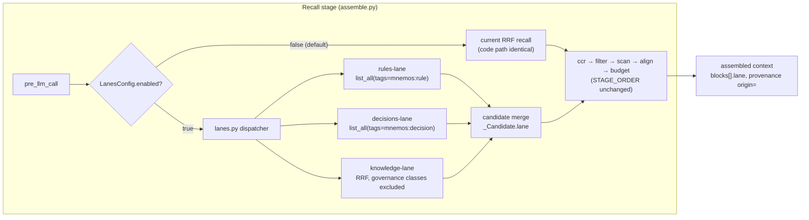

# ADR 0025: Memory Meta-Level — Retrieval Lanes and Area Manifests

**Status:** Lanes hypothesis FALSIFIED by the first recorded pre-registered
run (Architectural Committee ratification, 2026-09-14; run
`e3-lanes-56c568297ad6`, E0 ledger revisions 1-8 + run ledger). The
original acceptance (2026-09-08, with conditions) is superseded for the
lanes leg: the registered consequence applies verbatim — "theory NOT
confirmed; at most a cheap type-boost survives; recommendation reverts to
B0; the meta-level is not built." The lanes engine remains in-tree behind
`LanesConfig.enabled=False` as a verified-inert dormant capability (no
rollout: rollout required an H3+H4 pass). The awareness leg (D) and the
collapse-cascade legs (C) carry separate hypotheses and are NOT
falsified by this run. Committee findings: the engine executed the
specification flawlessly (byte-exact reproduction, no defect) — the
query-blind pinned prefix, the very feature that constitutes B's
registered structural advantage over B0 (byte-stable KV prefix), caps at
`pinned∩gold` on per-query-gold strata (observed 12/96 = the exact
structural ceiling); a future query-conditioned redesign (leg B1) would
sacrifice H2 and requires a NEW pre-registration. The manifest lane
remains behind the P1 approval machine (unchanged).
**Deciders:** Tech Lead (chair), Product Architect, Analytics Lead,
Senior System Engineer, Senior Security Engineer
**Scope:** structured memory meta-level: retrieval lanes as a recall
sub-stage of `assemble_context`, area manifests as an operator-approved
governance class, the brain-metaphor boundary, the pre-registered A/B/B0
experiment (plus a separate compaction leg C), and the mint→pin security
contour
**Precondition:** ADR-0020 — the experiment legs need its stands (S1m
corpus, S2 timing), its McNemar pairing policy, and its event-driven
re-baseline triggers.

## Context

The owner proposed (2026-09-08) a meta-level "root layer" of memory: an
explicit structured hierarchy of areas, each with described functionality
and responsibility zones, optionally hardened into a fixed brain-style
structure governing all server layers — with mandatory experimental
confirmation of the theory before any implementation.

The pain is measured, not asserted. The live store holds 1457 entries, of
which 839 are checkpoints (58%) that drown the governance classes — 30
rules and 217 decisions. The memory connects, but recall delivers what the
caller least needs; governance drowning is a direct adoption limiter.
Meanwhile the M8 file-context boost (applyTo pinning, `path_scoped.py`) is
already in production, so pinning exists today — without an authorization
contour.

The committee accepted the direction in the Tech Lead's framing: the
record stays flat, structure lives on the **issuance side** — retrieval
lanes plus area manifests as a governance class — and a pre-registered
experiment validates the structure before it is built. A fixed brain
taxonomy was rejected as architecture by all four reviewing seniors; it
survives as positioning language only.

## Decision

Adopt the structured meta-level on the retrieval side, conditionally:

1. **Structure lives on issuance, not in the store.** Retrieval lanes
   become a sub-stage of recall in `assemble_context`; area manifests
   become a governance class that pins only through operator approval.
   The store stays flat; the M2 tag contract stays closed — `area:` is
   not added to `ALLOWED_OPTIONAL_PREFIXES` in v0.
2. **Experiment precedes implementation.** A pre-registered A/B/B0 run
   (plus a separate compaction leg C) on the ADR-0020 stands gates full
   implementation. The falsifier — B fails to beat B0 — is registered
   before the first run.
3. **The brain metaphor is positioning language, never architecture.**
   It enters no schema, API, or metric wording; "memory organized as a
   brain" is banned in messaging until proven by metrics; the metaphor
   may describe only the measured ("lanes that behave like attention").
4. **The security red line is the mint→pin path, not storage.** No class
   reaches pinning without operator approval (two-key rule); the existing
   M8 hole (`applyTo:"**"` minted without approval) is closed by the same
   measure as the new surface (P0).

### Architecture: lanes as a recall sub-stage

Principles:

- **The six stages do not change** (`STAGE_ORDER`: recall → ccr → filter →
  scan → align → budget). Lanes is a sub-stage of recall: several candidate
  sources merge into one `_Candidate` list before the ccr stage; downstream
  stages never learn where a candidate came from.
- **The DB schema does not change.** Deterministic lanes ride the existing
  SQL path `list_all(tags=...)` — the pattern `recall_context` already
  uses. The tag contract stays closed: `area:` is not added to
  `ALLOWED_OPTIONAL_PREFIXES` in v0, and the closed `MNEMOS_TAG_SUBTYPES`
  remains the only (incidental) mint control until P1 builds a real one.
- **One switch:** `LanesConfig.enabled: bool = False` — default off, no
  second enablement path. Where lane profiles live (per-project or global)
  is an E1 decision inside this constraint.
- **Lane ordering:** a stable sort `lane → (score desc)` in the budget
  stage, so the pinned governance prefix is byte-stable across assemblies
  of one session. This is the KV-cache argument — and the only structural
  contribution of leg B that B0 cannot give (block order is currently
  unstable through the RRF score).
- **The checkpoints-lane is the existing `on_session_start` →
  `recall_context`** bootstrap channel; checkpoints are not permanently
  embedded in `pre_llm_call`. Gap-fallback (knowledge empty → latest
  checkpoint) is an experimental variable, not v0 behavior.
- **No pinnable governance class exists until P1.** In v0 only existing
  rule/checkpoint records pin, via the operator CLI.

### Experiment protocol (pre-registered in `docs/experiments/`)

| Leg | Treatment |
|---|---|
| A (control) | current `assemble_context` pipeline as-is |
| B (treatment) | lanes + governance pinned to top + stable lane ordering |
| B0 (trivial) | type-boost of rules/decisions at recall — one ranking line, zero meta-level |
| C (separate) | checkpoint-compaction via mnema-refine; own hypotheses and falsifier; outside the A/B/B0 gate |

Hypotheses:

- **H1 (latency):** p95 assemble on governance-heavy load ≤ 0.9 × A (S2,
  quiet machine, ≥3 repeats, noise band = max−min; NOISE semantics when the
  band is wider than the corridor).
- **H2 (KV-cache):** LCP ≥ 512 tokens in ≥80% of intra-session transitions
  (deterministic proxy) and TTFT ≥20% on a stable prefix (live measurement,
  vLLM / llama.cpp prefix cache, ≥30 paired runs).
- **H3 (flooding):** governance-recall@5 on the G-gov stratum: B ≥ B0 + 10 pp
  AND B ≥ A + 10 pp absolute, McNemar p < 0.05.
- **H4 (no-harm):** recall@5 on the 192 existing queries ≥ 0.832 (baseline
  0.8745 − CI95 0.043); governance-noise-rate on G-neg ≤ 0.15 (falsifier
  > 0.30).

**Decision rule:** the theory is confirmed when H3 holds (B beats B0) AND
the H4 guardrail holds. If B does not beat B0 (difference < 5 pp or
p ≥ 0.05), the theory is not confirmed; at most a cheap type-boost
survives, the recommendation reverts to B0, and the meta-level is not
built. H1/H2 are independent secondary confirmations: if only H2 (lane
ordering) holds, the surviving argument is KV stability alone.

**Interpretation boundary:** a positive result validates the
retrieval-side structure — not a "brain zeroth layer".

Mandatory design elements:

- **Equal-budget** is the primary mode of leg B; a B-inflated run is
  report-only, never a basis for conclusions — "governance no longer
  drowns" must not be bought with extra tokens.
- **Blind adjudication:** the judge never sees which leg an issuance came
  from.
- **Strata:** G-gov ~96 queries (the governance class is absent from the
  S1m corpus) plus a negative control G-neg ~24 — the price of pinning,
  false governance insertions.
- **Ground truth** for G-gov follows the `tech_patterns.py` pattern
  (~60–100 seeded rules/decisions, 2 queries per entry for McNemar power);
  the applicability criterion is fixed in E0 before seeding.
- **Pre-registration before the first run** (anti-HARKing); single-look
  analysis; any corpus or issuance-path change is an event-driven
  re-baseline in the same PR (ADR-0020).
- **Pin-cost curve** 5/15/30% maps the displacement trade-off; behavioral
  obedience of pinned rules (~20 scripted tasks) and longitudinal
  governance-decay are exploratory in E0; checkpoint-share@k enters the
  ADR-0020 metric registry, informational at first.

### Binding security controls

The red line is an invariant, not a negotiation position: **no mint→pin
path without operator approval**. Where a manifest lives is a contractual
choice; who may promote it to pinning is not.

| Risk | Control |
|---|---|
| Existing M8 hole: `path_scoped.py` mints `applyTo:"**"` with no approval, making any rule record a pin candidate | **P0:** authorization contour on applyTo pinning — an in-flight hole closed by the same measure as the new surface, never cut on schedule |
| Untraceable block origin | **P0:** an `origin=` segment in the provenance line of every assembled block, built from server columns — never client tags or metadata |
| Client-minted governance class (standing prompt injection, CWE-862) | Tag contract stays closed (`MNEMOS_TAG_SUBTYPES`; no `area:` in `ALLOWED_OPTIONAL_PREFIXES` in v0); a pinnable class exists only behind the P1 approval machine |
| Agent self-promotion to pinning | **Two-key rule:** any agent proposes a record (nothing pins on proposal); only the operator promotes, by interactive command |
| Federated manifest as a cross-device standing-injection channel | The manifest class is born `mnemos:no-federate`; `origin=federated` is never pinned |
| Injection riding a pinned block | Stricter injection screen for the pinnable class (declarative prose, no second-person imperatives); fail-closed refusal of pinning on trigger |
| Operator lock-in | Kill switch: an operator command unpins a manifest without deleting the record |
| Auto-generated manifests (future) | Generation ≠ promotion: the generator consumes no federated/low-trust sources; the approval surface shows per-clause provenance; two-key stands |

The approval machine (`pending → operator-approved`) is the P1 parallel
track and the precondition of any manifest lane. The v0 experiment carries
**no manifest lane at all** — its metrics live on rules, decisions,
knowledge, and checkpoints over existing records, and v0 pinning goes
through the operator CLI only.

### Phases

| Phase | Scope | Size | Gate |
|---|---|---|---|
| E0 | Pre-registration in `docs/experiments/`: hypotheses H1–H4, primary metric, MDE, thresholds, G-gov ground-truth protocol, analysis plan | S | file committed before the first run |
| E1 | Engine spike: `lanes.py` behind the flag, `_Candidate.lane`, lane ordering in the budget stage, telemetry in `traces` | M | flag default off; happy-path, empty-lane, and flag-rollback tests; `make verify` green |
| E2 | Corpus extension: G-gov ~96, G-neg ~24, distribution-consistent corpus profile | M | blind adjudication protocol; re-baseline per ADR-0020 |
| E3 | A/B/B0 run: equal-budget primary, pin-cost curve 5/15/30%, KV proxy LCP, S2 latency ≥3 repeats | M | decision rule: H3 (B beats B0) AND H4 guardrail |
| C (parallel, separate) | Checkpoint-compaction via mnema-refine as its own pre-registered leg | M | own hypotheses and falsifier; a 2×2 factorial only after B and C pass individually |
| P0-security | Authorization contour on M8 applyTo pinning + `origin=` provenance segment | S | issue filed; runs parallel to E1; not cut on schedule |
| P1 | Approval machine `pending → operator-approved`, two-key, policy preview `[mnemos-policy:]` envelope, kill switch, stricter injection screen | M | precondition of any manifest lane; runs parallel to the experiment |
| R (after E3) | Full lanes implementation: per-lane budgets and triggers, fallback triggers | M/L | positive E3 verdict + owner decision only |

Open points (non-blocking): the owner's verdict on the metaphor (the
committee recommends narrative over architecture), the owner's green light
for leg C, the G-gov applicability criterion (E0, Analytics Lead with a
Security observer), manifest storage in-store vs out-of-store (deferred to
P2 behind the approval machine), and lane-profile config placement (E1).

## Consequences

- **Positive:** drowned governance (58% checkpoints vs 30 rules) gets a fix
  that taxes neither the schema nor every new harness with a foreign
  ontology — a retrieval-side structure forgives a write-side mistake
  where a record-side hierarchy would make the mistake permanent in every
  context; the flag default off keeps shipped behavior identical until the
  experiment speaks; the pre-registered falsifier makes the decision honest
  science rather than confirmation; stable lane ordering carries a
  measurable KV-cache win independent of recall outcomes; the M8
  authorization hole is closed by the same measure (P0), not left as the
  known hole beside the new surface.
- **Negative / costs:** an engine spike and a corpus extension are real work
  before any user-visible feature; the G-gov stratum must be invented (no
  governance queries exist in S1m) and its ground truth is only as strong
  as the E0 applicability criterion; if B0 wins, the "core = lanes
  mechanics" premise collapses to a one-line type-boost and the
  monetization bet on the meta-level falls with it — both risks were
  acknowledged before the run; the manifest lane is blocked behind P1, so
  the flagship artifact of this direction ships last.
- **Deferred / accepted residuals:** manifest storage (in-store vs
  out-of-store) waits for P2 behind the approval machine — a manifest lane
  is a separate committee decision after E3 plus the decay metric;
  wallpaper decay of pinned governance is a deferred probe whose
  confirmation would zero the value of a manifest lane; leg C is approved
  as a direction but gated on the owner's green light.

## Alternatives considered

| Alternative | Why rejected |
|---|---|
| Neuro-taxonomy as architecture (a fixed "zeroth layer" of brain areas governing all server layers) | No vision/motor analogue exists for a memory server; half the inventory has no counterpart; it demands a scheduler/controller — overengineering for single-tenant SQLite; a fixed biological taxonomy is an evolution tax on the core. The metaphor survives as positioning language only. |
| Area manifests as store records under an open tag contract (`area:` in `ALLOWED_OPTIONAL_PREFIXES`) | A client-mintable pinning class is standing prompt injection by any agent (CWE-862): pinning to the top turns a poisoned record from "one of a dozen recalled" into "the first block of every assembly". |
| In-store manifests in v0 without an approval machine | Opens a pinnable class before any authorization contour exists; the experiment needs no manifest lane, so nothing forces the risk. |
| Relative threshold "+20% recall@5" | Mathematically unsound: a relative lift from a high base exceeds 1.0; replaced with absolute stratified thresholds and McNemar. |
| Compaction as a variable inside the A/B run | Mutates the corpus without a re-baseline; effect interference (compaction compresses the measured leg-B win) makes attribution impossible — leg C is separate, a 2×2 factorial only after both pass individually. |
| Latency as the primary metric in S1 | The stand is deterministic without wall-clock by ADR-0020 design; latency lives in S2 as a secondary confirmation (H1). |
| Two legs without B0 | Confirmation bias nearly guaranteed: any pinning mechanics lifts drowned governance; the trivial leg is the anti-bias element that makes a positive result mean something. |
| "Memory organized as a brain" in messaging | The metaphor may claim only the measured; trust is the primary asset, and an unproven structural claim in marketing precedes its evidence. |

## References

- ADR-0017 — D1 provider contract: the fixed `assemble_context` pipeline
  this decision extends with a recall sub-stage.
- ADR-0019 — optimistic publication and pipeline states; the provenance
  marker contract that the `origin=` segment extends.
- ADR-0020 — benchmark framework: stands S1–S4, McNemar pairing policy,
  event-driven re-baseline triggers; the guardrail baseline (recall@5
  0.8745, CI95 0.043 → floor 0.832 on the 192-query corpus) this
  experiment must not break.
- ADR-0024 — the "memory content is data, not instructions" caveat and the
  static-registry precedent (server-minted, shipped with the package)
  that area manifests inherit.
- Architectural Committee session of 2026-09-08 — protocol
  (`2026-09-08-memory-meta-level-lanes.md`) and contract
  (`2026-09-08-memory-meta-level-lanes-contract.md`), archived with the
  committee records, team-local, not part of this repository; see the
  mnemos entries below.
- mnemos decision id `840f04d8`; committee contract mnemos id `049e4157`.
