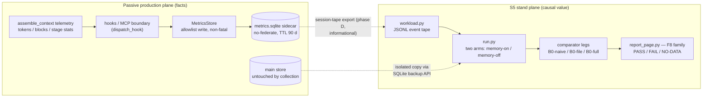

# ADR 0026: Memory-Value Observability — Measurement Methodology and Architecture

**Status:** Accepted with conditions (Architectural Committee, 2026-09-09) —
pending owner green-light for phases A+B and the default-on question;
addendum accepted the same day
**Deciders:** Tech Lead (chair), Product Architect, Analytics Lead,
Senior Security Engineer, Senior System Engineer
**Scope:** the measurement methodology and architecture for proving memory
value in-the-loop: passive per-request telemetry collection (the
`metrics.sqlite` sidecar), token-economy metrics, the injection-relevance
signal ladder, context-dynamism metrics, the `F8` metric family in the
ADR-0020 registry, the `S5` "memory-value" replay stand, the
invariant / corridor / verdict status taxonomy, and pre-registration
discipline
**Preconditions:** ADR-0020 (metric registry, stands, baselines, gate
policy), ADR-0021 (fail-loud spirit), ADR-0025 (E0 pre-registration canon,
McNemar pairing, MDE discipline)

## Context

The owner directed (2026-09-09, mnemos `0fd16319`): on paper everything
reads beautifully, but there is no felt evidence that context is REALLY
assembled dynamically. How many tokens do we actually save? Is the right
instruction, skill, or memory chunk injected for this request? The
directive demands a verification methodology and an HONEST confirmation —
or an honest report that something does not work.

The existing stands cannot answer. S1–S4 (ADR-0020) measure the server —
issuance quality, wall-clock latency, session coherence, availability —
not what memory gives the loop. Value is defined as the savings from not
re-obtaining information, minus the price of injection, minus the price of
noise; net savings must be allowed to come out negative.

The facts are already computed and then thrown away: `assemble_context`
returns `tokens {budget, estimated}`, per-block provenance, and six-stage
stats (`src/mnemos/assemble.py`) — the telemetry dies with the call
response. Zones 2 and 4 would also open the project's first
"context → persistent store" back-path, which nothing gates today
(CWE-532). The committee resolved the tension by splitting planes: facts
in production, causal value on the stand.

## Decision

Adopt the five-zone measurement methodology with a two-plane architecture:
passive per-request facts land in a quarantined sidecar, causal value
claims come only from a two-arm replay stand, a new `F8` registry family
carries the owner's answer in one place, and a status taxonomy lets value
verdicts go red without touching CI.

1. **Five zones, implemented 4 → 1 → 2 → 5 → 3.** Zone 4 (context
   dynamism) first: it is the cheapest — computable from existing
   `assemble_context` outputs — and it hits the owner's core skepticism
   head-on. Then zone 1 (token economy), zone 2 (injection relevance),
   zone 5 (the `S5` honest-report stand), and zone 3 (instruction/skill
   routing).
2. **Two measurement planes, one honesty rule.** The passive production
   plane measures facts: cost, composition, usage. The `S5` stand plane
   measures causal value. Any public "saved X tokens" claim requires an
   `S5` replay; passive-only claims are banned as instrumentalism.
3. **The `metrics.sqlite` sidecar: allowlist schema, hooks/MCP boundary,
   born isolated.** Collection happens after result assembly, at the
   `dispatch_hook` boundary and the MCP surface; the `assemble_context`
   pipeline stays clean of writes — S2 measures that verb directly, and
   an inserted write would eat its corridor headroom. The schema is
   allowlist-only, born final (no migrations), in three tables:
   `assemble_metrics` (one row per request), `injection_blocks` (one row
   per injected block), `usage_reports` (one row per harness response).
   No raw-text columns exist: the raw `query` is never persisted, `file`
   is stored as a stem, the stats dict is not persisted verbatim, and any
   future text field passes `detect_secrets` fail-closed before a write.
   Content fingerprints are keyed HMAC under a per-install random key
   that is never stored in the sidecar (no rotation — rotation would
   break longitudinal uniqueness); plain hashes of governance-class
   blocks are banned (CWE-759 dictionary recovery). Write failure is
   non-fatal (warning log, `TraceRecorder` pattern), `busy_timeout` is
   250 ms so metric contention can never freeze the hook path, and tokens
   count on post-redaction text with one estimator shared by every leg.
   Security conditions: **C1** the isolation canary — bug-report, backup,
   export, and federation paths never include the sidecar — is the first
   implementation commit; **C2** 0600 permissions and encryption parity
   with the main store land in the same PR; **C3** config-lint refuses to
   start per-request collection with a session column under
   `auth_enabled=true` without explicit acknowledgement (default-on only
   in local-first); **C4** retention TTL 90 days, nightly DELETE plus a
   quiet-window VACUUM, job failure alerts (fail-loud). The plane is born
   no-federate, is excluded from the wheel, and its records are declared
   "not audit records" — the append-only canon stays on traces.
4. **The `F8` "Memory value" family enters the ADR-0020 registry.** Basis:
   the owner directive `0fd16319` — the registry rule "new families only
   by owner directive" is codified here, not violated. One value, one
   name, one family: compression metrics stay in F3
   (`ccr-reduction-ratio`, `assemble-budget-utilization`,
   `context-growth-factor` — compression is not value), corpus
   `recall@k` / `precision@k` stay in F2, and ADR-0025 experiment metrics
   stay with the experiment. Metric-name sync `S5` ↔ E0 (ADR-0025) lands
   in the same PR that introduces `F8`.
5. **Status taxonomy: invariant / corridor / verdict.** Invariants are
   mechanical facts (`= 1.000` / `= 0`) and always block:
   `injection-traceability`, `assembly-coverage`, and
   `cross-principal-leak` extended to the metrics plane. Corridors block
   regressions against the metric's own baseline — self-comparison
   `baseline − max(0.02; CI95)` — and are born from the first measurement.
   Verdicts are value thresholds and never block: PASS / FAIL / NO-DATA,
   red is an allowed outcome, and NO-DATA renders explicitly — it is not
   zero. `net_savings > 0` is a verdict, not an invariant. A verdict is
   promoted to a merge gate only by a new owner directive with
   re-pre-registration.
6. **The `S5` "memory-value" stand: generalized s3 framework, two arms.**
   The s3 framework is generalized, not copied — the scenario heart is
   new, the bones (single-command runner, `--record`, BLAKE2b-lexical
   determinism, baseline layout) are reused. `workload.py` consumes a
   JSONL event tape; `run.py` drives memory-on / memory-off arms on an
   isolated store copy (SQLite backup API, S4 precedent), audit-marked
   `actor=benchmark`; wall-clock quantities never enter metrics.
   Comparator legs: `B0-naive` (fixed system prompt plus the full
   transcript — the headline), `B0-file` (a static curated file of equal
   average token budget — the direct killer of the "it only reads
   nicely" suspicion), `B0-full` (whole history — reference only, it
   inflates savings). The headline "saved X" is valid only when
   `task_success(M) ≥ task_success(B0-naive)`. The scripted leg runs
   ~100 tasks across strata (knowledge-heavy, governance-heavy) plus ~20
   negative-control tasks; the replay leg runs ≥ 30 real sessions (50 is
   the target); `S5` v1 is synthetic-only. Baselines live in
   `benchmarks/baselines/s5.json` on the standard s1/s3/s4 layout;
   `report_page.py` gains an additive `s5` row and the `F8` traffic
   light; existing baselines are not recomputed. The pre-registered
   falsifier: PASS ⇔ the lower bound of the bootstrap CI95 of
   `net-token-savings` is strictly above 0 — the burden of proof is on
   memory; the generator aborts (exit 1) on breach instead of editing.
7. **The relevance signal ladder, gated by calibration.** Signals ascend:
   retrieval score → shingle-touched (blocks ≥ 40 tokens) → blind LLM
   judge. Cheap proxies enter corridors only after calibration:
   shingle-touched against a ~50-step ablation (the golden standard)
   with Cohen's κ ≥ 0.6; the judge runs blind on a ~100-injection
   subsample with double annotation and κ reported. The degradation
   alert catches the owner's fear verbatim: `explicit_hint_share` high
   while dynamism ≈ 0 → RED — recall ignores the request.
8. **Pre-registration before the first run.**
   `docs/experiments/s5-memory-value.md` is committed before the first
   `S5` run, on the E0 canon of ADR-0025: hypotheses per zone, the
   primary zone metric, MDE, comparators, thresholds (calibration
   κ ≥ 0.6, the equal-success tolerance, the zero-uniqueness falsifier
   level), the workload fingerprint, the analysis plan, single-look. All
   comparator legs are reported symmetrically — no leg is removed post
   hoc. Every threshold in the owner's report traces to a pre-registration
   or to a corridor born from a measurement. The `docs/experiments/`
   directory is created by this track and reused by E0.
9. **Phasing and the usage loop.** Phases A–E run with per-phase gates
   (table below). The `post_llm_call` hook action is spec-first: the
   committee contract annex (mnemos `9a3cd4a2`, §3.5) is its
   specification — allowlist fields `block_ids_touched`, `tokens_out`,
   `wrong_tool_flag` — and implementation lands in phase C, after A and
   B: the stand drives both arms itself and counts touched blocks by
   formal `[mnemos:<id>]` matching, so no hook extension is needed
   earlier, and `hooks.py` is not extended "in passing". Dynamism layers
   are split by name: the server-side `context_dynamism_ratio` is primary,
   deterministic, and corridor-gated; the harness-side
   `prompt_static_share` is client-computed, informational, and never
   gates mnemos regressions — attribution of a drop between harness and
   mnemos is impossible.

### Architecture: two planes and a sidecar

### The `F8` metric roster (v1)

| Metric | Definition | Status | Plane |
|---|---|---|---|
| `injection-traceability` | share of injections with a recorded row = 1.000 | invariant (blocks) | both |
| `assembly-coverage` | share of `pre_llm_call` hints with a recorded assembly = 1.000 | invariant (blocks) | both |
| `cross-principal-leak` (extended to metrics) | = 0 | invariant (blocks) | production |
| `context_dynamism_ratio` | `1 − static_share`; a static block := a fingerprint present in ≥ 80% of a session's assemblies | corridor | server |
| `dynamic_uniqueness` | `mean(1 − Jaccard(HMAC-shingles))` over request pairs within a session (pairs sampled in long sessions) | corridor | server |
| `explicit_hint_share` | share of assemblies with `query_source=explicit`; precondition metric — at 0, dynamism is impossible in principle | corridor | server |
| `net-token-savings` | `gross_savings − write_cost`; `gross = prompt_tokens(B0-naive) − prompt_tokens(M)`; write cost summed over the write path from traces | verdict (PASS ⇔ bootstrap CI95 lower bound > 0) | `S5` |
| `value_ratio` | `net_savings / prompt_tokens(B0-naive)` | verdict | `S5` |
| `tokens_per_success` | arm tokens per successful task (leg comparison when success rates differ) | verdict | `S5` |
| `relevance_judge_rate` | blind judge on a ~100-injection subsample, double-annotated, κ reported | verdict | `S5` |
| `replay-fp-rate` | 1 − relevance (an irrelevant injection is a false positive) | verdict | `S5` |
| `touched_rate` | share of ≥ 40-token blocks with a shingle-touched signal | corridor (post-calibration, κ ≥ 0.6) | both |
| `prompt_static_share` | static share of the full prompt, computed by the harness client-side | informational — never gates | harness |

Compression stays in F3 (`ccr-reduction-ratio`,
`assemble-budget-utilization`, `context-growth-factor`); corpus
`recall@k` / `precision@k` stay in F2 (golden corpus, not live sessions);
ADR-0025 experiment metrics live with the experiment under their own
names. Reports show the per-session median with a bootstrap CI95 and
p25/p75, by strata, not only pooled.

### Phases and gates

| Phase | Content | P / size | Phase gate |
|---|---|---|---|
| A. Passive collection | `src/mnemos/metrics/sink.py` + `MetricsStore`; sink calls at the hooks/MCP boundary; zone-1 counters | P1, S | the C1 isolation canary is green before any metric lands |
| B. Dynamism + `S5` v1 + `F8` + retention | `context_dynamism_ratio` / `dynamic_uniqueness` / `explicit_hint_share` on server outputs; the `S5` framework, synthetic workload, comparator legs; `F8` in `report_page.py`; TTL 90 d | P1, M | the first `S5` run with `--record` writes `baselines/s5.json`; the pre-registration is committed before the run |
| C. Usage loop | the `post_llm_call` action per the committee contract annex (mnemos `9a3cd4a2`, §3.5); `touched_rate` into corridors | P2, S | the touched proxy is calibrated (κ ≥ 0.6) against the ablation |
| D. Real-session replay | session-tape export from `metrics.sqlite` → `S5` informational (no gates) | P3, S→M | owner opt-in capture policy; fail-closed sanitization at the capture boundary |
| E. Wrong-tool A/B (zone 3) | ~100 paired tasks plus negative control, McNemar, MDE +10 pp | P3, M | on the ready ADR-0025 E3 protocol — no duplication |

## Consequences

**What becomes true:**

- The owner gets an honest PASS / FAIL / NO-DATA answer to all three
  directive questions — dynamism, per-request relevance, token savings —
  instead of prose; a red verdict is a reportable result, and NO-DATA is
  never silently rendered as zero.
- `mnemos-eyes` gets its "saved tokens this week" showcase number with a
  causal basis, and a claims-ledger becomes possible: every public claim
  about mnemos can link to the metric that proves it.
- The `assemble_context` pipeline stays clean of instrumentation — S2
  corridors keep their headroom — and the main store is untouched: zero
  migration risk, S4 backup semantics intact, retention is a file
  operation.
- Vanity metrics (store volumes, raw counts) stay out of the owner's
  report; net economics are allowed to be negative and are reported as a
  verdict.

**Costs and accepted residuals:**

- Shingle-touched measures echo, not causation — it enters corridors only
  after calibration (Cohen's κ ≥ 0.6) against the ~50-step ablation; the
  judge is the second echelon.
- The blind judge has its own reliability — mitigated by double
  annotation of a subsample with κ in the report, never assumed.
- Telemetry may lose rows under contention (`busy_timeout` 250 ms,
  non-fatal write failure) — acceptable because `S5` gates count on the
  stand, not on the live stream.
- INSERT latency (~0.1–1 ms WAL) and volume (~0.5–1 MB/day at 1000
  requests) are estimates, not measurements; the first phase-A run
  delivers the fact. Retention is born with the plane regardless.
- The verdict non-blocking trade is deliberate: protection from Goodhart
  comparator-fitting is paid with CI softness — a red verdict is an
  operational trigger (generator exit 1, ticket), not a merge gate.
- Economics depend on the workload mix — mitigated by strata reporting,
  not only pooled medians.

## Alternatives considered

| Alternative | Why rejected |
|---|---|
| Recording metrics inside the `assemble_context` pipeline | S2 measures the `mgr.assemble_context` verb directly; an inserted write eats the corridor headroom and buys nothing. |
| Metrics tables in the main store (or `ALTER TABLE`) | Breaks S4 backup semantics — the backup API would drag metrics into the isolated copy; VACUUM and retention would run on the hot store; telemetry would mix with audit data. |
| Aggregates-only production plane (Security's RL3 as originally filed) | Pairwise shingle-Jaccard uniqueness is unrecoverable from per-day aggregates; withdrawn in favor of per-request rows under C1–C4. |
| In-memory rolling fingerprints instead of SQLite | A restart loses the window; it duplicates what SQLite already does natively. |
| Spreading value metrics across F2/F3/F5 | The owner would reassemble the answer from three lines — the report fails as a dashboard. |
| Blocking merge-gate on value (`net_savings > 0`) | Goodhart pressure to tune the comparator; a transition-period red would block unrelated PRs. |
| `B0-full` as the headline | Inflates savings; demoted to a reference-only row. |
| Harness-side "prompt minus block" baseline | The harness cannot know what it would have substituted for the block; any assumption is fiction. |
| Gini as the dynamism measure | Distribution inequality is not the question; shingles + Jaccard answer it exactly. |
| Copy-paste of the s3 framework into `S5` | Generalize, don't copy: the heart (scenario) is new, the bones (runner, determinism, baseline layout) are reused. |
| In-place extension of S1/S3 with value metrics | Their baselines and invariants must stay stable. |
| A new `hint_source` field name | The existing `query_source` enum (explicit / derived) is reused. |
| Plain (unkeyed) BLAKE2b hashes for governance blocks | The candidate space is small and partly public; a dictionary attack recovers content (CWE-759) — keyed HMAC only. |

## Addendum: Full Server Coverage (2026-09-09, owner directive)

The owner extended the directive the same day: the methodology must cover
the ENTIRE functionality of the Mnemos memory server — 26 MCP tools,
~50 REST routes (including auth, sessions, federation), 85
`MemoryManager` methods, the background subsystems (processor loop,
CCR-cleanup, heal, reclaim, scanner, federation pull server/client,
watchers, the workflow machine, auto-collect), and the CLI with doctor.
The committee accepted the addendum with conditions; nothing in the
parent decision (above) is revisited, and phases B–E do not change.

1. **Two contours: mandatory health, promised value.** Every server
   function ships with a health contour — invoked / success /
   latency / errors ("no function ships without its contour"). The
   value contour applies only to functions that make a product
   promise. Value metrics land in their existing owner families:
   CCR and `context_rewrite` redemption → F3, auto-collect adoption
   and checkpoint-return → F5, refine quality (McNemar,
   `refine-retention-gain ≥ 0`) → F2, federation value (when a claim
   exists) → F8, `auth-bypass-probe` → F6. No F10. Family boundary
   rule, codified: a family is a theme or one falsifiable owner
   question — never a tier; F8's birth is the precedent.
2. **Exactly one new family: `F9` "Subsystem health" — health-only
   forever, it never accepts value.** It renders as sub-traffic lights,
   one row per subsystem (a single red light is not actionable):
   federation (pull success, ACL denied, bytes synced), workflow
   (transitions, locks, blocked age), heal/reclaim, DLQ retry, ingest
   (success, SSRF-rejected), 401/429, the MCP/REST traffic split,
   scanner per-detector, watchers, background jobs, and the
   `health.check` history.
3. **Phase A2 (P1, M): the universal verb ledger.** `verb_metrics` +
   `verb_metrics_hourly` join the sidecar born-final — all 5 tables in
   one PR, no migrations, and the verb tables never receive
   session or principal columns. The record signature is
   `record(surface, verb, status, latency_ms, project, agent,
   meta_json)`; `surface` (mcp|rest|background|cli) distinguishes a
   REST call of a verb from its MCP twin. Ten collection points sit at
   surface boundaries — `call_tool`, a `MetricsMiddleware` next to
   `AuthMiddleware` (route template, not raw path), the processor
   loop, CCR-cleanup, heal/reclaim, the scanner loop, federation
   `handle_pull` / `pull_from_peer`, watchers, the CLI after-callback —
   the pipeline is untouched and the S2 stand bypasses the wrappers.
   `assemble_metrics` stays a specialized domain table linked by
   `verb_row_id` (not a view — it carries tokens, stage stats, and
   HMAC fingerprints a view would destroy). Prometheus goes hybrid:
   counters plus p50/p95 histograms fed from the rollup (they survive
   restart); `avg_latency` is removed — a mean hides the tails. Raw
   rows TTL 30 days, rollup ~400 days (~50 MB/year). Phase-A2 gates:
   the C1 canary extended to the new tables, measured INSERT p95 in
   the hooks path < 2 ms, a measured volume fact, and **C5** —
   `meta_json` is a fail-closed allowlist (an unknown key refuses the
   write with a warning; no exception texts, no stack traces, no
   caller input; `error_type` is a class name, `status_code` an int).
4. **Security: a P0 finding and red lines RL-S1–S7.** RL-S1 is the
   P0 blocker of the addendum's first PR and a separate ticket:
   `_METRICS_BYPASS` (`middleware.py:69,82`) — the `/metrics` and
   `/api/v1/metrics` endpoints bypass auth unconditionally, even with
   `auth_enabled=true` on non-loopback, and already export
   `by_project` / `by_agent`; fix: auth on non-loopback or a split
   public-safe/operator-only exposition. RL-S2: zero
   endpoint/project/detector labels on security metrics in the public
   exposition. RL-S3: no principal, peer-id, IP, concrete path, or
   per-request security rows anywhere in the metrics plane —
   forensics stays in `FederationAccessLog`. RL-S4: invariants are
   computed from gates, canaries, and tests, never from non-fatal
   telemetry — "zero rows" is not "zero leaks". RL-S5: same sidecar,
   the C1 canary enumerates the new tables, TTL without exceptions.
   RL-S6: fail-loud alerts fire only on invariants and monitor
   blindness (telemetry-write-failure-rate, retention-job failure);
   attacker-driven counters (401/429/SSRF/ACL) become corridors with
   deduplicated tickets — never per-event alerts, or the attacker
   floods the operator (OWASP A09 both ways). RL-S7: only rates with
   per-day denominators go outside.
5. **New invariants and differentiated anti-HARKing.** New mechanical
   invariants, computed from gates and probes:
   `ccr-marker-accounting = 1.000` (issued = redeemed + expired +
   evicted + active), `workflow-transition-validated = 1.000`,
   `auth-bypass-probe = 1.000` (a tokenless request with
   `auth_enabled=true` always gets 401; the probe runs on S4
   mechanics), `federation-acl-probe = 1.000` (out-of-scope control
   probes get denied), `ingest-ssrf-bypass = 0` (per-hop probes);
   `cross-principal-leak = 0` is extended to federation and the
   metrics plane. Anti-HARKing splits by contour: a health threshold
   is fixed after a two-week baseline, never before the data; a value
   threshold gets the full E0 pre-registration of ADR-0025.
6. **Waves 1–3, free counters first.** Wave 1: silent failures and
   free counters — heal/reclaim and refine-outcome are already counted
   in code (exposition is nearly free), plus CCR accounting,
   federation, and workflow. Wave 2: auto-collect, ingest, 401/429,
   DLQ retry, the MCP/REST split — after phase C. Wave 3: the blind
   quarantine-FP sampling (n=30/week, FP ≤ 0.05 pre-registered before
   the first sample — CI95 ±7.8 pp at 5% on n=30 is why it is a
   verdict, not a gate), refine McNemar (waiting for the 192-query
   corpus), and federation value (owner directive).
7. **Claims-ledger: `docs/claims.md`.** One table per public promise —
   promise → owner family → metric → status (`measured-value` /
   `measured-health` / `UNMEASURED`). Flagship rows: CCR "originals
   preserved" → F3 redemption; KV-cache → `UNMEASURED` (needs a
   client signal, a candidate for the `post_llm_call` annex).
   Orphan rule: a metric without a dashboard, an alert, or a
   claims link is deleted at the quarterly review. Health counters
   never enter the value report.
8. **Doctor splits (P3).** Dynamic checks (`_check_sqlite`,
   `_check_vector_store`, `_check_vault`, `_check_pending_refine`,
   `_check_tag_contract`) run hourly from the processor loop and land
   as `health.check` rows; a failed check is a FAIL row (never
   silent), and a missing expected hourly row raises an alert —
   missingness is not health. Static checks stay CLI-only:
   periodic polling of them would be noise.

### Addendum: alternatives rejected

| Alternative | Why rejected |
|---|---|
| Per-subsystem metric tables (10+ schemas) | A UNION hell on cross-subsystem questions and a birth of migrations; the "universal ledger + domain tables" pattern already exists (`TraceRecorder`). |
| A recording wrapper on the 85 manager methods | Double counting (`call_tool` + `mgr.add`) and a write inside the pipeline — the exact thing the parent decision banned. |
| Exporter-only health storage | Restart instability loses history and p95 tails; it repeats the "facts are computed and thrown away" mistake the parent decision exists to fix. |
| F10 "subsystem value" (tier-based families) | Splits the CCR promise "compressed — redeemed" between F3 and F10; a tier is a folder, not a family. |
| Two subsystem families (Federation + Mechanical) | The same owner question "does the subsystem work" would live in two families. |
| Cosine before/after for refine quality | Both readings are false: high = "did nothing", low = "broke it" — McNemar plus retention-gain instead. |
| Per-event alerts on attacker-driven counters (401/429/SSRF) | An attacker floods the operator's alert queue — corridors with deduplicated tickets instead. |
| Per-principal metrics with HMAC | The peer population is small and enumerable; the protection is illusory, and forensics already lives in the access log. |
| Prometheus from raw verb rows | The scrape would scan megabytes daily; the exporter reads only the rollup. |
| Turning all of doctor into metrics | Static checks polled periodically are noise; only the dynamic half moves to `health.check`. |

### Addendum: updated phasing

| Phase | Content | P / size | Phase gate |
|---|---|---|---|
| A | metrics sink + passive collection (parent decision) | P1, S | the C1 canary is green |
| **A2** | verb ledger + rollup + 10 boundary points + Prometheus hybrid + C5 + the RL-S1 fix | P1, M | canary on the new tables; INSERT p95 < 2 ms in the hooks path; a volume fact; C5 live |
| B | dynamism + `S5` v1 + `F8` + retention (parent decision) | P1, M | pre-registration committed before the run |
| C | `post_llm_call` usage loop | P2, S | touched proxy calibrated (κ ≥ 0.6) |
| D | real-session replay | P3, S→M | owner opt-in + fail-closed sanitization |
| E | wrong-tool A/B (zone 3) | P3, M | on the ADR-0025 E3 protocol |
| `F9` waves 1–3 | silent-failure and subsystem corridors | P2–P3 | corridors from measurements (two-week baselines) |
| doctor-P3 | dynamic checks → `health.check` rows | P3 | the Analytics guards: FAIL rows, missing-row alerts |

Phase A2 does not block B — one foundation (`sink.py`), two tracks.

## Open questions

1. **Owner (blocks phase A):** default-on of passive collection in
   local-first vs a default-off canary posture. The committee recommends
   default-on: directive `0fd16319` is an explicit observability request,
   and a local attacker holding `metrics.sqlite` already holds the main
   store with full content.
2. **Owner (blocks the phase start):** green-light for phases A+B.
3. **Owner (blocks phase A2):** green-light for the addendum —
   phase A2 and the `F9` family — under the same directive that
   extended coverage to the full server.
4. **Joint specification (phase C):** a small zcode client-contract RFC
   for `prompt_static_share` and touched reports, after phases A–B.
5. **Registry sync:** metric names `S5` ↔ E0 (ADR-0025) land in the same
   PR that introduces `F8`; the `docs/experiments/` template created by
   this track is reused by E0.

## References

- mnemos decision id `7ec9dda3`
  (archcom-2026-09-09-memory-value-observability-methodology) — the
  committee record this ADR distills.
- mnemos contract id `9a3cd4a2`
  (archcom-contract-2026-09-09-memory-value-observability) — the
  implementation contract: schema, gates, phases; its §3.5 annex is the
  `post_llm_call` specification.
- mnemos `0fd16319` — the owner directive that convened the committee;
  as an agenda record it is superseded by the decision above.
- mnemos `4f355ed3` — Round-4 review verdicts.
- mnemos `061398fe` — the addendum decision (full server coverage,
  2026-09-09): the two-contour frame, phase A2, the `F9` family,
  RL-S1–S7, and the claims-ledger; child of `7ec9dda3`.
- ADR-0020 — benchmark framework: the metric registry `F8` extends
  additively, stands S1–S4, the standard baseline layout, gate policy.
- ADR-0021 — the fail-loud spirit: report states, breach aborts.
- ADR-0025 — memory meta-level lanes: the E0 pre-registration canon,
  McNemar pairing, MDE discipline; phase E builds on its E3 protocol and
  reuses its experiments directory.
- Architectural Committee session of 2026-09-09 — protocol and contract,
  archived with the committee records, team-local, not part of this
  repository; identified by the mnemos ids above.
