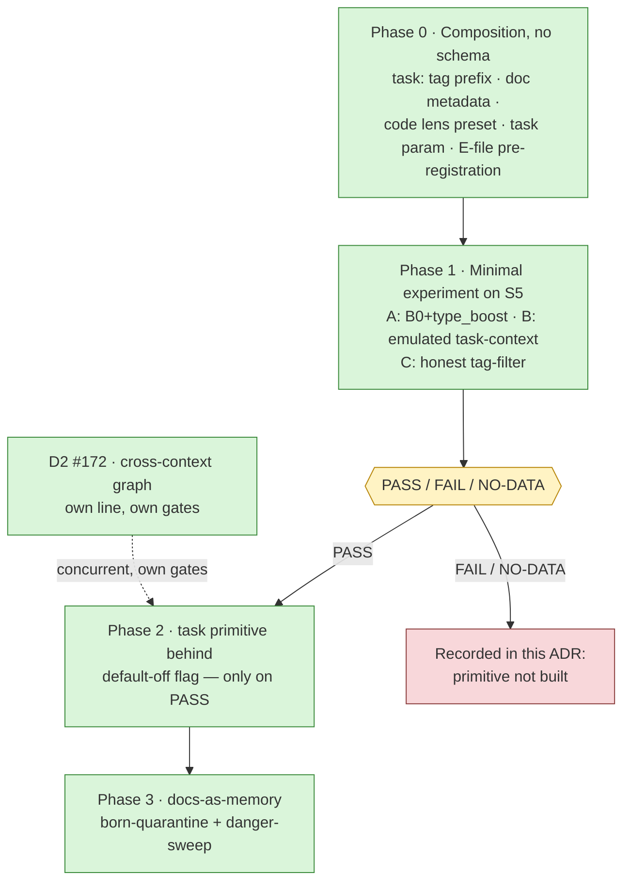

# ADR 0027: Multi-Context Memory — Compose Existing Context Levels, Gate New Primitives on a Pre-Registered Experiment

**Status:** Accepted (Architectural Committee, 2026-09-14)
**Deciders:** Tech Lead (chair), Product Architect, Analytics Lead,
Senior Security Engineer, Senior System Engineer
**Scope:** context-level composition semantics (project × agent × session ×
task), the task-context primitive candidate, document-context grouping
(docs-as-memory), code-defined lens presets, and the pre-registered experiment
gate that admits or refuses the task primitive. The cross-context graph is
explicitly out of scope (stays in the D2 line, #172).
**Preconditions:** ADR-0025 (E0 pre-registration canon, E3 falsification
verdict, the `LanesConfig` default-off precedent), ADR-0026 (the `S5` replay
stand, the PASS / FAIL / NO-DATA verdict taxonomy, the value-claim rule)

## Context

The owner's hypothesis (2026-09-14), triggered by a competitor's marketing
phrase about turning documentation into a "multi context memory system": the
value of multi-contextuality might be the composition of existing context
levels plus a few missing primitives — task context (JTBD), document
context, a cross-context graph, lenses. The facts, verified against code and
a competitive scan of ten projects (2026-09-14), cut both ways:

- **~80% of "multi-context memory" on the market is marketing.** The real
  substrate is named collections/namespaces, memory typologies, and
  entity-scoping. Genuinely empty zones: task-scoping as a first-class
  primitive, hierarchical scope intersection (project × agent × session),
  docs-as-memory that preserves structure, awareness/CCR. Lenses in the
  strict sense are shipped by nobody — there is no external reference
  standard, so metric calibration is self-built.
- **~80% of the mechanics already exist in-tree, scattered**: the
  project/agent/session scopes, awareness chronology, `supersedes` edges,
  lanes behind a flag, CCR, cache-stable prefixes. The core of the proposal
  is a repackaging with low schema cost.
- **Query-blind composition is already falsified.** The E3 lanes run
  (`e3-lanes-56c568297ad6`) showed a statically composed pinned prefix at
  0.1250 recall vs 0.7396 for B0 (−61.5 pp, McNemar p = 4.4e-16); only the
  query-conditioned `type_boost` survived (+3.1 pp). Any context composition
  must therefore be query-conditioned — this is a class-level ban, not a
  tuning preference.
- **Open P1 gaps bound the shape**: #248 (unauthorized mint→pin via
  `applyTo:"**"`) blocks any projection that pins into the top-of-context;
  ADR-0026 records the ungated "context → persistent store" back-path
  (CWE-532).

The committee accepted the direction as **accept-staged**: compose now
without schema change, gate every new primitive behind a pre-registered
experiment, and let data — not participant preferences — pick the final form.

## Decision

Adopt multi-context memory as a staged composition of existing context levels
with an experiment gate before any new primitive:

1. **Composition now, zero schema migration (Phase 0).** Formalize the scope
   hierarchy project × agent × session × task as an assembly rule:
   inheritance is **intersection, not union** — a child scope sees parent
   records only where admissibility sets already overlap, never an
   everything-below merge. Extend the tag contract with the `task:` prefix,
   add document grouping as a metadata convention, ship one code-defined
   lens preset, and accept an optional `task` parameter in
   `assemble_context` (query-conditioned tail only).
2. **Experiment precedes any primitive (Phase 1).** A pre-registered minimal
   experiment on the `S5` stand (ADR-0026) compares an emulated task-context
   against both the canonical baseline and an honest tag-filter. No
   primitive is built before its verdict.
3. **The task primitive ships behind a default-off flag only on PASS
   (Phase 2).** Its form — a `task_id` column, reinforced tag
   infrastructure, or a `tasks`+`task_members` table — is decided by the
   experiment data and measured migration pain; migrations come last.
4. **Docs-as-memory is the second wave (Phase 3), born quarantined:**
   ingested documents are untrusted content, held until a danger-sweep
   clears them (the RESTORE-gate analogue).
5. **The cross-context graph is not part of this epic.** It remains the
   existing D2 line (#172, ADR-0017) with its own gates; the committee does
   not open a parallel track.

### Phase 0 — composition without schema (first user value)

| Component | Content |
|---|---|
| Scope hierarchy | Formalize project × agent × session × task as an assembly rule; inheritance = intersection, not union (doctrine lives in this ADR) |
| Tag contract | Extend the validator with the `task:` prefix — format `^task:[a-z0-9_-]{1,64}$`, EN/RU docs updated in sync. A deliberate contract extension (committee precedent), not a "free" addition: Phase 0 adds `task:` and nothing more. Old records without the tag imply no global task |
| Doc grouping | metadata convention `{doc_id, chunk_idx, heading_path}` on existing rows (`file_path`/`source_url` are already columns); a separate `documents` table only if a measured parent→chunks query pattern appears |
| Lens preset | A code-defined preset (the shape of the existing filter profiles): a deterministic query-conditioned function corpus → projection that only narrows admissibility; an enum in code — not a table, not a tag; default = absent; never pinned into the top-of-context |
| `assemble_context` | Optional `task` argument (analogue of `file`/`agent`), feeding the query-conditioned tail; optional for backward compatibility |
| Pre-registration | The Phase-1 E-file in `docs/experiments/` on the E0 canon (anti-HARKing): arms, metrics, corridors, decision rules — before the run |

Phase-0 readiness: a user can run several tasks in one mixed corpus
(`task:` tags), assemble context with a task condition, and break none of the
invariants below; the suite and bench-s1 stay green.

### Phase 1 — the minimal experiment (gate)

- **Stand**: `S5` replay (ADR-0026); a versioned mixed corpus over the
  existing levels (project + agent + session + docs) with per-query-gold
  labeling; the corpus hash enters the manifest before the run
  (anti-cherry-picking). Runs go through the E3-runner (run-ledger; refuses
  to record without `--record`).
- **Arms**: (A) canonical baseline B0 + `type_boost`; (B) emulated
  task-context — query-conditioned grouping by the task label, zero
  production code; (C) an honest tag-filter carrying the same information
  (a strawman comparison is banned).
- **Primary metric**: per-context recall@k on the per-query-gold stratum.
  **Corridors**: cross-context recall ≥ baseline; share of foreign-context
  noise ≤ threshold; tokens-per-completed-task ≤ baseline. Exact thresholds
  and full decision rules — including the INDETERMINATE zones — are
  registered in the E-file before the data exists.
- **Reporting**: per-stratum only (anti aggregation-bias); all arms reported
  symmetrically; picking a favorable lens post hoc = HARKing.

### Phase 2 — the task primitive behind a flag (only on PASS)

Default-off flag (the `LanesConfig` precedent). The form — `task_id` column
vs reinforced tag infrastructure vs a `tasks`+`task_members` table with
lifecycle — is chosen by the Phase-1 data and measured migration pain;
migrations come last. Security conditions land in the same patch: the repeat
secret scan on cross-context assembly, and a security review of the
task ∩ project intersection. Flipping the default is a separate owner
decision.

### Phase 3 — docs-as-memory (second wave)

Starts from the Phase-0 metadata prototype; structure-preserving chunking
(`heading_path`, `chunk_idx`) once parent→chunks assembly becomes a real
pattern. Commitments: born-quarantine for ingested documents until the
danger-sweep; repeat secret scan at issuance of assemblies containing doc
chunks; a `ccr_cache` version bump on any re-fragmentation.

### Binding invariants (all phases)

| # | Invariant |
|---|---|
| 1 | Byte-stability of prefixes: any new sort input lands strictly after the id-tiebreak wave of epic #280, with integer weights; assembled text stays a per-call tail |
| 2 | Lanes stay default-off; the E3 verdict is not revisited without a new class of data |
| 3 | Awareness stays tail-only, never-pinnable, born no-federate; task/doc mechanics never touch payload presence/delta or the `awr:*` cursors |
| 4 | CCR marker atomicity; re-fragmentation/re-chunking bumps the cache version in the same transaction |
| 5 | Worst-link transitivity of no-federate/quarantine across any edges and derived assemblies |
| 6 | A lens/preset may only narrow the admissibility set, never expand it; lens definitions are code/operator config under review — never user input (a named lens is an injection vector: a tag lies about one record, a lens about the whole corpus) |
| 7 | Repeat secret scan at issuance of cross-context assemblies (combining clean records creates a new correlation-leak context) |
| 8 | Ingested documents are untrusted content: born-quarantine until danger-sweep |
| 9 | Any projection pinning into the top-of-context — only after #248 is closed |
| 10 | The tag contract is extended only by committee decision; Phase 0 = `task:` and nothing more |
| 11 | Value claims only via an `S5` PASS; passive metrics are facts, not value (ADR-0026) |

## Consequences

**What becomes true:**

- First user value ships in Phase 0 with zero schema migration: one agent,
  several concurrent tasks, one mixed corpus, clean switching between tasks
  — the harness passes the task identifier, the hierarchy is inherited, the
  agent needs no meta-knowledge about how memory is organized.
- Composition rides the proven six-stage issuance pipeline unchanged; a
  retrieval-side structure forgives a write-side mistake where a record-side
  hierarchy would make it permanent in every context.
- "Is task-context more than a tag filter?" becomes a falsifiable,
  pre-registered question with an honest negative answer allowed — arm C
  exists precisely to catch self-deception.
- The security model stays orthogonal to contexts; every new place
  multi-contextuality could move the "what to issue / what to federate"
  decision is covered by a named invariant before code.

**Costs and accepted residuals:**

- **Value is not proven until Phase 1.** Phase 0 delivers composition
  semantics and infrastructure, not demonstrated retrieval gain. An entirely
  plausible outcome is "task-context = an honest tag-filter with a different
  label" — accepted as a legitimate result: the primitive is then not built,
  the outcome is recorded in this ADR, and revision waits for a new class of
  data.
- No external reference standard exists for lenses (nobody ships them);
  calibration is self-built, and external differentiation claims wait for an
  `S5` PASS — internally the wording is "uncalibrated zone", not
  "differentiator".
- The doc-grouping metadata is a convention, not enforced schema —
  convention-drift risk until a measured pattern justifies a table.
- #248 remains open: pinned projections stay blocked, which deliberately
  constrains the shape of Phase-0 lens presets.
- Sequencing debt: new sort inputs queue behind the id-tiebreak wave of
  epic #280 — two unstable sort waves back to back are forbidden.

## Alternatives considered

| Alternative | Why rejected |
|---|---|
| A `task_id` column / `tasks`+`task_members` table now (Product's preference) | Schema before data: a migration plus an FTS rebuild without a proven query pattern; E3 showed the price of premature structure. The experiment gate decides the form instead. |
| Separate context spaces / collections | Duplicates the vector index, splits FTS, and multiplies sources of truth — competitor mechanics the market gets no value from; "partitioning destroys what we sell". Unanimously rejected in favor of projections over one corpus. |
| A `lenses` table (lenses as data) now | Versioning semantics is a compatibility burden; code presets first, user-defined saved views only after S5-proven value; a named lens is an injection vector, so definitions must stay operator config under review. |
| The cross-context graph as a separate track | Duplicates the existing D2 line (#172, ADR-0017); a kind-whitelist extension is an ADR-0018 migration; before id-tiebreak lands it stacks two unstable sort waves. |
| Memory typology (six MIRIX-style types) | A schema migration without proven value; `memory_type` plus filter profiles already covers part of the need. |
| Query-blind composition of any kind | Experimentally falsified by E3: −61.5 pp (0.1250 vs 0.7396, McNemar p = 4.4e-16; run `e3-lanes-56c568297ad6`). Banned as a class. |

## References

- ADR-0017 — memory system evolution roadmap: the D1 `assemble_context`
  pipeline this decision composes within, and the D2 graph line (#172) the
  cross-context graph defers to.
- ADR-0018 — context rewrite and LTM bridge: the `supersedes`-only edge
  whitelist any graph extension must migrate.
- ADR-0025 — memory meta-level lanes: the E3 falsification verdict this
  decision inherits, the E0 pre-registration canon, the `LanesConfig`
  default-off precedent, the surviving `type_boost`.
- ADR-0026 — memory-value observability: the `S5` replay stand Phase 1 runs
  on, the PASS / FAIL / NO-DATA taxonomy, the value-claim rule, the
  CWE-532 back-path caveat.
- Issues: #172 (D2 graph line), #248 (applyTo pin authorization — the
  blocker for pinned projections), #280 (id-tiebreak / byte-stability epic).
- Architectural Committee session of 2026-09-14 — protocol
  (`2026-09-14-multi-context-memory.md`) and contract
  (`2026-09-14-multi-context-memory-contract.md`), archived with the
  committee records, team-local, not part of this repository.
