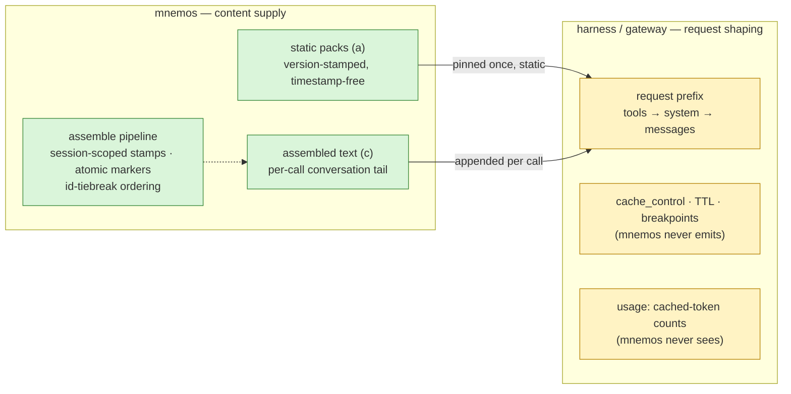

# ADR 0028: Cache Contract — Prefix-Stable Content Supply, Tail Discipline, and the Harness Boundary

**Status:** Accepted (owner directives of 2026-09-13 and 2026-09-14; Tech
Lead decisions of 2026-09-14)
**Deciders:** Owner (policy directives), Tech Lead
**Scope:** the content-side contract between mnemos-issued text and provider
KV/prompt caches: surface classification (prefix-stable / stabilizable /
inherently dynamic), what mnemos must NOT do, the behavioral guidance
shipped to harnesses, the versioned provider-economics registry principle,
and prefix-stability measurement hooks. Request shaping — breakpoints,
TTLs, `cache_control`, usage accounting — is out of scope: it belongs to
the harness/gateway.
**Preconditions:** ADR-0017 (the D1 `assemble_context` pipeline and its
provenance rows), ADR-0025 (the E3 falsification verdict, the default-off
precedent), ADR-0026 (the `metrics.sqlite` sidecar, the `S5` stand, the
value-claim rule), the Phase-0 cache-economy report (2026-09-13)

## Context

Phase-0 research for epic #280 (2026-09-13; code-verified, provider docs
fetched the same day) established the landscape this contract answers:

- **Every provider surveyed — twelve, West and China plus Ollama Cloud —
  is prefix-based with byte-exact matching** and the same key hierarchy
  (tools → system → messages). They differ only in numbers: write premiums
  1.0–2.0x, cached reads 0.02–0.5x, minimum cacheable 512–4096 tokens by
  model, TTLs from 5 minutes to best-effort. Under implicit caching
  (w = 1.0) a wasted write costs nothing — only the hit rate matters.
- **The measured cache poisoners are volatility placed early**: timestamps
  in first blocks, mid-prefix mutation, tool-schema drift,
  non-deterministic retrieval ordering.
- **mnemos's own largest poisoner was `retrieved=<iso>`** — minted per
  assembly, first line of every provenance-wrapped block, after the align
  stage deliberately runs. A second defect: the aligner's bare-token
  pattern gutted CCR marker lines in `log/terminal/web/default` profiles.
- **The audit found no standing-prefix injection channel in the repo** —
  packs are static version-stamped text; the Pi bridge injects the static
  pack, never assembled content. Harness-side behavior is unverifiable
  from the repo, hence guidance rather than code.

Three owner decisions frame the contract: quality is never traded for
stability (2026-09-13); tokens are the only model interface — no binary
request formats; provider economics is a versioned data registry, not
hardcoded constants (2026-09-14).

### Phase-0 open questions — resolution status

| OQ | Question | Status |
|---|---|---|
| OQ1 | Fate of per-block `retrieved=<iso>` | **Resolved** — issue #282 (PR #305): session-scoped `retrieved=`, first-assembly stamp per session id, byte-stable across the session's assemblies |
| OQ2 | Any repo integration placing assembled text into a standing prefix | **Resolved (audit)** — none exists; harness side stays a guidance matter |
| OQ3 | CCR-hash/CacheAligner collision (was static-analysis only) | **Resolved** — issue #282 (PR #305): CCR markers are atomic, extraction-protected spans in every profile, runtime-tested |
| OQ4 | Lanes as the default for cache-stable ordering | **Closed by experiment** — E3 (ADR-0025) FALSIFIED the lanes hypothesis; the engine stays default-off; stability comes from id-tiebreak, not lanes |
| OQ5 | Model-mix sensitivity (512-token minimums etc.) | **Open (guidance)** — guidance stays provider-agnostic; no numeric promises |
| OQ6 | Anthropic "84% median / 94% top decile" figure | **Not verifiable** (source page 404 at fetch) — not cited as fact |

## Decision

mnemos adopts a cache contract in six clauses.

1. **Policy bar — quality first.** Never sacrifice meaning freshness or
   completeness for prefix stability (owner directive, 2026-09-13).
   Cache-friendliness may break ties between equally fresh and complete
   assemblies; it may never drop, stale, or truncate content to keep bytes
   stable. Assembled mnemos text is **per-call conversation content (the
   tail) — never a standing prefix** and never system-prompt content (the
   owner two-track policy: static packs are the only prefix material
   mnemos offers). No new standing-prefix injection channels may be added.

2. **Content contract — every surface is classified.** Three classes:
   **(a)** prefix-stable by nature, **(b)** could be stabilized,
   **(c)** inherently dynamic — must ride the tail. Current
   classification (Phase-0 inventory, updated for this wave):

   | Surface | Class | Contract |
   |---|---|---|
   | CacheAligner `align()` + stage-5 order (align before wrap) | (a) | deterministic; wrapping first would let the aligner strip provenance fields |
   | Provenance row-static segments (`mnemos:id`, `project`, `status`, `origin`, `pipeline`, `v`) | (a) | `origin` documented row-static; `v` moves only on served-projection swaps |
   | `retrieved=<iso>` | (a) since #282/#305 | session-scoped stamp — stable within a session, distinct across sessions |
   | CCR markers `[compressed: <hash> \| …]` | (a) | atomic protected spans in every profile; content-addressed, idempotent |
   | Final RRF ordering | (a) | `(score desc, id asc)` tiebreak — the single ranking surface; downstream stages run stable sorts only |
   | Static packs (instructions / skills / agents_md) | (a) | verbatim copies, version-stamped, timestamp-free |
   | `mnemos_search` / `mnemos_agent_recall` outputs | (a)/(c) mixed | ids, titles, content row-stable; per-call `score`/`search_type` ride the tail |
   | `mnemos_assemble_context` text output | (c) | per-call conversation tail, by contract |
   | Checkpoint reminder suffix (call count, elapsed) | (c) | tail position; breaks byte-diff replay of tool outputs — accepted residual |
   | (b) examples: budget membership churn; `pre_llm_call` composition | (b) | churn is acceptable for tail content; the hook already asserts awareness-tail discipline |

   Rule: **a new mnemos surface ships with its (a)/(b)/(c) classification
   in the same change**; (c) content is placed after stable content and is
   never advertised as prefix material.

3. **NOT-do list (scope discipline).** mnemos does not: emit
   `cache_control`, choose TTLs, or manage breakpoints — request shaping is
   the harness/gateway's job, mnemos is content supply; rewrite
   harness-owned prompts except via explicit `mnemos_align_prefix` calls;
   make provider usage or cost-accounting claims — a memory server never
   sees usage, cached-token counts are the harness's metric; assume
   provider cache semantics in code or guidance — minimums vary 512–4096
   by model, TTLs run 5 min–1 h, write premiums appeared where there were
   none (GPT-5.6+), so guidance is provider-agnostic or clearly dated; add
   new standing-prefix injection channels.

4. **Behavioral guidance — the five pack rules** (shipped in the always-on
   pack and the context-lifecycle skill): assemble once per session or on
   material memory change; assembled text is tail, never a standing
   prefix; keep the MCP tool set and schemas stable within a session —
   tool changes invalidate the provider cache for the whole session;
   append-over-rewrite on compaction; align system prompts once at build
   time (`mnemos_align_prefix`), dynamic values live in the tail. Pack
   text stays static — no timestamps.

5. **Provider economics is a versioned data registry.** Not hardcoded
   constants, not frozen ADR tables: a registry maintained as data with
   dates — versioned schema, `watch_items` for numbers expected to drift,
   and a `superseded` chain (owner decision, 2026-09-14). This ADR fixes
   the principle; the registry's contents live outside it, so guidance
   derived from the registry is re-dated without a new ADR.

6. **Measurement hooks — pointers, not implementation.** mnemos measures
   the byte-stability of its own output, not provider cache hits:
   `lcp_with_prev_same_session` (the deterministic H2 proxy named in
   ADR-0025 E0), `first_diff_offset`, block-set churn (membership
   symmetric difference across consecutive assemblies), and the align
   stats (`blocks_aligned`, `moved_chars` — already computed, currently
   discarded with the response). Target venue: the ADR-0026
   `metrics.sqlite` sidecar, zone 1, milestone M1 of epic #280 Phase 2.
   Savings numbers remain banned without an `S5` verdict (the ADR-0026
   value-claim rule).

## Consequences

**What becomes true:**

- The block sequence is byte-comparable across a session's re-assemblies:
  session stamp, id-tiebreak, atomic markers, and the deterministic
  aligner compose into stability wherever a harness pins static packs or
  replays a session.
- The responsibility boundary is documented once: mnemos owns content
  byte-stability and guidance; the harness owns request shaping and cache
  metrics.
- Provider drift stops being doc rot: the dated registry with its
  `superseded` chain lets guidance track economics changes without code
  changes or ADR rewrites.
- Prefix-stability regressions become visible facts through the sidecar
  hooks; value claims stay gated behind `S5`.

**Costs and accepted residuals:**

- The contract constrains future features: every new surface must be
  classified (a)/(b)/(c) before merge, and the preference for stable
  content will bias designs toward static material — accepted while the
  quality bar (clause 1) holds the line.
- No cost accounting means mnemos cannot promise "saves X%" on its own —
  economic numbers require harness usage data or an `S5` run.
- Session-scoped `retrieved=` trades per-call audit precision for
  byte-stability; the stamp registry is in-memory, capped at 10 000
  sessions (FIFO), and a restart re-stamps every session on its next
  assembly — a mid-session prefix change, accepted.
- Harness-side behavior remains unverifiable from the repo; the contract
  binds mnemos output and guidance, not harness requests.
- The registry needs curation (`watch_items`) or guidance silently rots —
  the `superseded` chain makes rot visible, not impossible.

## Alternatives considered

| Alternative | Why rejected |
|---|---|
| Binary/compact wire formats for assembled blocks (shorter, hash-stable prefixes) | Owner policy: no binary request formats — tokens are the only model interface. |
| `cache_control` emission by mnemos | Request shaping is the harness/gateway scope; mnemos never builds or sees the request envelope. |
| Lanes as the default ordering for cache stability | E3 (ADR-0025) falsified the lanes hypothesis (−61.5 pp recall); default-off stands; stability is delivered by the id-tiebreak without lanes. |
| Per-block per-call `retrieved=<iso>` (status quo) | Poisoned every block from byte ~30 onward; superseded by the session-scoped stamp (#282 / PR #305). |
| A "cache-optimized" standing-prefix channel for assembled text | Violates the tail policy (clause 1); pinned static composition is also the query-blind class falsified by E3 and banned by ADR-0027. |
| Provider economics hardcoded in code or ADR tables | Numbers drift by provider, model, and month; registry-as-data instead (owner decision, 2026-09-14). |

## References

- Phase-0 cache-economy research report (2026-09-13) — internal research
  artifact, team-local, not part of this repository; source of the surface
  inventory, the provider-economics landscape, and OQ1–OQ6.
- ADR-0017 — the D1 `assemble_context` pipeline and provenance rows this
  contract classifies.
- ADR-0025 — the E3 falsification verdict (OQ4), the E0
  `lcp_with_prev_same_session` proxy, the default-off precedent.
- ADR-0026 — the `metrics.sqlite` sidecar (zone 1) hosting the stability
  hooks, the `S5` stand, the value-claim rule.
- Issues: #280 (cache-aware context economy epic), #282 (byte-stable
  assembled blocks — session-scoped `retrieved=` and atomic CCR markers;
  merged as PR #305).
- Wave commits on `feat/cache-contract-phase1`: `f5bfbc4` (deterministic
  id tiebreak in the final RRF ordering), `dbf2c24` (cache-discipline
  section in the always-on pack and the context-lifecycle skill),
  `989b0b6` (seeded harness ids restoring cross-run byte-identity — the
  Tech Lead decision of 2026-09-14 the Status line cites).
- Owner directives: 2026-09-13 (quality-first hard policy), 2026-09-14
  (provider-economics registry as versioned data); owner two-track policy
  (static packs as the only prefix material; no binary request formats);
  Tech Lead decisions of 2026-09-14.
