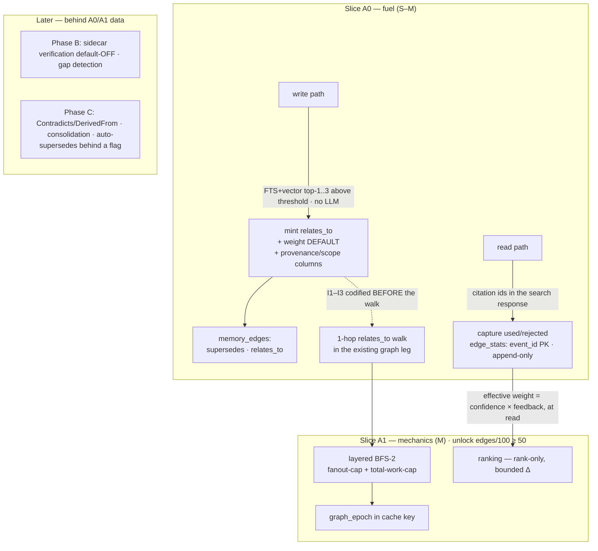

# ADR 0030: Memory Graph — the Self-Fueling Graph (Search Graph Line Continuation)

**Status:** Accepted (ArchCom 2026-09-15, accept-staged — A0 rides the next
major line; A1 waits behind a density gate revisitable at A0-review; phases
B/C deferred, C blocked on a separate threat-model session. Decision mnemos
id `d11debf8-f181-4b6c-ae71-c7aa0bf2f97c`; contract mnemos id
`1d4bf66e-3002-492e-9a3e-9987dca41c61`)
**Deciders:** Tech Lead (chair), Product Architect, Senior System Engineer,
Senior Security Engineer — all four entered conditional positions; the
conditions converged in the challenge phase
**Scope:** the `memory_edges` schema and its consumers — the search graph
leg (ADR-0029 §6), deterministic edge minting on the write path,
used/rejected feedback capture (`edge_stats`), and federation export of
edges. Phases B (sidecar verification) and C (Contradicts/DerivedFrom,
write-time consolidation, auto-supersedes) are named here only to be
deferred; the release ordering of 4.3.0/4.4.0 is the owner/GWS decision.
**Preconditions:** ADR-0018 (`memory_edges` Phase 1, supersedes-only),
ADR-0019 (§4 refined-only, §5 absolute quarantine — must hold on every new
path), ADR-0027 (multicontext Phase 0 staged, graph excluded), ADR-0028
(id-tiebreak determinism), ADR-0029 (graph leg v1 — decay rule, gates F1/F2,
the post-guard reference baseline recall@5 0.9409), the live probe of
2026-09-15 (1662 memories / 0 edges)

## Context

The initiative is not new — it was lost. It entered the ArchCom queue on
2026-08-21 with a Tech Lead recommendation P1, backed by the jcode
mechanics research (§3a/§8.4): the only researched path to qualitatively
beat both competitors. The graph alone does not differentiate (mnemosyne
ships a temporal KG, jcode a BFS citation cascade); the differentiator is
the graph combined with server autonomy — which is precisely the
"universal pluggable autonomous memory for any harness" bar. On 2026-08-31
the committee-queue cleanup dropped it administratively: no disposition was
recorded, initiative 7f2fd914 became neither an issue nor a dev-plan line,
and only the narrow D2 tail #172 (citation cascade + CCR index, P2)
survived in the dev-plan. The owner rediscovered the loss on 2026-09-15
and demanded revision plus this committee.

Production facts (live DB, 2026-09-15) frame what the revision had to
explain:

1. **`memory_edges` carries one edge kind.** `supersedes` only
   (ADR-0018 Phase 1 groundwork); no weights, no provenance, no scope.
2. **The graph leg v1 is live.** PR #315 (ADR-0029 §6): 1-hop expansion
   in both directions, deterministic anchor-rank decay, gates F1/F2 —
   the leg walks whatever the table holds.
3. **The table holds nothing.** The `context_rewrite` channel is live
   with 1662 memories and has minted 0 edges. Harnesses do not send
   linking events; the original fuel theory (explicit harness-supplied
   events) is disproved by production, not argued. The leg is dormant —
   any ranking mechanics over an empty table is a no-op.

The conclusion writes itself: the only path to the differentiator is the
server mints the graph itself, from traffic that already flows — write
traffic (deterministic minting) and read traffic (citation feedback).
Hence the committee's reframe: fuel before mechanics.

## Decision

**1. accept-staged — the «self-fueling graph» reframe.** The committee
accepts the initiative in the re-encharged form: the server builds the
graph from its own write/read traffic; fuel precedes ranking mechanics.
One-sentence justification (protocol): production data disproved the
original fuel theory — the live `context_rewrite` channel produced 0
edges on 1662 memories, and any ranking mechanics over an empty table is
a no-op. Slice A0 (fuel) rides as the next major line (the 4.4.0
window); slice A1 (mechanics) waits behind a density gate; phases B and
C are deferred (clause 5). All four deciders entered conditional;
every condition was adopted in the challenge phase — Security's
inertness requirement and Product's traversal requirement are both
satisfied by the same sequencing rule (clause 2, item 4).

**2. Slice A0 — fuel (S–M).**

- **Edge-kinds migration — the one-shot window.** Recreate
  `memory_edges` with an extended CHECK (`supersedes`, `relates_to`), a
  `weight` column with DEFAULT, `provenance` (rule id / machine /
  declared), and `scope` (project/agent) columns; the `_EDGE_KINDS`
  whitelist syncs in the same change. The window is one-shot because
  the table is empty — 0 rows to recreate — and it closes the day
  minting starts. The final schema lands in A0 precisely because a
  retrofit after fuel flows is a real migration.
- **Deterministic auto-minting of `relates_to` on write.** One
  synchronous search through the EXISTING FTS+vector legs; the top-1..3
  candidates above the similarity threshold become `relates_to` edges
  with elevated weight and the provenance marker `auto-dedupe`. No LLM
  anywhere on the path; no supersede decisions — similarity does not
  prove replacement, `supersedes` is a semantic claim and `relates_to`
  is the honest weaker one. The candidate-set excludes
  `mnemos:no-federate` nodes, §5 quarantine, and cross-project rows
  (intra-project only).
- **used/rejected CAPTURE into `edge_stats`.** A new, separate table in
  its final schema from day one: `event_id` PK (idempotent per event —
  an agent retry contributes no double weight), append-only audit,
  scope fields (project/agent) from the FIRST event (a retrofit loses
  the boundary), volume-cap per principal (storage-DoS and APPLY
  pre-poisoning), bounded counter clamp. The used-report binds to the
  existing search call — citation ids ride the search response; no new
  harness duty.
- **I1–I3 codified BEFORE the walk — same PR.** The three search-path
  invariants land as mutation-verified tests (the two-test pattern of
  #315) before the 1-hop `relates_to` walk enables. `relates_to` edges
  are inert until the tests exist (Security's condition), and the walk
  ships in the same slice (Product's condition — fuel that never
  reaches search is a second dormant leg). The chair's resolution is
  sequencing inside one slice, not a substantive compromise.
- **Acceptance and guards.** Acceptance = minting-rate telemetry AND a
  share of searches with `via_graph=True` > 0 with live traversal.
  Guard: reference recall@5 ≥ 0.9409 (the post-#314 baseline,
  ADR-0029). Each leg ships default-off behind a flag until validated.

**3. Slice A1 — mechanics (M), behind the density gate.** Unlock:
`edges/100 records ≥ 50` (= edges-per-memory ≥ 0.5 — one quantity in
two units). An expert threshold, revisitable at A0-review against live
minting telemetry; explicitly a ranking-feature MERGE unlock, not an
access gate. I1–I3 already stand by then. Contents:

- **App-level layered BFS-2** — `WHERE from_memory_id IN (?, ...)`;
  2 levels × 2 directions = 4 point queries over indexes (microseconds
  at 10⁴–10⁷ rows); a per-node fanout cap plus a total-work cap on
  visited rows. NOT a recursive CTE (see Alternatives).
- **Path attribution «first anchor wins»** — a neighbour's path is its
  first anchor's; the ADR-0028 determinism line holds, the id tiebreak
  is untouched.
- **Feedback APPLY — rank-only, bounded Δ per principal**; never
  status, never eligibility (`pipeline_state` and §4 refined-only are
  untouchable). Effective weight = pipeline confidence × feedback
  factor, computed at read time.
- **Ranking formula** `(1-alpha)/(rrf_k + 2*pos) × w_edge ×
  0.7^(depth-1)` — a pure function of the fused ranking, the edge
  table, and depth; weights enter post-gate and move ranking only.
- **`graph_epoch`** — a meta counter incremented on any edge write or
  update, part of the CCR/assemble_context cache key; without it
  feedback serves stale rankings.

**4. The nine binding invariants I1–I9 — the security contract.** Every
slice of this line is bound by them: codified as tests where the
surface exists, named as preconditions where the phase is deferred.

- **I1 worst-link:** a record reachable through a chain inherits the
  strictest status/gate among ALL nodes of the path; gates bind to the
  query scope, never to the current traversal frontier.
- **I2 absorbing quarantine:** no path of any length, no consolidation,
  no sidecar ever touches the §5 quarantine (ADR-0019).
- **I3 post-gate weights:** edge weights participate in ranking only
  AFTER gate filtering; they never restore eligibility; the id
  tiebreak stands (ADR-0028).
- **I4 no-federate:** no-federate nodes are excluded from the
  auto-minting candidate-set, and edge export applies worst-link by
  ENDPOINTS. Tag inheritance by an edge is the wrong mechanism — an
  edge is not a memory.
- **I5 feedback-capture:** scoped (only records visible to the calling
  agent under the same gates), uniform-404 (no existence oracle),
  `event_id` idempotency, append-only audit, volume-cap.
- **I6 feedback-apply:** rank-only, bounded Δ per principal; never
  status or eligibility (`pipeline_state`, §4 refined-only are
  untouchable).
- **I7 decay rank-only:** decay moves position, never membership;
  leaving a candidate-set happens only through an explicit, logged,
  reversible lifecycle transition.
- **I8 consolidation (phase C):** intra-project only, provenance on
  auto-edges, auto-supersedes only behind an explicit flag; absent in
  A0/A1.
- **I9 sidecar (phase B+):** default OFF; input only post-gate
  candidates (nothing quarantined, nothing raw); the response is
  untrusted data (store-scan before persist); logs carry ids + hashes,
  no content.

**5. Phases B and C — deferred.** B (M–L): LLM-sidecar verification
(default-OFF) and gap detection; tuning is impossible without A0/A1
data, and the sidecar additionally waits for the egress decision. C
(L): Contradicts/DerivedFrom, provenance, write-time consolidation,
auto-supersedes behind a flag — BLOCKED on a separate threat-model
session (outbound LLM egress + automatic semantic mutations of the
graph are new threat surfaces). I8/I9 exist so this deferral is
enforced by contract, not by memory.

**6. Roadmap placement.** The line rides as major 4.4.0. Release 4.3.0
(search v2 + short-token guard) is untouched. Multicontext Phase 0
(ADR-0027) keeps its staged slot and executes first on owner
green-light. D2 #172 (citation cascade + CCR index) merges into the
«Memory Graph» epic as a downstream slice.

**7. Anti-loss process fixes.** The 2026-08-31 loss mode gets rules,
not regrets:

- a committee recommendation becomes a GitHub issue within 48 hours;
- every queue cleanup records a disposition per item — `issue` |
  `declined` | `merged-into`;
- dev-plan is derived state from issues/ADRs, and regeneration
  preserves wave annotations (S/M/L, dependencies) — otherwise phasing
  is lost in the next regeneration;
- task-manager onboarding includes a recommendations↔tracker
  cross-check.

## Consequences

**What becomes true:**

- Every write pays graph rent: `relates_to` edges are minted through
  legs that already exist — the 1662/0 dormancy ends structurally,
  without betting on N external ecosystems cooperating.
- Fuel reaches search in the same slice it is minted: acceptance
  demands a nonzero `via_graph` share with live traversal, so this leg
  cannot ship dormant the way the previous one did.
- Behavioral telemetry flows from day one: used/rejected capture rides
  the existing search call, feeding the D-behavioral experiment
  without waiting for APPLY.
- The security contract is executable, not aspirational: I1–I3 become
  mutation-verified tests before the production surface changes, and
  I4 guards no-federate at both generation and export.
- Determinism survives enrichment: a pure-function ranking formula, the
  untouched id tiebreak, and `graph_epoch` keeping cache and feedback
  coherent (the ADR-0028 boundary — invalidation is mnemos's side).
- The one-shot migration window is spent while it is free: the final
  schema lands before the first edge exists.
- The 2026-08-31 loss mode is structurally closed: recommendations
  reach the tracker within 48 hours, cleanups require dispositions,
  and dev-plan regeneration preserves wave phasing.

**Costs and accepted residuals:**

- The A1 density threshold (edges/100 ≥ 50) is set without data — an
  expert estimate at 1–3 auto-links per write. Accepted because it is
  explicitly revisitable at A0-review on live minting-rate telemetry;
  an explicit revisitable threshold beats an infinite gate.
- Auto-minting mints noise: false-positive near-dups are possible.
  Mitigations — the similarity threshold, the `auto-dedupe` provenance
  marker, rank-only weights — make a junk edge degrade ranking, never
  safety; the threshold itself is calibrated on the live corpus at
  A0-review (an open question of the contract).
- Capture without APPLY can demotivate harnesses: reporting `used`
  that changes nothing is weak feedback. Accepted for one review
  cycle — A1 rides time-boxed right after A0, and the used-report
  binds to the existing search call, so no new harness duty accrues in
  the gap.
- `relates_to` hubs with high fanout can dominate expansion. In A0 the
  1-hop leg keeps the ADR-0029 headroom gate and page cap; in A1 the
  fanout and total-work caps bound the work; monitored via
  diagnostics.
- An edge to a no-federate node would be a metadata leak at export.
  Double protection — candidate-set exclusion at generation plus
  worst-link-by-endpoints at export; the residual stands only if BOTH
  barriers fail.
- Schema finality cuts the other way: after fuel flows, recreating
  `memory_edges` is a real migration — the cheap window closes with
  A0, by design.
- Owner questions stay open outside this ADR: the green-light for
  multicontext Phase 0 and the 4.3.0/4.4.0 release order (GWS) decide
  which line moves first; neither is blocked by A0.

## Alternatives considered

| Alternative | Why rejected |
|---|---|
| Full A→B→C in one shot (the 2026-08-21 phasing) | Builds mechanics before fuel; production proved the fuel theory empty. The sidecar also adds friction in a permissive-led niche where adoption velocity is the binding constraint. |
| near-dup → auto-supersedes in the first slice | Security veto: a visibility mutation from content proximity, and a no-federate laundering path (a scanner-positive replaced by a clean duplicate sheds the tag before export — CWE-200). Similarity does not prove replacement; `relates_to` is the honest weaker claim. |
| Harness-supplied fuel (explicit linking events) | Disproved by production: the live `context_rewrite` channel minted 0 edges on 1662 memories. Betting the differentiator on N external ecosystems cooperating contradicts the "universal" position. |
| Keep only D2 #172 | Same starvation — 0 `supersedes` edges to cascade over; the differentiation window against mnemosyne closes while waiting for harnesses. |
| Fold the graph into multicontext Phase 0 (ADR-0027) | Different risk pools; Phase 0 is frozen staged and schema-free by design — coupling delays both lines. |
| `has_tag` edges | Duplicate the first-class tags column and create hubs whose fanout equals tag size. |
| Recursive CTE as the traversal primitive | Does not naturally express «first anchor wins» determinism, per-edge weights, or work caps; justified from depth ≥ 3, which this design does not have. App-level layered BFS-2 is 4 indexed queries. |
| Feedback into `memories.confidence` | Two writers on one column with pipeline M4 (last-writer-wins); training is lost on every re-publish. The append-only `edge_stats` table keeps one writer per datum. |

## References

- ArchCom protocol and architectural contract, 2026-09-15 — committee-local
  artifacts under `~/.gcw/architectural-committee/`, not part of this
  repository; mnemos decision id `d11debf8-f181-4b6c-ae71-c7aa0bf2f97c`,
  contract id `1d4bf66e-3002-492e-9a3e-9987dca41c61`.
- [ADR-0018](0018-context-rewrite-ltm-bridge.md) — `memory_edges` Phase 1,
  the `supersedes` edge kind this ADR extends.
- [ADR-0019](0019-optimistic-publication-async-refinement.md) — §4
  refined-only, §5 absolute quarantine (I2's anchor).
- [ADR-0027](0027-multi-context-memory.md) — multicontext Phase 0 staged;
  the graph explicitly excluded.
- [ADR-0028](0028-cache-contract.md) — id-tiebreak determinism (I3, BFS-2
  path attribution); `graph_epoch` keeps CCR coherent with feedback.
- [ADR-0029](0029-search-v2-query-semantics.md) — graph leg v1: the decay
  rule and gates F1/F2 A0 extends; the #314 guard that set the reference
  recall@5 0.9409 baseline this ADR's guard cites.
- PR #315 (graph leg v1); issue #314 → PR #317 (short-token guard).
- Research: `docs/project/research/mnemosyne-vs-mnemos-competitor-analysis.md`
  §3a/§8.4 (jcode mechanics — the differentiation argument behind the P1
  recommendation of 2026-08-21).
- Live probe (2026-09-15): 1662 memories in the `context_rewrite` channel /
  0 `memory_edges` rows.
- Issue #172 (D2 citation cascade + CCR index) — merged into the
  «Memory Graph» epic as a downstream slice.
