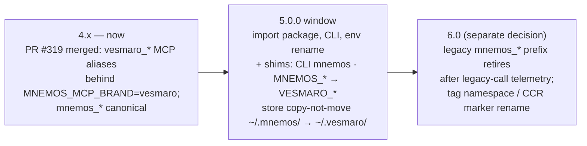

# ADR 0031: Rebrand — mnemos → vesmaro

**Status:** Accepted (ArchCom sessions 2026-09-14/15, four naming rounds; the
name was chosen by the owner from the round-2/3 shortlist; partial execution
already merged — the dual-mode MCP PR #319 is in `main`; registries claimed
2026-09-15. Decision-chain mnemos ids: open question
`9ab24ac2-03c8-4d75-9e59-2abc69cc140e`; round-1
`6412a74f-237d-426f-949c-9fe1988eff68` (superseded); round-2
`d90fba80-a1ba-437c-91d2-0dab5626f366` (superseded); round-3
`754f83a7-466e-4a42-a884-76382c7ea6d4` (superseded); round-4
`9917a27d-5f1c-4f11-aa8b-fce513789a61`; execution
`86ce17e7-1099-4e94-aa1b-eba431522560`)
**Deciders:** Tech Lead (chair), Product Manager, Senior Security Engineer,
Senior System Engineer, Analytics Lead; final name selection by the owner
**Scope:** the product/brand rename across registries (GitHub org and repo,
PyPI, npm), the import package and CLI names, MCP tool naming, model family
names, and docs. NOT in scope: the `mnemos:<subtype>` tag namespace and the
`[mnemos:<id>]` CCR marker format — data-contract formats whose migration is
a separate 6.0 decision — and federation wire protocol semantics.
**Preconditions:** release-versioning policy v2 (GWS release-window card
required: vesmaro/vesmaro#331), ADR-0028 determinism, the conftest src-pin
guard (#303/#288), the canonical single-store policy, the model fingerprint
precedent v1.1.0 (round-3 nano-model track).

## Context

1. **The bare name is burned.** The PyPI name `mnemos` is occupied by a
   dormant third-party stub (published June 2025; PyPI names are never
   released), and at least four live same-niche namesakes exist: the
   Riley-Coyote/mnemos MCP server with a colliding `mnemos doctor` command,
   anthony-maio/mnemos, the PyPI mnemos-memory / mnemos-embedkit pair, and
   an npm `mnemos`. The niche burns names weekly — mnemex, mnemora, and
   mienetic/mnema appeared in September 2026 alone.
2. **Round 1 stayed inside the burned cluster.** Its shortlist (`mnemus`,
   `mnemata`, `mnemosia`) kept the mnem- stem and was rejected by the owner
   as "too tight".
3. **Rounds 2–4 converged on `vesmaro`.** Over 150 names were screened
   against PyPI, npm, GitHub, RDAP, MCP directories, and trademark screens.
   `vesmaro` is a coined letta/zep-class brand with all seven slots free
   (PyPI, npm, GitHub org, npm org, .com/.dev/.io/.ai) and zero GitHub
   namesakes — plus the LLM-attractor property: when the six-name vesm*
   sibling family collapses in model output, spelling converges toward the
   -o variant, i.e. toward the canonical name.

## Decision

**1. The product is renamed to `vesmaro`; the ecosystem inherits the
family.** `vesmaro-embed` / `vesmaro-refine` (the model family, renamed
together — unanimous), and `vesmaro-eyes` (the future GUI).

**2. Additive dual-prefix, not a hard cut.** MCP tools gained `vesmaro_*`
aliases behind `MNEMOS_MCP_BRAND=vesmaro` (PR #319, merged) while the
canonical `mnemos_*` tools stay live; the legacy prefix retires no earlier
than 6.0, after legacy-call telemetry. Import package, CLI, and env names
rename in the 5.0.0 window with compatibility shims: a CLI shim `mnemos`, a
`MNEMOS_*` → `VESMARO_*` env mapping, and a store path migration
`~/.mnemos/` → `~/.vesmaro/` that is **copy-not-move**, with a backup and a
refuse-on-two-stores guard.

**3. The data-contract formats stay through the dual period.** The
`mnemos:<subtype>` tag namespace and the `[mnemos:<id>]` CCR marker remain
as-is — 83 test files and all stored records depend on them. A one-shot
rename of these formats is a separate 6.0 decision, out of scope here.

**4. Registries were claimed in one day, defensively.** 2026-09-15, in
runbook order (GitHub org first, then PyPI+npm in one session, then
domains): GitHub `vesmaro/vesmaro` (transfer preserves redirects); npm
`vesmaro` plus 5 sibling placeholders; PyPI `vesmaro` plus 4/6 placeholders
(vesmarin and vesmeri retrying behind the PyPI per-account new-project rate
limit); 5 GitHub sibling orgs (vesmara, vesmario, vesmaris, vesmarin,
vesmeri); domains .com/.dev pending owner purchase. Defensive registration
of the whole sibling family is deliberate: it absorbs LLM-drift mis-spawns
and sibling squatting regardless of which name a model emits.

## Execution status

- **Merged:** PR #319 — dual-mode MCP naming (`vesmaro_*` aliases behind
  `MNEMOS_MCP_BRAND=vesmaro`), in `main`, commit `1ced5b0`.
- **Claimed 2026-09-15:** GitHub org and repo `vesmaro/vesmaro`; npm
  `vesmaro` + 5 sibling placeholders; PyPI `vesmaro` + 4/6 placeholders
  (vesmarin, vesmeri pending behind the PyPI rate limit); 5 GitHub sibling
  orgs.
- **Pending:** domain purchases (.com/.dev — owner decision); the two
  remaining PyPI placeholders; the 5.0.0 code/docs rename window; the
  farewell deprecation release of `mnemos-memory-server`.

## Consequences

**What becomes true:**

- Clean namespace: every slot — PyPI, npm, GitHub org, npm org, and the
  four domains — is owned by the project, with zero GitHub namesakes.
- The LLM-attractor property works for the project: drift inside the vesm*
  sibling family converges toward the canonical -o spelling, so model-output
  mis-spawns land on names the project already owns.
- The defensive family blocks squatting on all live variants before
  squatters arrive, not after.

**Costs:**

- One fingerprint migration for the model family (precedent: v1.1.0 on the
  nano-model track).
- A compatibility surface held for the whole 5.x line — CLI shim, env
  mapping, store-path migration — retired no earlier than 6.0.
- Rewrite volume: ~4.5k code occurrences plus ~3k doc occurrences; docs go
  in a single EN/RU commit per the docs-sync rule.
- A farewell deprecation release of `mnemos-memory-server`; MCP directory
  listings update after the release.

**Risks accepted:**

- Typo paths from vesm* spellings toward vestmark-class brands. Mitigated
  by canonical install commands in all docs and weekly vesm*/mnem* registry
  monitoring.
- The fashion brand vesmara.co.in occupies SERP for the sibling name; it
  does not affect the canonical `vesmaro`.

## Alternatives considered

| Alternative | Why rejected |
|---|---|
| `mnemus` / `mnemata` / `mnemosia` (round-1) | Inside the burned mnem- cluster; the owner rejected the shortlist as "too tight". |
| `karteka` / `cunea` / `deltoi` (round-2) | Rejected by the owner on aesthetics; `cunea` carries a permanent SERP anchor (the Hyphantria cunea moth); `deltoi` has 1-edit paths to deltoid/delton. |
| `vesmara` / `vesmeri` (round-3 siblings) | `vesmara` collides with the fashion brand vesmara.co.in and the occupied GitHub user vesmira; `vesmeri` loses the LLM-attractor race to `vesmaro`. |
| `vemara` / `vekara` (round-4 feature-vector names) | One edit away from the vesm* family with live external edges; `vekara` is a dictionary word with an existing children's brand. |
| Feature-rooted names (vec-/embed-/mesh-/sem- stems, ~65 checked, round-4) | Feature semantics does not sell — mem0, letta, and zep carry none; and those stems are collision hot-zones (vixor: .ai taken + 72 repos; semira: 273 repos; vexta: vextab ★652). |
| Keep `mnemos` and fight squatters | Impossible: PyPI never releases names, and every install of the bare name feeds the third-party stub. |

## References

- GWS release-window card vesmaro/vesmaro#331 (release-versioning policy v2
  gate for the 5.0.0 window).
- PR #319 — dual-mode MCP naming, merged; commit `1ced5b0`.
- Conftest src-pin guard: #303, #288.
- ArchCom artefacts are team-local, not part of this repository:
  `~/.gcw/architectural-committee/2026-09-14-mnemos-rename.md`,
  `-round2.md`, `-round3.md`, `-round4.md`, `-contract.md`, and
  `2026-09-15-vesmaro-registration-runbook.md`.
- mnemos decision-chain ids (see Status): open question
  `9ab24ac2-03c8-4d75-9e59-2abc69cc140e`; rounds 1–4
  `6412a74f-237d-426f-949c-9fe1988eff68`,
  `d90fba80-a1ba-437c-91d2-0dab5626f366`,
  `754f83a7-466e-4a42-a884-76382c7ea6d4`,
  `9917a27d-5f1c-4f11-aa8b-fce513789a61`; execution
  `86ce17e7-1099-4e94-aa1b-eba431522560`.
- [ADR-0021](0021-nano-model-track.md) — the nano-model track; its v1.1.0
  fingerprint migration is the precedent for the model-family rename.
- [ADR-0028](0028-cache-contract.md) — the determinism line the rename must
  not disturb.
- Registries: [pypi.org/project/vesmaro](https://pypi.org/project/vesmaro/),
  [npmjs.com/package/vesmaro](https://www.npmjs.com/package/vesmaro),
  [github.com/vesmaro/vesmaro](https://github.com/vesmaro/vesmaro).
