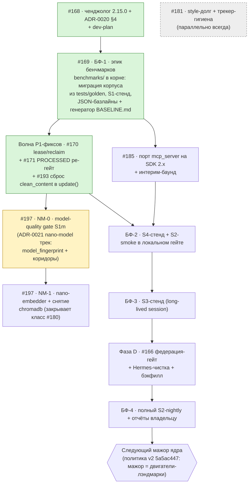

# План разработки mnemos — Фаза 2 (dev-plan)

> **Живой документ.** Обновляется на закрытии каждой волны (каденция — §7).
> Единый язык задач — GitHub-трекер [Korrnals/mnemos](https://github.com/Korrnals/mnemos/issues)
> (живые ссылки в §5). Архитектурные инварианты —
> [ADR-0017](adr/0017-memory-system-evolution-roadmap.md) (дорожная карта памяти),
> [ADR-0018](adr/0018-context-rewrite-ltm-bridge.md) (context-rewrite мост),
> [ADR-0019](adr/0019-optimistic-publication-async-refinement.md) (оптимистичная
> публикация), [ADR-0020](adr/0020-benchmark-framework.md) (бенчмарк-рамка),
> [ADR-0021](adr/0021-nano-model-track.md) (nano-model трек).
> Проценты готовности считает председатель Архкома на срезе; здесь они только
> фиксируются. Владелец документа — Tech Lead; волна-отчёты публикуются по
> шаблону §6.

## 1. Термины

| Термин | Значение |
| --- | --- |
| **Волна** | Группа задач, сданная одним конвейером «реализация → ревью → мерж»; закрывается волна-отчётом (§6). |
| **ADR-линия** | Трек исполнения одного ADR (например, Фазы A–D в ADR-0019). |
| **БФ-волна** | Волна рамки бенчмарков ADR-0020: БФ-1..4 (стенды S1–S4, базлайны, отчёты). |
| **Стенд** | Бенчмарк-стенд ADR-0020: S1 quality, S2 timing, S3 session, S4 availability. |
| **Эпик** | Issue-зонт трекера, закрывается закрытием дочерних карточек (пример: #169 — эпик БФ-волн). |
| **Гейт** | Критерий входа/выхода, который нельзя обойти (ingest-гейт ADR-0019, федерация-гейт #166). |
| **Снимок** | Раздел §2 на дату: проценты по линиям + счётчики трекера. Пересчитывается на срезе. |

## 2. Текущее состояние — снимок на 2026-08-31

**Ядро Фазы 2 сделано: модель публикации (ADR-0019, Фазы A–B) и защита
контекста (ADR-0018) в main. Измерительная часть начата: БФ-1 сдан (S1-стенд,
корневой `benchmarks/`, канонические базлайны); впереди — стенды S2–S4 и
уборка (Фаза D). ИТОГО программа Фазы 2 ≈ 55 % (проценты ADR-0019/итога
пересчитает председатель на следующем срезе).**

| Линия | Прогресс | Сделано | Не сделано / дальше |
| --- | --- | --- | --- |
| **ADR-0017** — дорожная карта памяти | **100 % Фаз 0–1** | 22 PR [#135–#158](https://github.com/Korrnals/mnemos/pull/158) + PR [#121](https://github.com/Korrnals/mnemos/pull/121) (в диапазоне #139/#146 — issues, не PR); issues #123/#124/#125/#139/#146 закрыты; сьют 1601 → 2006 на финале Фаз 0–1 (до 2181 довели волны ADR-0019 2026-08-30); D1 контракт ✅; D6 zero-config ✅ (#136); D5 — рамка метрик готова (ADR-0020) | D2 граф памяти ~10 %: groundwork `memory_edges` (#147) есть; каскад цитирований + CCR-индекс → [#172](https://github.com/Korrnals/mnemos/issues/172); стенды D5 = БФ-волны (#169) |
| **ADR-0018** — context-rewrite мост | **95 %** | Треки безопасности P0/P1/P2 ✅ (#145/#147/#148/#153); волны W1–W5 ✅ | Мелкие остатки реестра: B5 tier-2 margin-straddle (мониторится; adr/0018:190) и B4 management-plane exclusion (:228) → [#172–#176](https://github.com/Korrnals/mnemos/issues/172); N3 escape-hatch — хвост не заведён, будет отдельная карточка |
| **ADR-0019** — оптимистичная публикация | **50 %** | Фаза A защита ✅ 100 % ([#161](https://github.com/Korrnals/mnemos/pull/161)); Фаза B ядро ✅ 100 %: B1 [#162](https://github.com/Korrnals/mnemos/pull/162) (2 раунда ревью), B2a движок [#163](https://github.com/Korrnals/mnemos/pull/163), B2b видимость+ретракция [#165](https://github.com/Korrnals/mnemos/pull/165) | Фаза C измерения 0 % → волны ADR-0020 + [#169](https://github.com/Korrnals/mnemos/issues/169); Фаза D уборка 0 % → [#166](https://github.com/Korrnals/mnemos/issues/166) (федерация-гейт) + упразднение Hermes-обхода (избыточен технически — нужна чистка и бэкфилл) |
| **ADR-0020** — бенчмарки | **~35 %** | Рамка + решение комитета ✅ 100 % ([#164](https://github.com/Korrnals/mnemos/pull/164), включая поправку §5 к ADR-0019); БФ-1 ✅: корневой `benchmarks/` (корпус из tests/golden мигрирован, S1-стенд, канонический `baselines/s1.json` + генерируемый BASELINE.md, гейт `make bench-s1` в verify, wheel/sdist-исключение) | Стенды БФ-2..4 — **1 из 4 готов** (S1); эпик [#169](https://github.com/Korrnals/mnemos/issues/169) закрывается волнами БФ-2+ |
| **Релизная инфраструктура** | конвейер **✅ 100 %** | Подключён Korrnals/release-pipeline ([#179](https://github.com/Korrnals/mnemos/pull/179), dry-run зелёный); релизы v2.14.1 → v2.15.0 → **v3.0.0** (2026-08-31) | Гэпы конвейера: [#180](https://github.com/Korrnals/mnemos/issues/180) (P1 CVE chromadb — решение владельца), [#182](https://github.com/Korrnals/mnemos/issues/182)/[#183](https://github.com/Korrnals/mnemos/issues/183) (owner-infra), [#184](https://github.com/Korrnals/mnemos/issues/184), pipeline #19/#20. Мажор = двигатели-лэндмарки (политика v2, `5a5ac447`): v3.0.0 = publication-engine; доработки — минорами 3.1.0+ |
| **Трекер** | гигиена ✅ | P1 открыто 10 по факту `gh issue list` 2026-08-31: #169, #170, #171, #180, #185, #189, #191, #193, #197 + #166 (открыт без метки, считается P1); #168 закрыт. **Волна P1-фиксов 2026-08-31 закрывает #170/#171/#193** → после мержа P1 открыто 7 (#166, #169, #180, #185, #189, #191, #197). P2 открыто 10 (#172–#176, #181–#183, #186, #190; #184 — приоритет P2 в заголовке карточки, метки нет); P3 — 1 эпик (#177). Очередь комитета вычищена 2026-08-31 | БФ-1 сдан — волны БФ-2+ по эпику #169; далее #185 → #189/#191; **NM-0 (#197, ADR-0021) — после волны P1-фиксов** |

Чекпоинт-доска (фиксированный формат — приводится в каждом ответе владельцу,
§7):

```markdown
| Линия       | Прогресс                              | Следующий шаг              |
| ADR-0017    | 100 % Фаз 0–1 (D2 ~10 %)              | #172/D2 после БФ-волн      |
| ADR-0018    | 95 %                                  | #172–#176                  |
| ADR-0019    | 50 % (A ✅ B ✅ · C 0 % · D 0 %)       | БФ-волны + #166            |
| ADR-0020    | ~35 % (рамка ✅ · S1 ✅ БФ-1 · 1/4)    | #169 БФ-2 (S4 + S2-smoke)  |
| Инфра       | конвейер ✅ (#179)                    | #180–#184, pipeline #19/#20|
| Фаза 2 итого| ≈ 55 % — ядро сделано                 | измерения + уборка (D)     |
```

## 3. Реестр завершённых волн

| Дата | Волна | Артефакты |
| --- | --- | --- |
| 2026-08-27 | Финал Фаз 0–1 ADR-0017 | PR [#157](https://github.com/Korrnals/mnemos/pull/157), [#158](https://github.com/Korrnals/mnemos/pull/158); итоговый [отчёт](reports/2026-08-27-phase-0-1-final-report.md); сьют 1601 → 2006 |
| 2026-08-29 | ADR-0019 принят | PR [#159](https://github.com/Korrnals/mnemos/pull/159) (Архком); recall-фикс [#160](https://github.com/Korrnals/mnemos/pull/160) — recency исключает ARCHIVED |
| 2026-08-30 | Фазы A–B ADR-0019 + ADR-0020 + релиз + конвейер | Phase A [#161](https://github.com/Korrnals/mnemos/pull/161); B1 [#162](https://github.com/Korrnals/mnemos/pull/162) (2 раунда ревью); B2a [#163](https://github.com/Korrnals/mnemos/pull/163) (2 раунда); B2b [#165](https://github.com/Korrnals/mnemos/pull/165) (мутации 3+3+6); ADR-0020 [#164](https://github.com/Korrnals/mnemos/pull/164) (Архком, поправка §5 ADR-0019); issue-практика + ретро-разбор #166–#177; релиз **v2.15.0** (преждевременный v3.0.0 снят — директива владельца `b0a1cf40`); конвейер подключён [#179](https://github.com/Korrnals/mnemos/pull/179) + гэпы #180–#184, pipeline #19/#20; MCP восстановлен, стор объединён; ротация бекапов; сьют 2006 → 2181 |
| 2026-08-31 | Гигиена очереди | Очередь комитета вычищена; [#185](https://github.com/Korrnals/mnemos/issues/185)/[#186](https://github.com/Korrnals/mnemos/issues/186) переоформлены из очереди комитета (карточки от 2026-08-30); заведён этот dev-plan (поезд [#168](https://github.com/Korrnals/mnemos/issues/168)) |
| 2026-08-31 | БФ-1 (эпик [#169](https://github.com/Korrnals/mnemos/issues/169)) | Корневой каталог `benchmarks/` (директива владельца 2026-08-30): корпус мигрирован из `tests/golden` байт-точно (2 отклонения: импорт-пути пакетов; фикс бага фикстуры `aurora-ci-token-note` — 32-символьный хвост ghp_ против 36 в PLANTED_SECRETS); S1-стенд (`make bench-s1`, гейт в verify) = golden-измерения + сценарии S1–S3 ADR-0019 (карантин/ретракция/подмена) + detector-quarantine-fp (легитимные tech-паттерны в корпусе, 8 записей) + инвариант render-neutrality + interim-McNemar (знаковый тест); канонический `baselines/s1.json` (baseline_version 1, stand_version s1-1, corpus_fingerprint) + генерируемый `BASELINE.md`; wheel/sdist-исключение `benchmarks/` (по образцу #179); smoke-тесты стенда + мутационный тест нейтральности |
| 2026-08-31 | P1-фиксы [#170](https://github.com/Korrnals/mnemos/issues/170)/[#171](https://github.com/Korrnals/mnemos/issues/171)/[#193](https://github.com/Korrnals/mnemos/issues/193) | **#170** lease/reclaim зависших `processing`: `REFINE_LEASE_TIMEOUT_SEC=600` (claim штампует lease-часы `updated_at`), идемпотентный CAS-reclaim в sweeper-цикле процессора (`WHERE pipeline_state='processing' AND updated_at < cutoff` — двойной воркер/свипер безопасен), аудит `outcome=lease-reclaimed age=…`, retry-бюджет не расходуется. **#171** N1-гейт контентных правок распространён на все admissible-статусы (edit-ветка; flip-ветка осталась PUBLISHED-only — контракт knowledge-pipeline: rewrite-оригиналы редактируются на выдаче): отказ → демоция RAW без касания `pipeline_state` (инвариант B1), чистая правка PROCESSED → `pipeline_state=pending` (F8-семантика, включая legacy-NULL admissible-строки). **#193** `update()` сбрасывает `clean_content` той же транзакцией, что пишет новый контент (B2a swap-дисциплина); served-проекция (`effective_content`) — новый контент немедленно; S1-базлайн перезаписан честно (`filter_projection_stale_after_update` true→false, остальные метрики байт-точно). Сьют 2186 → 2203 (+17: lease-reclaim 7, PROCESSED-гейт 7, сброс проекции 3); мутации 5+2+2 пойманы. NM-трек [#197](https://github.com/Korrnals/mnemos/issues/197)/ADR-0021 внесён в DAG (§4) |

## 4. DAG ближайших волн



Пояснения:

- **#169 (БФ-1) — вход всей измерительной части. СДАН (2026-08-31):**
  каталог `benchmarks/` в корне проекта (директива владельца 2026-08-30,
  поправка ADR-0020 §4), корпус из `tests/golden` мигрирован, S1-стенд в
  локальном merge-гейте (`make bench-s1` в `verify`), канонический
  `s1.json` + генерируемый `BASELINE.md`, wheel/sdist-исключение. Эпик
  #169 остаётся открытым до БФ-4 (стенды S2–S4).
- **#170 ∥ #171 ∥ #185** — параллельные лейны после БФ-1; все трое гейтят
  БФ-2 (зависимости версий/стендов). **#170/#171 сданы волной P1-фиксов
  2026-08-31 (вместе с #193 — см. §3)**; из лейнов после БФ-1 остаётся
  #185. За ними встают **#189** (реальный
  LLM-провайдер в refine-конвейер — «мозг» дообработки, директива
  владельца) и **#191** (эпик доставки: имя PyPI за владельцем —
  рекомендация TL `mnemos-memory-server`; npm = работа pi; релизные
  артефакты с 3.1.0).
- **#197 / ADR-0021 (NM-трек, инициатива владельца, Архком
  2026-08-31)** — стейджинг с обязательными гейтами:
  **NM-0 (model-quality gate S1m) идёт первым, после волны P1-фиксов**
  — сегодня S1 не гейтит продакшен-эмбеддер (тихая подмена проходит);
  NM-0 добавляет метрики ранжирования + `model_fingerprint` в базлайны
  и fail-loud на смене весов без re-baseline в том же PR; **NM-1**
  (дистилляция nano-эмбеддера + снятие chromadb) закрывает класс
  [#180](https://github.com/Korrnals/mnemos/issues/180) (−3 CVE,
  −телеметрия, −150–250 МБ); NM-2 требует S3-стенд (БФ-3); **NM-3
  (nano-refiner)** — deferred-gated за швом #189, opt-in до
  превосходства над стабом по коридорам.
- **Фаза D** идёт после БФ-3: сначала измерения фиксируют поведение
  публикации, потом срезается Hermes-обход (чистка + бэкфилл) под гейтом
  федерации [#166](https://github.com/Korrnals/mnemos/issues/166).
- **Мажорный релиз ядра** — политика версий v2 (директива владельца
  `5a5ac447`): мажор привязан к двигателям-лэндмаркам, а не зарезервирован
  до конца роадмапа (`b0a1cf40` отменена). **v3.0.0 вышел 2026-08-31**
  (publication-engine: ADR-0019 семантика + релизный конвейер);
  доработки идут минорами 3.1.0+; следующий мажор — следующая лэндмарка.
- **Вне критического пути:** [#181](https://github.com/Korrnals/mnemos/issues/181)
  (style-долг) и трекер-гигиена — постоянный фон, не блокируют волны.

## 5. Лог проблем

Формат открытых: проблема → приоритет → план. Живые статусы — в трекере;
здесь — снимок на дату раздела §2.

### 5.1 Открытые (трекер)

| Приоритет | Карточка | Суть | План |
| --- | --- | --- | --- |
| P1 | [#166](https://github.com/Korrnals/mnemos/issues/166) | Федерация-гейт Фазы D + упразднение Hermes-обхода (чистка, бэкфилл) | после БФ-3 (DAG §4) |
| P1 | [#168](https://github.com/Korrnals/mnemos/issues/168) | Ченджолог 2.15.0 (PR #159–#165, #167 + issues-практика #166+), поправка ADR-0020 §4, этот dev-plan | в работе сейчас |
| P1 | [#169](https://github.com/Korrnals/mnemos/issues/169) | Эпик БФ-1..4: стенды S1–S4, каталог `benchmarks/`, базлайны, отчёты | БФ-1 сдан 2026-08-31; эпик держится открытым до БФ-4 |
| P1 | [#170](https://github.com/Korrnals/mnemos/issues/170) | Lease для записей, зависших в `processing` | закрывается волной P1-фиксов 2026-08-31: `REFINE_LEASE_TIMEOUT_SEC=600`, claim штампует lease-часы, CAS-reclaim в sweeper (`outcome=lease-reclaimed`), retry-бюджет не расходуется |
| P1 | [#171](https://github.com/Korrnals/mnemos/issues/171) | PROCESSED ре-гейт | закрывается волной P1-фиксов 2026-08-31: edit-ветка N1 на все admissible-статусы (flip-ветка осталась PUBLISHED-only — контракт knowledge-pipeline); отказ → RAW (B1: `pipeline_state` не трогается), чистая правка → `pending` |
| P1 | [#193](https://github.com/Korrnals/mnemos/issues/193) | `manager.update` оставляет stale `clean_content` при замене контента — served-проекция отстаёт до перефильтрации (наблюдалось BF-1: `filter_projection_stale_after_update=true`) | закрывается волной P1-фиксов 2026-08-31: сброс `clean_content` той же транзакцией; S1-базлайн перезаписан (флаг true→false, метрики байт-точно) |
| P1 | [#180](https://github.com/Korrnals/mnemos/issues/180) | P1 CVE в chromadb (зависимость) — держит алерт конвейера | ждёт решения владельца (§5.2) |
| P1 | [#185](https://github.com/Korrnals/mnemos/issues/185) | Порт mcp_server на SDK 2.x + интерим-баунд зависимости | параллельно после БФ-1 |
| P1 | [#189](https://github.com/Korrnals/mnemos/issues/189) | Реальный LLM-провайдер в refine-конвейер (сейчас детерминированный стаб-обогащение в `_produce_refined_projection` — единственная точка замены) | после #170/#171 — «мозг» дообработки (директива владельца) |
| P1 | [#191](https://github.com/Korrnals/mnemos/issues/191) | Эпик доставки: PyPI-публикация (имя за владельцем), npm-пакет = работа pi, релизные артефакты с 3.1.0 | имя PyPI — решение владельца (§5.2); параллельно после #170/#171/#185 |
| P1 | [#197](https://github.com/Korrnals/mnemos/issues/197) | NM-трек (ADR-0021, инициатива владельца, Архком 2026-08-31, стейджинг): NM-0 model-quality gate → NM-1 nano-эмбеддер + снятие chromadb → NM-3 refiner deferred-gated | NM-0 — после волны P1-фиксов (DAG §4); NM-1 закрывает класс #180 |
| P2 | [#190](https://github.com/Korrnals/mnemos/issues/190) | Hard hook automation для произвольных харнессов (за пределами instruction-дисциплины) | по мере волн (директива владельца) |
| P2 | [#172](https://github.com/Korrnals/mnemos/issues/172) | D2-граф: каскад цитирований + CCR-индекс (хвост линии ADR-0018) | после БФ-волн |
| P2 | [#173–#176](https://github.com/Korrnals/mnemos/issues/173) | Мелкие остатки реестра ADR-0018 (B5 tier-2 margin-straddle — мониторится; B4 management-plane exclusion и др.) | по мере волн |
| P2 | [#181](https://github.com/Korrnals/mnemos/issues/181) | Style-долг (постоянный фон) | параллельно всегда |
| P2 | [#182](https://github.com/Korrnals/mnemos/issues/182) | Owner-infra: docker+buildx vs контейнерный раннер конвейера | ждёт решения владельца (§5.2) |
| P2 | [#183](https://github.com/Korrnals/mnemos/issues/183) | Owner-infra: валидный COSIGN_KEY для подписей релизов | ждёт решения владельца (§5.2) |
| P2 | [#184](https://github.com/Korrnals/mnemos/issues/184) | Гэп релизного конвейера | в очереди конвейера |
| P2 | [#186](https://github.com/Korrnals/mnemos/issues/186) | Переоформлен из очереди комитета 2026-08-30 (наполнение — по карточке) | по мере волн |
| P3 | [#177](https://github.com/Korrnals/mnemos/issues/177) | Эпик ретро-разбора практики (заведён 2026-08-30 вместе с #166–#176) | вне критического пути |

Незаведённый хвост: N3 (per-call `validate_marker=false` escape-hatch,
реестр ADR-0018) — карточки в трекере нет; заводится отдельной карточкой.

### 5.2 Ждут решения владельца

| Вопрос | Контекст | Рекомендация |
| --- | --- | --- |
| [#180](https://github.com/Korrnals/mnemos/issues/180) — P1 CVE в chromadb | Зависимость с известной CVE держит P1-алерт конвейера | Оценка Security + ignore-list с датой пересмотра |
| [#182](https://github.com/Korrnals/mnemos/issues/182) — способ сборки релизных образов | docker+buildx на раннере vs контейнерный раннер конвейера | Решение owner-infra; критпутом не является |
| [#183](https://github.com/Korrnals/mnemos/issues/183) — ключ подписи релизов | Без валидного COSIGN_KEY подписи релизов идут мимо контура | Выпустить ключ и внести секрет в конвейер |
| [#191](https://github.com/Korrnals/mnemos/issues/191) — имя пакета на PyPI | Эпик доставки (#191) не может публиковаться без имени; артефакты обещаны с 3.1.0 | `mnemos-memory-server` (TL): говорящее, свободно на PyPI — проверить перед регистрацией |
| 28 устаревших развёрнутых скилл-файлов | Обновление skill-пака перезапишет локальные правки | Принять перезапись или явно зафиксировать набор |
| Судьба K3s-варианта конвейера | Альтернативная форма раннера | Не срочно — вернуться после #182/#183 |

## 6. Шаблон волна-отчёта (фиксированный)

Каждая закрытая волна сопровождается отчётом строго этой формы:

```markdown
## Волна-отчёт: <ID> — <имя> (дата)

**Итог:** <одной строкой: что планировалось и что получилось на самом деле>

### План → Факт
| Планировалось | Сделано | Осталось |
| --- | --- | --- |
| <шаг/задача> | <факт: сделано/частично/нет + артефакт PR/коммит> | <что переносится и куда> |

### Решённые проблемы
| Проблема | Решение | Статус |
| --- | --- | --- |
| <из лога §5 или новая> | <как решили> | <закрыто / закроется мержем> |

### Открытые проблемы / риски
| Проблема/риск | Влияние | Владелец | План |
| --- | --- | --- | --- |

### Параллельные потоки
- <лейн/задача>: состояние, что ждал и что параллелилось в этой волне

### План следующей волны
1. <шаг> — критерий готовности: <проверяемое условие>

### Ждут решения владельца
- <вопрос> — рекомендация TL: <вариант + обоснование>
```

## 7. Каденция обновления

- **План обновляется на закрытии каждой волны** — тем же PR, что и изменения
  волны, либо отдельным docs-коммитом; минимум — §2 (снимок), §3 (реестр),
  §5 (лог). Проценты пересчитывает председатель Архкома на срезе и передаёт
  сюда готовыми.
- **Чекпоинт-доска (формат в §2) приводится в каждом ответе владельцу** —
  первой таблицей, до деталей; проценты и «следующий шаг» обязаны совпадать
  с текущим снимком §2.
- **Реестр волн (§3)** пополняется на закрытии волны; **лог проблем (§5)** —
  при обнаружении (открытые) и на закрытии волны (закрытые уходят в
  волна-отчёт).
- **Статус-источник — трекер GitHub**: карточки живые, этот документ —
  снимок; при расхождении правдой считается трекер, снимок обновляется.

---

*Источник снимка: данные председателя Архитектурного комитета от
2026-08-31 (проценты посчитаны председателем); main@`7c56b7f`. Артефакты
волн — PR и issues репозитория Korrnals/mnemos.*
