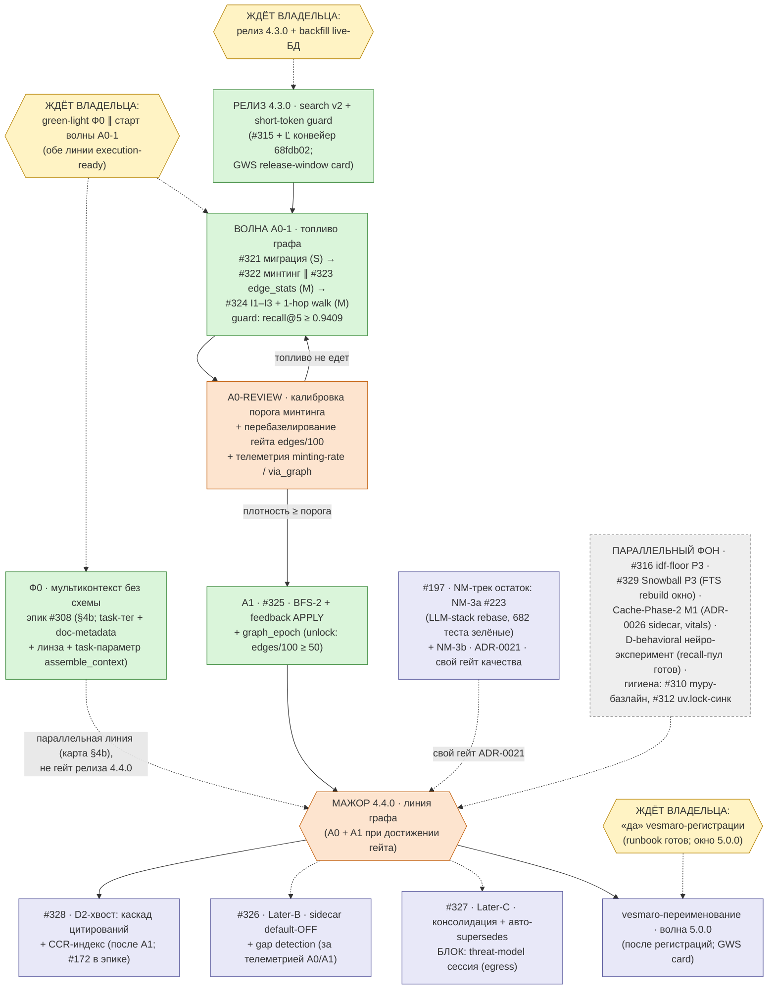
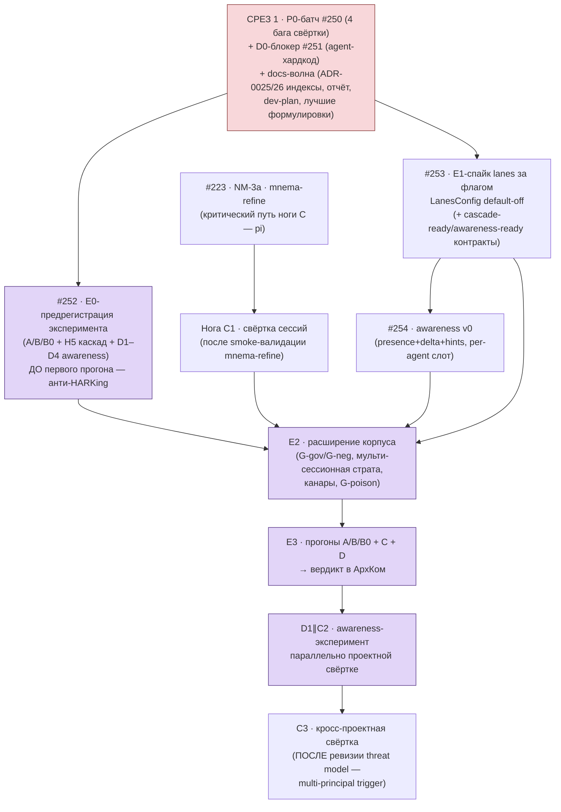
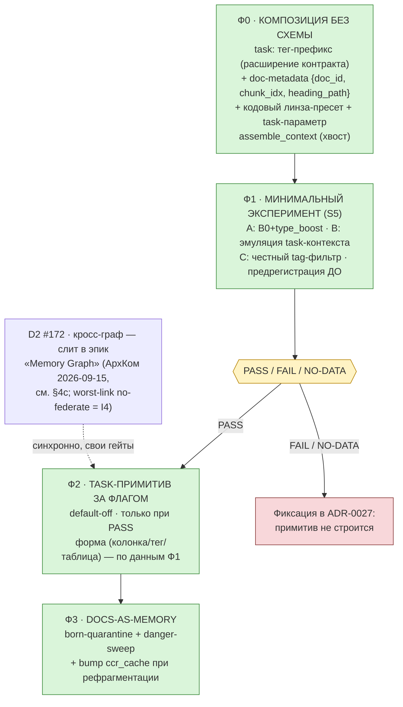
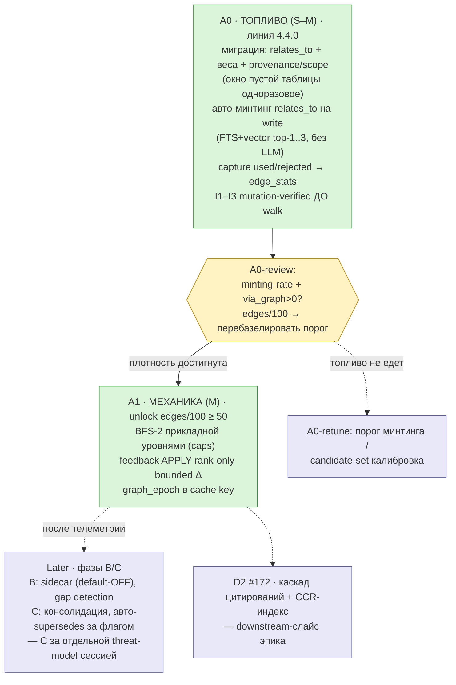

# План разработки mnemos — Фаза 2 (dev-plan)

> **Живой документ.** Обновляется на закрытии каждой волны (каденция — §7).
> Единый язык задач — GitHub-трекер [Korrnals/mnemos](https://github.com/Korrnals/mnemos/issues)
> (живые ссылки в §5). Архитектурные инварианты —
> [ADR-0017](adr/0017-memory-system-evolution-roadmap.md) (дорожная карта памяти),
> [ADR-0018](adr/0018-context-rewrite-ltm-bridge.md) (context-rewrite мост),
> [ADR-0019](adr/0019-optimistic-publication-async-refinement.md) (оптимистичная
> публикация), [ADR-0020](adr/0020-benchmark-framework.md) (бенчмарк-рамка),
> [ADR-0021](adr/0021-nano-model-track.md) (nano-model трек).
> Проценты готовности считает председатель Архкома на срезе; здесь они только
> фиксируются. Владелец документа — Tech Lead; волна-отчёты публикуются по
> шаблону §6.

## 1. Термины

| Термин | Значение |
| --- | --- |
| **Волна** | Группа задач, сданная одним конвейером «реализация → ревью → мерж»; закрывается волна-отчётом (§6). |
| **ADR-линия** | Трек исполнения одного ADR (например, Фазы A–D в ADR-0019). |
| **БФ-волна** | Волна рамки бенчмарков ADR-0020: БФ-1..4 (стенды S1–S4, базлайны, отчёты). |
| **Стенд** | Бенчмарк-стенд ADR-0020: S1 quality, S2 timing, S3 session, S4 availability. |
| **Эпик** | Issue-зонт трекера, закрывается закрытием дочерних карточек (пример: #169 — эпик БФ-волн). |
| **Гейт** | Критерий входа/выхода, который нельзя обойти (ingest-гейт ADR-0019, федерация-гейт #166). |
| **Снимок** | Раздел §2 на дату: проценты по линиям + счётчики трекера. Пересчитывается на срезе. |

## 2. Текущее состояние — снимок на 2026-08-31

> **Примечание 2026-09-13:** проценты и счётчики ниже — снимок на
> 2026-08-31; с тех пор main ушёл далеко (ADR-0019 Фазы C–D, ADR-0021–0026,
> релизы 3.x–4.1.0, срез 1 §4a). Пересчёт процентов линий — за
> председателем АрхКома на ближайшем срезе; живые статусы — в трекере.

**Ядро Фазы 2 сделано: модель публикации (ADR-0019, Фазы A–B) и защита
контекста (ADR-0018) в main. Измерительная часть начата: БФ-1 сдан (S1-стенд,
корневой `benchmarks/`, канонические базлайны); впереди — стенды S2–S4 и
уборка (Фаза D). ИТОГО программа Фазы 2 ≈ 55 % (проценты ADR-0019/итога
пересчитает председатель на следующем срезе).**

| Линия | Прогресс | Сделано | Не сделано / дальше |
| --- | --- | --- | --- |
| **ADR-0017** — дорожная карта памяти | **100 % Фаз 0–1** | 22 PR [#135–#158](https://github.com/Korrnals/mnemos/pull/158) + PR [#121](https://github.com/Korrnals/mnemos/pull/121) (в диапазоне #139/#146 — issues, не PR); issues #123/#124/#125/#139/#146 закрыты; сьют 1601 → 2006 на финале Фаз 0–1 (до 2181 довели волны ADR-0019 2026-08-30); D1 контракт ✅; D6 zero-config ✅ (#136); D5 — рамка метрик готова (ADR-0020) | D2 граф памяти ~10 %: groundwork `memory_edges` (#147) есть; каскад цитирований + CCR-индекс → [#172](https://github.com/Korrnals/mnemos/issues/172); стенды D5 = БФ-волны (#169) |
| **ADR-0018** — context-rewrite мост | **95 %** | Треки безопасности P0/P1/P2 ✅ (#145/#147/#148/#153); волны W1–W5 ✅ | Мелкие остатки реестра: B5 tier-2 margin-straddle (мониторится; adr/0018:190) и B4 management-plane exclusion (:228) → [#172–#176](https://github.com/Korrnals/mnemos/issues/172); N3 escape-hatch — хвост не заведён, будет отдельная карточка |
| **ADR-0019** — оптимистичная публикация | **50 %** | Фаза A защита ✅ 100 % ([#161](https://github.com/Korrnals/mnemos/pull/161)); Фаза B ядро ✅ 100 %: B1 [#162](https://github.com/Korrnals/mnemos/pull/162) (2 раунда ревью), B2a движок [#163](https://github.com/Korrnals/mnemos/pull/163), B2b видимость+ретракция [#165](https://github.com/Korrnals/mnemos/pull/165) | Фаза C измерения 0 % → волны ADR-0020 + [#169](https://github.com/Korrnals/mnemos/issues/169); Фаза D уборка 0 % → [#166](https://github.com/Korrnals/mnemos/issues/166) (федерация-гейт) + упразднение Hermes-обхода (избыточен технически — нужна чистка и бэкфилл) |
| **ADR-0020** — бенчмарки | **~35 %** | Рамка + решение комитета ✅ 100 % ([#164](https://github.com/Korrnals/mnemos/pull/164), включая поправку §5 к ADR-0019); БФ-1 ✅: корневой `benchmarks/` (корпус из tests/golden мигрирован, S1-стенд, канонический `baselines/s1.json` + генерируемый BASELINE.md, гейт `make bench-s1` в verify, wheel/sdist-исключение) | Стенды БФ-2..4 — **1 из 4 готов** (S1); эпик [#169](https://github.com/Korrnals/mnemos/issues/169) закрывается волнами БФ-2+ |
| **Релизная инфраструктура** | конвейер **✅ 100 %** | Подключён Korrnals/release-pipeline ([#179](https://github.com/Korrnals/mnemos/pull/179), dry-run зелёный); релизы v2.14.1 → v2.15.0 → **v3.0.0** (2026-08-31) | Гэпы конвейера: [#180](https://github.com/Korrnals/mnemos/issues/180) (P1 CVE chromadb — решение владельца), [#182](https://github.com/Korrnals/mnemos/issues/182)/[#183](https://github.com/Korrnals/mnemos/issues/183) (owner-infra), [#184](https://github.com/Korrnals/mnemos/issues/184), pipeline #19/#20. Мажор = двигатели-лэндмарки (политика v2, `5a5ac447`): v3.0.0 = publication-engine; доработки — минорами 3.1.0+ |
| **Трекер** | гигиена ✅ | P1 открыто 10 по факту `gh issue list` 2026-08-31: #169, #170, #171, #180, #185, #189, #191, #193, #197 + #166 (открыт без метки, считается P1); #168 закрыт. **Волна P1-фиксов 2026-08-31 закрывает #170/#171/#193** → после мержа P1 открыто 7 (#166, #169, #180, #185, #189, #191, #197). P2 открыто 10 (#172–#176, #181–#183, #186, #190; #184 — приоритет P2 в заголовке карточки, метки нет); P3 — 1 эпик (#177). Очередь комитета вычищена 2026-08-31 | БФ-1 сдан — волны БФ-2+ по эпику #169; далее #185 → #189/#191; **NM-0 (#197, ADR-0021) — после волны P1-фиксов** |

Чекпоинт-доска (фиксированный формат — приводится в каждом ответе владельцу,
§7):

```markdown
| Линия       | Прогресс                              | Следующий шаг              |
| ADR-0017    | 100 % Фаз 0–1 (D2 ~10 %)              | #172/D2 после БФ-волн      |
| ADR-0018    | 95 %                                  | #172–#176                  |
| ADR-0019    | 50 % (A ✅ B ✅ · C 0 % · D 0 %)       | БФ-волны + #166            |
| ADR-0020    | ~35 % (рамка ✅ · S1 ✅ БФ-1 · 1/4)    | #169 БФ-2 (S4 + S2-smoke)  |
| Инфра       | конвейер ✅ (#179)                    | #180–#184, pipeline #19/#20|
| Фаза 2 итого| ≈ 55 % — ядро сделано                 | измерения + уборка (D)     |
```

## 3. Реестр завершённых волн

| Дата | Волна | Артефакты |
| --- | --- | --- |
| 2026-08-27 | Финал Фаз 0–1 ADR-0017 | PR [#157](https://github.com/Korrnals/mnemos/pull/157), [#158](https://github.com/Korrnals/mnemos/pull/158); итоговый [отчёт](reports/2026-08-27-phase-0-1-final-report.md); сьют 1601 → 2006 |
| 2026-08-29 | ADR-0019 принят | PR [#159](https://github.com/Korrnals/mnemos/pull/159) (Архком); recall-фикс [#160](https://github.com/Korrnals/mnemos/pull/160) — recency исключает ARCHIVED |
| 2026-08-30 | Фазы A–B ADR-0019 + ADR-0020 + релиз + конвейер | Phase A [#161](https://github.com/Korrnals/mnemos/pull/161); B1 [#162](https://github.com/Korrnals/mnemos/pull/162) (2 раунда ревью); B2a [#163](https://github.com/Korrnals/mnemos/pull/163) (2 раунда); B2b [#165](https://github.com/Korrnals/mnemos/pull/165) (мутации 3+3+6); ADR-0020 [#164](https://github.com/Korrnals/mnemos/pull/164) (Архком, поправка §5 ADR-0019); issue-практика + ретро-разбор #166–#177; релиз **v2.15.0** (преждевременный v3.0.0 снят — директива владельца `b0a1cf40`); конвейер подключён [#179](https://github.com/Korrnals/mnemos/pull/179) + гэпы #180–#184, pipeline #19/#20; MCP восстановлен, стор объединён; ротация бекапов; сьют 2006 → 2181 |
| 2026-08-31 | Гигиена очереди | Очередь комитета вычищена; [#185](https://github.com/Korrnals/mnemos/issues/185)/[#186](https://github.com/Korrnals/mnemos/issues/186) переоформлены из очереди комитета (карточки от 2026-08-30); заведён этот dev-plan (поезд [#168](https://github.com/Korrnals/mnemos/issues/168)) |
| 2026-08-31 | БФ-1 (эпик [#169](https://github.com/Korrnals/mnemos/issues/169)) | Корневой каталог `benchmarks/` (директива владельца 2026-08-30): корпус мигрирован из `tests/golden` байт-точно (2 отклонения: импорт-пути пакетов; фикс бага фикстуры `aurora-ci-token-note` — 32-символьный хвост ghp_ против 36 в PLANTED_SECRETS); S1-стенд (`make bench-s1`, гейт в verify) = golden-измерения + сценарии S1–S3 ADR-0019 (карантин/ретракция/подмена) + detector-quarantine-fp (легитимные tech-паттерны в корпусе, 8 записей) + инвариант render-neutrality + interim-McNemar (знаковый тест); канонический `baselines/s1.json` (baseline_version 1, stand_version s1-1, corpus_fingerprint) + генерируемый `BASELINE.md`; wheel/sdist-исключение `benchmarks/` (по образцу #179); smoke-тесты стенда + мутационный тест нейтральности |
| 2026-08-31 | P1-фиксы [#170](https://github.com/Korrnals/mnemos/issues/170)/[#171](https://github.com/Korrnals/mnemos/issues/171)/[#193](https://github.com/Korrnals/mnemos/issues/193) | **#170** lease/reclaim зависших `processing`: `REFINE_LEASE_TIMEOUT_SEC=600` (claim штампует lease-часы `updated_at`), идемпотентный CAS-reclaim в sweeper-цикле процессора (`WHERE pipeline_state='processing' AND updated_at < cutoff` — двойной воркер/свипер безопасен), аудит `outcome=lease-reclaimed age=…`, retry-бюджет не расходуется. **#171** N1-гейт контентных правок распространён на все admissible-статусы (edit-ветка; flip-ветка осталась PUBLISHED-only — контракт knowledge-pipeline: rewrite-оригиналы редактируются на выдаче): отказ → демоция RAW без касания `pipeline_state` (инвариант B1), чистая правка PROCESSED → `pipeline_state=pending` (F8-семантика, включая legacy-NULL admissible-строки). **#193** `update()` сбрасывает `clean_content` той же транзакцией, что пишет новый контент (B2a swap-дисциплина); served-проекция (`effective_content`) — новый контент немедленно; S1-базлайн перезаписан честно (`filter_projection_stale_after_update` true→false, остальные метрики байт-точно). Сьют 2186 → 2203 (+17: lease-reclaim 7, PROCESSED-гейт 7, сброс проекции 3); мутации 5+2+2 пойманы. NM-трек [#197](https://github.com/Korrnals/mnemos/issues/197)/ADR-0021 внесён в DAG (§4) |
| 2026-09-13 | Срез 1 §4a «Стабилизация + документация» (цикл АрхКома мета-уровня) | Docs-волна [PR #256](https://github.com/Korrnals/mnemos/pull/256) (ADR-0025/0026, отчёт цикла, §4a, формулировки EN/RU); зависший фикс #245 [PR #257](https://github.com/Korrnals/mnemos/pull/257); P0-батч #250 [PR #260](https://github.com/Korrnals/mnemos/pull/260) (карантин вход+чтение, strip-by-default, ANY-member no-federate, input_set_hash, суперпрессия ARCHIVED); origin= provenance [PR #262](https://github.com/Korrnals/mnemos/pull/262); D0 #251 [PR #263](https://github.com/Korrnals/mnemos/pull/263) (save_checkpoint single authority, binding, issuer-dedup, трёхслойная защита штампов — security approve после ремонта); формат-долг verify [PR #268](https://github.com/Korrnals/mnemos/pull/268). Сьют 2419 → 2452; bench-s1 gate PASS. Урожай трекера: #258/#259/#261(закрыт)/#264/#265/#266/#267 |
| 2026-09-13 | Срез 2 §4a «Предрегистрация + движок за флагом» | E0-предрегистрация [PR #271](https://github.com/Korrnals/mnemos/pull/271) (docs/experiments/e0-meta-level.md, 394 строки; request-changes → до-прогонная правка → approve; закрывает #252); E1-спайк lanes [PR #272](https://github.com/Korrnals/mnemos/pull/272) (lanes.py за LanesConfig default-off, byte-эквивалентность off sha256-фикстурами, cascade/awareness-ready контракты; P2 lane-dedup → ремонт → approve; закрывает #253); format-долг #270 [PR #273](https://github.com/Korrnals/mnemos/pull/273). Сьют 2452 → 2492 passed / 3 skipped: +37 lane-тестов (34 спайк + 3 ремонт `cb95d4d`) и +3 теста от параллельного PR #270 (#258, вне среза). Правило §4a-1 соблюдено: E1 стартовал только после мержа E0. Далее: E2 (страты корпуса по E0-спеке) |
| 2026-09-13 | Interleave-волна: срез 3 (awareness v0) ∥ E2 волна 1 (владелец делегировал секвенирование TL директивой 2026-09-13; interleave по рекомендации АрхКома) | Awareness v0 [PR #275](https://github.com/Korrnals/mnemos/pull/275) (closes #254; двойное ревью code+security → консолидированный ремонт по 13 находкам → approve; hooks-композиция R3, инструменты 26→27, federated_origin-штампы, E0-амендмент revision 2; +59 тестов); E2 волна 1 [PR #276](https://github.com/Korrnals/mnemos/pull/276) (G-gov 96/48×2 + пул 52, G-neg 24, профиль 57.96%, слепая адъюдикация; +696 тестов; analytics approve). Сьют на ветках: 2551 (awareness) / 3188 (E2); объединённый main — **3247 passed / 3 skipped** (2492 + 696 + 59 — точная сумма), bench-s1 gate PASS (recall@5 0.8745), mypy --strict 88 файлов, format/lint/doctor/check-version зелёные; pip-audit остаётся вынесенным в [#267](https://github.com/Korrnals/mnemos/issues/267). Трекер: [#277](https://github.com/Korrnals/mnemos/issues/277) (E3-readiness), [#278](https://github.com/Korrnals/mnemos/issues/278) (awareness-полировка) |
| 2026-09-13 | Волна «E3-runner ∥ D-страты» (+ параллельные треки дня) | E3-runner + #277 [PR #283](https://github.com/Korrnals/mnemos/pull/283) (закрывает #277: ledger-aware worksheet вне fingerprint-множества, замороженное правило 20% double-annotation, run-манифесты content-addressed, структурный запрет статистики в артефактах, отказ записи без --record, B0 = type_boost×10 за mutex; P2 → ремонт → approve); E2 волна 2 D-страты [PR #286](https://github.com/Korrnals/mnemos/pull/286) (80 пар 40/40 ceteris-paribus, 40 stale 20/20, 200 канарок false-drop 0, adversarial, #224-replay 57.9%, оракул D1/D4; P1 слепота id-префиксов + P2 D4-предусловие → ремонт → approve; привязка к реальному движку). Формат-долг #285 → [PR #287](https://github.com/Korrnals/mnemos/pull/287); изоляция-баг #285 → [#288](https://github.com/Korrnals/mnemos/issues/288). E0-амендменты: rev.3 (B0 + 20% + fingerprint), rev.4 (D-оракул + нейтрализация слепоты), rev.5-open (H4 floor → **0.8191** от S1m-блока: 0.8745→0.8630 после round-3 ребейзлайна #285; гибрид-блок перенесён неперемерянным → [#292](https://github.com/Korrnals/mnemos/issues/292), [PR #290](https://github.com/Korrnals/mnemos/pull/290) (open))(https://github.com/Korrnals/mnemos/pull/290)). Параллельно в main: #285 (round-3 эмбеддер, owner-approved), #289 (pip-audit-адвайзори, закрывает #267). Сьют main: **3341 passed / 3 skipped**, bench-s1 gate PASS по новому базлайну, format/lint/mypy/doctor/version зелёные. Датированное TL-решение (2026-09-13, до любого D-сравнения): type-2 поднять 40→80 добавлением пар по raise-правилу §3.6 (мощность 0.62→0.70 при MDE +20pp; 80% при ≈+25pp; остаток регистрируется честно) — исполнение в волне D-runner |
| 2026-09-14 | Вердикт-волна lanes: первый записанный прогон → фальсификация ратифицирована | D-runner волна [PR #294](https://github.com/Korrnals/mnemos/pull/294) (type-2 40→80 по датированному TL-решению + D-раннер с теми же анти-HARKing гарантиями; E0 rev.6-8: рейз, probe-политика + scope, условные мощности + эффективное n=32; двойное approve). **Первый записанный прогон** `e3-lanes-56c568297ad6` (A/B/B0, владелец-авторизован «до конца»): §5.1 фальсификатор — B 0.1250 vs B0 0.7396 (−61.5pp, McNemar p=4.4e-16); run-ledger [PR #296](https://github.com/Korrnals/mnemos/pull/296). АрхКом (c7db3c37): фальсификация РАТИФИЦИРОВАНА + ceiling-анализ (движок безупречен, 12/96 = структурный потолок query-blind префикса на per-query-gold страте; B1-редизайн = новая предрегистрация с жертвой H2) + H4b-маскалибровка (порог ниже шанс-базлайна; displacement-дизайн для будущих регистраций). Продуктовая поза: lanes остаются за default-off как проверенно-инертная возможность; B0 «выживает» (+3.1pp) — смена дефолта = решение владельца; D/C-ноги не затронуты. Сьют: 3360/3 → +19; ADR-0025 статус → FALSIFIED |
| 2026-09-15 | Search v2 follow-up: short-token guard [#314](https://github.com/Korrnals/mnemos/issues/314) | Гард дегенеративных коротких токенов в v2-билдере FTS (закрывает residual ADR-0029; дефект релевантности из ревью #313, поверх merged [#315](https://github.com/Korrnals/mnemos/pull/315)): 1-символьные токены и RU/EN-стоп-слова (модульный `frozenset`) выпадают до AND-join — больше не коллапсируют bm25 idf и не заглушают AND до LIMIT-шума; `isupper()`-акронимы (IT/QA/DB/CI/ML/GWS, AND-как-литерал) и цифро-идентификаторы (v2, x1, p0) выживают структурно; never-empty фолбэк (полностью дегенератный запрос сохраняет свои токены); гард до кэпа (`_FTS_TERM_CAP` — выпавшие не съедают бюджет). Golden-сьют: секция 8 «Degenerate short tokens» (+11 тестов); security-пин инжекционной безопасности обновлён под гард. Остаток честно записан: idf-floor query-time гард (опция 3 #314) не построен — нет read-path корпусной статистики |
| 2026-09-15 | АрхКом: Memory Graph → «самозаправляющийся граф» (ревизия роадмапа) | Владелец обнаружил потерю инициативы «Memory Graph + Learning Loop» (очередь АрхКома с 2026-08-21, TL-рекомендация P1; при вычистке очереди 2026-08-31 не переоформлена — disposition отсутствовал, в dev-plan выжил только D2-хвост [#172](https://github.com/Korrnals/mnemos/issues/172)). Комитет (TL chair + Product Architect + Senior System Engineer + Senior Security Engineer, все conditional → сходимость в фазе критики) принял **accept-staged**: прод-факт 1662 записи / 0 рёбер опроверг теорию топлива от харнессов ⇒ топливо прежде механики. A0 (S–M): миграция видов (`relates_to`+веса+provenance/scope, одноразовое окно пустой таблицы), детерминированный авто-минтинг `relates_to` на write (без LLM, без supersede-решений), capture used/rejected в `edge_stats` (`event_id` PK, append-only, volume-cap), I1–I3 mutation-verified ДО включения 1-hop walk — acceptance: minting-rate + `via_graph`>0, guard recall@5 ≥ 0.9409. A1 (M) за гейтом плотности edges/100 ≥ 50 (revisitable на A0-review): BFS-2 прикладной уровнями, feedback APPLY rank-only, `graph_epoch` в cache key. B/C — Later (C за отдельной threat-model сессией). Линия едет мажорным 4.4.0; 4.3.0 не тронут; D2 #172 слит в эпик. Инварианты I1–I9 + процессные анти-потеря-фиксы (рекомендация → issue ≤48ч; disposition на каждый item при вычистке; dev-plan = derived state) — ADR-0030 `docs/project/adr/0030-memory-graph-self-fueling.md`; mnemos `d11debf8`/`1d4bf66e`; план — §4c |

## 4. DAG ближайших волн

> Регенерирован 2026-09-15 (правило derived state): предыдущий DAG
> августа исполнен почти полностью (БФ-волны, P1-фиксы — §3-реестр);
> ЖИВОЙ остаток — эпик NM-трека [#197](https://github.com/vesmaro/vesmaro/issues/197)
> (NM-3a [#223](https://github.com/vesmaro/vesmaro/issues/223) + NM-3b, ADR-0021).
> Мастер-карта ниже собирает ЖИВЫЕ линии: граф (ADR-0030, §4c),
> мультиконтекст (ADR-0027, §4b), NM-остаток, поисковые остатки, релизы.
> Источник номеров — трекер (vesmaro/vesmaro).



Пояснения:

- **Релиз 4.3.0** — поисковая линия уже в main (86fcc19: #315 search v2,
  #317 short-token guard); конвейер подключён (68fdb02). Порядок релизов
  фиксирует GWS (release-window card); backfill живой БД
  (`backfill-embedding-ids --apply`) — действие владельца, к коду волн
  не привязано.
- **Волна A0-1** — первая волна графа (эпик #320, ADR-0030): #321
  (миграция, окно пустой таблицы одноразовое) открывает #322∥#323;
  #324 замыкает (инварианты I1–I3 mutation-verified ДО включения walk,
  тем же PR). Guard каждой ноги: reference recall@5 ≥ 0.9409; каждая
  нога default-off до валидации.
- **Ф0 и A0-1 — обе execution-ready, порядок за владельцем** (решение
  АрхКома 2026-09-15: Ф0 сохраняет staged-слот первым при green-light;
  граф — следующая мажорная линия 4.4.0).
- **A0-review** — обязательная остановка: калибровка порога минтинга на
  живой телеметрии, перебазелирование гейта `edges/100 ≥ 50`
  (экспертный порог, revisitable), решение о допуске A1.
- **Later-B/Later-C** — маркеры отложки (re-cut при unlock); C жёстко
  блокируется отдельной threat-model сессией (egress sidecar +
  автоматические семантические мутации графа).
- **NM-трек (#197)** — живой остаток инициативы владельца (ADR-0021):
  NM-3a = #223 (rebase + merge LLM-стека, 682 теста зелёные на ветках),
  NM-3b за ним; свой гейт качества (S1m-коридоры), не блокирует
  мажорные маркеры. Ревью-правка 2026-09-15: узел возвращён в DAG
  после потери при первой регенерации (ловушка derived-state —
  благодарность ревьюеру PR #330).
- **Параллельный фон** не блокирует критический путь: #316 (idf-floor)
  и #329 (Snowball) — поисковые P3; Cache-Phase-2 M1 живёт в
  vitals-сессии (ADR-0026 sidecar); D-behavioral — главный поведенческий
  эксперимент нейро-трека, recall-пул фразовых агентов готов к замеру
  после search-v2.
- **Мажорные маркеры** (политика v2 5a5ac447): 4.4.0 = линия графа;
  5.0.0 = окно переименования vesmaro (регистрации по runbook, GWS card,
  ADR — все за «да» владельца).

## 4a. Мета-уровень памяти — план реализации (цикл АрхКома 2026-09-08/09)

> **Источник:** АрхКом R1–R3 (ADR-0025 + аддендумы R2/R3),
> [отчёт цикла](reports/2026-09-09-archcom-meta-level-cycle-report.md).
> Владелец директивой 2026-09-09: «всё оформить issues, начать с закрытия
> багов + актуализация доков в том же срезе, подробный пошаговый план с
> обязательным чеклистом и чекпоинтом после каждого среза». Реализация —
> волнами; каждый срез закрывается чекпоинт-отчётом (формат §6: доска →
> сделано/не сделано → пояснение → «ждут владельца»).

### Дорожная карта (решение комитета: interleave, не swap)



### Срез 1 — «Стабилизация + документация» (СТАРТ НОВОЙ СЕССИИ)

**Цель:** закрыть все живые баги, найденные циклом АрхКома, и актуализировать
документацию. Ничего экспериментального не трогаем. Исполнение: System
Engineer (+ Security-ревью контура #251); доки — Tech Lead.

Чеклист:

- [x] P0-батч [#250](https://github.com/Korrnals/mnemos/issues/250): F1
  intake-предикат `is_quarantined` в `cluster_raw_memories`; F2
  strip-by-default (синтез без `applyTo:`/`severity:`); F2b no-federate по
  правилу ANY-member; F3 идемпотентность с `input_set_hash` (4-компонентный
  ключ). Тесты на все четыре (мутации: подмена члена кластера, карантин
  входит, секрет на непервой позиции, swap не инвалидирует).
  **✅ 2026-09-13, [PR #260](https://github.com/Korrnals/mnemos/pull/260)**
  (вердикт approve после ремонтного цикла): карантинный предикат на входе
  И на чтении членов синтеза (расширенная находка ревью, закрыл #261),
  strip-by-default + `POLICY_TAG_PREFIXES`, ANY-member no-federate,
  4-компонентный ключ с `input_set_hash` + суперпрессия устаревших
  черновиков (ARCHIVED + `superseded_by`); 8 тестов в
  `tests/test_synthesis_guards.py`.
- [x] D0-блокер [#251](https://github.com/Korrnals/mnemos/issues/251):
  расхардкод `agent="user"` в `mnemos_save_context` (MCP + REST-аналог) из
  валидированной identity; серверный session→agent binding поверх
  sessions-таблицы; дедуп-ключ с issuer
  SHA256(content+project+agent); trivial-reject на границе. Security-ревью
  обязательное.
  **✅ 2026-09-13, [PR #263](https://github.com/Korrnals/mnemos/pull/263)**
  (security-ревью approve после ремонта): единая точка
  `MemoryManager.save_checkpoint`, binding first-writer-wins в meta-таблице,
  issuer-keyed dedup, trivial-reject, гигиена идентичности
  (`^[a-z0-9_-]{1,64}$`), трёхслойная защита серверных штампов
  `checkpoint_*` от подделки через generic-create (P1-находка ревью,
  CWE-346); 18 тестов в `tests/test_save_context_identity.py`.
- [x] `origin=` в provenance-строке всех блоков (из серверных колонок) —
  если ещё не в #250/#251 срезе, отдельным коммитом (связано с #248).
  **✅ 2026-09-13, [PR #262](https://github.com/Korrnals/mnemos/pull/262)**:
  `origin=<source>` в каждом маркере из серверной колонки `Memory.source`
  (spoof-тесты: тег/metadata никогда не попадают в маркер) + структурное
  поле блока + синхрон контрактных доков EN/RU (http-api, mcp-tools).
- [x] Docs-волна: закоммитить untracked (ADR-0025, ADR-0026, отчёт цикла,
  индексы adr/README + reports/README, этот dev-plan §4a); обновить
  формулировки, найденные циклом: «свёртка с чеками» (двухчастное
  «безусловное»), «нервная система, не дирижёр» (awareness-граница),
  «ноль тихих потерь» (retention-or-report), лестница обещаний «хранит и
  находит → сворачивает с чеками → строит понимание» — в соответствующие
  места доков (README/docs-обзор) с EN-каноном и RU-синхронностью (правило
  docs-reflect-code).
  **✅ 2026-09-13, [PR #256](https://github.com/Korrnals/mnemos/pull/256)**
  (ревью approve, 7 находок исправлены: опечатка, индекс-даты, легенда
  статусов, нумерация, таблица отчёта, калюк, EOF).
- [x] `make verify` зелёный; сьют расширен тестами P0/D0.
  **✅ 2026-09-13**: сьют 2419 → 2452 на объединённом main (полный `make verify`
  в чистом worktree): format (после формат-PR [#268](https://github.com/Korrnals/mnemos/pull/268)
  — долг `test_hermes_adapter.py` + пришедший с #257
  `test_federation_import_gate.py`), lint, mypy --strict, tests 2452/3,
  bench-s1 **gate PASS** (recall@5=0.8745), doctor, check-version — зелёные.
  Единственная красная стадия — pip-audit по СВЕЖИМ сторонним адвайзори
  (aiohttp/cryptography/pip/setuptools), не регрессия среза → отдельный
  P1-тикет [#267](https://github.com/Korrnals/mnemos/issues/267).

**Чекпоинт среза 1 (закрыт 2026-09-13):**

- **Доска:** 5/5 пунктов чеклиста закрыты; PR #256, #257 (зависший фикс
  #245 прошлой сессии), #260, #262, #263 — все смержены после
  ревью-гейтов (2 approve с первого захода, 2 approve после ремонтных
  циклов, 1 approve по security-контуру после ремонта).
- **Мутации пойманы:** да — карантин в кластере/синтезе (секрет не доезжает
  до черновика), подмена члена инвалидирует кэш, секрет на непервой позиции
  рождает no-federate, подделка штампов через generic-create стрипается,
  спуфинг `origin:federated` не попадает в маркер.
- **Урожай в трекер:** #258 (изоляция ошибок sqlite-merge), #259 (restore
  без гейта), #261 (закрыт ремонтом #260), #264 (ARCHIVED-консистентность),
  #265 (D1-харднинг идентичности: eviction/TTL, UNIQUE-колонка,
  server-issued ids, оракулы, import-гейт с условием loopback), #266
  (hermes-канал вне save_checkpoint).
- **Параллельные потоки:** pi/NM-3a не тронуты (training/, uv.lock, npm —
  никогда не stage); Containerfile/entrypoint.sh пришли в main через PR
  #255 параллельной сессии — конфликтов нет.
- **Ждут владельца:** те же 3 green-light из §5 отчёта цикла (interleave
  D∥C; нарратив после D1+D4; финализация R2 → go эксперимента) — срез 2
  (E0-предрегистрация #252 + E1-спайк #253) может стартовать без них;
  срез 3 (awareness #254) требует green-light interleave.

### Срез 2 — «Предрегистрация + движок за флагом»

**Цель:** E0-файл закоммичен ДО любого прогона; lanes-движок за флагом
default-off; ничего не ломает прод.

Чеклист:

- [x] [#252](https://github.com/Korrnals/mnemos/issues/252) E0:
  `docs/experiments/` — гипотезы H1–H5 + D1–D4, первичные метрики, MDE,
  пороги, страты (G-gov ~96, G-neg ~24, мульти-сессионные ~80–100,
  канары 200, stale-claims 40, G-poison), фальсификаторы (B-vs-B0,
  awareness-theater, over-deferral, adversarial-peer), решающие правила,
  план анализа. Коммит до первого прогона.
  **✅ 2026-09-13, [PR #271](https://github.com/Korrnals/mnemos/pull/271)**
  (`docs/experiments/e0-meta-level.md`, 394 строк; ревью analytics:
  request-changes 1×P1 + 4×P2 + 4×P3 → до-прогонная правка `9bbb433` →
  approve). Ключевое: ПОЛНОЕ дизъюнктное пространство исходов решающих
  правил (INDETERMINATE-зоны зарегистрированы до данных), консервативная
  мощность (H3 0.13–0.32 при собственном MDE +10pp — наследственное
  ограничение R1), dated amendment-log с честной до-прогонной ревизией.
- [x] [#253](https://github.com/Korrnals/mnemos/issues/253) E1-спайк:
  `lanes.py`, `_Candidate.lane`, stable lane→score ordering, телеметрия,
  флаг-эквивалентность при off; cascade-ready (lane-enum с synthesized,
  origin=, 4-компонентный ключ — если не в срезе 1) и awareness-ready
  (per-agent слот, курсоры `awr:*` в meta) контракты.
  **✅ 2026-09-13, [PR #272](https://github.com/Korrnals/mnemos/pull/272)**
  (ревью: request-changes 1×P2 lane-vs-lane дедуп → ремонт `cb95d4d` →
  approve). Engine: lanes как SUB-stage recall за единственным флагом
  `LanesConfig.enabled=False`; byte-эквивалентность off-пути доказана
  sha256-фикстурами от pristine main; cascade-ready (enum с synthesized,
  collapse_level-конвенция; origin= и 4-компонентный ключ уже из среза 1);
  awareness-ready (awr:-курсоры UPSERT-хелперы, per-agent слот, guard
  «awareness рендерится последним»).
- [x] Тесты: happy path, пустые дорожки, off-эквивалентность,
  ordering-стабильность; `make verify`.
  **✅ 2026-09-13**: 37 тестов в `tests/test_lanes.py` (все четыре класса
  acceptance + дедуп + карантин-композитность + side-channel-пины);
  сьют 2452 → 2492 на ветке; полный `make verify` на объединённом main —
  код-гейты зелёные (см. чекпоинт ниже; pip-audit-красный остаётся
  вынесенным в [#267](https://github.com/Korrnals/mnemos/issues/267));
  попутный format-долг от #270 закрыт [PR #273](https://github.com/Korrnals/mnemos/pull/273).

**Чекпоинт среза 2 (закрыт 2026-09-13):**

- **E0 закоммичен до прогонов: ДА** — ни один прогон любой ноги (A/B/B0,
  C0–C3, D) не выполнялся; E1 запущен только после мержа E0 (правило §4a-1
  соблюдено буквально).
- **Флаг-эквивалентность доказана тестом: ДА** — sha256-фикстуры
  pristine-main воспроизводятся побайтово при выключенном флаге (обе
  сборки: без файла и file+query), плюс list_all-шпион (0 lane-запросов),
  key-walk (нет lane-ключей в выводе) и trace-пин (0 lane-строк трейса).
- **Осталось до E2:** посев страт по E0-спеке — G-gov (48 записей × 2
  запроса + surplus-пул замены), G-neg 24, мульти-сессии 80–100 сценариев,
  200 канарок, 40 stale-claims, G-poison; распределение-согласованный
  профиль (58% чекпоинтов ±2pp); re-baseline по ADR-0020 в том же PR;
  для C-ног — smoke-валидация mnema-refine [#223](https://github.com/Korrnals/mnemos/issues/223)
  (pi); для D-ноги — awareness v0 [#254](https://github.com/Korrnals/mnemos/issues/254)
  (требует green-light interleave владельца).
- **Форвард-ноты ревью E1** (в каноне lanes.py): collapse_level/delta-slot —
  докстринг-пины, поведенческое закрепление приходит с механикой каскада;
  applyTo-тегированные knowledge-строки теряют пин при lanes-on
  (off-contract вход, M8 скоупит applyTo на rules).

### Срез 3 — «Awareness v0» (после green light владельца по interleave)

Чеклист: [#254](https://github.com/Korrnals/mnemos/issues/254) awareness.py
(presence_snapshot, project_delta), hooks-композиция, MCP-инструмент
`mnemos_awareness`, двухуровневое доверие, фрейм-оговорка, abstention
attribution, project-scoped fail-closed, born no-federate. Зависимости:
#251 (срез 1). Тесты по acceptance #254.

**✅ 2026-09-13, [PR #275](https://github.com/Korrnals/mnemos/pull/275)**
(двойное ревью — code + security — request-changes → консолидированный
ремонт `41ffd9c` по 13 находкам → оба approve). Green-light по interleave:
директивой владельца 2026-09-13 секвенирование делегировано ТехЛиду —
решение принято TL по рекомендации АрхКома (interleave, не swap).
Реализовано: awareness.py (presence_snapshot/project_delta/conflict-hints,
двухуровневое доверие с дословной оговоркой R3 и inline-[unverified],
per-agent слот, ограничение секции top-8), hooks-композиция
(include_awareness opt-in, off-путь побайтово эквивалентен, закреплено
тестом), MCP `mnemos_awareness` + REST-паритет (инструментов 26→27),
abstention attribution (цепочка воздержание→дельта-блок→чекпоинт→сессия
писателя, self-abstention отвергнуто, note-гигиена), project=None
fail-closed, never-pinnable + born no-federate, федеративное исключение
(штамп federated_origin на всех import-путях, RESTORE = self-restore),
адмиссибельность goal-эха при ungated presence-слотах. E0-амендмент
(pre-run revision 2) регистрирует CONFLICT_HINT_MIN_SHARED_TOKENS=2.
Тесты: 59 (41 acceptance + 18 ремонтных); сьют 2492 → 2551 на ветке.
Остатки-полировка → [#278](https://github.com/Korrnals/mnemos/issues/278).

### Срезы 4+ — «Корпус → прогоны → вердикт» (E2 → E3 → АрхКом)

- [ ] E2: страты корпуса (по E0-спеке), распределение-согласованный профиль
  (58% чекпоинтов), re-baseline по ADR-0020 в том же PR.
  **Волна 1 ✅ 2026-09-13, [PR #276](https://github.com/Korrnals/mnemos/pull/276)**
  (analytics-ревью approve): G-gov (100 сидов, analyzed 96 = 48×2,
  replacement-пул 52 + append-only ledger), G-neg 24, профиль 421/57.96%
  ∈ 58%±2pp, слепой адъюдикационный worksheet (96×3, ключи отдельно),
  re-baseline честно НЕ триггернут (страты вне fingerprint-множества S1,
  закреплено тестом). Остаток: страты C/D ног (мульти-сессии 80–100,
  awareness-пары/stale-claims/канары/adversarial-peer, G-poison) —
  по готовности ног; E3-runner + pre-run обязательства [#277](https://github.com/Korrnals/mnemos/issues/277).
- [ ] E3: прогоны A/B/B0; затем C1 (после smoke mnema-refine #223) и D
  (после awareness v0) — по предрегистрированным воротам; факториалы B×C1
  и B×D только после индивидуальных проходов.
- [ ] Вердикт каждого эксперимента → обратно в АрхКом (созывает Tech Lead
  по итогам E3); C2/C3 и «организм»-нарратив — по метрикам, отдельными
  решениями владельца.

### Правила исполнения (связывают все срезы)

1. **Никакой реализации lanes/каскада/awareness до E0-коммита** —
   предрегистрация обязательна (анти-HARKing, решение комитета).
2. **P0/D0 (#250/#251) не ждут экспериментов** — чинят живой конвейер.
3. **pi-параллельный трек (#223, training/, npm) никогда не stage в наши
   PR** — уроки параллельных сессий.
4. **Каждый срез = волна** конвейером «реализация → ревью → мерж»,
   волна-отчёт §6, снимок §2 обновляется.
5. **Расхождение → трекер прав.** Проценты пересчитывает председатель
   АрхКома на срезе.


## 4b. Многоконтекстная память — план реализации (АрхКом 2026-09-14)

> **Источник:** АрхКом 2026-09-14 (вердикт accept-staged; ADR-0027, эпик
> [#308](https://github.com/Korrnals/mnemos/issues/308); mnemos-решение
> `bb7aa6be`, суперпрессировало идею `a4b846c7`). Формулировка владельца
> 2026-09-14 после конкурентного среза (10 проектов: multi-context = ~80%
> маркетинга; пустые зоны рынка — task-скоуп первого класса, пересечение
> скоупов, docs-as-memory со структурой, линзы). Решающий внутренний факт —
> фальсификация lanes (E3): query-blind композиция −61,5 пп ⇒ вся
> композиция обязана быть query-conditioned.

### Дорожная карта (accept-staged: гейт-эксперимент перед примитивами)



### Чеклист эпика

- [ ] **Ф0 — композиция без схемы** (первая пользовательская ценность:
      один агент · несколько задач · один смешанный корпус · чистое
      переключение):
  - [ ] семантика иерархии скоупов project×agent×session×task — доктрина
        ADR-0027 (наследование = пересечение, не объединение);
  - [ ] расширение тег-контракта префиксом `task:`
        (`^task:[a-z0-9_-]{1,64}$`; валидация + доки EN/RU синхронно) —
        контрактное расширение оформить явно, решение комитета уже есть;
  - [ ] doc-группировка: metadata `{doc_id, chunk_idx, heading_path}`
        поверх существующих колонок `file_path`/`source_url` (нулевая
        миграция);
  - [ ] кодовый линза-пресет (фигура фильтр-профилей): детерминированная
        query-conditioned функция корпус→проекция; только сужает
        admissibility; НЕ пинится в top-of-context;
  - [ ] опциональный `task`-параметр `assemble_context` (только хвост;
        префиксы не трогать — инвариант №1 ADR-0027).
- [ ] **Ф1 — предрегистрация + прогон** (гейт; канон E0/E3-runner,
      run-ledger): руки A/B/C (C — честный tag-фильтр, не чучело);
      primary = per-context recall@k на per-query-gold; коридоры:
      cross-context recall ≥ базлайна, шум чужого контекста ≤ порога,
      tokens-per-task ≤ базлайна; только per-stratum отчётность.
- [ ] **Ф2 — примитив за флагом** (только при PASS; default-off; миграции
      последними; повторный секрет-скан кросс-контекстных сборок в том же
      PR; дефолт-он = отдельное решение владельца).
- [ ] **Ф3 — docs-as-memory** (born-quarantine до danger-sweep; повторный
      скан на выдаче; bump версии ccr_cache при перечанкинге).
- [ ] Синхронизация с D2 [#172](https://github.com/Korrnals/mnemos/issues/172):
      кросс-граф НЕ часть эпика — гейты D2 (id-tiebreak #280 → измеренный
      retrieval-гейн → worst-link транзитивность no-federate → рёбра
      born-no-federate → целочисленные веса BFS).

### Инварианты эпика (стоп-волна; канон — 11 инвариантов ADR-0027)

1. Байт-стабильность префиксов (инвариант №1 ADR-0027; новые входы
   сортировки — после id-tiebreak эпика #280, веса целочисленные).
2. Lanes default-off (вердикт E3 не пересматривается без нового класса
   данных).
3. Awareness tail/never-pinnable/born-no-federate + неприкосновенность
   `awr:`-курсоров.
4. CCR-атомарность маркеров; рефрагментация/перечанкинг — bump версии
   ccr_cache той же транзакцией.
5. Worst-link транзитивность no-federate/карантина по рёбрам и
   производным сборкам.
6. Линза/пресет только сужает admissibility; дефиниции — код/операторский
   конфиг под ревью, никогда юзер-ввод.
7. Повторный секрет-скан на выдаче кросс-контекстных сборок.
8. Ingested-документы = недоверенный контент: born-quarantine до
   danger-sweep.
9. Любая проекция в top-of-context — только после закрытия #248.
10. Тег-контракт расширяется только решением комитета; Ф0 = `task:` и
    ничего более.
11. Value-заявления только через S5 PASS (ADR-0026); пассивные метрики —
    факты, не ценность.

### Честно принятый риск

Ф1 может показать «task-контекст = tag-фильтр с другой вывеской» — тогда
примитив НЕ строится, исход фиксируется в ADR-0027. Это приемлемый
результат, а не провал эксперимента.


## 4c. Memory Graph — самозаправляющийся граф (АрхКом 2026-09-15)

> **Источник:** АрхКом 2026-09-15 (вердикт accept-staged; ADR-0030
> `docs/project/adr/0030-memory-graph-self-fueling.md`; mnemos-решение
> `d11debf8`, контракт `1d4bf66e`). Ревизия вскрыла потерю инициативы
> «Memory Graph + Learning Loop» (очередь с 2026-08-21, P1-рекомендация;
> слилась в очередь при вычистке 31.08 без disposition). Решающий
> прод-факт: 1662 записи / 0 рёбер — харнессы события не шлют, всякая
> механика над пустой таблицей есть no-op ⇒ топливо прежде механики.
> D2 [#172](https://github.com/Korrnals/mnemos/issues/172) слит в этот
> эпик как downstream-слайс.

### Дорожная карта (accept-staged: топливо прежде механики)



### Чеклист эпика

- [ ] **A0 — топливо:** миграция `memory_edges` (CHECK `supersedes`+`relates_to`,
      `weight` DEFAULT, `provenance`, `scope`; whitelist `_EDGE_KINDS` синхронно);
      авто-минтинг на write (candidate-set исключает `mnemos:no-federate`, §5-карантин,
      чужие проекты); `edge_stats` финальной схемой с первого дня (`event_id` PK,
      scope-поля, volume-cap, bounded-клэмп); инварианты I1–I3 — mutation-verified
      тесты в том же PR, до включения 1-hop walk `relates_to`; acceptance:
      minting-rate телеметрия + доля поисков `via_graph=True` > 0; guard:
      reference recall@5 ≥ 0.9409; каждая нога default-off флагом до валидации.
- [ ] **A1 — механика** (unlock-гейт слияния — `edges/100 ≥ 50`, экспертный,
      revisitable на A0-review; ranking-feature unlock, НЕ access-гейт): BFS-2
      прикладной уровнями (fanout-cap + total-work-cap, «first anchor wins»,
      id-tiebreak ADR-0028 не трогаем); feedback APPLY (rank-only, bounded Δ
      per-principal, uniform-404); `graph_epoch` в cache key CCR/assemble_context.
- [ ] **Later:** фаза B (sidecar-верификация default-OFF + gap detection — после
      телеметрии A0/A1); фаза C (Contradicts/DerivedFrom, write-time консолидация,
      авто-supersedes за флагом) — блокируется отдельной threat-model сессией.
- [ ] **D2 [#172]** (downstream-слайс): каскад цитирований + CCR-индекс на
      накопленном рёберном топливе.

### Инварианты (связывающие, канон — ADR-0030 приложение)

I1 worst-link · I2 карантин поглощающий · I3 веса post-gate · I4 no-federate
(exclusion + worst-link на экспорте рёбер) · I5 capture scoped/идемпотентен/
uniform-404/append-only/volume-cap · I6 apply rank-only · I7 decay rank-only ·
I8 консолидация intra-project+provenance+авто-supersedes за флагом · I9 sidecar
default-OFF.

### Анти-потеря (процессные правила комитета)

Рекомендация АрхКома → GitHub issue ≤ 48 часов (без issue не существует);
любая вычистка очереди требует disposition на каждый item (issue | declined |
merged-into); dev-plan = derived state из issues/ADR с сохранением
wave-аннотаций (S/M/L, зависимости); сверка «рекомендации ↔ трекер» при
онбординге task-manager.


## 5. Лог проблем

Формат открытых: проблема → приоритет → план. Живые статусы — в трекере;
здесь — снимок на дату раздела §2.

### 5.1 Открытые (трекер)

| Приоритет | Карточка | Суть | План |
| --- | --- | --- | --- |
| P1 | [#166](https://github.com/Korrnals/mnemos/issues/166) | Федерация-гейт Фазы D + упразднение Hermes-обхода (чистка, бэкфилл) | после БФ-3 (DAG §4) |
| P1 | [#168](https://github.com/Korrnals/mnemos/issues/168) | Ченджолог 2.15.0 (PR #159–#165, #167 + issues-практика #166+), поправка ADR-0020 §4, этот dev-plan | в работе сейчас |
| P1 | [#169](https://github.com/Korrnals/mnemos/issues/169) | Эпик БФ-1..4: стенды S1–S4, каталог `benchmarks/`, базлайны, отчёты | БФ-1 сдан 2026-08-31; эпик держится открытым до БФ-4 |
| P1 | [#170](https://github.com/Korrnals/mnemos/issues/170) | Lease для записей, зависших в `processing` | закрывается волной P1-фиксов 2026-08-31: `REFINE_LEASE_TIMEOUT_SEC=600`, claim штампует lease-часы, CAS-reclaim в sweeper (`outcome=lease-reclaimed`), retry-бюджет не расходуется |
| P1 | [#171](https://github.com/Korrnals/mnemos/issues/171) | PROCESSED ре-гейт | закрывается волной P1-фиксов 2026-08-31: edit-ветка N1 на все admissible-статусы (flip-ветка осталась PUBLISHED-only — контракт knowledge-pipeline); отказ → RAW (B1: `pipeline_state` не трогается), чистая правка → `pending` |
| P1 | [#193](https://github.com/Korrnals/mnemos/issues/193) | `manager.update` оставляет stale `clean_content` при замене контента — served-проекция отстаёт до перефильтрации (наблюдалось BF-1: `filter_projection_stale_after_update=true`) | закрывается волной P1-фиксов 2026-08-31: сброс `clean_content` той же транзакцией; S1-базлайн перезаписан (флаг true→false, метрики байт-точно) |
| P1 | [#180](https://github.com/Korrnals/mnemos/issues/180) | P1 CVE в chromadb (зависимость) — держит алерт конвейера | ждёт решения владельца (§5.2) |
| P1 | [#185](https://github.com/Korrnals/mnemos/issues/185) | Порт mcp_server на SDK 2.x + интерим-баунд зависимости | параллельно после БФ-1 |
| P1 | [#189](https://github.com/Korrnals/mnemos/issues/189) | Реальный LLM-провайдер в refine-конвейер (сейчас детерминированный стаб-обогащение в `_produce_refined_projection` — единственная точка замены) | после #170/#171 — «мозг» дообработки (директива владельца) |
| P1 | [#191](https://github.com/Korrnals/mnemos/issues/191) | Эпик доставки: PyPI-публикация (имя за владельцем), npm-пакет = работа pi, релизные артефакты с 3.1.0 | имя PyPI — решение владельца (§5.2); параллельно после #170/#171/#185 |
| P1 | [#197](https://github.com/Korrnals/mnemos/issues/197) | NM-трек (ADR-0021, инициатива владельца, Архком 2026-08-31, стейджинг): NM-0 model-quality gate → NM-1 nano-эмбеддер + снятие chromadb → NM-3 refiner deferred-gated | NM-0 — после волны P1-фиксов (DAG §4); NM-1 закрывает класс #180 |
| P1 | [#308](https://github.com/Korrnals/mnemos/issues/308) | Эпик многоконтекстной памяти (АрхКом 2026-09-14, accept-staged, ADR-0027): Ф0 композиция без схемы → Ф1 эксперимент-гейт (S5, руки A/B/C) → Ф2 task-примитив за флагом → Ф3 docs-as-memory | план §4b; Ф0 — следующая волна после id-tiebreak-волны эпика #280 |
| P2 | [#190](https://github.com/Korrnals/mnemos/issues/190) | Hard hook automation для произвольных харнессов (за пределами instruction-дисциплины) | по мере волн (директива владельца) |
| P2 | [#172](https://github.com/Korrnals/mnemos/issues/172) | D2-граф: каскад цитирований + CCR-индекс — слит в эпик «Memory Graph» как downstream-слайс (§4c, ADR-0030) | после A1 (по рёберному топливу) |
| P2 | [#173–#176](https://github.com/Korrnals/mnemos/issues/173) | Мелкие остатки реестра ADR-0018 (B5 tier-2 margin-straddle — мониторится; B4 management-plane exclusion и др.) | по мере волн |
| P2 | [#181](https://github.com/Korrnals/mnemos/issues/181) | Style-долг (постоянный фон) | параллельно всегда |
| P2 | [#182](https://github.com/Korrnals/mnemos/issues/182) | Owner-infra: docker+buildx vs контейнерный раннер конвейера | ждёт решения владельца (§5.2) |
| P2 | [#183](https://github.com/Korrnals/mnemos/issues/183) | Owner-infra: валидный COSIGN_KEY для подписей релизов | ждёт решения владельца (§5.2) |
| P2 | [#184](https://github.com/Korrnals/mnemos/issues/184) | Гэп релизного конвейера | в очереди конвейера |
| P2 | [#186](https://github.com/Korrnals/mnemos/issues/186) | Переоформлен из очереди комитета 2026-08-30 (наполнение — по карточке) | по мере волн |
| P3 | [#177](https://github.com/Korrnals/mnemos/issues/177) | Эпик ретро-разбора практики (заведён 2026-08-30 вместе с #166–#176) | вне критического пути |

Незаведённый хвост: N3 (per-call `validate_marker=false` escape-hatch,
реестр ADR-0018) — карточки в трекере нет; заводится отдельной карточкой.

### 5.2 Ждут решения владельца

| Вопрос | Контекст | Рекомендация |
| --- | --- | --- |
| [#180](https://github.com/Korrnals/mnemos/issues/180) — P1 CVE в chromadb | Зависимость с известной CVE держит P1-алерт конвейера | Оценка Security + ignore-list с датой пересмотра |
| [#182](https://github.com/Korrnals/mnemos/issues/182) — способ сборки релизных образов | docker+buildx на раннере vs контейнерный раннер конвейера | Решение owner-infra; критпутом не является |
| [#183](https://github.com/Korrnals/mnemos/issues/183) — ключ подписи релизов | Без валидного COSIGN_KEY подписи релизов идут мимо контура | Выпустить ключ и внести секрет в конвейер |
| [#191](https://github.com/Korrnals/mnemos/issues/191) — имя пакета на PyPI | Эпик доставки (#191) не может публиковаться без имени; артефакты обещаны с 3.1.0 | `mnemos-memory-server` (TL): говорящее, свободно на PyPI — проверить перед регистрацией |
| 28 устаревших развёрнутых скилл-файлов | Обновление skill-пака перезапишет локальные правки | Принять перезапись или явно зафиксировать набор |
| Судьба K3s-варианта конвейера | Альтернативная форма раннера | Не срочно — вернуться после #182/#183 |
| Релиз 4.3.0 (search-v2 + short-token guard) + `backfill-embedding-ids --apply` живой БД | main содержит поисковую линию (86fcc19); конвейер подключён (68fdb02); backfill вернёт диагностическую ценность `embedding_id` (1662 строки NULL) | Да обоим: релиз кластерным конвейером (боевая проверка §2a-канона GCW), backfill после dry-run |

## 6. Шаблон волна-отчёта (фиксированный)

Каждая закрытая волна сопровождается отчётом строго этой формы:

```markdown
## Волна-отчёт: <ID> — <имя> (дата)

**Итог:** <одной строкой: что планировалось и что получилось на самом деле>

### План → Факт
| Планировалось | Сделано | Осталось |
| --- | --- | --- |
| <шаг/задача> | <факт: сделано/частично/нет + артефакт PR/коммит> | <что переносится и куда> |

### Решённые проблемы
| Проблема | Решение | Статус |
| --- | --- | --- |
| <из лога §5 или новая> | <как решили> | <закрыто / закроется мержем> |

### Открытые проблемы / риски
| Проблема/риск | Влияние | Владелец | План |
| --- | --- | --- | --- |

### Параллельные потоки
- <лейн/задача>: состояние, что ждал и что параллелилось в этой волне

### План следующей волны
1. <шаг> — критерий готовности: <проверяемое условие>

### Ждут решения владельца
- <вопрос> — рекомендация TL: <вариант + обоснование>
```

## 7. Каденция обновления

- **План обновляется на закрытии каждой волны** — тем же PR, что и изменения
  волны, либо отдельным docs-коммитом; минимум — §2 (снимок), §3 (реестр),
  §5 (лог). Проценты пересчитывает председатель Архкома на срезе и передаёт
  сюда готовыми.
- **Чекпоинт-доска (формат в §2) приводится в каждом ответе владельцу** —
  первой таблицей, до деталей; проценты и «следующий шаг» обязаны совпадать
  с текущим снимком §2.
- **Реестр волн (§3)** пополняется на закрытии волны; **лог проблем (§5)** —
  при обнаружении (открытые) и на закрытии волны (закрытые уходят в
  волна-отчёт).
- **Статус-источник — трекер GitHub**: карточки живые, этот документ —
  снимок; при расхождении правдой считается трекер, снимок обновляется.

---

*Источник снимка: данные председателя Архитектурного комитета от
2026-08-31 (проценты посчитаны председателем); main@`7c56b7f`. Артефакты
волн — PR и issues репозитория Korrnals/mnemos.*
