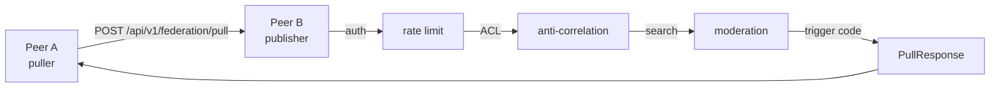
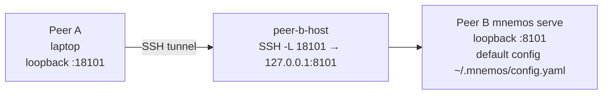

# Федерация — руководство по cross-host-тестированию

**🌐 Language / Язык:** [English](../../en/admin/federation-testing.md) · Русский

**Аудитория:** операторы и QA-инженеры, проверяющие федерацию mnemos перед
релизом или перед открытием нового peer'а.

**Область:** сквозная проверка канала mediated pull
(`POST /api/v1/federation/pull`) между двумя инстансами mnemos — один в
роли peer A (puller, забирающая сторона), другой в роли peer B (publisher,
публикующая сторона). Охватывает смоук-тест на одном хосте и e2e-тест между
хостами (ноутбук ↔ удалённый хост). Заметки о production-развёртывании —
в конце.

**Связанное:**

- [`federation.md`](federation.md) — предпосылки Phase 1 (per-peer ACL,
  триггер-коды, журнал доступа) и справочник полей `PeerConfig`.
- [`security.md`](security.md) §9 — T-AUTH, non-loopback стартовый guard,
  TOTP 2FA.
- [`docs/project/adr/0016-federation-threat-model.md`](../../project/adr/0016-federation-threat-model.md)
  — mTLS-пиннинг, привязка per-peer bearer-токенов, модель угроз.
- Контракт ArchCom 2026-07-17 §3.2, §9, §10 — flow mediated pull,
  триггер-коды, журнал доступа.

---

## 1. Обзор

Cross-host-тестирование федерации проверяет, что peer A может вытягивать
записи памяти у peer B через эндпоинт mediated pull и что каждая защита в
федеративной цепочке ведёт себя корректно. Цепочка:



Тест-матрица покрывает шесть поведений:

| # | Поведение | Как проверяется |
| --- | --- | --- |
| 1 | Mediated pull — A вытягивает записи у B через `POST /api/v1/federation/pull` | запрос `curl`; ожидаем `trigger_code=EXHAUSTIVE` и непустой массив `records` |
| 2 | Anti-correlation — повторный запрос по той же паре `(peer, topic)` возвращает `ALREADY_EXHAUSTED` | Повторить запрос; ожидаем `trigger_code=ALREADY_EXHAUSTED` и пустой `records` |
| 3 | Применение ACL — `project_scope`, отсутствующий в `PeerConfig.allowed_projects`, отклоняется | Запрос с проектом вне scope; ожидаем `403` + `trigger_code=REFUSED` |
| 4 | Rate limiting — запросы сверх `rate_limit_per_minute` возвращают `429` | Отправить 30+ быстрых запросов; после лимита ожидаем `429` |
| 5 | Идемпотентный импорт — повторный импорт того же compact-payload пропускает существующие записи | `mnemos sync import` дважды; на втором запуске ожидаем `records_imported=0, records_skipped=N` |
| 6 | Полный roundtrip — после импорта вытянутые записи находятся поиском на A | `mnemos search` находит импортированную запись на peer A |

Пять триггер-кодов (`EXHAUSTIVE`, `ALREADY_EXHAUSTED`, `PARTIAL`,
`REFUSED`, `OFFLINE_LITE`) определены в
`src/mnemos/trigger_codes.py` и описаны в
[`federation.md`](federation.md) §2.

---

## 2. Предварительные требования

| Требование | Детали |
| --- | --- |
| Версия mnemos | v2.12.1+ на **обоих** хостах (и эндпоинт mediated pull, и non-loopback стартовый guard появились в линейке v2.12); текущий релиз: 4.0.0. |
| Конфиг peer B | `federation.enabled: true` (или непустой `federation.shared_projects` — сервер трактует пустой `shared_projects` как выключенную федерацию). |
| Peer'ы peer B | Peer A сконфигурирован в `federation.peers` на peer B с `bearer_token_env`, `allowed_projects`, `allowed_types`, `rate_limit_per_minute`. См. [`federation.md`](federation.md) §1. |
| SSH-доступ | Для cross-host-теста оператор имеет SSH-доступ к хосту peer B (используется, чтобы пробросить loopback-порт peer B на ноутбук). |
| Привязка к loopback | Стартовый guard `_check_non_loopback_auth` (в `src/mnemos/api/main.py`) завершается с ненулевым кодом при попытке non-loopback bind без `auth_enabled=true` + `totp_enabled=true` + `behind_tls_proxy=true`. Тест привязывается к loopback и туннелируется через SSH, поэтому полный auth-стек для теста не требуется. |

> **Изоляция хранилищ.** mnemos разрешает свой конфиг в фиксированном
> порядке — явный флаг `--config` → переменная окружения `MNEMOS_CONFIG` →
> `./config.yaml` → `~/.mnemos/config.yaml` (`find_config_file` в
> `src/mnemos/config.py`). Переменной `MNEMOS_HOME` **не существует**.
> Чтобы запустить изолированный инстанс, создайте per-instance
> `config.yaml` (с собственными `mnemos.data_dir` / `mnemos.vault_path`)
> и укажите `MNEMOS_CONFIG` на него — все команды ниже используют этот
> паттерн.

### Почему для тестирования loopback + SSH-туннель

Стартовый guard существует, чтобы неправильно сконфигурированный сервер с
`auth_enabled: false` никогда не стал доступен из сети без учётных данных
(см. [`security.md`](security.md) §9). Для теста, который выполняется на
одном удалённом хосте и доступен только через SSH-туннель с ноутбука
оператора, привязка к loopback удовлетворяет guard'у, а SSH-туннель
обеспечивает транспорт — не нужны ни TLS-прокси, ни TOTP master-ключ, ни
ingress. Это конфигурация **только для теста**; production-развёртывания
обязаны использовать полный auth-стек (см. §5).

### Тестовые токены

Bearer-токен, используемый в этом руководстве, — **заглушка**:
сгенерируйте реальный для своего тестового прогона и удалите его после.
Никогда не коммитьте значение токена в конфиг-файл или репозиторий.

```bash
# Generate a test bearer token (32 bytes, base64)
TEST_TOKEN=$(openssl rand -base64 32)
echo "MNEMOS_FED_PEER_MNEMOS_A_TOKEN=$TEST_TOKEN"
```

---

## 3. Смоук-тест на одном хосте

Смоук-тест на одном хосте запускает два инстанса mnemos на одной машине —
каждый смотрит на своё хранилище через per-instance конфиг-файл,
выбираемый `MNEMOS_CONFIG` — и проходит цикл export → import → search →
повторный import (идемпотентность). Он **не** задействует живой эндпоинт
`POST /api/v1/federation/pull` — это cross-host-тест в §4. Смоук-тест
проверяет формат compact-payload и CLI `mnemos sync`.

Сопутствующий скрипт `scripts/smoke-federation.sh` автоматизирует шаги
ниже. Он добавляется параллельно с этим руководством; если его ещё нет в
вашем checkout, выполните шаги вручную.

### Шаги

1. **Создайте два изолированных конфига инстансов.**

   Каждый инстанс получает собственную директорию с `config.yaml`,
   указывающим `mnemos.data_dir` / `mnemos.vault_path` внутри неё:

   ```bash
   export MNEMOS_CONF_A=/tmp/mnemos-fed-a/config.yaml
   export MNEMOS_CONF_B=/tmp/mnemos-fed-b/config.yaml
   for inst in a b; do
     mkdir -p "/tmp/mnemos-fed-$inst/data" "/tmp/mnemos-fed-$inst/vault"
     cat > "/tmp/mnemos-fed-$inst/config.yaml" <<EOF
   mnemos:
     data_dir: /tmp/mnemos-fed-$inst/data
     vault_path: /tmp/mnemos-fed-$inst/vault
   EOF
   done
   ```

   Каждая команда в остатке этого раздела выполняется с
   `MNEMOS_CONFIG="$MNEMOS_CONF_A"` (peer A) или `"$MNEMOS_CONF_B"`
   (peer B) в окружении.

2. **Наполните peer B тестовой памятью.**

   Контент — позиционный аргумент; slug'и проекта и агента едут внутри
   значения `--tags` через запятую (контракт тегов):

   ```bash
   MNEMOS_CONFIG="$MNEMOS_CONF_B" mnemos add \
     "Test decision: federation pull uses POST /api/v1/federation/pull" \
     --tags "project:cross-memory-test,agent:hermes-test,mnemos:decision"
   ```

3. **Экспортируйте compact-payload с peer B.**

   ```bash
   MNEMOS_CONFIG="$MNEMOS_CONF_B" mnemos sync export \
     --shared-projects cross-memory-test \
     --output /tmp/mnemos-fed-payload.json
   ```

4. **Импортируйте payload на peer A.**

   Исходный файл — позиционный аргумент:

   ```bash
   MNEMOS_CONFIG="$MNEMOS_CONF_A" mnemos sync import \
     /tmp/mnemos-fed-payload.json
   ```

   Ожидаем `Imported: 1 records` и `skipped: 0`.

5. **Проверьте, что запись находится поиском на peer A.**

   Запрос — тоже позиционный аргумент:

   ```bash
   MNEMOS_CONFIG="$MNEMOS_CONF_A" mnemos search \
     "federation pull" --project cross-memory-test
   ```

   Тестовое решение из шага 2 должно появиться в результатах.

6. **Повторно импортируйте тот же payload — проверьте идемпотентность.**

   ```bash
   MNEMOS_CONFIG="$MNEMOS_CONF_A" mnemos sync import \
     /tmp/mnemos-fed-payload.json
   ```

   Ожидаем `Imported: 0 records` и `skipped: 1`. Команда `sync import`
   мержит идемпотентно по `id` записи (префикс
   `fed:<source_agent>:<uuid>`); существующие записи пропускаются,
   никогда не перезаписываются (см. `src/mnemos/cli/sync.py`).

7. **Очистка.**

   ```bash
   rm -rf /tmp/mnemos-fed-a /tmp/mnemos-fed-b /tmp/mnemos-fed-payload.json
   ```

---

## 4. Cross-host e2e-тест (ноутбук ↔ удалённый хост)

Это тест, который мы прогнали 2026-07-27 между ноутбуком (peer A) и
удалённым хостом (peer B, машина `ai-agent`). Он задействует живой
эндпоинт `POST /api/v1/federation/pull` и каждую защиту в цепочке.

**Топология:**



### a. Запустите тестовый `mnemos serve` на peer B (удалённый хост)

Зайдите по SSH на peer B и запустите mnemos на loopback-порту. Настройка
`auth_enabled=false` — **только для теста**: привязка к loopback
удовлетворяет стартовому guard'у, а SSH-туннель — единственный путь внутрь.

```bash
# On peer B (remote host)
mnemos serve --port 8101
```

Если `config.yaml` на peer B содержит `api.auth_enabled: true`,
переопределите это для теста, передав переменную окружения или
отредактировав тестовый конфиг. Стартовый guard срабатывает только на
non-loopback bind, поэтому serve на loopback с `auth_enabled=false`
стартует чисто.

### b. Наполните peer B тестовой памятью

Не выходя с peer B, добавьте тестовую запись в проект, который будет в
`allowed_projects` peer A:

```bash
mnemos add \
  "Cross-host test decision: mediated pull verified 2026-07-27" \
  --tags "project:cross-memory-test,agent:hermes-test,mnemos:decision"
```

### c. Сконфигурируйте peer A в `federation.peers` на peer B

Отредактируйте `~/.mnemos/config.yaml` peer B, добавив peer A. Значение
токена живёт в именованной переменной окружения, никогда в конфиг-файле.

```yaml
federation:
  shared_projects:
    - cross-memory-test
  peers:
    mnemos-A:
      bearer_token_env: MNEMOS_FED_PEER_MNEMOS_A_TOKEN
      allowed_projects:
        - cross-memory-test
      allowed_types:
        - decision
        - learning
        - bug-pattern
      rate_limit_per_minute: 30
      # mtls_cert_fingerprint omitted for the test — mTLS pinning is
      # optional and not exercised in the SSH-tunnel test path.
```

Перезапустите `mnemos serve`, чтобы он подхватил изменение конфига (карта
федеративных peer'ов загружается на старте).

### d. Задайте bearer-токен в окружении serve на peer B

Перезапустите `mnemos serve` с токеном в окружении:

```bash
# On peer B (remote host)
MNEMOS_FED_PEER_MNEMOS_A_TOKEN=<token-from-§2> mnemos serve --port 8101
```

Сервер читает токен из переменной окружения, названной в
`bearer_token_env`, в момент запроса (см. `_resolve_peer_token` в
`src/mnemos/federation_server.py`), поэтому ротация не требует рестарта —
а вот карта peer'ов требует.

### e. Откройте SSH-туннель с ноутбука

На ноутбуке (peer A) пробросьте локальный порт на loopback-порт peer B:

```bash
# On peer A (laptop)
ssh -f -N -L 18101:127.0.0.1:8101 peer-b-host
```

`-f` уводит туннель в фон после аутентификации; `-N` означает, что
удалённая команда не выполняется. Ноутбук теперь достаёт mnemos peer B по
`http://127.0.0.1:18101`.

### f. Выполните pull с ноутбука

```bash
# On peer A (laptop)
curl -sS -X POST http://127.0.0.1:18101/api/v1/federation/pull \
  -H "Authorization: Bearer <token-from-§2>" \
  -H "Content-Type: application/json" \
  -d '{
    "peer_id": "mnemos-A",
    "query": "mediated pull verified",
    "project_scope": "cross-memory-test",
    "include_content": true
  }' | jq
```

### g. Проверьте ответ

Ожидаем:

- HTTP `200`
- `trigger_code: "EXHAUSTIVE"`
- массив `records` непуст (одна запись — тестовая запись из шага b)
- `records[0].source_agent` совпадает с self-id peer B (`mnemos-B` по
  умолчанию или значение `MNEMOS_FED_SELF_ID`, если переопределено)
- `ttl_class: "ephemeral"` — policy-подсказка; сервер не принуждает TTL
  на стороне A (контракт §3.3)

### h. Проверка anti-correlation

Повторите в точности тот же запрос (тот же `peer_id`, та же строка
`query`):

```bash
curl -sS -X POST http://127.0.0.1:18101/api/v1/federation/pull \
  -H "Authorization: Bearer <token-from-§2>" \
  -H "Content-Type: application/json" \
  -d '{
    "peer_id": "mnemos-A",
    "query": "mediated pull verified",
    "project_scope": "cross-memory-test",
    "include_content": true
  }' | jq '.trigger_code, .records | length'
```

Ожидаем `trigger_code: "ALREADY_EXHAUSTED"` и пустой `records`. Журнал
доступа (`~/.mnemos/logs/federation-access.jsonl` на peer B) хранит
прежнюю запись `EXHAUSTIVE` для этой пары `(peer_id, sha256(query))`, и
сервер возвращает `ALREADY_EXHAUSTED` **без повторного запуска поиска**
(контракт §9). Открытый текст запроса никогда не попадает в журнал
доступа — только его SHA-256 (КП-5).

### i. Проверка ACL

Запросите с `project_scope`, которого **нет** в `allowed_projects`
peer A:

```bash
curl -sS -o /dev/null -w "%{http_code}\n" -X POST http://127.0.0.1:18101/api/v1/federation/pull \
  -H "Authorization: Bearer <token-from-§2>" \
  -H "Content-Type: application/json" \
  -d '{
    "peer_id": "mnemos-A",
    "query": "anything",
    "project_scope": "secret-project-not-allowed",
    "include_content": true
  }'
```

Ожидаем HTTP `403` и тело с `trigger_code: "REFUSED"`. Журнал доступа
фиксирует отказ с `trigger_code=REFUSED` и пустым `record_ids`.

### j. Проверка rate limit

Отправляйте запросы быстрее, чем `rate_limit_per_minute` (30 в примере
конфига). Простой цикл:

```bash
for i in $(seq 1 40); do
  code=$(curl -sS -o /dev/null -w "%{http_code}" -X POST http://127.0.0.1:18101/api/v1/federation/pull \
    -H "Authorization: Bearer <token-from-§2>" \
    -H "Content-Type: application/json" \
    -d '{
      "peer_id": "mnemos-A",
      "query": "rate-limit-probe-'$i'",
      "project_scope": "cross-memory-test",
      "include_content": false
    }')
  echo "req $i -> $code"
done
```

Ожидаем, что первые ~30 запросов вернут `200` (у каждого свой `query`,
поэтому anti-correlation их не перехватывает), а остальные вернут `429`.
Rate limiter — per-peer скользящее 60-секундное окно с ключом по
`peer_id` (см. `RateLimiter` в `src/mnemos/federation_server.py`).
Подождите 60 секунд, пока окно вытеснится, прежде чем продолжать.

### k. Полный roundtrip — pull, импорт, поиск на peer A

Сохраните pull-ответ из шага f в файл, оберните массив `records` в
compact-payload `mnemos.federation.v1` и импортируйте на ноутбуке.

```bash
# On peer A (laptop) — save the pull response
curl -sS -X POST http://127.0.0.1:18101/api/v1/federation/pull \
  -H "Authorization: Bearer <token-from-§2>" \
  -H "Content-Type: application/json" \
  -d '{
    "peer_id": "mnemos-A",
    "query": "mediated pull verified roundtrip",
    "project_scope": "cross-memory-test",
    "include_content": true
  }' > /tmp/pull-response.json

# Wrap the records as a compact payload. The compact payload shape is
# documented in src/mnemos/compact.py. A minimal wrapper:
jq '{format_version: "mnemos.federation.v1", records: .records}' \
  /tmp/pull-response.json > /tmp/compact-payload.json

# Import into peer A's mnemos
mnemos sync import /tmp/compact-payload.json
```

Ожидаем `Imported: 1 records` и `skipped: 0`.

Затем проверьте, что запись находится поиском на peer A:

```bash
mnemos search "mediated pull verified" --project cross-memory-test
```

Импортированная запись должна появиться, с provenance от peer B (префикс
`fed:mnemos-B:<uuid>` у id записи).

### l. Идемпотентность — повторный импорт того же payload

```bash
mnemos sync import /tmp/compact-payload.json
```

Ожидаем `Imported: 0 records` и `skipped: 1`. Команда `sync import`
мержит идемпотентно по `id` записи; существующие записи пропускаются,
никогда не перезаписываются.

### m. Очистка

1. Убейте `mnemos serve` на peer B (`Ctrl-C` в терминале serve или
   `pkill -f "mnemos serve --port 8101"`).
2. Снесите SSH-туннель на ноутбуке:

   ```bash
   # Find and kill the tunnel process
   pkill -f "ssh -f -N -L 18101:127.0.0.1:8101 peer-b-host"
   ```

3. Удалите тестовый токен из окружения peer B (он был задан инлайн в
   команде serve, так что завершение процесса его очищает; если
   экспортировали — `unset MNEMOS_FED_PEER_MNEMOS_A_TOKEN`).
4. Уберите запись peer'а `mnemos-A` из `config.yaml` peer B или замените
   её на production-конфиг.
5. Опционально отзовите тестовую память на peer B. CLI-глагола
   `mnemos delete` не существует — поддерживаемый путь это workflow-эндпоинт
   отзыва (`DELETE /memories/{memory_id}/workflow`, статус → `withdrawn`);
   id найдите через `mnemos search`. На практике запись может и просто
   остаться: она живёт в проекте `cross-memory-test`, который ни один
   production-peer не указывает в `allowed_projects`, так что в будущий
   production-pull она утечь не может.
6. Удалите локальные артефакты: `rm /tmp/pull-response.json /tmp/compact-payload.json`.

---

## 5. Заметки о production-развёртывании

Конфигурация SSH-туннель + loopback bind выше — **только для теста**.
Production-развёртывание федерации обязано использовать полный auth-стек.

| Аспект | Тест (это руководство) | Production |
| --- | --- | --- |
| Транспорт | SSH-туннель `-L 18101 → 127.0.0.1:8101` | Ingress + TLS (Caddy / nginx / Traefik), терминирующий mTLS выше по стеку |
| Bind peer B | Loopback, `auth_enabled=false` | Non-loopback, `auth_enabled=true` + `totp_enabled=true` + `behind_tls_proxy=true` (стартовый guard требует все три) |
| Bearer-токен | Инлайн-переменная окружения в команде serve | Per-peer bearer в Kubernetes `Secret` — конфиг называет переменную (`bearer_token_env`), `Secret` хранит значение |
| mTLS | Опущен (`mtls_cert_fingerprint` не задан) | Per-peer пиннинг сертификата по ADR-0016 — задайте `mtls_cert_fingerprint` равным SHA-256 клиентского сертификата peer'а, и пусть реверс-прокси инжектирует `X-Client-Cert-Fingerprint` |
| Rate limit | 30/мин (тест) | Настраивается per-peer; лимитер process-local, поэтому multi-worker-развёртываниям нужен внешний лимитер (Redis) — см. [`federation.md`](federation.md) |
| Журнал доступа | `~/.mnemos/logs/federation-access.jsonl` (по умолчанию) | Персистентный том — задайте `federation.access_log_path` на смонтированный путь в контейнеризированных развёртываниях |

### Ссылка на Helm-чарт

Задача по Helm-черту AgentsNode (id памяти mnemos `4df5d1bd`) отслеживает
production Helm-чарт, который подключает per-peer bearer `Secret`, пиннинг
mTLS-сертификатов и том для журнала доступа. Пока чарт не приземлился,
production-развёртывания настраивают перечисленное выше вручную в
`config.yaml` + переменных окружения деплоя.

Полную модель угроз и обоснование выбора mTLS-vs-bearer см. в ADR-0016
(`docs/project/adr/0016-federation-threat-model.md`).

---

## 6. Устранение неполадок

| Симптом | Вероятная причина | Решение |
| --- | --- | --- |
| `403` + `trigger_code=REFUSED` (peer не сконфигурирован) | `peer_id` peer A отсутствует в карте `federation.peers` peer B, или `federation.peers` пуст | Добавьте запись peer'а в `config.yaml` peer B и перезапустите `mnemos serve` |
| `403` + `trigger_code=REFUSED` (несовпадение токена) | Bearer-токен в запросе не совпадает со значением переменной окружения, названной в `bearer_token_env` | Проверьте, что переменная задана в окружении serve на peer B, а запрос отправляет `Authorization: Bearer <token>` с тем же значением |
| `403` + `trigger_code=REFUSED` (ACL) | `project_scope` отсутствует в `allowed_projects` peer'а (и не `["*"]`) | Добавьте проект в `allowed_projects` или используйте уже разрешённый проект |
| `429` | Превышен per-peer rate limit — скользящее 60-секундное окно заполнено | Подождите 60 секунд, пока окно вытеснится, или поднимите `rate_limit_per_minute` (диапазон 1–600) |
| `200` + `trigger_code=ALREADY_EXHAUSTED` + пустой `records` | Ожидаемо при повторном запросе по той же паре `(peer_id, topic)` — журнал доступа зафиксировал прежний `EXHAUSTIVE` | Это корректное поведение, а не ошибка. Чтобы повторить pull, используйте другую строку `query` (журнал доступа ключуется по `sha256(query)`) |
| `200` + `trigger_code=EXHAUSTIVE` + пустой `records` | На peer B нет записей, совпадающих с запросом в разрешённом scope проектов/типов | Наполните peer B тестовой записью разрешённого проекта и типа, затем повторите pull |
| Connection refused (ноутбук) | SSH-туннель упал, `mnemos serve` не запущен на peer B или порт неверен | Проверьте туннель: `ss -lntp \| grep 18101` на ноутбуке; проверьте serve: `ss -lntp \| grep 8101` на peer B; перезапустите по необходимости |
| `FATAL: non-loopback bind (...) requires: api.auth_enabled=true, ...` при старте | `mnemos serve` запущен с non-loopback `--host` (или `api.host` в конфиге) без полного auth-стека | Либо привяжитесь к loopback (`--host 127.0.0.1`) и используйте SSH-туннель для теста, либо задайте `api.auth_enabled=true` + `api.totp_enabled=true` + `api.behind_tls_proxy=true` и предоставьте `MNEMOS_API__TOTP_MASTER_KEY` (см. [`security.md`](security.md) §9) |
| `FATAL: api.totp_enabled=true but MNEMOS_API__TOTP_MASTER_KEY is not set` | TOTP включён без master-ключа | Задайте `MNEMOS_API__TOTP_MASTER_KEY` в окружении (только env, никогда на диск) |
| `mnemos sync import` возвращает `records_skipped=N` при первом импорте | Записи уже были в хранилище peer A с прошлого прогона | Ожидаемо, если тест запускался раньше и не был убран. Подтвердите наличие записей через `mnemos search`, затем продолжайте |

---

### Ссылки

- Контракт ArchCom 2026-07-17 — `.archcom/sessions/2026-07-17-federation-contract.md` §3.2 (flow), §9 (триггер-коды), §10 (журнал доступа)
- ADR-0016 — `docs/project/adr/0016-federation-threat-model.md`
- `src/mnemos/federation_server.py` — `handle_pull` (поток обработки на сервере)
- `src/mnemos/api/federation.py` — адаптер FastAPI-маршрута
- `src/mnemos/api/main.py` — `_check_non_loopback_auth` (стартовый guard)
- `src/mnemos/cli/sync.py` — `mnemos sync import` (идемпотентный мерж)
- `src/mnemos/trigger_codes.py` — пять триггер-кодов
- `scripts/smoke-federation.sh` — автоматизация смоук-теста на одном хосте (добавляется параллельно)

---

_Последнее обновление: 2026-09-05_
